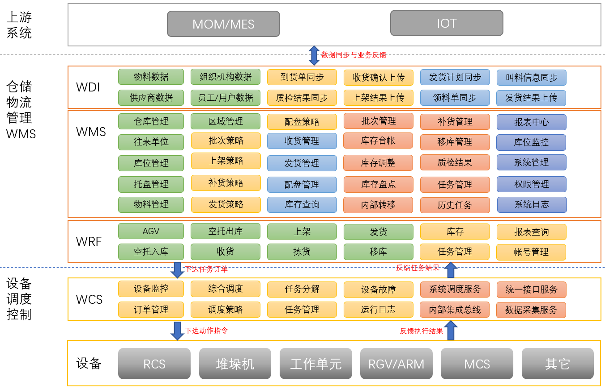

# ZEQP WMS

## 简介

ZEQP WMS是由中南智能研发的新一代仓库管理系统。支持多仓库、多货主的多库融合，支持多种场景与业态，上下游系统无缝集成。

## 支持环境

### 操作系统

#### Windows

| 名称                      | 版本                          | 架构         |
| --------------------      | ---------------------------   | --------------------- |
| Windows Server            | 2025, 23H2, 2022, 2019, 2016, 2012-R2, 2012 | x64, x86 |
| Windows Server Core       | 2025, 2022, 2019, 2016, 2012-R2, 2012 | x64, x86    |
| Nano Server               | 2025, 2022, 2019              | x64                   |
| Windows                   | 10+ | Arm64, x64, x86 |

#### Linux

| 名称                            | 版本                    | 架构         |
| ----------------------------- | --------------------------- | --------------------- |
| Alpine               | 3.21, 3.20, 3.19            | Arm32, Arm64, x64     |
| Azure Linux              | 3.0                         | Arm64, x64            |
| CentOS Stream            | 10, 9                       | Arm64, ppc64le, s390x, x64 |
| Debian                 | 12                          | Arm32, Arm64, x64     |
| Fedora                 | 42, 41, 40                  | Arm32, Arm64, x64     |
| openSUSE Leap          | 15.6                        | Arm64, x64            |
| Red Hat Enterprise Linux | 10, 9, 8                   | Arm64, ppc64le, s390x, x64 |
| SUSE Enterprise Linux   | 15.6                        | Arm64, x64            |
| Ubuntu                 | 25.04, 24.10, 24.04, 22.04  | Arm32, Arm64, x64     |

#### 国产系统

|名称|版本|架构|官网|
|---|---|---|---|
|银河麒麟|V10+|飞腾、龙芯、鲲鹏、申威、兆芯、海光、Intel、AMD|[https://www.kylinos.cn/](https://www.kylinos.cn/)|
|统信|V20+|AMD64/ARM64/MIPS64/SW64/LoongArch|[https://www.uniontech.com/](https://www.uniontech.com/)|

### 数据库

|名称|版本|供应商|
|---|---|---|
|SQL Server|SQL Server 2012及更高版本|微软|
|Oracle|Oracle DB 11.2 及更高版本|甲骨文|
|MySql|MySql 5及更高版本|甲骨文|
|SQLite|*开发中*|开源|
|DM|*开发中(DM8+)*|达梦数据|

## 系统架构

