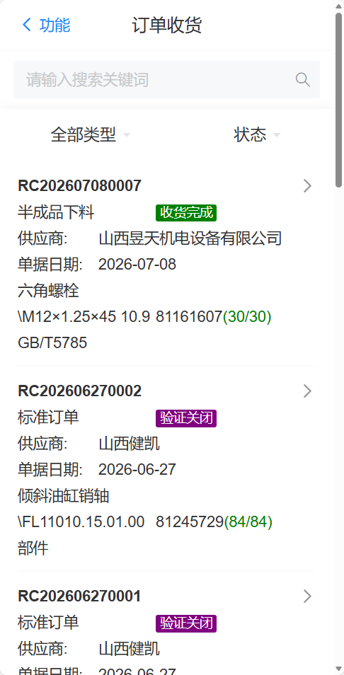
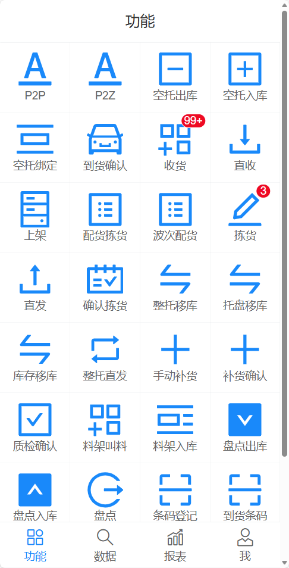
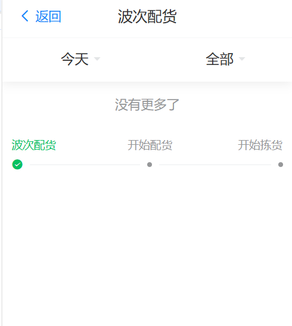

# 业务流程

ZEQP-WMS 是基于.NET Core 开源架构、支持 MySQL/MSSQL 双数据库的轻量化全功能仓储管理系统，适配中小制造、电商、商贸多行业仓库作业，依托 PDA 条码扫码、托盘 / 货位精细化管控，打通入库 - 库内管理 - 出库 - 盘点 - 异常处理全闭环业务，可与 ERP、OMS 系统 API 无缝对接，实现仓储作业无纸化、库存数据实时同步、全流程可追溯。

## 入库流程
&nbsp;&nbsp;&nbsp;&nbsp;1.收货：到货验收，PDA 扫码核对物料与数量

&nbsp;&nbsp;&nbsp;&nbsp;2.质检：合格入库，不合格隔离处理

&nbsp;&nbsp;&nbsp;&nbsp;3.上架：系统推荐货位，扫码确认完成入库

&nbsp;&nbsp;&nbsp;&nbsp;4.库存：实时更新库存

## 在库管理

&nbsp;&nbsp;&nbsp;&nbsp;1.货位 / 批次 / 效期统一管控

&nbsp;&nbsp;&nbsp;&nbsp;2.支持移库、调拨、库存预警

&nbsp;&nbsp;&nbsp;&nbsp;3.全程条码化，账实一致

## 出库流程

&nbsp;&nbsp;&nbsp;&nbsp;1.接单：接收发货订单

&nbsp;&nbsp;&nbsp;&nbsp;2.拣货：波次任务 + 路径优化，PDA 扫码拣货

&nbsp;&nbsp;&nbsp;&nbsp;3.打包贴单，确认出库并扣减库存

## 盘点流程

&nbsp;&nbsp;&nbsp;&nbsp;1.创建盘点单（全盘 / 抽盘）

&nbsp;&nbsp;&nbsp;&nbsp;2.PDA 现场盘点录入

&nbsp;&nbsp;&nbsp;&nbsp;3.系统生成差异表

&nbsp;&nbsp;&nbsp;&nbsp;4.审核调账，更新库存

## 核心特点
&nbsp;&nbsp;&nbsp;&nbsp;1.全流程条码 / PDA作业

&nbsp;&nbsp;&nbsp;&nbsp;2.入库→在库→出库→盘点闭环

&nbsp;&nbsp;&nbsp;&nbsp;3.对接 ERP/OMS，数据实时同步

&nbsp;&nbsp;&nbsp;&nbsp;4.简单、稳定、易落地

