# SQLServer 安装

## 下载

1. SQL Server ([下载](https://www.microsoft.com/zh-cn/sql-server/sql-server-downloads))
2. SQL Server Management Studio (SSMS) ([下载](https://aka.ms/ssmsfullsetup?clcid=0x804))

## 安装SQL Server

1. 双击SQLServer2022-x64-CHS.iso文件装载iso
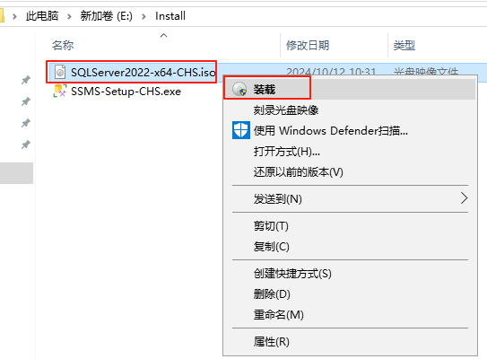

2. 以管理员方式运行setup.exe文件开始安装
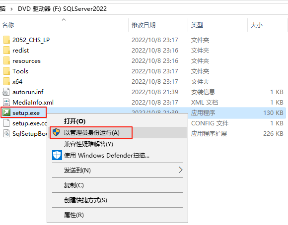

3. 选择“全新SQL Server独立安装”
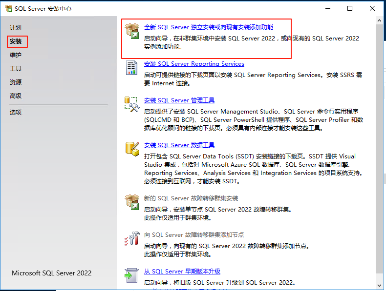

4. 选择安装版本
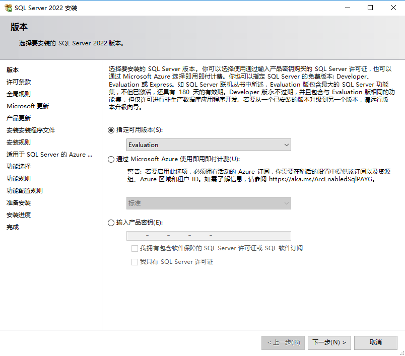

5. 取消选择“适用于SQL Server 的 Azure"
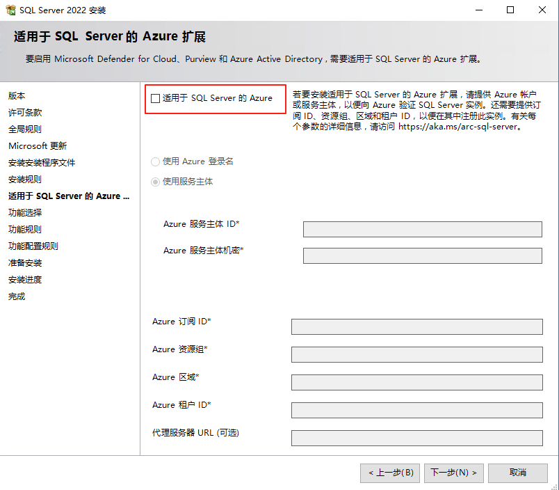

6. 功能选择
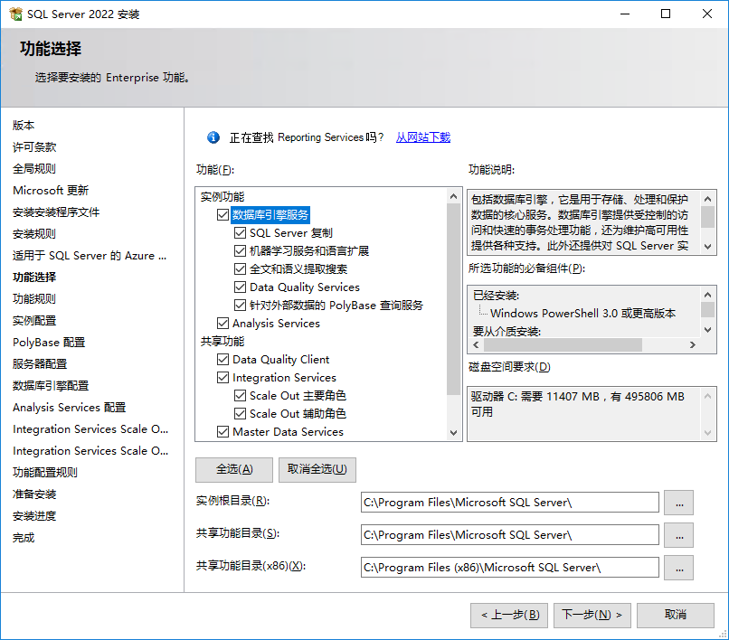

7. 实例配置

如果全新安装就选择“默认实例”
如果系统里已经有其它实例，就给实例命名一个新的名字

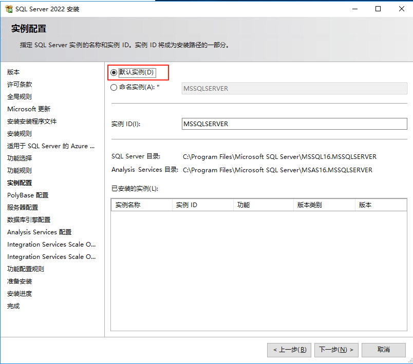

8. 数据库引擎配置

身份认证选择“混合模式”

添加当前用户为SQL Server管理员

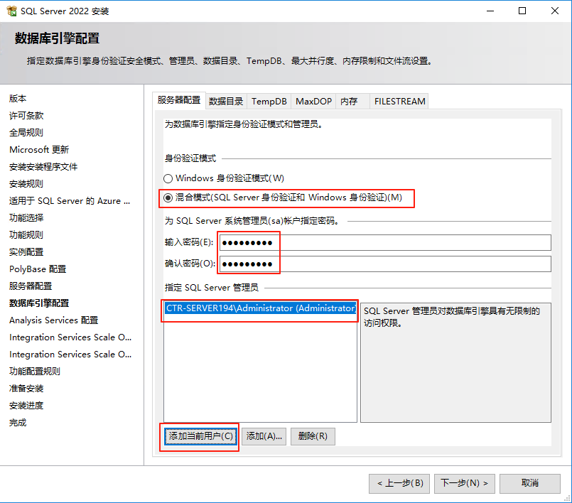

修改数据目录

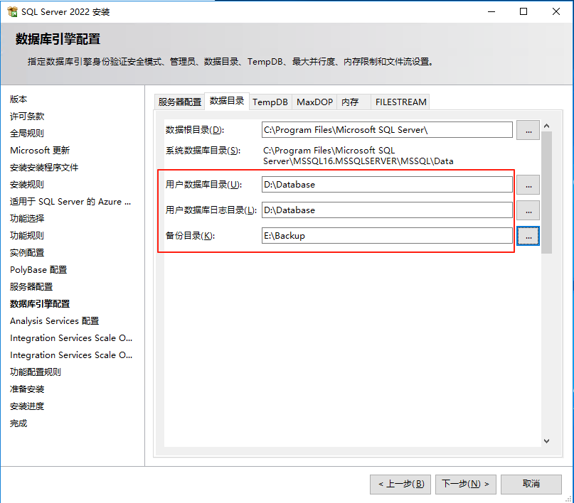

9. 安装完成
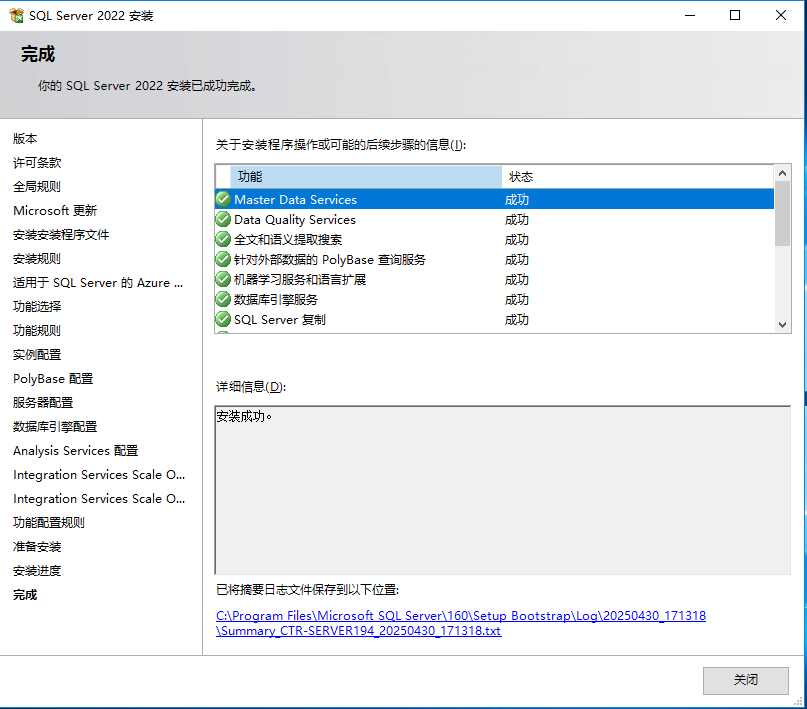

## 安装SSMS

1. 以管理员方式运行SSMS-Setup-CHS.exe
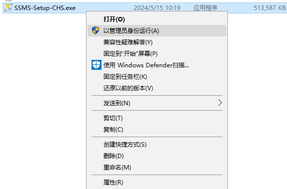

2. 点击安装
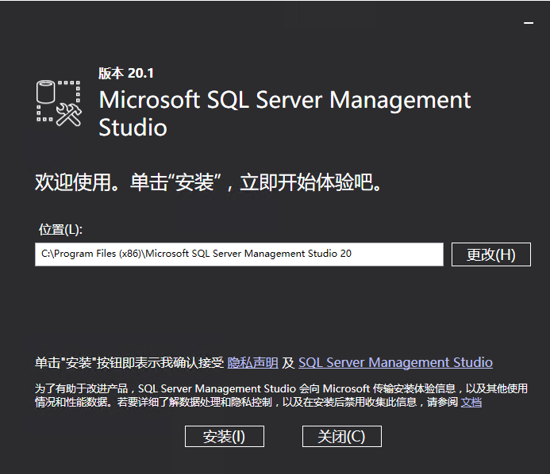

3. 安装完成
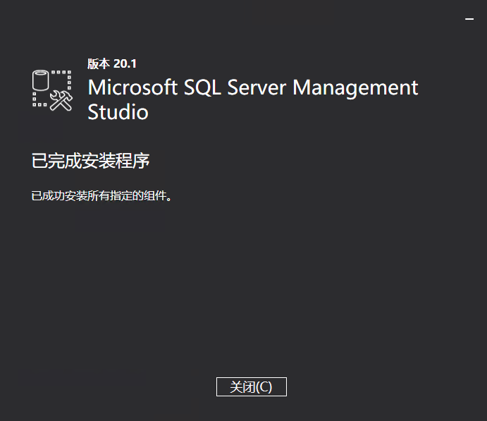

4. 连接数据库
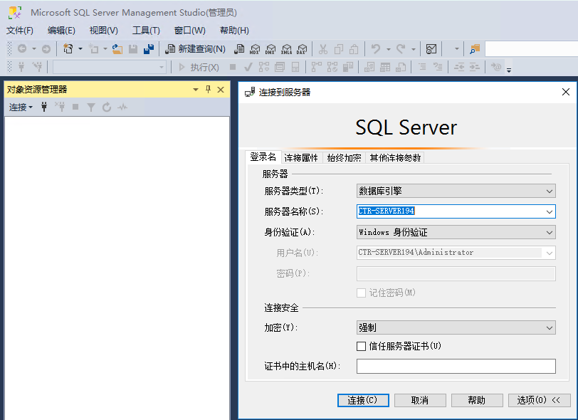

5. 连接成功
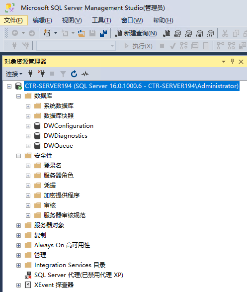

## 配置SQL Server

1. 打开SQL Server配置管理器
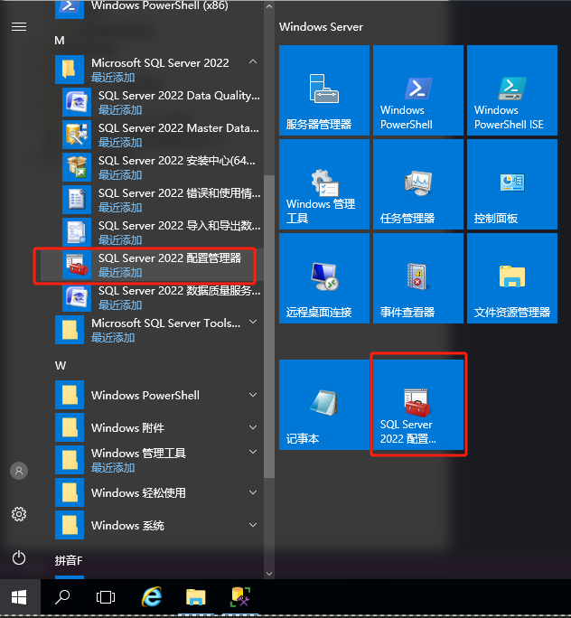

2. 打开计算机证书管理器certlm.msc

选择“个人->证书”找到对应服务器名称的证书

右键->所有任务->管理私钥

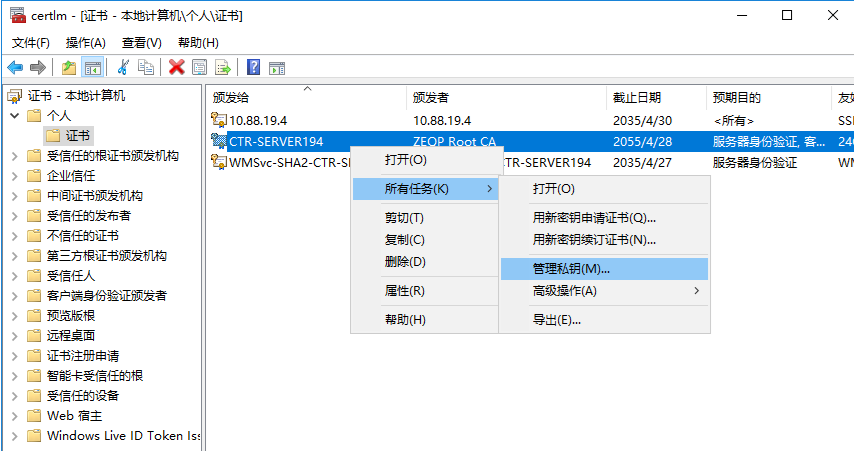

3. 允许Everyone角色访问服务器证书私钥
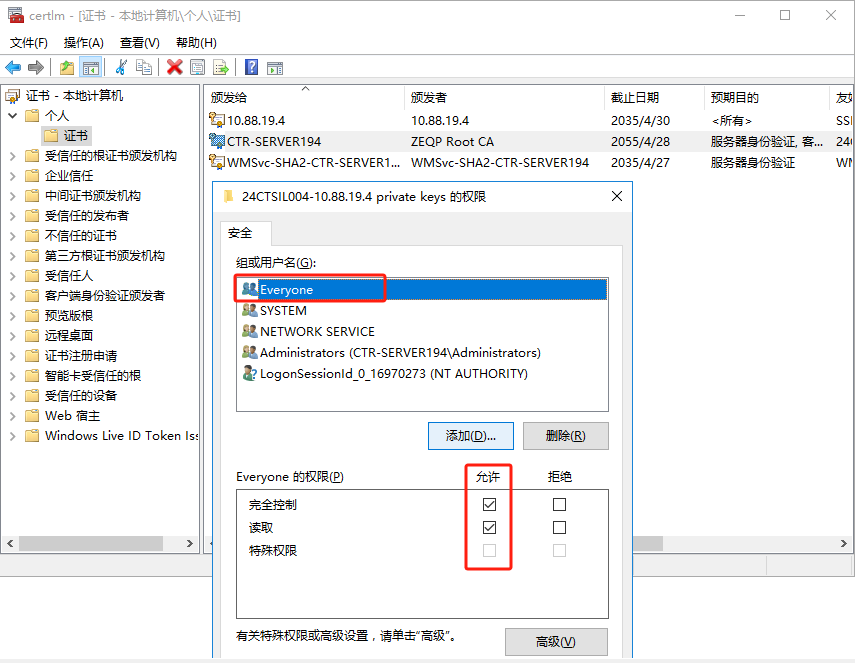

4. 修改SQL Server协议配置

选择“SQL Server配置管理器->SQL Server网络配置->MSSQLSERVER的协议”，右键选择“属性”
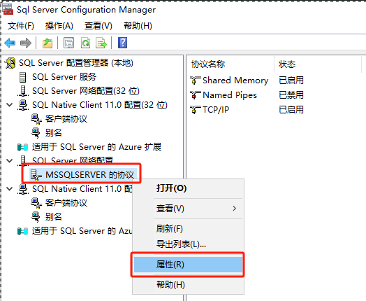

5. 修改证书

把证书指定为服务器证书，然后“应用”

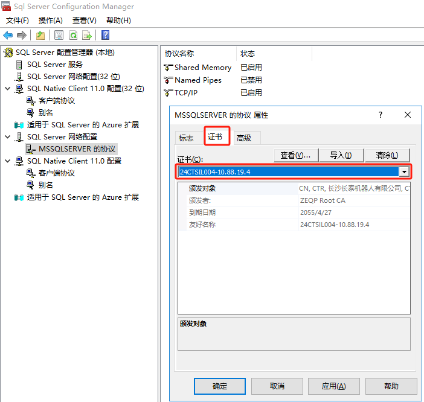

6. 重新启动SQL Server服务
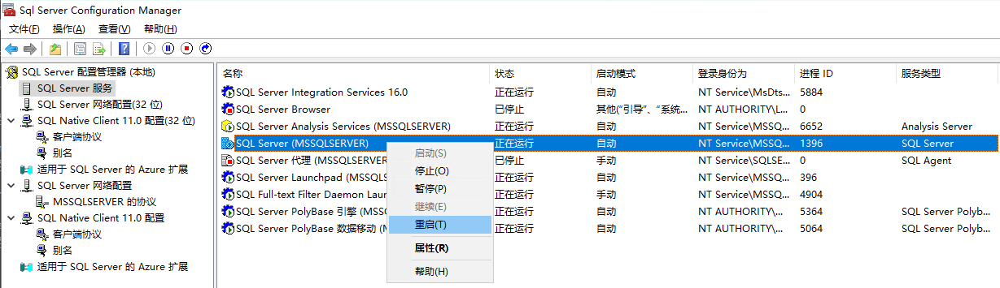

7. 开户防火墙1433端口
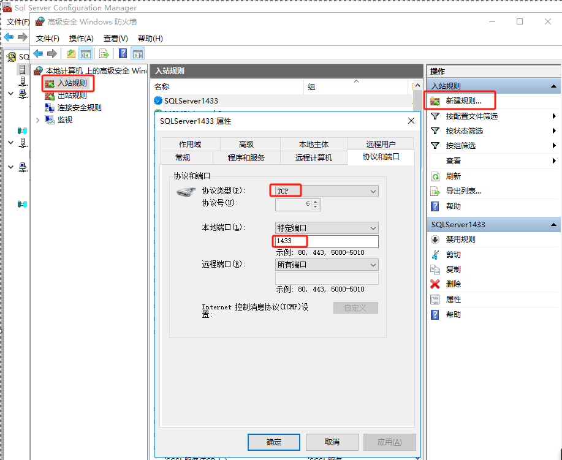

## 前置条件

1. 安装.NET Framework 4.7.2+ ([下载](https://dotnet.microsoft.com/zh-cn/download/dotnet-framework))

## 注意事项

### Navicat Premium 连接报错

如果报 [IM002] [Microsoft][ODBC 驱动程序管理器] 未发现数据源名称并且未指定默认驱动程序 (0)

请下载客户端驱动

1. 下载用于 SQL Server 的 ODBC 驱动程序 ([下载](https://learn.microsoft.com/zh-cn/sql/connect/odbc/download-odbc-driver-for-sql-server))
2. 下载适用于 SQL Server 的 Microsoft OLE DB 驱动程序  ([下载](https://learn.microsoft.com/zh-cn/sql/connect/oledb/download-oledb-driver-for-sql-server))

### 客户端测试连接是否正常

使用 UDL 文件测试与 SQL Server 的连接 ([帮助](https://learn.microsoft.com/zh-cn/troubleshoot/sql/database-engine/connect/test-oledb-connectivity-use-udl-file))