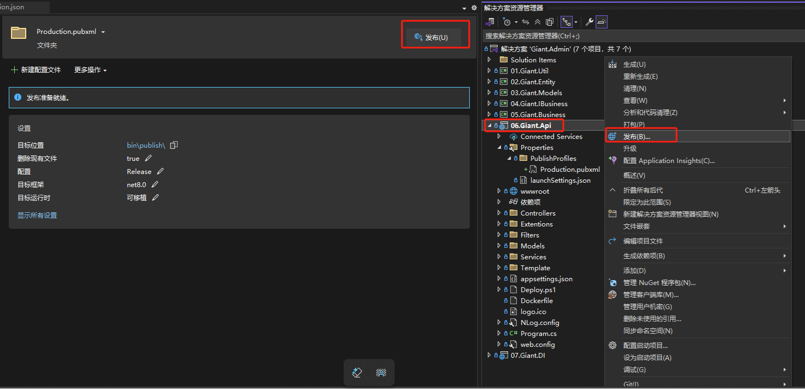
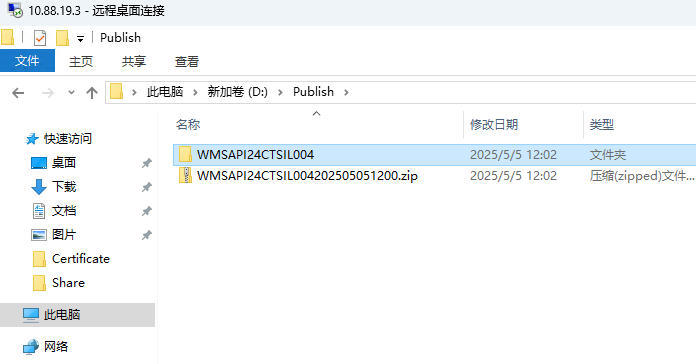
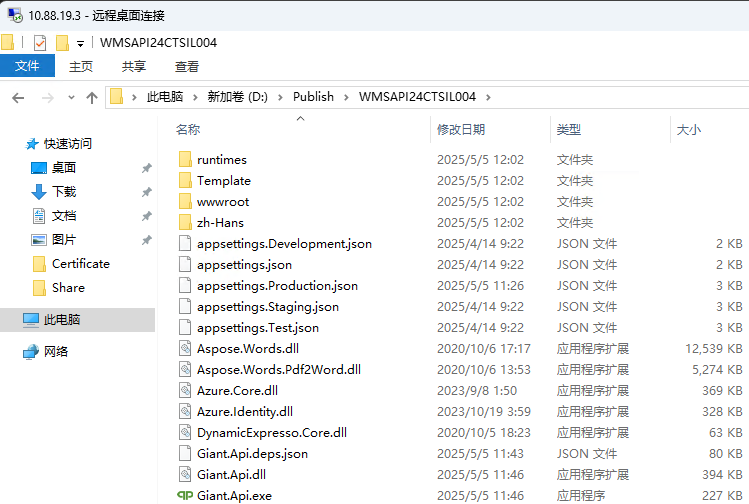
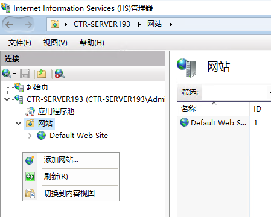
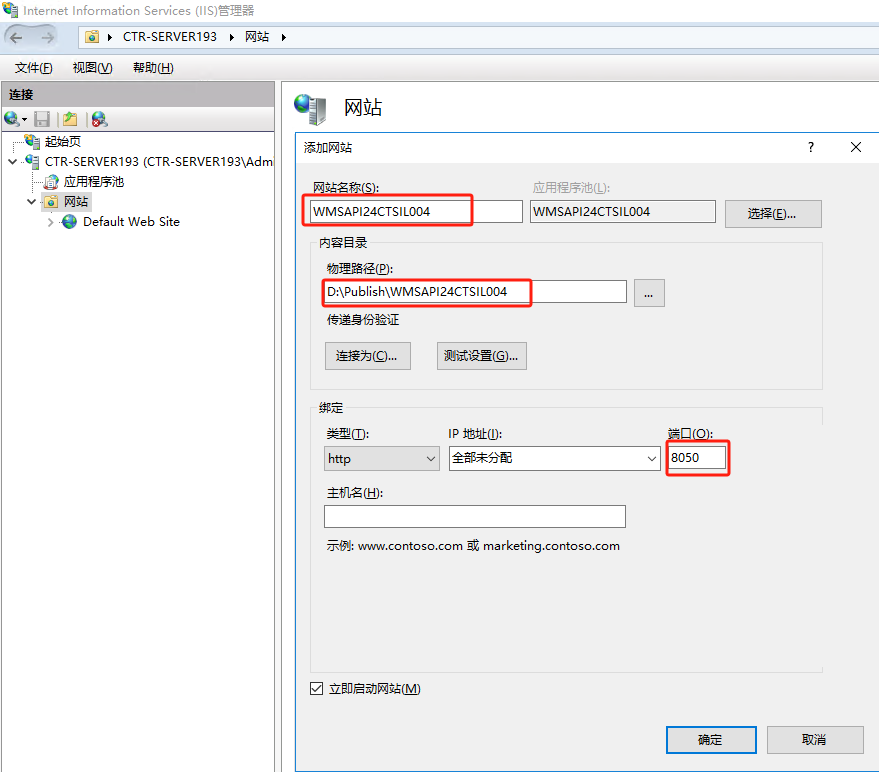
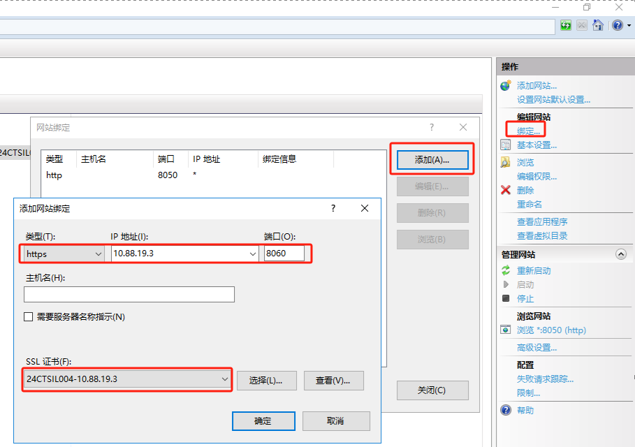
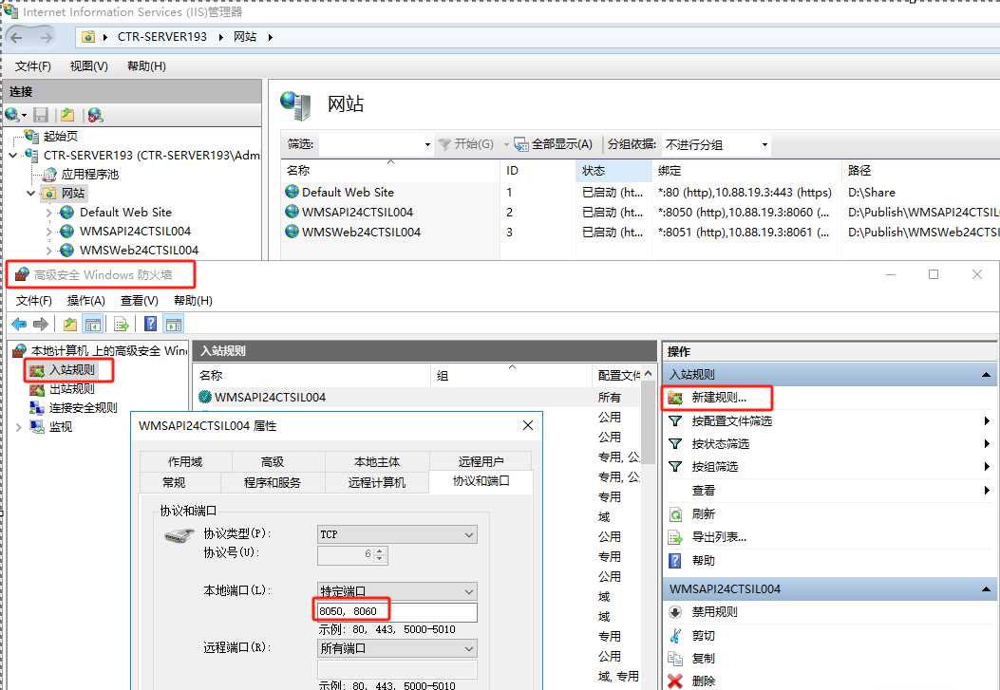
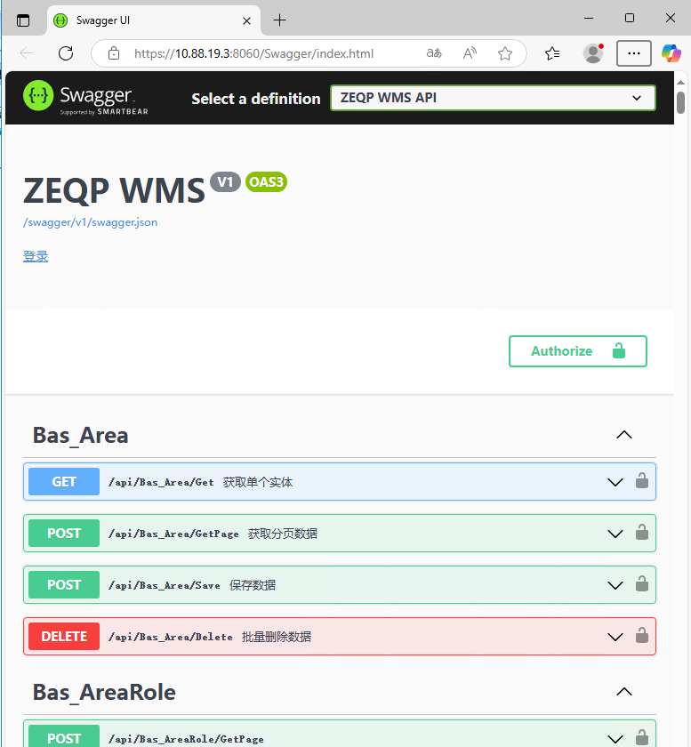

<script setup>
import { ref } from 'vue'
import { data } from '/.vitepress/project.data.ts'
const projectData = ref(data)
</script>

# 部署 WMS API

## 修改配置文件

修改Giant.Api\appsettings.Production.json文件

1. 修改CORS允许访问API的域名
2. 配置正确的数据库连接字符串
3. 配置正确的授权文件

```json-vue
  "AllowedOrigins": [
    "http://localhost:8051",
    "http://localhost:8052",
    "http://{{data.webHost}}:8051",
    "http://{{data.webHost}}:8052",
    "https://{{data.webHost}}:{{projectData.wmsWebPort}}",
    "https://{{data.webHost}}:{{projectData.wmsRFPort}}"
  ],
  "ConnectionStrings": {
    "GDbContext": "Data Source={ServerIP};Initial Catalog={DatabaseName};User Id={UserName};Password={Password};APP=ZEQPWMS;Pooling=true;"
  },
  "Copyright": {
    "License": "{License Text}",
    "Sign": "{License Sign}"
  }
```

## 发布 WMS API

### 命令发布（方式一）

1. 打开PowerShell运行下面3个命令

```powershell
#进入API项目目录
cd D:\CTR\Giant.Admin\Giant.Api\
#运行发布命令
dotnet publish -o .\bin\publish\ -c "Release" -f net8.0 --no-self-contained --no-restore -v m --nologo /p:EnvironmentName=Production
#给发布文件签名(可选)
..\Sign\signtool.exe sign /f ..\Sign\ZEQP-WMS.pfx /p zeqp /t http://localhost:1003/TSA/ /fd SHA256 .\bin\publish\Giant.*
```

2. 下面为执行命令后的输出

```powershell
PS C:\Users\Giant> cd D:\CTR\Giant.Admin\Giant.Api\
PS D:\CTR\Giant.Admin\Giant.Api> dotnet publish -o .\bin\publish\ -c "Release" -f net8.0 --no-self-contained --no-restore -v m --nologo /p:EnvironmentName=Production
  03.Giant.Models 已成功 (0.4 秒) → D:\CTR\Giant.Admin\Giant.Models\bin\Release\net8.0\Giant.Models.dll
  01.Giant.Util 已成功 (0.4 秒) → D:\CTR\Giant.Admin\Giant.Util\bin\Release\net8.0\Giant.Util.dll
  02.Giant.Entity 成功，出现 8 警告 (4.0 秒) → D:\CTR\Giant.Admin\Giant.Entity\bin\Release\net8.0\Giant.Entity.dll
    D:\CTR\Giant.Admin\Giant.Entity\Migrations\20250428023007_allocatedetail-add.cs(11,26): warning CS8981: 类型名称 "allocatedetailadd" 仅包含小写 ascii 字符。此类名称可能会成为该语言的保留值。
    D:\CTR\Giant.Admin\Giant.Entity\Migrations\20250428023007_allocatedetail-add.Designer.cs(16,19): warning CS8981: 类型名称 "allocatedetailadd" 仅包含小写 ascii 字符。此类名称可能会成为该语言的保留值。
    D:\CTR\Giant.Admin\Giant.Entity\Stg\Stg_PutawayDetail.cs(329,74): warning CS0618: “Stg_PutawayDetail.PutawayZoneId”已过时:“使用上架类型配置值替代”
    D:\CTR\Giant.Admin\Giant.Entity\Stg\Stg_PutawayDetail.cs(330,73): warning CS0618: “Stg_PutawayDetail.PutawayLocId”已过时:“使用上架类型配置值替代”
    D:\CTR\Giant.Admin\Giant.Entity\Stg\Stg_PutawayDetail.cs(339,31): warning CS0618: “Stg_PutawayDetail.PutawayZoneId”已过时:“使用上架类型配置值替代”
    D:\CTR\Giant.Admin\Giant.Entity\Stg\Stg_PutawayDetail.cs(340,31): warning CS0618: “Stg_PutawayDetail.PutawayLocId”已过时:“使用上架类型配置值替代”
    D:\CTR\Giant.Admin\Giant.Entity\Stg\Stg_PutawayDetail.cs(422,31): warning CS0618: “Stg_PutawayDetail.PutawayZoneId”已过时:“使用上架类型配置值替代”
    D:\CTR\Giant.Admin\Giant.Entity\Stg\Stg_PutawayDetail.cs(423,31): warning CS0618: “Stg_PutawayDetail.PutawayLocId”已过时:“使用上架类型配置值替代”
  04.Giant.IBusiness 已成功 (0.2 秒) → D:\CTR\Giant.Admin\Giant.IBusiness\bin\Release\net8.0\Giant.IBusiness.dll
  05.Giant.Business 已成功 (1.6 秒) → D:\CTR\Giant.Admin\Giant.Business\bin\Release\net8.0\Giant.Business.dll
  06.Giant.Api net8.0 已成功 (1.4 秒) → bin\publish\

在 8.3 秒内生成 成功，出现 8 警告
PS D:\CTR\Giant.Admin\Giant.Api> ..\Sign\signtool.exe sign /f ..\Sign\ZEQP-WMS.pfx /p zeqp /t http://localhost:1003/TSA/ /fd SHA256 .\bin\publish\Giant.*
Done Adding Additional Store
SignTool Error: This file format cannot be signed because it is not recognized.
SignTool Error: An error occurred while attempting to sign: .\bin\publish\Giant.Api.deps.json
Successfully signed: .\bin\publish\Giant.Api.dll
Successfully signed: .\bin\publish\Giant.Api.exe
SignTool Error: This file format cannot be signed because it is not recognized.
SignTool Error: An error occurred while attempting to sign: .\bin\publish\Giant.Api.pdb
SignTool Error: This file format cannot be signed because it is not recognized.
SignTool Error: An error occurred while attempting to sign: .\bin\publish\Giant.Api.runtimeconfig.json
SignTool Error: This file format cannot be signed because it is not recognized.
SignTool Error: An error occurred while attempting to sign: .\bin\publish\Giant.Api.staticwebassets.endpoints.json
SignTool Error: This file format cannot be signed because it is not recognized.
SignTool Error: An error occurred while attempting to sign: .\bin\publish\Giant.Api.xml
Successfully signed: .\bin\publish\Giant.Business.dll
SignTool Error: This file format cannot be signed because it is not recognized.
SignTool Error: An error occurred while attempting to sign: .\bin\publish\Giant.Business.pdb
Successfully signed: .\bin\publish\Giant.Entity.dll
SignTool Error: This file format cannot be signed because it is not recognized.
SignTool Error: An error occurred while attempting to sign: .\bin\publish\Giant.Entity.pdb
SignTool Error: This file format cannot be signed because it is not recognized.
SignTool Error: An error occurred while attempting to sign: .\bin\publish\Giant.Entity.xml
Successfully signed: .\bin\publish\Giant.IBusiness.dll
SignTool Error: This file format cannot be signed because it is not recognized.
SignTool Error: An error occurred while attempting to sign: .\bin\publish\Giant.IBusiness.pdb
Successfully signed: .\bin\publish\Giant.Models.dll
SignTool Error: This file format cannot be signed because it is not recognized.
SignTool Error: An error occurred while attempting to sign: .\bin\publish\Giant.Models.pdb
SignTool Error: This file format cannot be signed because it is not recognized.
SignTool Error: An error occurred while attempting to sign: .\bin\publish\Giant.Models.xml
Successfully signed: .\bin\publish\Giant.Util.dll
SignTool Error: This file format cannot be signed because it is not recognized.
SignTool Error: An error occurred while attempting to sign: .\bin\publish\Giant.Util.pdb
SignTool Error: This file format cannot be signed because it is not recognized.
SignTool Error: An error occurred while attempting to sign: .\bin\publish\Giant.Util.xml

Number of files successfully Signed: 7
Number of errors: 13
PS D:\CTR\Giant.Admin\Giant.Api>
```

### 操作发布（方式二）

1. 在Giant.Api项目上点右键，选择“发布”
2. 在打开的发布界面点“发布”按钮



## 服务器配置

### 复制发布文件至服务器

1. 在服务器D:盘下面创建Publish文件夹
2. 把本地的发布文件bin\publish目录下所有文件打包zip文件
3. 把本地打包的zip文件复制至服务器Publish目录下面
4. 在Publish目录下新建WMSAPI{{data.projectNo}}文件夹
5. 把zip压缩文件内的所有文件解压至WMSAPI{{data.projectNo}}文件夹




### 服务器配置IIS

1. 创建IIS站点

打开IIS管理器，在左边导航空白地方点右键，选择“添加网站”


输入站点名:WMSAPI{{data.projectNo}}、路径:D:\Publish\WMSAPI{{data.projectNo}}、端口（8050）等必要信息


选择创建的站点，在右边导航上选择“绑定”

新增加https的绑定项目，选择类型为https，IP地址为{{data.webHost}}，端口为：{{projectData.wmsAPIPort}}


2. 打开防火墙，允许访问{{projectData.wmsAPIPort}}端口


3. 测试站点

使用浏览器访问 <a :href="'http://'+projectData.webHost+':8050/Swagger'" target="_blank">http://{{projectData.webHost}}:8050/Swagger</a>

使用浏览器访问 <a :href="'https://'+projectData.webHost+':'+projectData.wmsAPIPort+'/Swagger'" target="_blank">https://{{projectData.webHost}}:{{projectData.wmsAPIPort}}/Swagger</a>

出现以下界面表示成功
