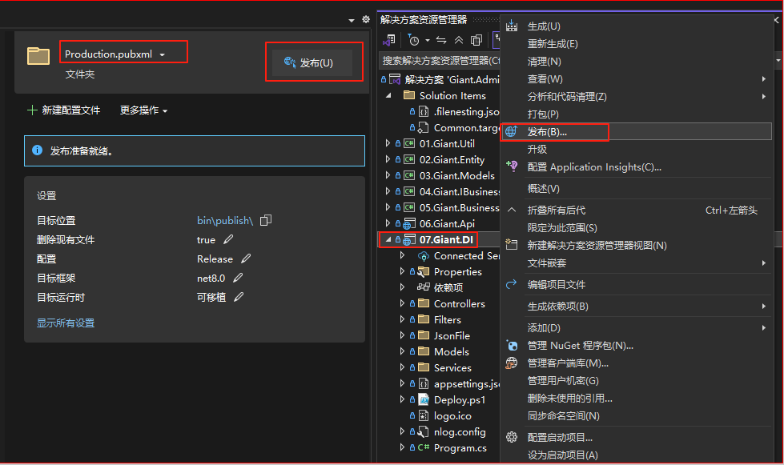
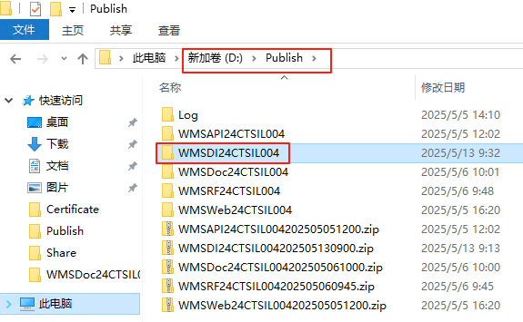
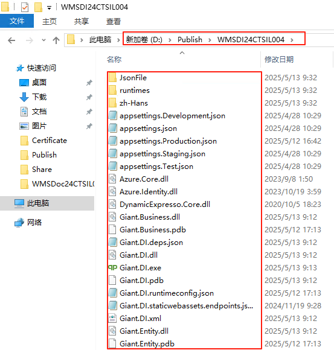
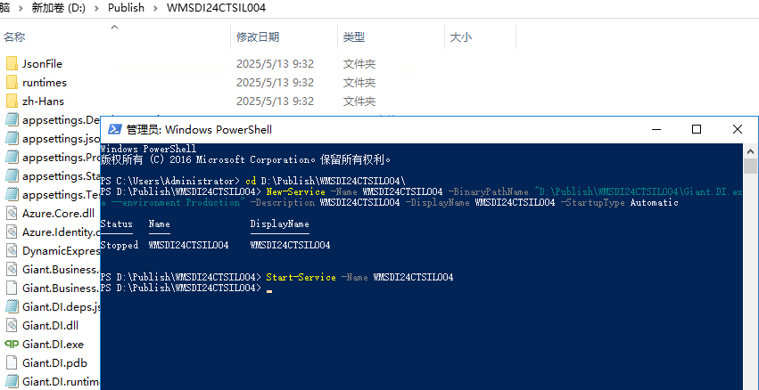
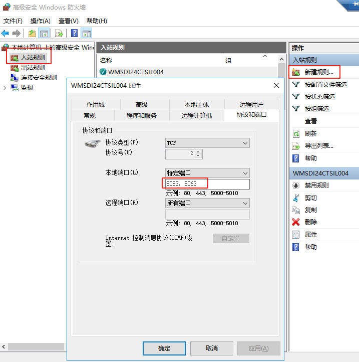
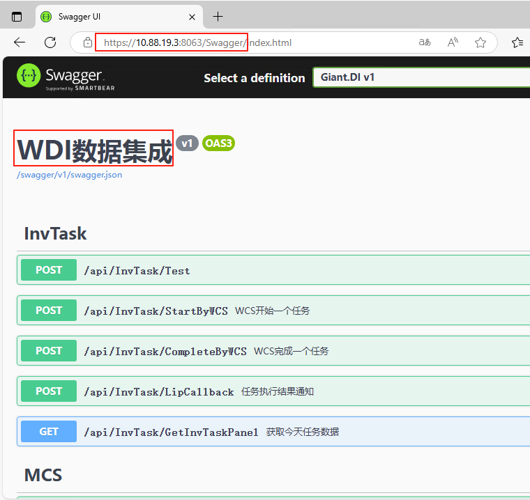

<script setup>
import { ref } from 'vue'
import { data } from '/.vitepress/project.data.ts'
const projectData = ref(data)
</script>

# 部署 WMS DI

## 修改配置文件

修改07.Giant.DI\appsettings.Production.json文件

1. 修改正确的Kestrel服务与证书配置(Kestrel节点)
2. 修改数据库连接与授权（ConnectionStrings，Copyright节点）
3. 配置正确的HttpClients（HttpClients节点）
4. 配置HostService的启动与定时时间（HostService节点）

```json-vue
{
  "Kestrel": {
    "Endpoints": {
      "Http": {
        "Url": "http://*:8053"
      },
      "HttpsDefaultCert": {
        "Url": "https://*:{{projectData.wmsDIPort}}"
      }
    },
    "Certificates": {
      "Default": {
        "Subject": "{{projectData.webHostName}}",
        "Store": "My",
        "Location": "LocalMachine",
        "AllowInvalid": false
      }
    }
  },
  "ConnectionStrings": {
    "GDbContext": "Data Source=10.88.19.4;Initial Catalog={{projectData.projectNo}};User Id=sa;Password={password};APP=ZEQPWMS;Pooling=true;"
  },
  "Copyright": {
    "License": "{WDI License}",
    "Sign": "{WDI Sign}"
  },
  "HttpClients": [
    {
      "Name": "{服务名称}",
      "BaseAddress": "{服务URL}",
      "Timeout": {超时时间，默认5},
      "Headers": {
        "{headerName}": "{headerValue}"
      }
    }
  ],
    "HostService": [
        {
            "Name": "{服务名称(名称空间)}",
            "Enable": {服务是否启用：true|false},
            "Cron": "{服务定时时间，Cron表达示}"
        }
    ]
}

```

## 发布 WMS DI

### 命令发布（方式一）

1. 打开PowerShell运行下面3个命令

```powershell
#进入DI项目目录
cd D:\CTR\Giant.Admin\Giant.DI\
#运行发布命令
dotnet publish -o .\bin\publish\ -c "Release" -f net8.0 --no-self-contained --no-restore -v m --nologo -p:EnvironmentName=Production -p:Product=ZEQP.WDI
#给发布文件签名(可选)
..\Sign\signtool.exe sign /f ..\Sign\ZEQP-WMS.pfx /p zeqp /t http://localhost:1003/TSA/ /fd SHA256 .\bin\publish\Giant.*
```

### 操作发布（方式二）

1. 在Giant.DI项目上点右键，选择“发布”
2. 在打开的发布界面点“发布”按钮




## 服务器配置

### 复制发布文件至服务器

1. 在服务器D:盘下面创建Publish文件夹
2. 把本地的发布文件bin\publish目录下所有文件打包zip文件
3. 把本地打包的zip文件复制至服务器Publish目录下面
4. 在Publish目录下新建WMSDI{{data.projectNo}}文件夹
5. 把zip压缩文件内的所有文件解压至WMSDI{{data.projectNo}}文件夹




### 服务器配置IIS

1. 创建WDI服务

```powershell-vue
#创建服务
New-Service -Name WMSDI{{data.projectNo}} -BinaryPathName "D:\Publish\WMSDI{{data.projectNo}}\Giant.DI.exe --environment Production" -Description WMSDI{{data.projectNo}} -DisplayName WMSDI{{data.projectNo}} -StartupType Automatic
#启动服务
Start-Service -Name WMSDI{{data.projectNo}}
```



2. 打开防火墙，允许访问8053,{{projectData.wmsDIPort}}端口


3. 测试站点

使用浏览器访问 <a :href="'http://'+projectData.webHost+':8053/Swagger'" target="_blank">http://{{projectData.webHost}}:8053/Swagger</a>

使用浏览器访问 <a :href="'https://'+projectData.webHost+':'+projectData.wmsDIPort+'/Swagger'" target="_blank">https://{{projectData.webHost}}:{{projectData.wmsDIPort}}/Swagger</a>

出现以下界面表示成功

