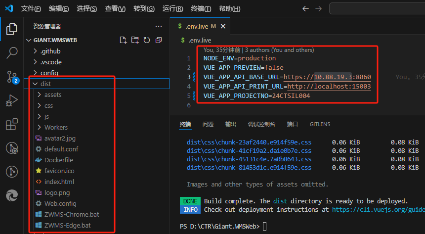
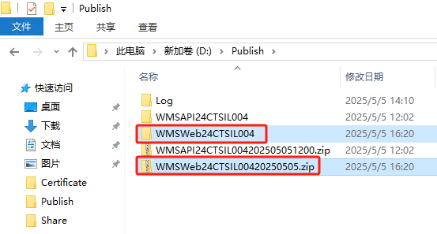
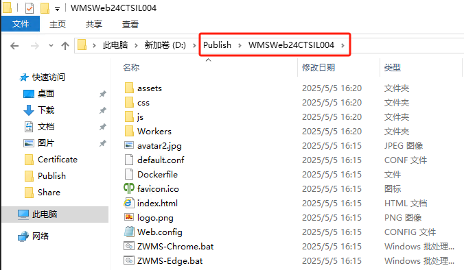
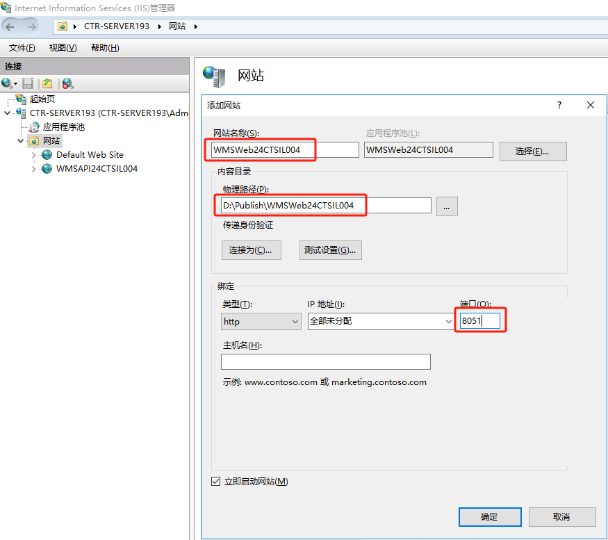
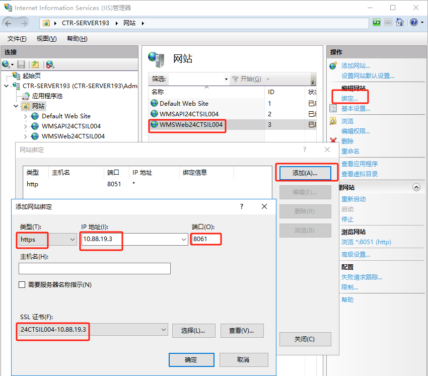
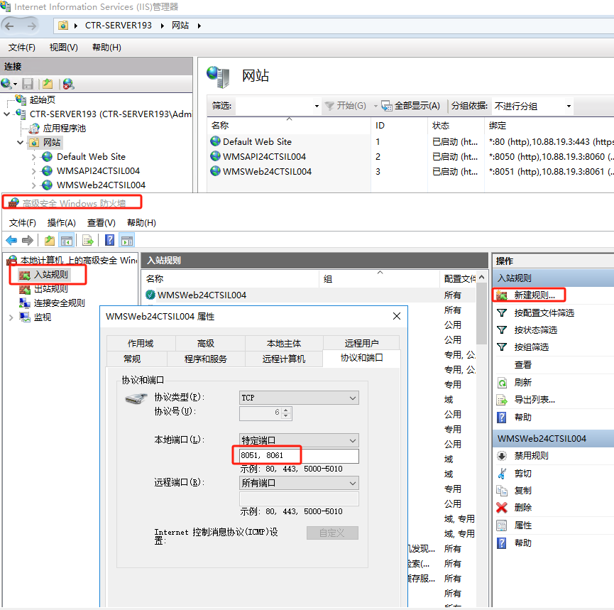
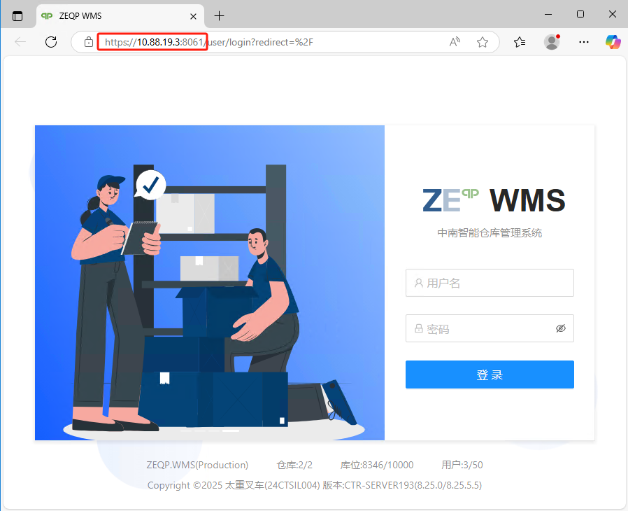

<script setup>
import { ref } from 'vue'
import { data } from '/.vitepress/project.data.ts'
const projectData = ref(data)
</script>

# 部署 WMS Web

## 发布WMS Web

1.修改配置文件.env.live

BASE_URL:API接口地址

```txt-vue
NODE_ENV=production
VUE_APP_PREVIEW=false
VUE_APP_API_BASE_URL=https://{{data.webHost}}:{{projectData.wmsAPIPort}}
VUE_APP_API_PRINT_URL=http://localhost:15003
VUE_APP_PROJECTNO={{data.projectNo}}
```

2. 编译文件

```powershell
npm run build:live
```

编译后生成的文件在dist目录



## 服务器配置

### 复制文件至服务器

1. 在服务器D:盘下面创建Publish文件夹
2. 把本地的发布文件dist目录下所有文件打包zip文件
3. 把本地打包的zip文件复制至服务器Publish目录下面
4. 在Publish目录下新建WMSWeb{{data.projectNo}}文件夹
5. 把zip压缩文件内的所有文件解压至WMSWeb{{data.projectNo}}文件夹




### 服务器配置IIS

1. 创建IIS站点

打开IIS管理器，在左边导航空白地方点右键，选择“添加网站”


输入站点名:WMSWeb{{data.projectNo}}、路径:D:\Publish\WMSWeb{{data.projectNo}}、端口（8051）等必要信息


选择创建的站点，在右边导航上选择“绑定”

新增加https的绑定项目，选择类型为https，IP地址为服务器IP:{{data.webHost}}，端口为：{{projectData.wmsWebPort}}


2. 打开防火墙8051,{{projectData.wmsWebPort}}


3. 测试站点

使用浏览器访问 <a :href="'https://'+projectData.webHost+':'+projectData.wmsWebPort" target="_blank">https://{{projectData.webHost}}:{{projectData.wmsWebPort}}</a>

出现以下界面表示成功
