# LIP兼容性测试报告-银河麒麟服务器 V10 兆芯版

| 系统版本: | 银河麒麟服务器 V10 兆芯版    |
| --------- | ---------------------------- |
| 认证产品: | LIP 智能物流调度集成平台V6.0 |
| 测试日期: | 2026年07月23日               |

------

## 1 引言

### 1.1 测试目的

对待测产品LIP 智能物流调度集成平台V6.0 与银河麒麟服务器 V10 兆芯版 的兼容性、功能加以验证。

## 2 认证产品信息及测试环境

### 2.1 产品信息

表2-1 产品信息表

| 产品名称                  | LIP 智能物流调度集成平台V6.0                                 |
| ------------------------- | ------------------------------------------------------------ |
| 产品信息                  | LIP 智能物流调度集成平台V6.0 是一套面向现代仓储物流的智能调度管理系统，提供任务管理、基础数据、系统管理等核心功能。系统采用 B/S 架构，前端基于 Vue 框架，后端基于 .NET 6平台，支持部署于银河麒麟服务器 V10 兆芯版 服务器操作系统。 |
| 安装方式                  | ☑ 脚本 □ 图形                                                |
| 构建（build）依赖         | .NET 6 SDK、Node.js 16+（前端构建）                          |
| 依赖的库文件及版本        | libssl1.1、libicu-dev（系统原生库）                          |
| 库接口                    | 无自定义库接口，后端通过 RESTful HTTP API 对外提供服务       |
| 内核模块                  | 无                                                           |
| B/S程序对浏览器插件的需求 | 无特殊插件需求，支持 Chrome、银河麒麟浏览器（基于 Chromium）等主流浏览器 |

### 2.2 环境信息

#### ***\**2.2.1 操作系统环境\**\***

表2-2 操作系统环境表

| OS平台       | 银河麒麟服务器 V10 兆兴版 操作系统                           |
| ------------ | ------------------------------------------------------------ |
| 操作系统镜像 | Kylin-Server-V10-SP3-2403-Release-20240426-X86_64.iso        |
| 系统信息     | 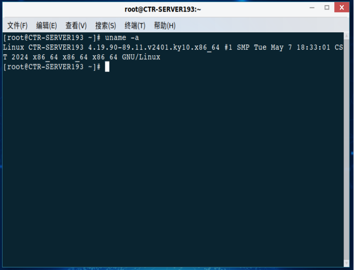 |
| CPU信息-GUI  | 我的电脑 - 右键 - 属性截图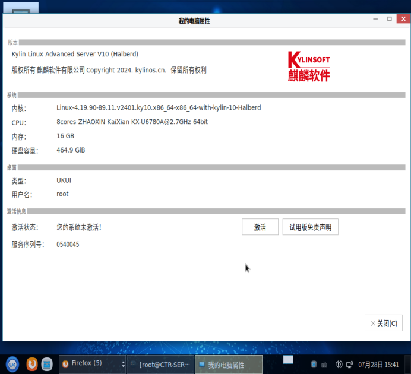 |
| CPU信息      | 执行 lscpu 命令截图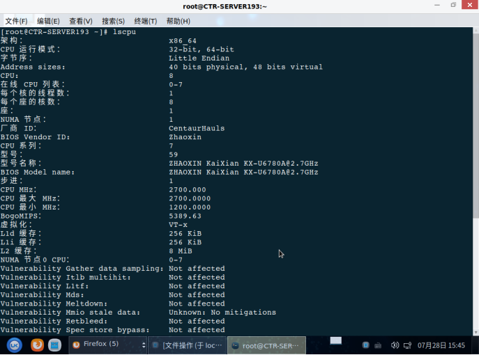 |
| IP信息       | 执行 ifconfig -a 命令截图，服务器内网 IP：10.76.40.96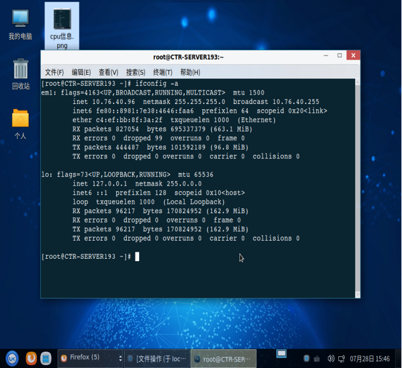 |
| 开发语言版本 | .NET 6 Runtime，执行 dotnet --version 命令截图 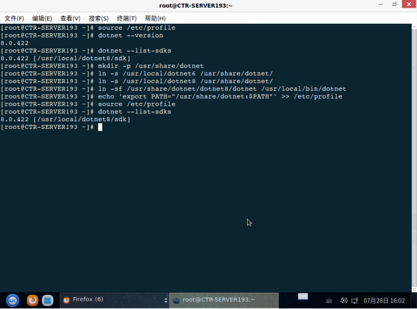 |
| 中间件状态   | Nginx，查看系统监视器，状态 运行中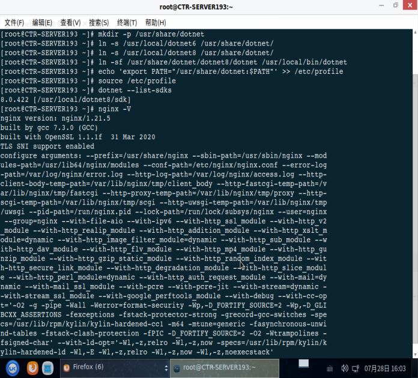 |
| 数据库状态   | 达梦8 部署于独立服务器 10.76.99.19                           |

#### **2.2.2 软件依赖环境**

表2-3 软件依赖环境表

|            | 软件名称              | 版本号       | 是否部署在银河麒麟系统 |
| ---------- | --------------------- | ------------ | ---------------------- |
| 产品架构   | ☑ B/S                 | /            | /                      |
| 开发语言   | ☑ C#（.NET 平台）     | .NET 6       | /                      |
| 依赖环境   | ☑ .NET Runtime        | 6.0          | ☑ 是                   |
| 中间件     | Nginx                 | 1.18+        | ☑ 是                   |
| 数据库     | 达梦 DM               | 8.1.3.x      | □ 否（独立服务器）     |
| 其他依赖库 | libssl1.1、libicu-dev | 系统自带版本 |                        |

#### **2.2.3 测试环境架构及说明**

***\*1、测试环境架构图\****

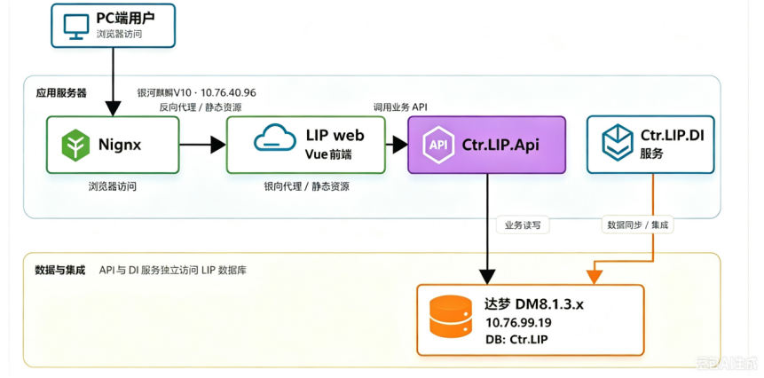

***\*2、测试环境说明\****

表2-4 测试环境说明表

| 访问入口                                                     | 测试账号   | 密码       |
| ------------------------------------------------------------ | ---------- | ---------- |
| http://10.76.40.96:8072（LIP前端）                           | admin      | ctr@2025   |
| [http://10.76.40.96:8850/swagger](http://10.76.40.96:8070/swagger)（API） | （待填写） | （待填写） |
| http://10.76.40.96:8071/swagger（DI）                        | （待填写） | （待填写） |

------

## 3 测试内容

### 3.1 测试策略

银河麒麟软件适配测试策略是基于合作厂商提供的完整测试报告，对产品主要功能进行抽查复测，确认测试用例覆盖产品主要功能模块，并完成基于银河麒麟服务器操作系统 V20 的认证测试。

### 3.2 测试方法

测试项包括产品安装、服务启动/停止、Web端功能验证、浏览器兼容性测试等。

\1. 通过脚本方式完成产品部署，验证部署过程无明显报错。

\2. 使用 systemctl 命令验证后端服务及 Nginx 的启动与停止。

\3. 使用银河麒麟浏览器及 Chrome 浏览器访问 LIP Web 端，对基础数据、基础信息、任务管理、任务信息、系统管理等功能模块进行验证。

### 3.3 测试结果总览

表3-1 测试结果表

|      | 用例总数 | PASS | PASS with Comments | FAIL | NA   |
| ---- | -------- | ---- | ------------------ | ---- | ---- |
| 结果 | 14       | 14   | 0                  | 0    | 0    |

 

### 3.4 用例列表及结果

表3-2 用例列表及结果表

| 测试类别     | 用例编号          | 用例名称                | 测试结果 |
| ------------ | ----------------- | ----------------------- | -------- |
| 产品部署测试 | YHQL-LIP-Base-001 | 产品安装部署            | ✅ PASS   |
|              | YHQL-LIP-Base-002 | 产品服务启动            | ✅ PASS   |
|              | YHQL-LIP-Base-003 | 产品服务停止            | ✅ PASS   |
|              | YHQL-LIP-Base-004 | 产品服务运行            | ✅ PASS   |
| 用户认证     | YHQL-LIP-Auth-001 | 用户登录                | ✅ PASS   |
| 基础数据     | YHQL-LIP-BASE-001 | 基础数据-容器信息       | ✅ PASS   |
| 基础信息     | YHQL-LIP-INFO-001 | 基础信息-规则           | ✅ PASS   |
| 任务信息     | YHQL-LIP-TSK-001  | 任务管理-历史任务       | ✅ PASS   |
|              | YHQL-LIP-TSK-002  | 任务信息-订单信息       | ✅ PASS   |
|              | YHQL-LIP-TSK-003  | 任务信息-任务信息       | ✅ PASS   |
| 系统管理     | YHQL-LIP-SYS-001  | 系统管理-编码规则       | ✅ PASS   |
|              | YHQL-LIP-SYS-002  | 系统管理-系统日志       | ✅ PASS   |
| 浏览器兼容性 | YHQL-LIP-BR-001   | 银河麒麟浏览器访问LIP端 | ✅ PASS   |
|              | YHQL-LIP-BR-002   | Chrome浏览器访问LIP端   | ✅ PASS   |

------

## 4 测试结果

| 用例编号 | YHQL-LIP-Base-001                                            |
| -------- | ------------------------------------------------------------ |
| 用例名称 | 产品安装部署                                                 |
| 预置条件 | 1. 银河麒麟服务器 V10 兆芯版 操作系统已安装完成 2. 已获取 LIP 智能物流调度集成平台V6.0 安装包及部署脚本 3. 已具备部署所需的系统权限 4. 数据库、中间件及运行环境满足部署要求 |
| 测试步骤 | 1. 登录银河麒麟服务器 V10 兆芯版 服务器 2. 上传 LIP 产品安装包及部署脚本至指定目录 3. 执行部署脚本 4. 查看部署过程输出日志 5. 检查前端、后端服务及相关配置文件是否生成 |
| 预期结果 | 产品安装部署过程无明显报错，相关服务文件、配置文件及部署目录生成正常，系统具备启动条件 |
| 实测结果 | ✅ PASS □ PASS with Comments □ FAIL □ NA                      |
| 结果截图 | 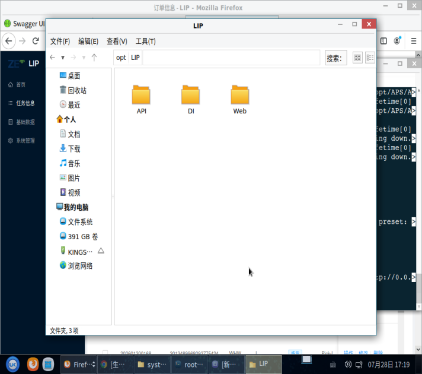 |

 

| 用例编号 | YHQL-LIP-Base-002                                            |
| -------- | ------------------------------------------------------------ |
| 用例名称 | 产品服务启动                                                 |
| 预置条件 | 1. 产品已完成安装部署 2. 后端服务、Nginx 服务配置文件已生成 3. 当前用户具备服务启动权限 |
| 测试步骤 | 1. 登录银河麒麟服务器 V10 兆芯版 服务器 2. 执行产品服务启动命令 3. 使用 systemctl status 查看后端服务及 Nginx 服务状态 4. 访问 LIP Web 前端地址、API Swagger 地址及 DI Swagger 地址 |
| 预期结果 | 产品相关服务均可正常启动，服务状态为 running/active，Web 前端及 Swagger 页面可正常访问 |
| 实测结果 | ✅ PASS □ PASS with Comments □ FAIL □ NA                      |
| 结果截图 | 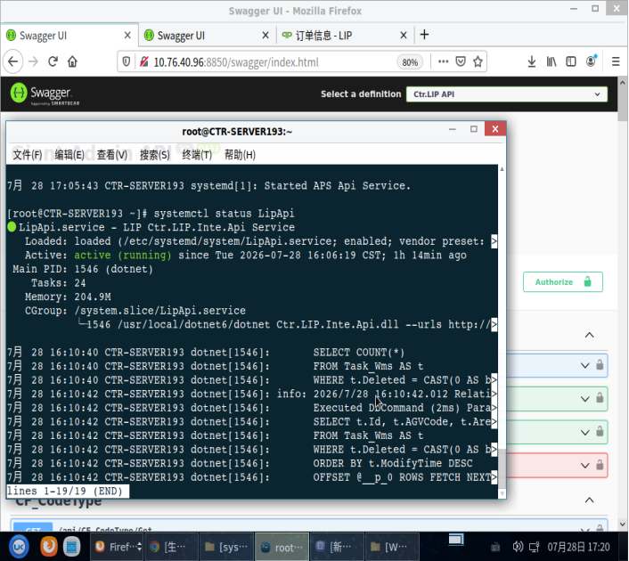 |

 

| 用例编号 | YHQL-LIP-Base-003                                            |
| -------- | ------------------------------------------------------------ |
| 用例名称 | 产品服务停止                                                 |
| 预置条件 | 1. 产品相关服务已正常启动 2. 当前用户具备服务停止权限        |
| 测试步骤 | 1. 登录银河麒麟服务器 V10 兆芯版 服务器 2. 执行产品服务停止命令 3. 使用 systemctl status 查看后端服务及 Nginx 服务状态 4. 尝试访问 LIP Web 前端地址、API Swagger 地址及 DI Swagger 地址 |
| 预期结果 | 产品相关服务可正常停止，服务状态变为 stopped/inactive，相关 Web 页面不可继续访问或提示服务不可用 |
| 实测结果 | ✅ PASS □ PASS with Comments □ FAIL □ NA                      |
| 结果截图 | 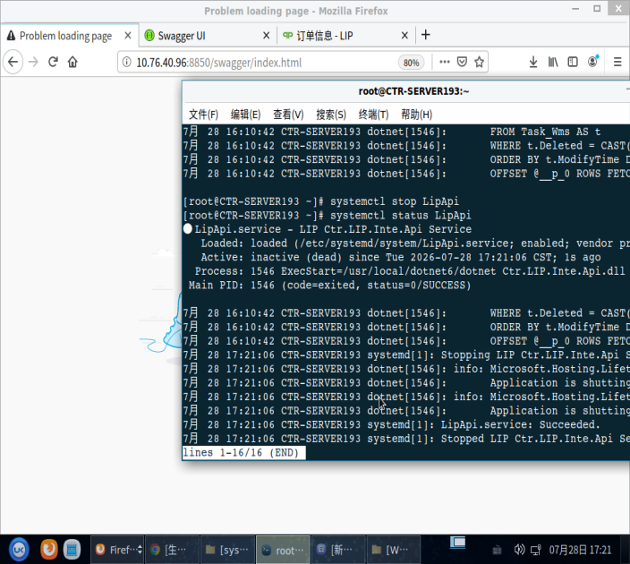 |

 

| 用例编号 | YHQL-LIP-Base-004                                            |
| -------- | ------------------------------------------------------------ |
| 用例名称 | 产品服务运行                                                 |
| 预置条件 | 1. 产品相关服务已正常启动 2. 数据库、中间件及网络连接正常    |
| 测试步骤 | 1. 登录银河麒麟服务器 V10 兆芯版 服务器 2. 查看产品后端服务及 Nginx 服务运行状态 3. 访问 LIP Web 前端地址 4. 执行登录、菜单访问、数据查询等基础操作 5. 查看服务运行期间是否出现异常报错 |
| 预期结果 | 产品服务运行稳定，页面访问正常，基础功能可正常使用，服务运行期间无明显异常报错 |
| 实测结果 | ✅ PASS □ PASS with Comments □ FAIL □ NA                      |
| 结果截图 | 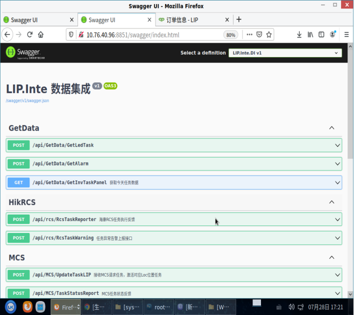 |

 

| 用例编号 | YHQL-LIP-Auth-001                                            |
| -------- | ------------------------------------------------------------ |
| 用例名称 | 用户登录                                                     |
| 预置条件 | 系统已正常启动，数据库连接正常，测试账号已存在               |
| 测试步骤 | 1. 打开浏览器，访问 LIP 前端地址 2. 输入测试账号和密码 3. 点击登录按钮 |
| 预期结果 | 登录成功，跳转至系统主页，左侧显示基础数据、基础信息、任务管理、任务信息、系统管理等菜单 |
| 实测结果 | ✅ PASS □ PASS with Comments □ FAIL □ NA                      |
| 结果截图 | 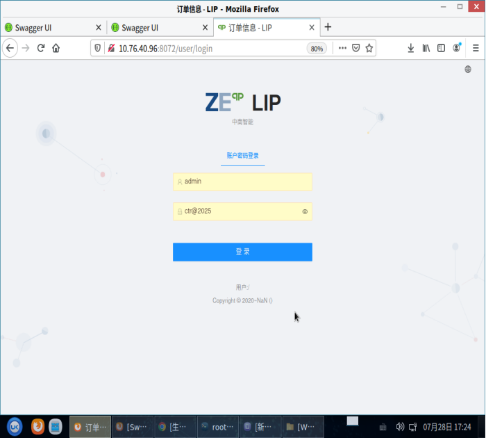 |

 

| 用例编号 | YHQL-LIP-BASE-001                                            |
| -------- | ------------------------------------------------------------ |
| 用例名称 | 基础数据-容器信息                                            |
| 预置条件 | 用户已登录，系统有容器信息数据                               |
| 测试步骤 | 1. 点击左侧菜单【基础数据】-【容器信息】 2. 查看列表         |
| 预期结果 | 容器信息列表正常加载，数据显示完整                           |
| 实测结果 | ✅ PASS □ PASS with Comments □ FAIL □ NA                      |
| 结果截图 | 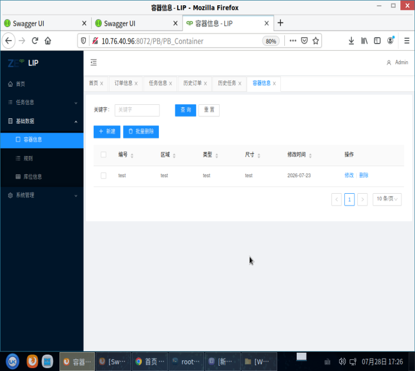 |

 

| 用例编号 | YHQL-LIP-INFO-001                                            |
| -------- | ------------------------------------------------------------ |
| 用例名称 | 基础信息-规则                                                |
| 预置条件 | 用户已登录，系统有规则配置数据                               |
| 测试步骤 | 1. 点击左侧菜单【基础信息】-【规则】 2. 查看规则列表         |
| 预期结果 | 规则列表正常加载，规则配置显示完整                           |
| 实测结果 | ✅ PASS □ PASS with Comments □ FAIL □ NA                      |
| 结果截图 | 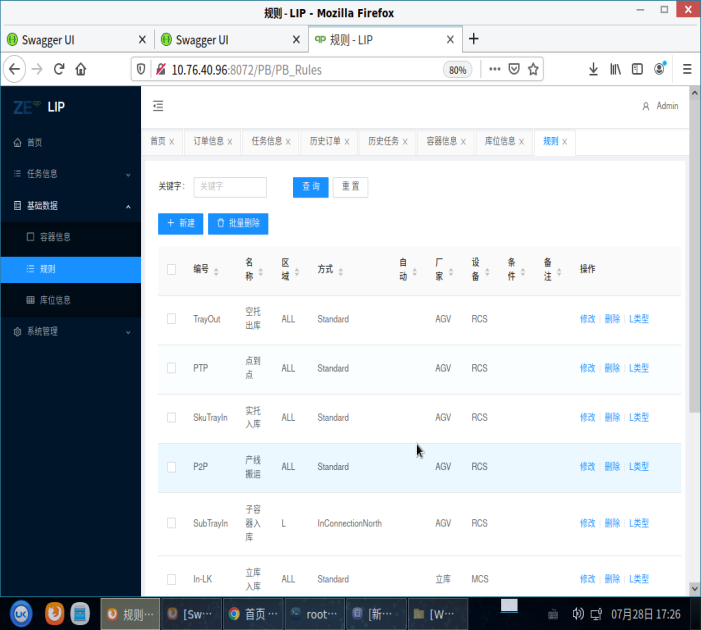 |

 

| 用例编号 | YHQL-LIP-TSK-001                                             |
| -------- | ------------------------------------------------------------ |
| 用例名称 | 任务信息-历史任务                                            |
| 预置条件 | 用户已登录，系统有历史任务数据                               |
| 测试步骤 | 1. 点击左侧菜单【任务管理】-【历史任务】 2. 输入查询条件，查看历史任务列表 |
| 预期结果 | 历史任务列表正常返回，列表分页正常，数据显示完整             |
| 实测结果 | ✅ PASS □ PASS with Comments □ FAIL □ NA                      |
| 结果截图 | 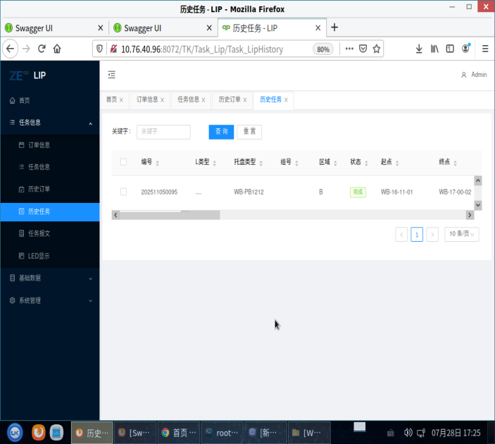 |

 

| 用例编号 | YHQL-LIP-TSK-002                                             |
| -------- | ------------------------------------------------------------ |
| 用例名称 | 任务信息-订单信息                                            |
| 预置条件 | 用户已登录，系统有订单信息数据                               |
| 测试步骤 | 1. 点击左侧菜单【任务信息】-【订单信息】 2. 输入查询条件，查看订单信息列表 |
| 预期结果 | 订单信息列表正常返回，列表分页正常，数据显示完整             |
| 实测结果 | ✅ PASS □ PASS with Comments □ FAIL □ NA                      |
| 结果截图 | 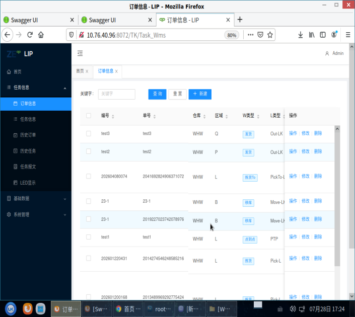 |

 

| 用例编号 | YHQL-LIP-TSK-003                                             |
| -------- | ------------------------------------------------------------ |
| 用例名称 | 任务信息-任务信息                                            |
| 预置条件 | 用户已登录，系统有任务信息数据                               |
| 测试步骤 | 1. 点击左侧菜单【任务信息】-【任务信息】 2. 输入查询条件，查看任务信息列表 |
| 预期结果 | 任务信息列表正常返回，列表分页正常，数据显示完整             |
| 实测结果 | ✅ PASS □ PASS with Comments □ FAIL □ NA                      |
| 结果截图 | 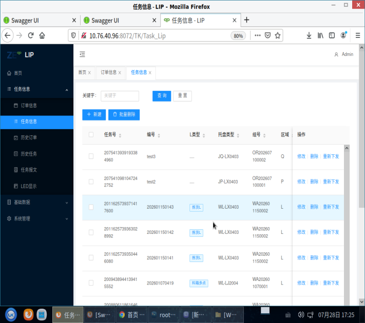 |

 

| 用例编号 | YHQL-LIP-SYS-001                                             |
| -------- | ------------------------------------------------------------ |
| 用例名称 | 系统管理-编码规则                                            |
| 预置条件 | 用户已登录，具有系统管理权限                                 |
| 测试步骤 | 1. 点击左侧菜单【系统管理】-【编码规则】 2. 查看编码规则列表 |
| 预期结果 | 编码规则列表正常加载，显示字典类型、键值等信息               |
| 实测结果 | ✅ PASS □ PASS with Comments □ FAIL □ NA                      |
| 结果截图 | 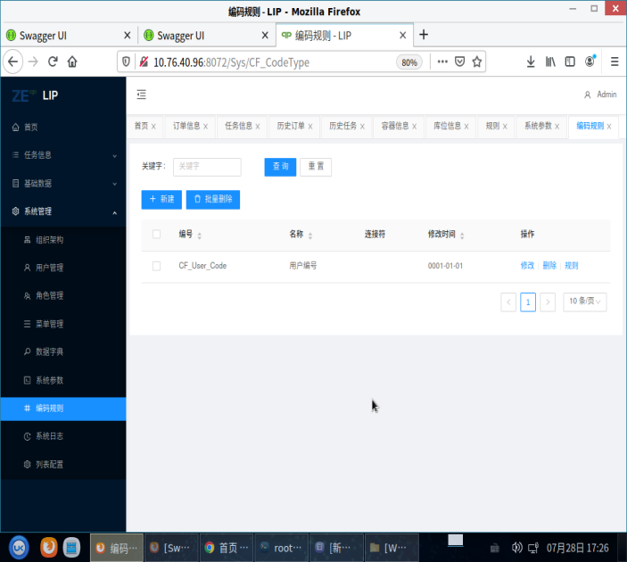 |

 

| 用例编号 | YHQL-LIP-SYS-002                                             |
| -------- | ------------------------------------------------------------ |
| 用例名称 | 系统管理-系统日志                                            |
| 预置条件 | 用户已登录，具有系统管理权限                                 |
| 测试步骤 | 1. 点击左侧菜单【系统管理】-【系统日志】 2. 查看用户列表     |
| 预期结果 | 用户列表正常加载，显示用户名、角色、状态等信息               |
| 实测结果 | ✅ PASS □ PASS with Comments □ FAIL □ NA                      |
| 结果截图 | 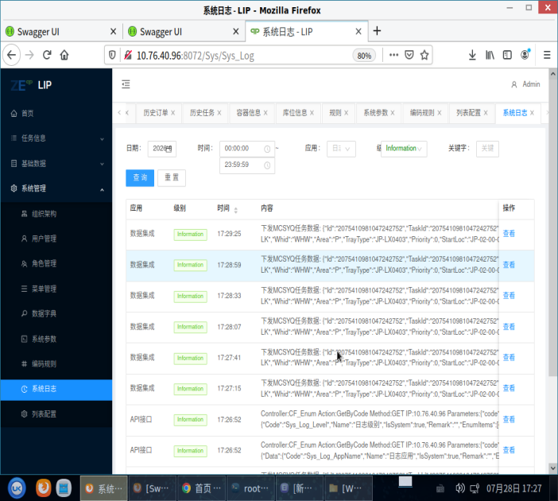 |

 

| 用例编号 | YHQL-LIP-BR-001                                              |
| -------- | ------------------------------------------------------------ |
| 用例名称 | 银河麒麟浏览器访问LIP端                                      |
| 预置条件 | 银河麒麟服务器 V10 兆芯版 系统自带浏览器已安装，LIP 服务正常运行 |
| 测试步骤 | 1. 打开银河麒麟浏览器 2. 访问 LIP 前端地址 3. 执行登录、菜单切换、数据查询等基础操作 |
| 预期结果 | 页面正常加载，功能操作正常，无明显兼容性问题                 |
| 实测结果 | ✅ PASS □ PASS with Comments □ FAIL □ NA                      |
| 结果截图 | 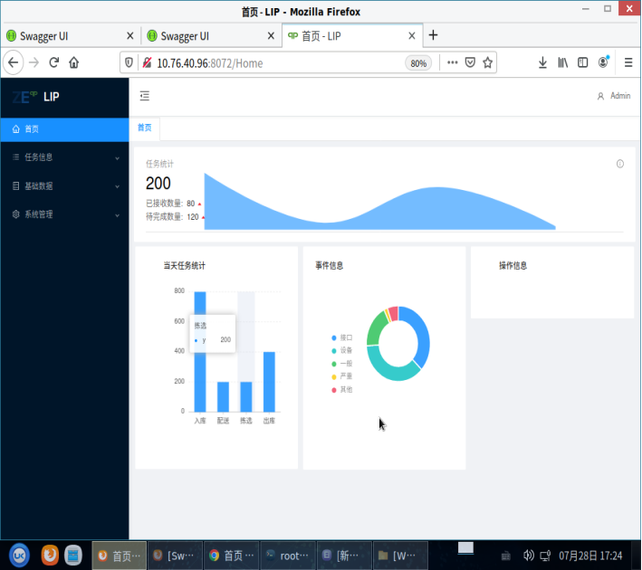 |

 

| 用例编号 | YHQL-LIP-BR-002                                              |
| -------- | ------------------------------------------------------------ |
| 用例名称 | Chrome浏览器访问LIP端                                        |
| 预置条件 | Google Chrome 浏览器已安装，LIP 服务正常运行                 |
| 测试步骤 | 1. 打开 Chrome 浏览器 2. 访问 LIP 前端地址 3. 执行登录、菜单切换、数据查询等基础操作 |
| 预期结果 | 页面正常加载，功能操作正常，无明显兼容性问题                 |
| 实测结果 | ✅ PASS □ PASS with Comments □ FAIL □ NA                      |
| 结果截图 | 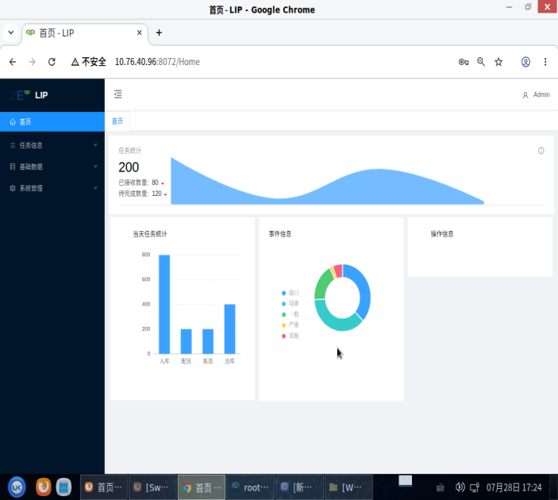 |

------

## 5 结论

LIP 智能物流调度集成平台V6.0 通过适配测试的各项内容，能够满足银河麒麟服务器操作系统 V20 的认证要求，通过银河麒麟软件适配认证测试。系统在银河麒麟服务器 V10 兆芯版 环境下，安装部署流程顺畅，服务启停正常，Web端基础数据-容器信息、基础信息-规则、任务管理-历史任务、任务信息-订单信息、任务信息-任务信息、系统管理-编码规则、系统管理-系统日志等核心功能运行稳定，银河麒麟浏览器及 Chrome 浏览器兼容性良好。

 

 