# WMS兼容性测试报告-银河麒麟服务器 V10 兆芯版

| 系统版本: | 银河麒麟服务器 V10 兆芯版 |
| --------- | ------------------------- |
| 认证产品: | WMS智能仓库管理系统V8.25  |
| 测试日期: | 2026年07月28日            |

------

## 1 引言

### 1.1 测试目的

对待测产品WMS智能仓库管理系统V8.25 与银河麒麟服务器 V10 兆芯版 的兼容性、功能加以验证。

## 2 认证产品信息及测试环境

### 2.1 产品信息

表2-1 产品信息表

| 产品名称                  | WMS智能仓库管理系统V8.25                                     |
| ------------------------- | ------------------------------------------------------------ |
| 产品信息                  | WMS智能仓库管理系统V8.25 是一套面向现代仓储物流的仓库管理系统，提供仓库业务、策略设置、功能管理、基础数据、库存管理、任务管理、数据管理、报表中心、系统管理等核心功能，并支持 RF 手持终端操作。系统采用 B/S 架构，前端基于 Vue 框架，后端基于 .NET 8平台，支持部署于银河麒麟服务器 V10 兆芯版服务器操作系统。 |
| 安装方式                  | ☑ 脚本 □ 图形                                                |
| 构建（build）依赖         | .NET 8 SDK、Node.js 16+（前端构建）                          |
| 依赖的库文件及版本        | libssl1.1、libicu-dev（系统原生库）                          |
| 库接口                    | 无自定义库接口，后端通过 RESTful HTTP API 对外提供服务       |
| 内核模块                  | 无                                                           |
| B/S程序对浏览器插件的需求 | 无特殊插件需求，支持 Chrome、银河麒麟浏览器（基于 Chromium）等主流浏览器 |

### 2.2 环境信息

#### ***\**2.2.1 操作系统环境\**\***

表2-2 操作系统环境表

| OS平台       | 银河麒麟服务器 V10 兆兴版 操作系统                           |
| ------------ | ------------------------------------------------------------ |
| 操作系统镜像 | Kylin-Server-V10-SP3-2403-Release-20240426-X86_64.iso        |
| 系统信息     | 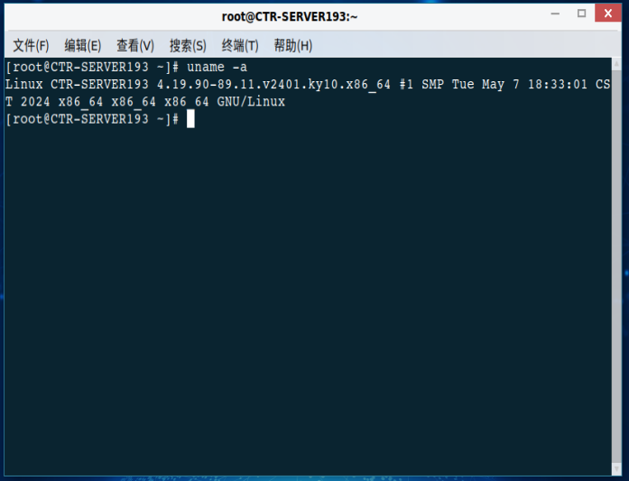 |
| CPU信息-GUI  | 我的电脑 - 右键 - 属性截图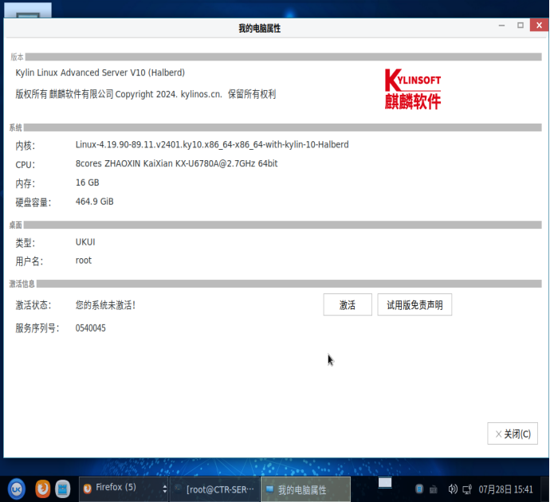 |
| CPU信息      | 执行 lscpu 命令截图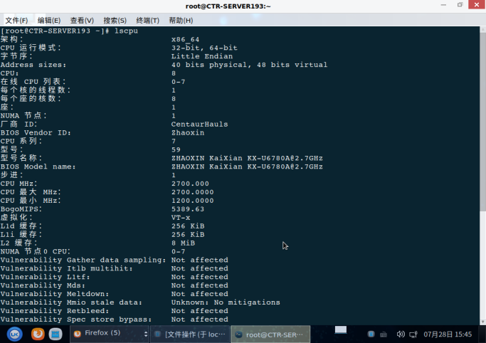 |
| IP信息       | 执行 ifconfig -a 命令截图，服务器内网 IP：10.76.40.96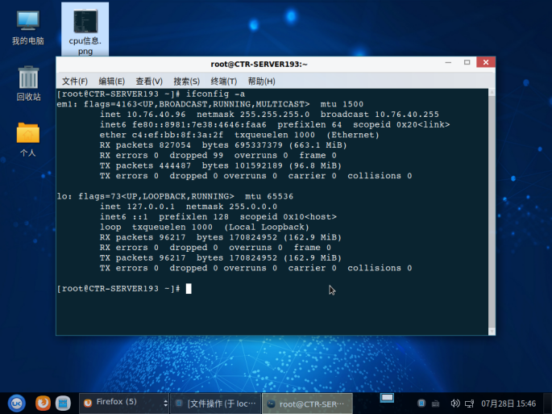 |
| 开发语言版本 | .NET 6 Runtime，执行 dotnet --version 命令截图 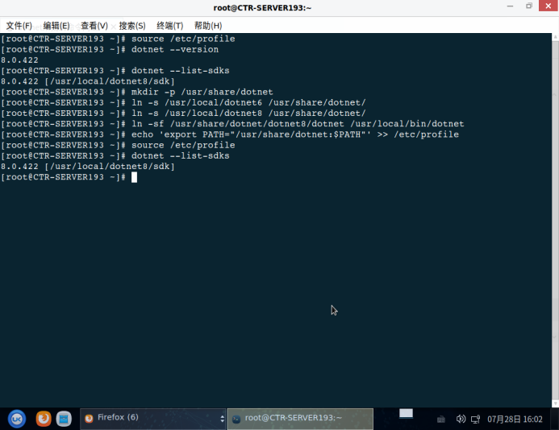 |
| 中间件状态   | Nginx，查看系统监视器，状态 运行中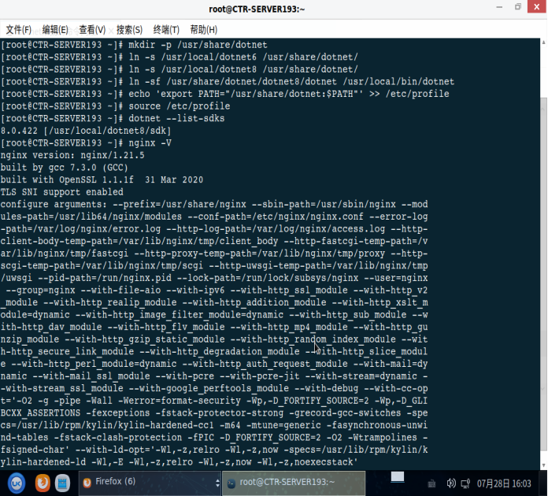 |
| 数据库状态   | 达梦8 部署于独立服务器 10.76.99.19                           |

#### **2.2.2 软件依赖环境**

表2-3 软件依赖环境表

|            | 软件名称              | 版本号       | 是否部署在银河麒麟系统 |
| ---------- | --------------------- | ------------ | ---------------------- |
| 产品架构   | ☑ B/S                 | /            | /                      |
| 开发语言   | ☑ C#（.NET 平台）     | .NET 8       | /                      |
| 依赖环境   | ☑ .NET Runtime        | 8.0          | ☑ 是                   |
| 中间件     | Nginx                 | 1.18+        | ☑ 是                   |
| 数据库     | 达梦 DM8.1.3.x        | DM8.1.3.x    | ☑ 否（独立服务器）     |
| 其他依赖库 | libssl1.1、libicu-dev | 系统自带版本 |                        |

#### **2.2.3 测试环境架构及说明**

***\*1、测试环境架构图\****

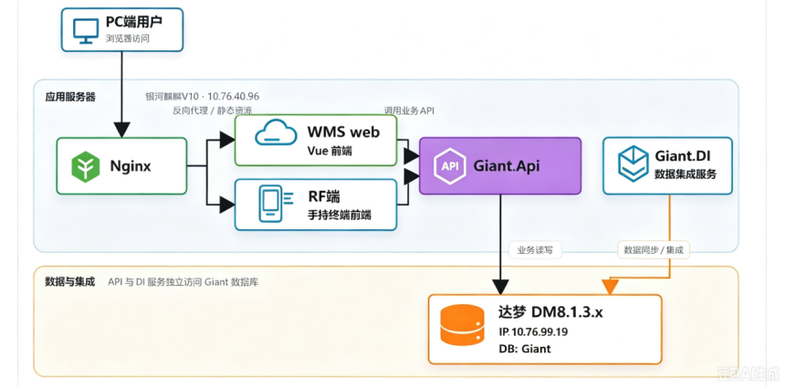

***\*2、测试环境说明\****

表2-4 测试环境说明表

| 访问入口                               | 测试账号   | 密码       |
| -------------------------------------- | ---------- | ---------- |
| http://10.76.40.96:8000（WMS前端）     | admin.wgj  | ctr@2025   |
| http://10.76.40.96:8080（RF端）        | admin.wgj  | ctr@2025   |
| http://10.76.40.96:8075/swagger（API） | （待填写） | （待填写） |
| http://10.76.40.96:8053/swagger（DI）  | （待填写） | （待填写） |

------

## 3 测试内容

### 3.1 测试策略

银河麒麟软件适配测试策略是基于合作厂商提供的完整测试报告，对产品主要功能进行抽查复测，确认测试用例覆盖产品主要功能模块，并完成基于银河麒麟服务器操作系统 V20 的认证测试。

### 3.2 测试方法

测试项包括产品安装、服务启动/停止、Web端功能验证、RF端功能验证、浏览器兼容性测试等。

\1. 通过脚本方式完成产品部署，验证部署过程无明显报错。

\2. 使用 systemctl 命令验证后端服务（wms-api、wms-di）及 Nginx 的启动与停止。

\3. 使用银河麒麟浏览器及 Chrome 浏览器访问 WMS Web 端，对仓库业务、策略设置、报表中心、系统管理、任务管理、基础数据等功能模块进行验证。

\4. 使用 RF 手持终端访问 WMS RF 端，验证登录、数据查询（收货、到货条码）、功能操作（任务、发货）、报表查询等操作功能。

### 3.3 测试结果总览

表3-1 测试结果表

|      | 用例总数 | PASS | PASS with Comments | FAIL | NA   |
| ---- | -------- | ---- | ------------------ | ---- | ---- |
| 结果 | 21       | 21   | 0                  | 0    | 0    |

### 3.4 用例列表及结果

表3-2 用例列表及结果表

***\*Web端\****

| 测试类别     | 用例编号          | 用例名称                    | 测试结果 |
| ------------ | ----------------- | --------------------------- | -------- |
| 产品部署测试 | YHQL-WMS-Base-001 | 产品安装部署                | ✅ PASS   |
|              | YHQL-WMS-Base-002 | 产品服务启动                | ✅ PASS   |
|              | YHQL-WMS-Base-003 | 产品服务停止                | ✅ PASS   |
|              | YHQL-WMS-Base-004 | 产品服务运行                | ✅ PASS   |
| 用户认证     | YHQL-WMS-Auth-001 | Web端用户登录               | ✅ PASS   |
| 仓库业务     | YHQL-WMS-BUS-001  | 到货管理查询                | ✅ PASS   |
| 策略设置     | YHQL-WMS-STG-001  | 上架策略查询                | ✅ PASS   |
| 库存管理     | YHQL-WMS-INV-001  | 库存台账                    | ✅ PASS   |
| 报表中心     | YHQL-WMS-RPT-001  | 库位监控查看                | ✅ PASS   |
| 系统管理     | YHQL-WMS-SYS-001  | 用户管理查询                | ✅ PASS   |
| 任务管理     | YHQL-WMS-TSK-001  | 任务管理查询                | ✅ PASS   |
| 基础数据     | YHQL-WMS-BAS-001  | 仓库基础数据查询            | ✅ PASS   |
| 浏览器兼容性 | YHQL-WMS-BR-001   | 银河麒麟浏览器访问WMS Web端 | ✅ PASS   |
|              | YHQL-WMS-BR-002   | Chrome浏览器访问WMS Web端   | ✅ PASS   |

***\*RF端\****

| 测试类别     | 用例编号           | 用例名称           | 测试结果 |
| ------------ | ------------------ | ------------------ | -------- |
| 用户认证     | YHQL-WMS-RF-001    | RF端用户登录       | ✅ PASS   |
| 功能操作     | YHQL-WMS-RF-002    | RF端收货数据查询   | ✅ PASS   |
|              | YHQL-WMS-RF-003    | RF端到货条码查询   | ✅ PASS   |
| 数据查询     | YHQL-WMS-RF-004    | RF端任务查询       | ✅ PASS   |
|              | YHQL-WMS-RF-005    | RF端发货操作       | ✅ PASS   |
| 报表查询     | YHQL-WMS-RF-006    | RF端报表查询       | ✅ PASS   |
| 浏览器兼容性 | YHQL-WMS-RF-BR-001 | Chrome访问WMS RF端 | ✅ PASS   |

------

##  

## 4 测试结果

### 4.1 产品部署测试

| 用例编号 | YHQL-WMS-Base-001                                            |
| -------- | ------------------------------------------------------------ |
| 用例名称 | 产品安装部署                                                 |
| 预置条件 | 1. 银河麒麟服务器 V10 兆芯版操作系统已安装完成 2. 已获取 WMS 智能仓库管理系统 V8.25 安装包及部署脚本 3. 已具备部署所需的系统权限 4. 数据库、中间件及运行环境满足部署要求 |
| 测试步骤 | 1. 登录银河麒麟服务器 V10 兆芯版服务器 2. 上传 WMS 产品安装包及部署脚本至指定目录 3. 执行部署脚本 4. 查看部署过程输出日志 5. 检查前端、后端服务及相关配置文件是否生成 |
| 预期结果 | 产品安装部署过程无明显报错，相关服务文件、配置文件及部署目录生成正常，系统具备启动条件 |
| 实测结果 | ✅ PASS □ PASS with Comments □ FAIL □ NA                      |
| 结果截图 | 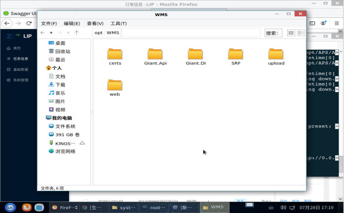 |

 

| 用例编号 | YHQL-WMS-Base-002                                            |
| -------- | ------------------------------------------------------------ |
| 用例名称 | 产品服务启动                                                 |
| 预置条件 | 1. WMS 产品已完成安装部署 2. 数据库服务连接正常 3. Nginx、wms-api、wms-di 等服务配置正确 |
| 测试步骤 | 1. 登录银河麒麟服务器 V10 兆芯版服务器 2. 执行服务启动命令，启动 WMS 后端服务及 Nginx 服务 3. 使用 systemctl status 查看服务运行状态 4. 访问 WMS Web 前端地址 5. 访问 API Swagger 与 DI Swagger 地址 |
| 预期结果 | wms-api、wms-di、Nginx 等服务均启动成功，服务状态为 running/active，Web 前端及 Swagger 页面可正常访问 |
| 实测结果 | ✅ PASS □ PASS with Comments □ FAIL □ NA                      |
| 结果截图 | 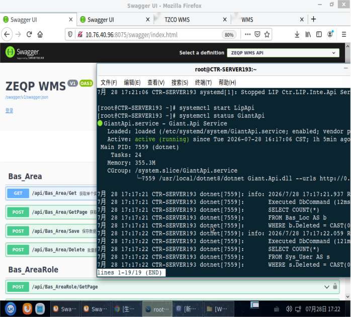 |

 

| 用例编号 | YHQL-WMS-Base-003                                            |
| -------- | ------------------------------------------------------------ |
| 用例名称 | 产品服务停止                                                 |
| 预置条件 | 1. WMS 产品服务已正常启动 2. 当前用户具备停止服务权限        |
| 测试步骤 | 1. 登录银河麒麟服务器 V10 兆芯版服务器 2. 执行服务停止命令，停止 wms-api、wms-di 及 Nginx 服务 3. 使用 systemctl status 查看服务状态 4. 尝试访问 WMS Web 前端地址及 Swagger 地址 |
| 预期结果 | wms-api、wms-di、Nginx 等服务可正常停止，服务状态变为 stopped/inactive，相关 Web 页面不可继续访问或提示服务不可用 |
| 实测结果 | ✅ PASS □ PASS with Comments □ FAIL □ NA                      |
| 结果截图 | 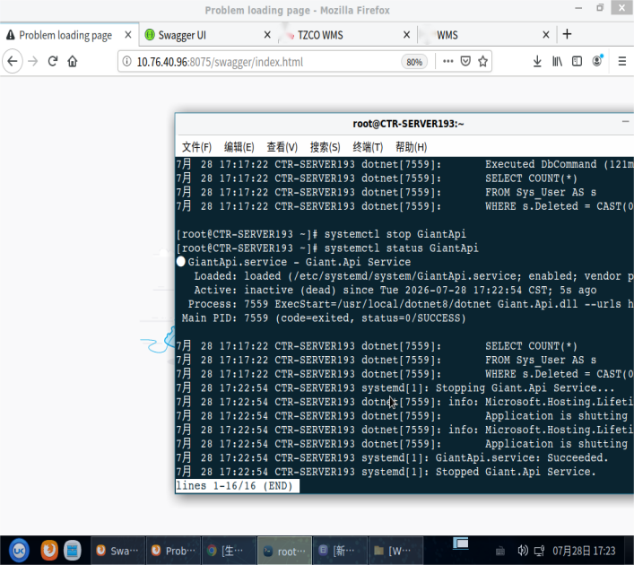 |

 

| 用例编号 | YHQL-WMS-Base-004                                            |
| -------- | ------------------------------------------------------------ |
| 用例名称 | 产品服务运行                                                 |
| 预置条件 | 产品服务已启动                                               |
| 测试步骤 | 1.执行命令 systemctl status mes-api 查看服务状态是否为启动 2.查看产品Swagger等界面是否正常运行 |
| 预期结果 | 进程正常运行，端口正常监听，API 响应正常，前端页面可访问     |
| 实测结果 | ✅ PASS □ PASS with Comments □ FAIL □ NA                      |
| 结果截图 | 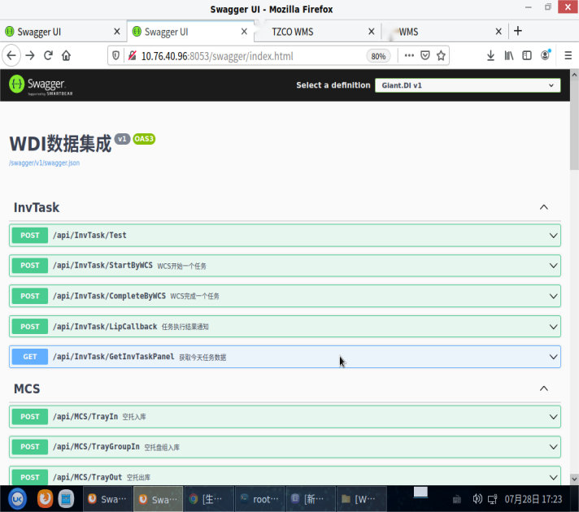|

 

### 4.2 Web端功能测试

| 用例编号 | YHQL-WMS-Auth-001                                            |
| -------- | ------------------------------------------------------------ |
| 用例名称 | Web端用户登录                                                |
| 预置条件 | 系统已正常启动，数据库连接正常，测试账号已存在               |
| 测试步骤 | 1. 打开浏览器，访问 WMS 前端地址 2. 输入测试账号和密码 3. 点击登录按钮 |
| 预期结果 | 登录成功，跳转至系统主页，左侧显示仓库业务、策略设置、功能管理、基础数据、库存管理、任务管理、数据管理、报表中心、系统管理等菜单 |
| 实测结果 | ✅ PASS □ PASS with Comments □ FAIL □ NA                      |
| 结果截图 | |

 

| 用例编号 | YHQL-WMS-BUS-001                                             |
| -------- | ------------------------------------------------------------ |
| 用例名称 | 到货管理查询                                                 |
| 预置条件 | 用户已登录，系统有到货单数据                                 |
| 测试步骤 | 1. 点击左侧菜单【仓库业务】-【到货管理】 2. 输入查询条件，点击查询按钮 |
| 预期结果 | 到货单列表正常返回，列表分页正常，数据显示完整               |
| 实测结果 | ✅ PASS □ PASS with Comments □ FAIL □ NA                      |
| 结果截图 | 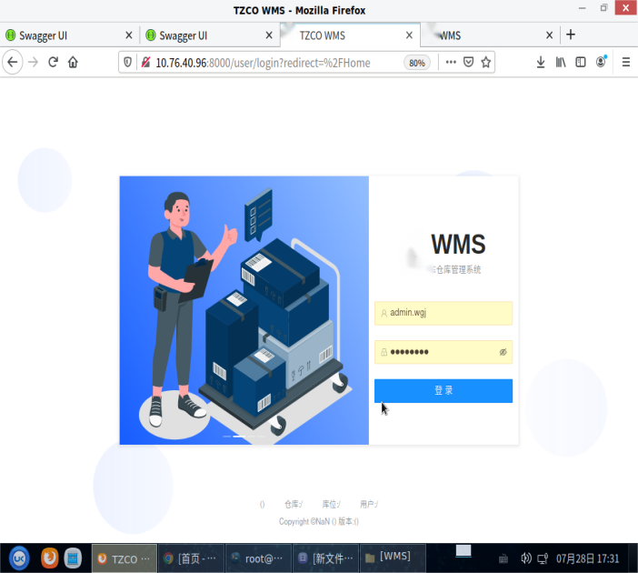 |

 

| 用例编号 | YHQL-WMS-STG-001                                             |
| -------- | ------------------------------------------------------------ |
| 用例名称 | 上架策略查询                                                 |
| 预置条件 | 用户已登录，系统有上架策略配置数据                           |
| 测试步骤 | 1. 点击左侧菜单【策略设置】-【上架策略】 2. 查看策略列表     |
| 预期结果 | 上架策略列表正常加载，策略配置显示完整                       |
| 实测结果 | ✅ PASS □ PASS with Comments □ FAIL □ NA                      |
| 结果截图 | 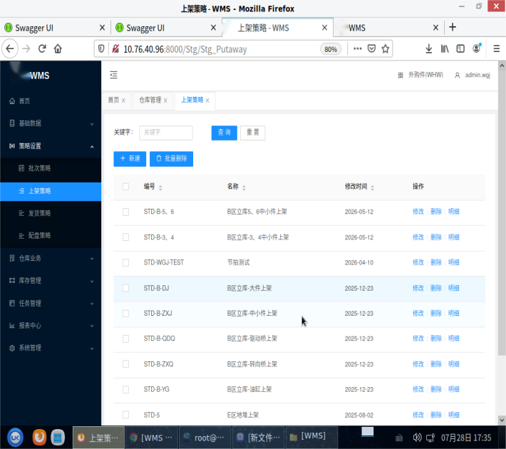 |

 

| 用例编号 | YHQL-WMS-INV-001                                             |
| -------- | ------------------------------------------------------------ |
| 用例名称 | 库存台账查询                                                 |
| 预置条件 | 用户已登录，系统有库存台账配置数据                           |
| 测试步骤 | 1. 点击左侧菜单【库存管理】-【库存台账】 2. 查看库存台账列表 |
| 预期结果 | 库存台账列表正常加载，库存台账配置显示完整                   |
| 实测结果 | ✅ PASS □ PASS with Comments □ FAIL □ NA                      |
| 结果截图 |  |

 

| 用例编号 | YHQL-WMS-RPT-001                                             |
| -------- | ------------------------------------------------------------ |
| 用例名称 | 库位监控查看                                                 |
| 预置条件 | 用户已登录，系统有库位及库存数据                             |
| 测试步骤 | 1. 点击左侧菜单【报表中心】-【库位监控】 2. 查看库位监控页面 |
| 预期结果 | 库位监控图表正常加载，库位占用状态显示完整                   |
| 实测结果 | ✅ PASS □ PASS with Comments □ FAIL □ NA                      |
| 结果截图 | 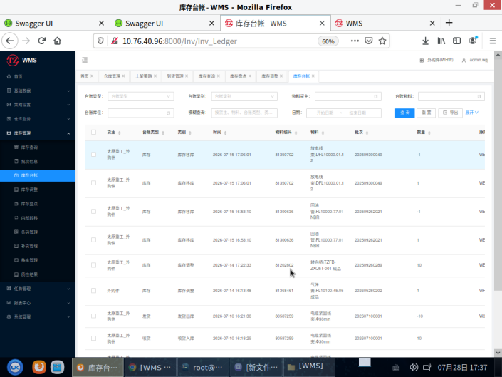 |

 

| 用例编号 | YHQL-WMS-SYS-001                                             |
| -------- | ------------------------------------------------------------ |
| 用例名称 | 用户管理查询                                                 |
| 预置条件 | 用户已登录，具有系统管理权限                                 |
| 测试步骤 | 1. 点击左侧菜单【系统管理】-【用户】 2. 查看用户列表         |
| 预期结果 | 用户列表正常加载，显示用户名、角色、状态等信息               |
| 实测结果 | ✅ PASS □ PASS with Comments □ FAIL □ NA                      |
| 结果截图 | 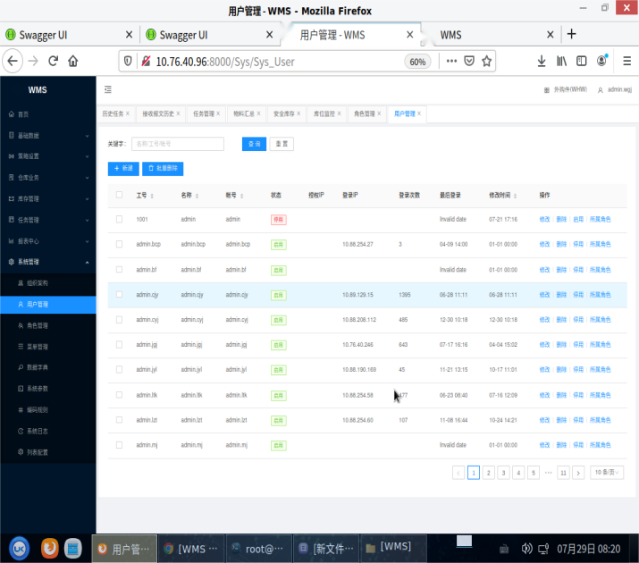 |

 

| 用例编号 | YHQL-WMS-TSK-001                                             |
| -------- | ------------------------------------------------------------ |
| 用例名称 | 任务管理查询                                                 |
| 预置条件 | 用户已登录，系统有任务数据                                   |
| 测试步骤 | 1. 点击左侧菜单【任务管理】-【任务管理】 2. 查看任务列表     |
| 预期结果 | 任务列表正常加载，显示任务编号、类型、状态等字段             |
| 实测结果 | ✅ PASS □ PASS with Comments □ FAIL □ NA                      |
| 结果截图 | 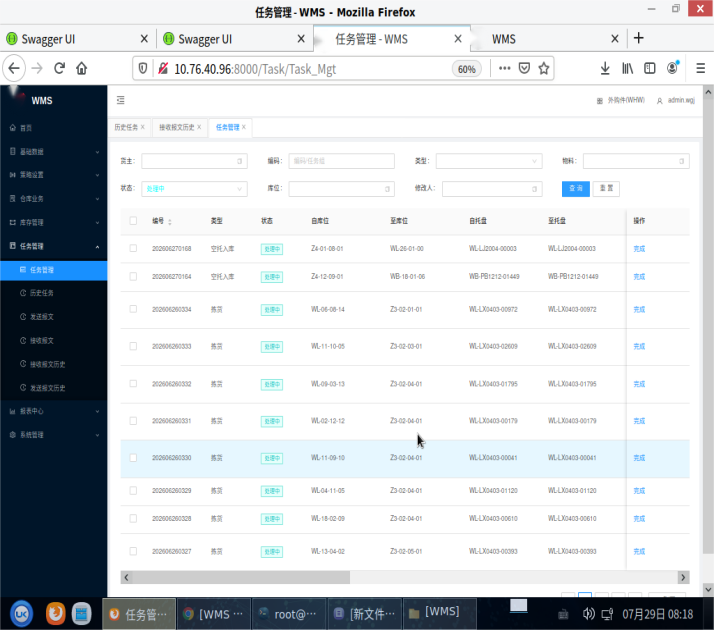 |

 

| 用例编号 | YHQL-WMS-BAS-001                                             |
| -------- | ------------------------------------------------------------ |
| 用例名称 | 仓库基础数据查询                                             |
| 预置条件 | 用户已登录，系统有仓库基础数据                               |
| 测试步骤 | 1. 点击左侧菜单【基础数据】-【仓库】 2. 查看仓库列表         |
| 预期结果 | 仓库列表正常加载，显示仓库编码、名称等信息                   |
| 实测结果 | ✅ PASS □ PASS with Comments □ FAIL □ NA                      |
| 结果截图 | 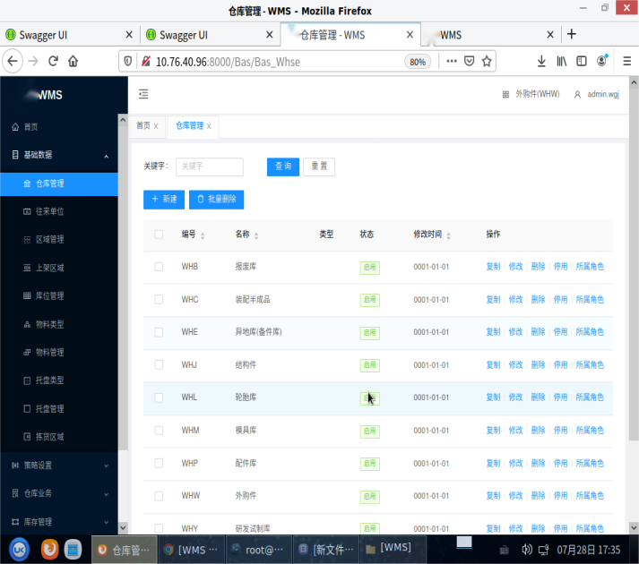 |

### 4.3 浏览器兼容性测试

| 用例编号 | YHQL-WMS-BR-001                                              |
| -------- | ------------------------------------------------------------ |
| 用例名称 | 银河麒麟浏览器访问WMS Web端                                  |
| 预置条件 | 银河麒麟服务器 V10 兆芯版系统自带浏览器已安装，WMS 服务正常运行 |
| 测试步骤 | 1. 打开银河麒麟浏览器 2. 访问 WMS 前端地址 3. 执行登录、菜单切换、数据查询等基础操作 |
| 预期结果 | 页面正常加载，功能操作正常，无明显兼容性问题                 |
| 实测结果 | ✅ PASS □ PASS with Comments □ FAIL □ NA                      |
| 结果截图 | 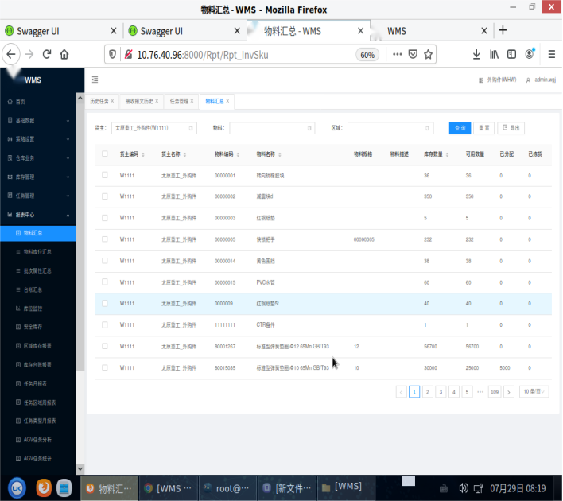 |

 

| 用例编号 | YHQL-WMS-BR-002                                              |
| -------- | ------------------------------------------------------------ |
| 用例名称 | Chrome浏览器访问WMS Web端                                    |
| 预置条件 | Google Chrome 浏览器已安装，WMS 服务正常运行                 |
| 测试步骤 | 1. 打开 Chrome 浏览器 2. 访问 WMS 前端地址 3. 执行登录、菜单切换、数据查询等基础操作 |
| 预期结果 | 页面正常加载，功能操作正常，无明显兼容性问题                 |
| 实测结果 | ✅ PASS □ PASS with Comments □ FAIL □ NA                      |
| 结果截图 | 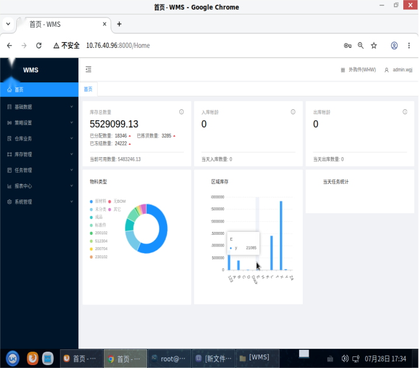 |

### 4.4 RF端功能测试

| 用例编号 | YHQL-WMS-RF-001                                              |
| -------- | ------------------------------------------------------------ |
| 用例名称 | RF端用户登录                                                 |
| 预置条件 | RF 手持终端已安装 WMS RF 客户端，服务正常运行                |
| 测试步骤 | 1. 打开 RF 客户端 2. 输入账号和密码 3. 点击登录              |
| 预期结果 | 登录成功，进入 RF 主菜单界面，显示数据、功能、报表等操作菜单 |
| 实测结果 | ✅ PASS □ PASS with Comments □ FAIL □ NA                      |
| 结果截图 | 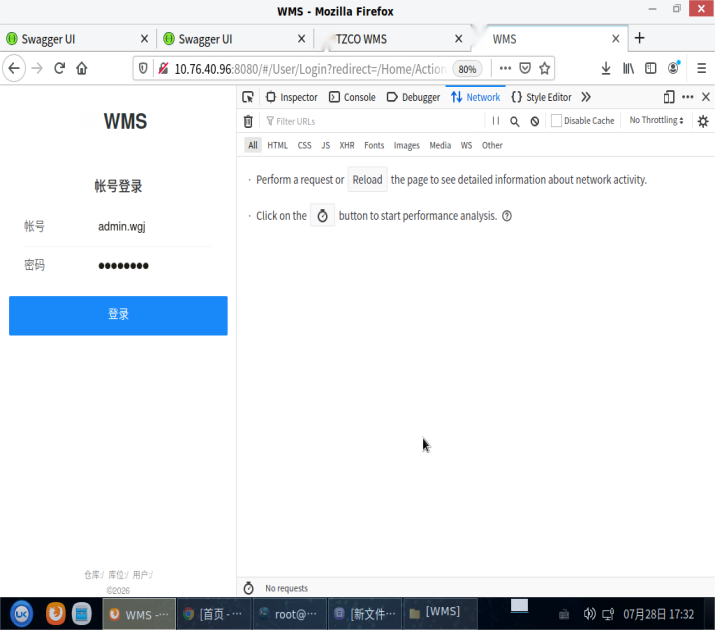 |

 

| 用例编号 | YHQL-WMS-RF-002                                              |
| -------- | ------------------------------------------------------------ |
| 用例名称 | RF端收货数据查询                                             |
| 预置条件 | RF 用户已登录，系统有收货记录数据                            |
| 测试步骤 | 1. 在 RF 端选择【功能】-【收货】 2. 输入查询条件，查看收货记录 |
| 预期结果 | 收货记录列表正常返回，数据显示完整                           |
| 实测结果 | ✅ PASS □ PASS with Comments □ FAIL □ NA                      |
| 结果截图 | 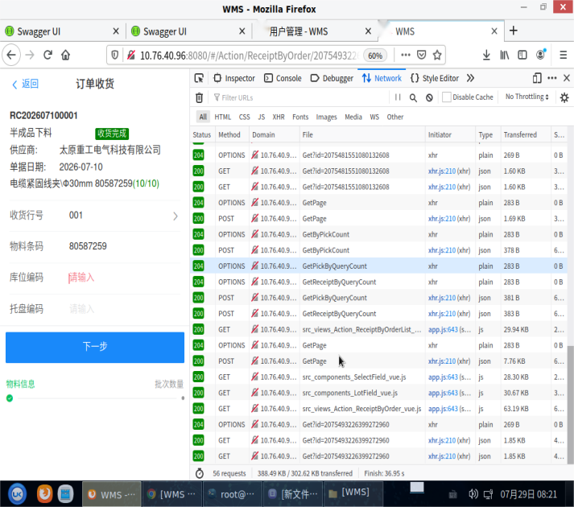 |

 

| 用例编号 | YHQL-WMS-RF-003                                              |
| -------- | ------------------------------------------------------------ |
| 用例名称 | RF端到货条码查询                                             |
| 预置条件 | RF 用户已登录，系统有到货条码数据                            |
| 测试步骤 | 1. 在 RF 端选择【功能】-【到货条码】 2. 输入条码或到货单号进行查询 |
| 预期结果 | 到货条码列表正常返回，数据显示完整                           |
| 实测结果 | ✅ PASS □ PASS with Comments □ FAIL □ NA                      |
| 结果截图 | 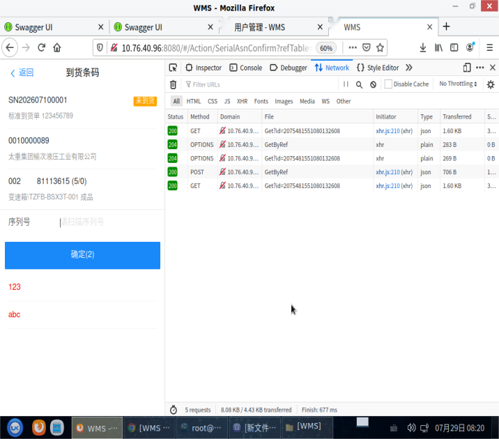 |

 

| 用例编号 | YHQL-WMS-RF-004                                              |
| -------- | ------------------------------------------------------------ |
| 用例名称 | RF端任务查询                                                 |
| 预置条件 | RF 用户已登录，系统有任务数据                                |
| 测试步骤 | 1. 在 RF 端选择【数据】-【任务】 2. 查看任务列表             |
| 预期结果 | 任务列表正常加载，显示任务编号、类型、状态等字段             |
| 实测结果 | ✅ PASS □ PASS with Comments □ FAIL □ NA                      |
| 结果截图 | 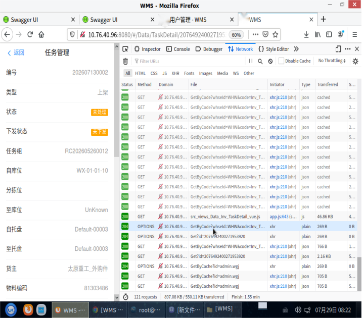 |

 

| 用例编号 | YHQL-WMS-RF-005                                              |
| -------- | ------------------------------------------------------------ |
| 用例名称 | RF端发货操作                                                 |
| 预置条件 | RF 用户已登录，系统有可发货的出库单数据                      |
| 测试步骤 | 1. 在 RF 端选择【数据】-【发货】 2. 查询出库单，执行发货操作 |
| 预期结果 | 发货功能页面正常加载，操作流程正常执行                       |
| 实测结果 | ✅ PASS □ PASS with Comments □ FAIL □ NA                      |
| 结果截图 | 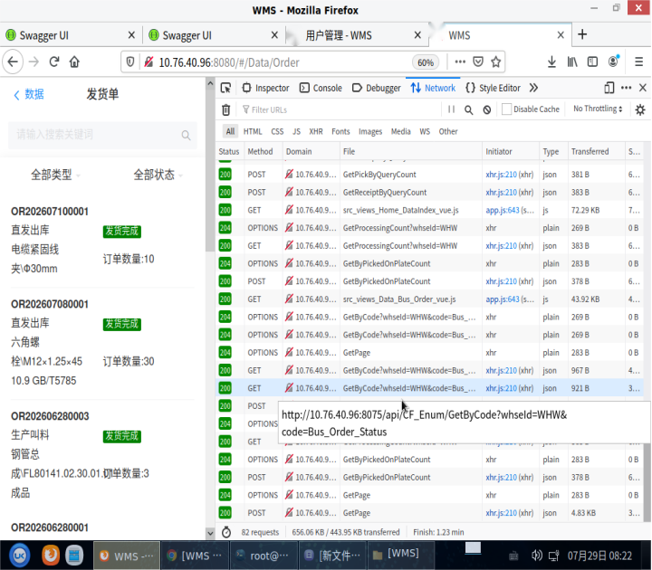 |

 

| 用例编号 | YHQL-WMS-RF-006                                              |
| -------- | ------------------------------------------------------------ |
| 用例名称 | RF端报表查询                                                 |
| 预置条件 | RF 用户已登录，系统有可查询的报表数据                        |
| 测试步骤 | 1. 在 RF 端选择【报表】功能 2. 查看报表列表及数据            |
| 预期结果 | 报表页面正常加载，数据显示完整                               |
| 实测结果 | ✅ PASS □ PASS with Comments □ FAIL □ NA                      |
| 结果截图 | 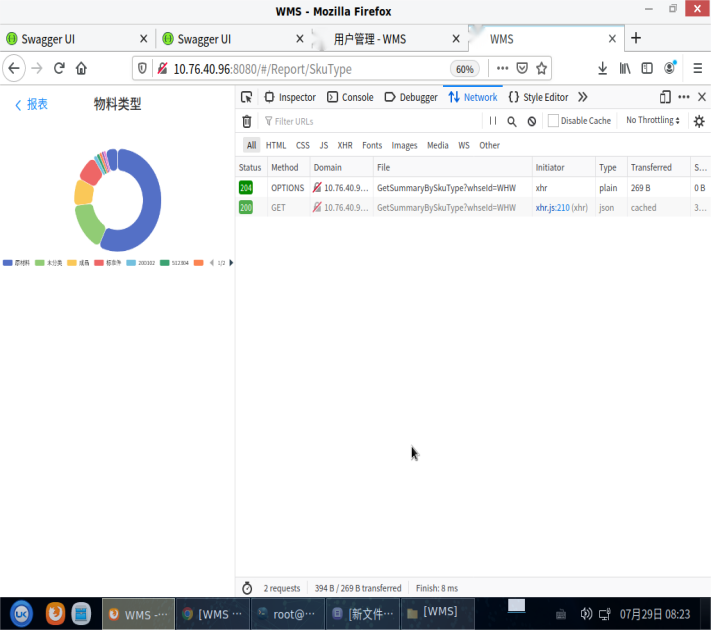 |

 

| 用例编号 | YHQL-WMS-RF-BR-001                                           |
| -------- | ------------------------------------------------------------ |
| 用例名称 | Chrome访问WMS RF端                                           |
| 预置条件 | Google Chrome 浏览器已安装，WMS RF 服务正常运行              |
| 测试步骤 | 1. 打开 Chrome 浏览器 2. 访问 WMS RF 端地址 3. 执行登录、收货等基础操作 |
| 预期结果 | RF 端页面正常加载，操作功能正常，无明显兼容性问题            |
| 实测结果 | ✅ PASS □ PASS with Comments □ FAIL □ NA                      |
| 结果截图 | 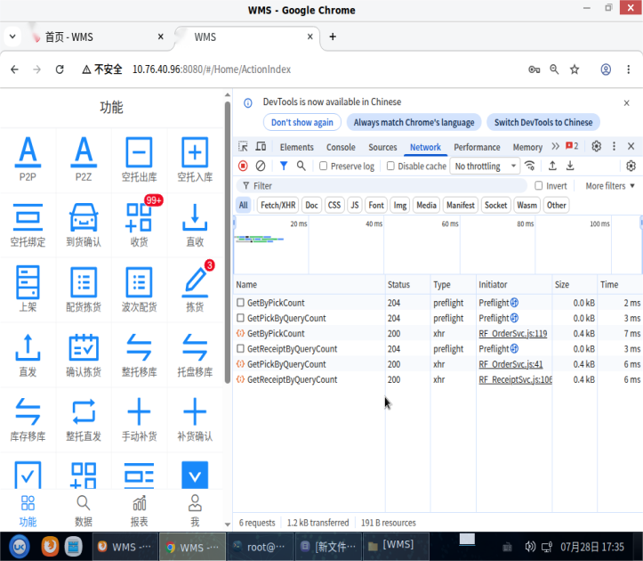 |

------

## 5 结论

WMS智能仓库管理系统V8.25 通过适配测试的各项内容，能够满足银河麒麟服务器操作系统 V20 的认证要求，通过银河麒麟软件适配认证测试。系统在银河麒麟服务器 V10 兆芯版环境下，安装部署流程顺畅，服务启停正常，Web端仓库业务-到货管理、策略设置-上架策略、报表中心-库位监控、系统管理-用户、任务管理-任务管理、基础数据-仓库等核心功能运行稳定，RF端数据-收货、数据-到货条码、功能-任务、功能-发货、报表查询等操作正常，银河麒麟浏览器及 Chrome 浏览器兼容性良好。

 