# WMS软件内部测试报告-中科方德 NFS V50 系统适配

> 项目：仓库管理系统（ZEQP.WMS）<br>
> 服务器：中科方德 NFS V50，IP `10.76.40.211`<br>
> 编写日期：2026-07-17

---

## 一、环境信息

| 组件       | 版本/说明                                                    |
| ---------- | ------------------------------------------------------------ |
| 操作系统   | 中科方德 NFS V50（基于 CentOS/RHEL，内核 Linux）             |
| 后端 API   | .NET 8 SDK（如果是 SCD 方式打包自包含运行时，无需安装 .NET 运行时） |
| 后端 DI    | .NET 8 SDK（如果是 SCD 方式打包自包含运行时，无需安装 .NET 运行时） |
| Web 服务器 | Nginx                                                        |
| 数据库     | SQL Server，IP `10.88.19.4`，库名 `24CTSIL004`               |
| 授权机器名 | `CTR-SERVER193`                                              |

---

## 二、前置准备（首次部署执行一次）

### 2.1 安装系统底层依赖

本项目支持两种打包部署方式：

| 方式    | 全称                                           | 说明                                                         |
| ------- | ---------------------------------------------- | ------------------------------------------------------------ |
| **FDD** | Framework-Dependent Deployment（框架依赖部署） | 程序本身不含 .NET 运行时，发布包体积小；服务器上必须提前安装对应版本的 .NET 运行时才能运行 |
| **SCD** | Self-Contained Deployment（自包含部署）        | .NET 运行时随程序一起打包发布，服务器无需安装任何 .NET 环境；发布包体积较大，但部署环境更简洁 |

无论哪种方式，Linux 上运行都依赖系统原生的加密库和国际化库，需要提前安装。

> 中科方德 NFS V50 基于 RPM 包管理体系，使用 `yum` 或 `dnf` 安装软件包。

```bash
# 更新本地软件包索引，确保后续安装的是最新版本
sudo yum update -y

# openssl-libs：SSL/TLS 加密库，程序建立加密连接时依赖此库
# libicu：Unicode 国际化支持库，.NET 处理中文字符串和日期格式时依赖
# -y 参数：自动确认，跳过手动输入 y 的步骤
sudo yum install openssl-libs libicu -y
```

> **【仅 FDD 需要】** 安装 .NET 8 运行时：
>
> ```bash
> sudo yum install dotnet-runtime-8.0 -y
> ```
>
> **【SCD 跳过此步】** 运行时已内置在发布包中，无需安装。

### 2.2 创建部署目录

提前创建好所有需要用到的目录，后续上传文件时直接往对应目录放置。需要创建的目录如下：

| 目录路径              | 用途                             |
| --------------------- | -------------------------------- |
| `/opt/wms/upload`     | 程序运行时上传附件的存放目录     |
| `/opt/wms/certs`      | HTTPS 证书文件存放目录           |
| `/opt/wms/Giant.Api`  | 后端 API 服务的程序文件目录      |
| `/opt/wms/Giant.DI`   | 后端 DI 集成服务的程序文件目录   |
| `/opt/wms/web/wmsweb` | WMSWeb 电脑端前端静态文件目录    |
| `/opt/wms/web/wmssrf` | WMSSRF RF 手持端前端静态文件目录 |

**命令行创建或打开中科方德 NFS V50 文件管理器，进入部署文件的目录创建**

```bash
# -p 参数：父目录不存在时一并创建，目录已存在时不报错
sudo mkdir -p /opt/wms/Giant.Api（文件路径）
```

---

## 三、Nginx 部署

### 3.1 安装

```bash
sudo yum install nginx -y
```

验证安装成功：

```bash
nginx -v
```

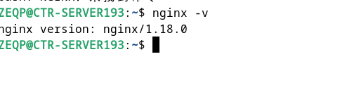{width:300px}

### 3.2 设置开机自启并启动

```bash
# 设置开机自启
sudo systemctl enable nginx
# 立即启动
sudo systemctl start nginx
```

验证启动成功（显示 `active (running)` 即正常）：

```bash
sudo systemctl status nginx
```

### 3.3 配置文件说明

| 路径                        | 说明                                     |
| --------------------------- | ---------------------------------------- |
| `/etc/nginx/nginx.conf`     | 主配置文件，一般不需要修改               |
| `/etc/nginx/conf.d/`        | 自定义站点配置目录，本项目的配置放在此处 |
| `/var/log/nginx/access.log` | 访问日志                                 |
| `/var/log/nginx/error.log`  | 错误日志，排查问题时首先查看此文件       |

### 3.4 常用管理命令

```bash
# 校验配置语法（修改配置后先执行，有错误会提示具体行号）
sudo nginx -t

# 重载配置（配置正确后执行，不中断现有连接）
sudo systemctl reload nginx

# 查看运行状态
sudo systemctl status nginx

# 重启
sudo systemctl restart nginx

# 停止
sudo systemctl stop nginx
```

> 修改 `/etc/nginx/conf.d/` 下的配置文件后，务必先执行 `sudo nginx -t` 校验语法，再执行 `sudo systemctl reload nginx` 使其生效。

---

## 四、后端部署

### 4.1 授权配置

> ⚠️ 注意：授权文件绑定了机器名，服务器主机名必须与授权登记一致，否则所有接口返回 ErrorCode 601。

授权文件路径：`/opt/wms/Giant.Api/WMS.Production.lic`（随程序文件一起部署），授权机器名为 `CTR-SERVER193`。

检查并设置主机名：

```bash
# 查看当前主机名
hostname

# 如不是 CTR-SERVER193，执行以下命令永久修改（重启后依然生效）
sudo hostnamectl set-hostname CTR-SERVER193

# 修改后验证是否生效
hostname
```

### 4.2 数据库连接配置

> 只需要先把 `ZEQP_Root_CA` 根证书导入系统信任库，SQL Server 证书链就会被正常信任。

```bash
# 将 ZEQP_Root_CA 根证书安装到系统信任库
sudo cp ZEQP_Root_CA.crt /etc/pki/ca-trust/source/anchors/ZEQP_Root_CA.crt
sudo update-ca-trust
```

证书安装完成后，重启 API 服务即可生效：

```bash
sudo systemctl restart giant-api
```

### 4.3 跨域配置

配置文件路径：`/opt/wms/Giant.Api/appsettings.Production.json`

前端访问后端接口时，后端需要允许前端域名跨域，否则浏览器拦截请求。

```json
"AllowedOrigins": [
  "http://10.76.40.211:8000",
  "http://10.76.40.211:8080"
]
```

> 修改配置后必须重启 API 服务才能生效。

### 4.4 DI 服务 HTTPS 证书配置

DI 服务配置了 HTTPS，Linux 不支持从 Windows 证书存储（LocalMachine\My）加载证书，需改为 pfx 文件方式。

**生成自签名证书（首次部署执行）：**

```bash
mkdir -p /opt/wms/certs

openssl req -x509 -newkey rsa:4096 -keyout /opt/wms/certs/kestrel.key \
  -out /opt/wms/certs/kestrel.crt -days 3650 -nodes \
  -subj "/CN=CTR-SERVER193"

openssl pkcs12 -export -out /opt/wms/certs/kestrel.pfx \
  -inkey /opt/wms/certs/kestrel.key \
  -in /opt/wms/certs/kestrel.crt \
  -passout pass:zeqp@2025

sudo chmod 755 /opt/wms/certs -R

ls -l /opt/wms/certs/
```
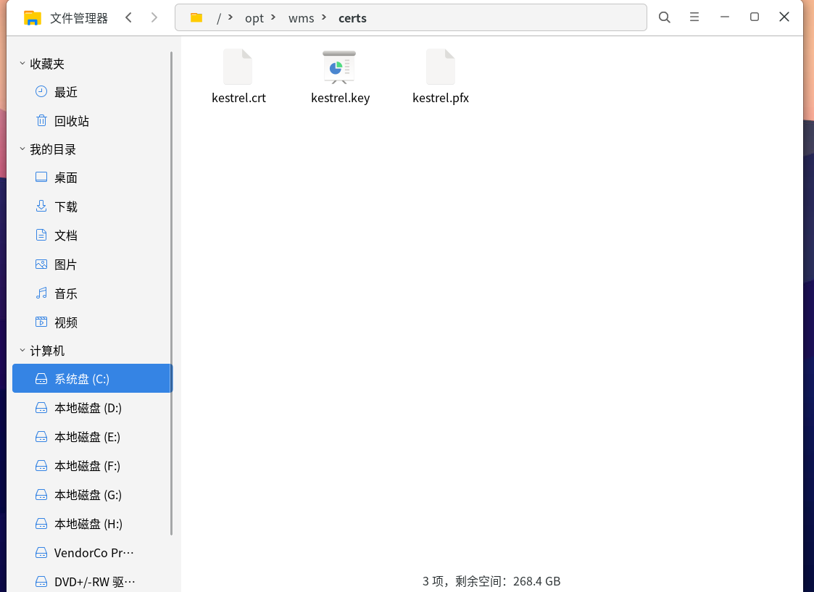{width:300px}

**修改 DI 配置文件** `/opt/wms/Giant.DI/appsettings.Production.json`（DI 服务的生产环境配置），将证书节点改为：

```json
"Certificates": {
  "Default": {
    "Path": "/opt/wms/certs/kestrel.pfx",
    "Password": "zeqp@2025"
  }
}
```

### 4.5 部署 API 服务文件

将编译好的 API 程序文件通过文件管理器手动上传（或复制粘贴）到目标部署目录 `/opt/wms/Giant.Api/`。

上传完成后，赋予主程序可执行权限（SCD 需要，否则服务无法启动，FDD 打包不需要）：

```bash
sudo chmod +x /opt/wms/Giant.Api/Giant.Api
```

### 4.6 部署 DI 服务文件

将编译好的 DI 程序文件通过文件管理器手动上传（或复制粘贴）到目标部署目录 `/opt/wms/Giant.DI/`。

上传完成后，赋予主程序可执行权限（SCD 需要，FDD 打包不需要）：

```bash
sudo chmod +x /opt/wms/Giant.DI/Giant.DI
```

---

## 五、注册后端服务（Systemd）

将两个后端服务注册为系统服务，实现开机自启、后台常驻、崩溃自动重启。

### 5.1 停止手动启动的进程（避免端口冲突）

如果之前手动测试运行过程序，注册服务前需要先停掉，否则端口被占用导致服务启动失败。

打开中科方德 NFS V50 **系统监视器**，在进程列表中找到 `Giant.Api` 和 `Giant.DI`，右键选择"结束进程"即可。

### 5.2 创建 API 服务文件

打开文件管理器，以管理员权限在 `/etc/systemd/system/` 目录下新建文本文件，命名为 `giant-api.service`，写入以下内容后保存：

```ini
[Unit]
Description=Giant WMS API Service
After=network.target

[Service]
WorkingDirectory=/opt/wms/Giant.Api
# SCD 方式：直接运行可执行文件（如下）
# FDD 方式：改为 ExecStart=/usr/bin/dotnet /opt/wms/Giant.Api/Giant.Api.dll --urls "http://0.0.0.0:8075"
ExecStart=/opt/wms/Giant.Api/Giant.Api --urls "http://0.0.0.0:8075"
Restart=always
RestartSec=5
User=root
Environment=ASPNETCORE_ENVIRONMENT=Production

[Install]
WantedBy=multi-user.target
```

### 5.3 创建 DI 服务文件

同上，在 `/etc/systemd/system/` 目录下新建文本文件，命名为 `giant-di.service`，写入以下内容后保存：

```ini
[Unit]
Description=Giant DI Service
After=network.target

[Service]
WorkingDirectory=/opt/wms/Giant.DI
# SCD 方式：直接运行可执行文件（如下）
# FDD 方式：改为 ExecStart=/usr/bin/dotnet /opt/wms/Giant.DI/Giant.DI.dll
ExecStart=/opt/wms/Giant.DI/Giant.DI
Restart=always
RestartSec=5
User=root
Environment=ASPNETCORE_ENVIRONMENT=Production

[Install]
WantedBy=multi-user.target
```

### 5.4 启动并设置开机自启

服务文件创建完成后，打开终端执行以下命令，重新加载配置并启动服务：

```bash
# 重新加载 systemd 配置（新增 .service 文件后必须执行）
sudo systemctl daemon-reload

# 设置开机自启
sudo systemctl enable giant-api
sudo systemctl enable giant-di

# 立即启动服务
sudo systemctl start giant-api
sudo systemctl start giant-di
```

验证运行状态，打开中科方德 NFS V50 **系统监视器**，在进程列表中确认 `Giant.Api` 和 `Giant.DI` 进程均已出现，即表示服务启动成功。

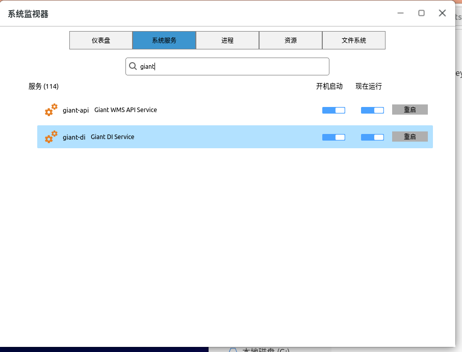{width:300px}

---

## 六、前端部署（Nginx 配置）

打开中科方德 NFS V50 文件管理器进入 `/etc/nginx/conf.d/` 目录，新建并编辑 Nginx 站点配置文件（`wms.conf`）（需管理员权限）
或者通过命令行方式如下：

```bash
sudo vi /etc/nginx/conf.d/wms.conf
```

写入以下内容：

```nginx
# WMSWeb 电脑端
server {
    listen 8000;
    server_name _;
    root /opt/wms/web/wmsweb;
    index index.html;

    location / {
        try_files $uri $uri/ /index.html;
        gzip on;
        gzip_types text/plain application/javascript text/css application/json;

        location ~* \.(js|css|png|jpg|ico|svg|woff|woff2)$ {
            expires 7d;
            add_header Cache-Control "public, immutable";
        }
    }
}

# WMSSRF RF手持端
server {
    listen 8080;
    server_name _;
    root /opt/wms/web/wmssrf;
    index index.html;

    location / {
        try_files $uri $uri/ /index.html;
        gzip on;
        gzip_types text/plain application/javascript text/css application/json;

        location ~* \.(js|css|png|jpg|ico|svg|woff|woff2)$ {
            expires 7d;
            add_header Cache-Control "public, immutable";
        }
    }
}
```

验证并重载：

```bash
sudo nginx -t
sudo systemctl reload nginx
```

---

## 七、访问地址

| 系统             | 地址                                     | 说明                  |
| ---------------- | ---------------------------------------- | --------------------- |
| WMSWeb 电脑端    | http://10.76.40.211:8000                 | PC 端仓库管理操作界面 |
| WMSSRF RF手持端  | http://10.76.40.211:8080                 | 手持终端扫码作业界面  |
| API Swagger 文档 | http://10.76.40.211:8075/swagger         | 后端接口在线调试文档  |
| DI 服务          | https://10.76.40.211:8053                | 数据集成服务（HTTPS） |

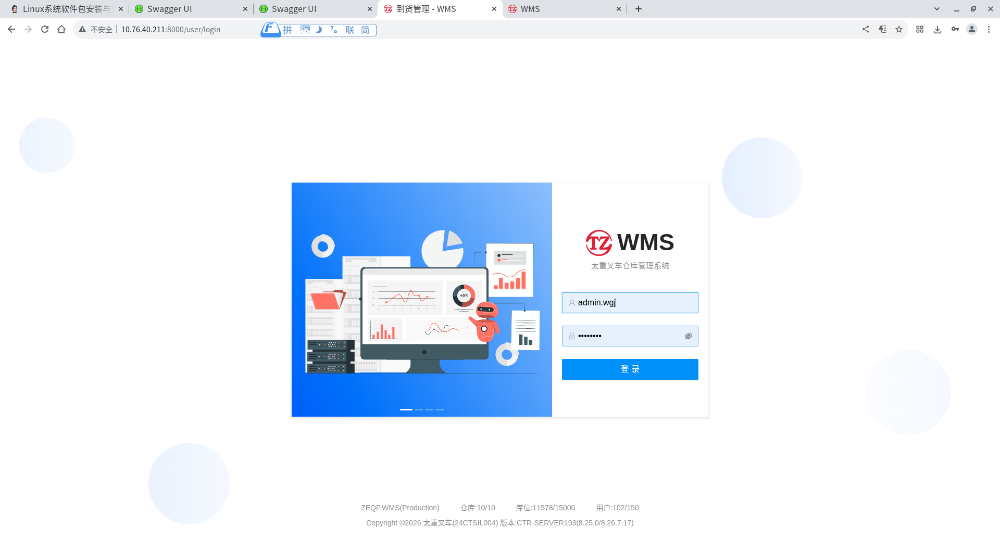{width:300px}
>
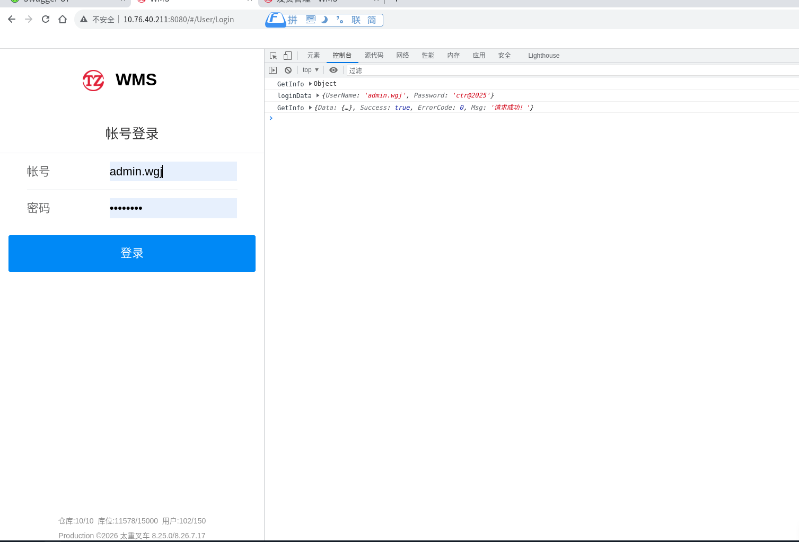{width:300px}
>
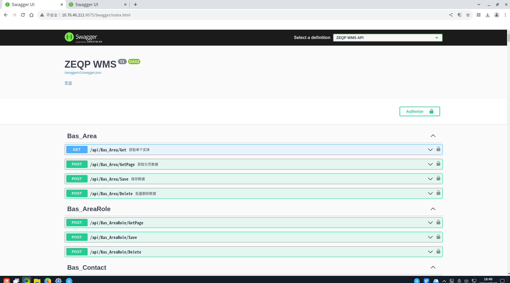 {width:300px}

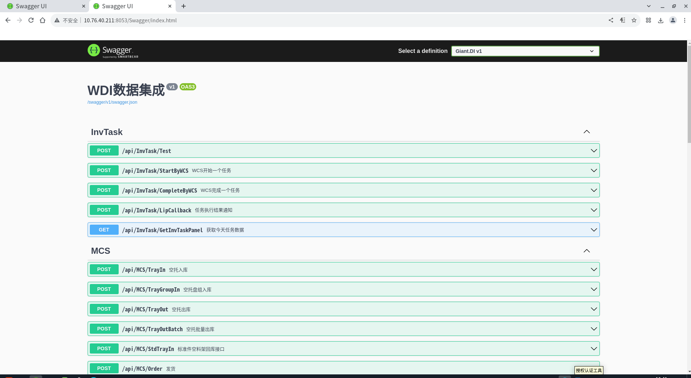{width:300px}

---

## 八、客户端兼容性测试

在中科方德 NFS V50 服务器本机使用不同浏览器，对 WMSWeb 电脑端（`http://10.76.40.211:8000`）进行登录、查询等基础网页操作测试。

| 序号 | 客户端操作系统          | 浏览器        | 适配测试方法                     | 测试结果   |
| ---- | ----------------------- | -------------| -------------------------------- | ---------- |
| 1    | 中科方德 NFS V50        | Google Chrome | 网页操作测试，如登录、查询等操作 | ✅ 正常 |
| 2    | 中科方德 NFS V50        | 中科自带浏览器  | 网页操作测试，如登录、查询等操作 | ✅ 正常 |

1.Google Chrome 登录成功页面：

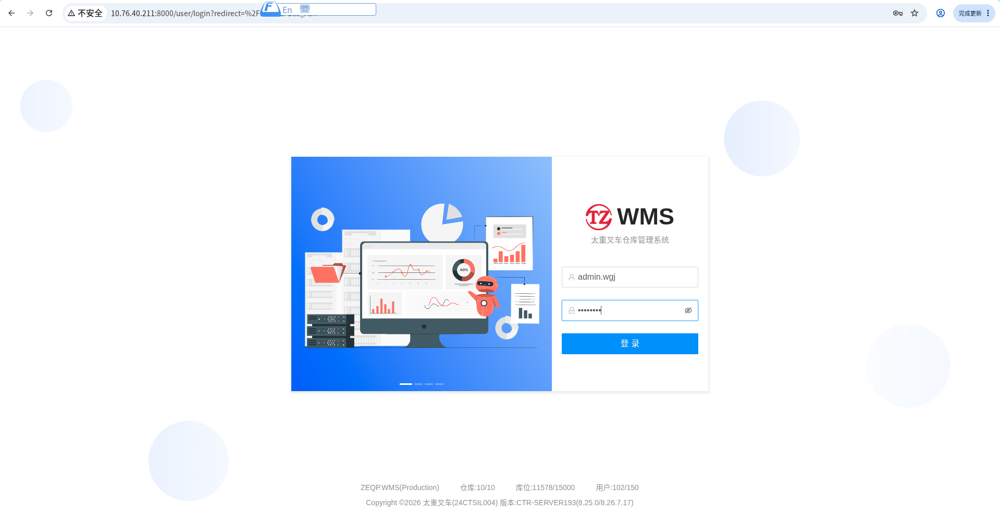{width:300px}

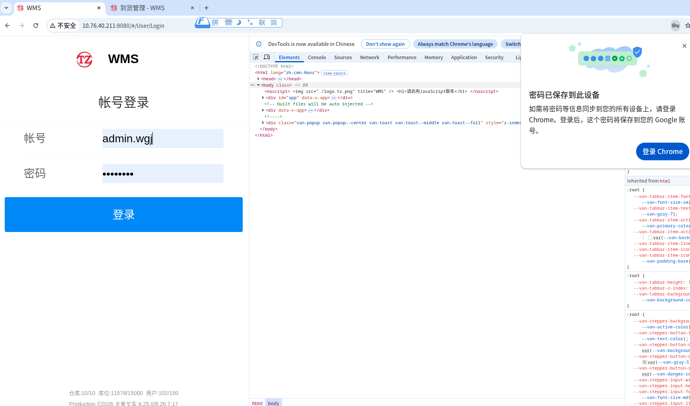{width:300px}

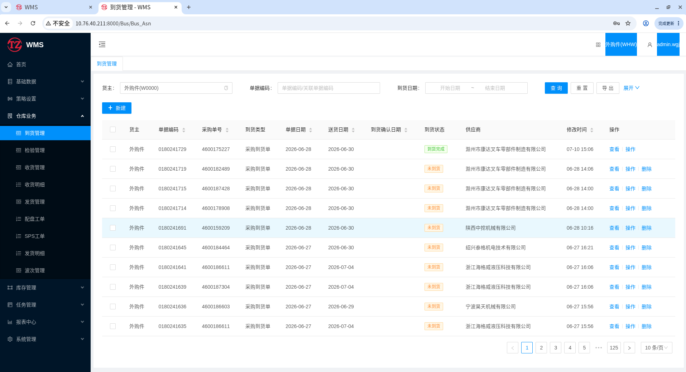{width:300px}

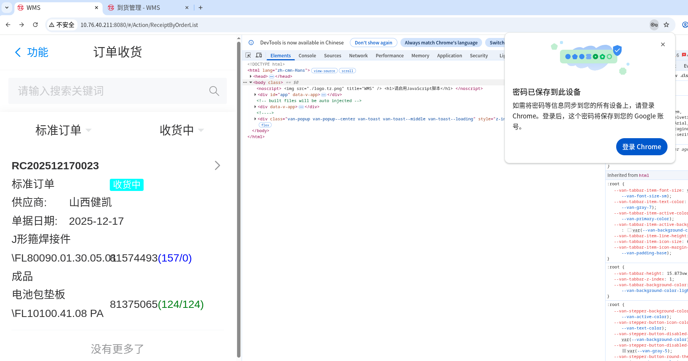{width:300px}

2.Firefox 登录成功页面：

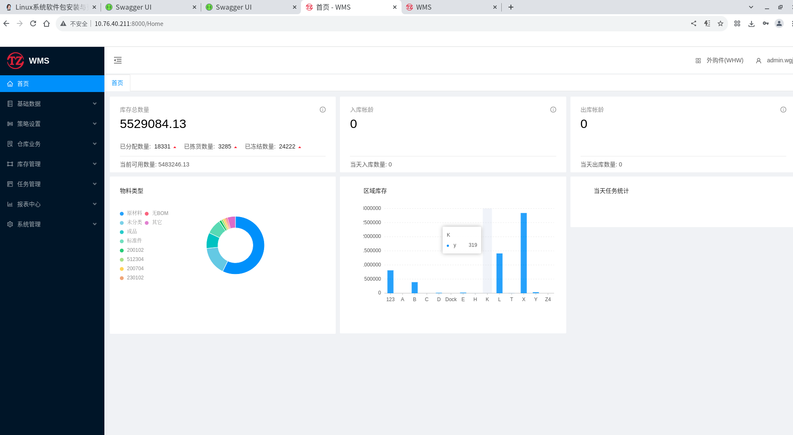{width:300px}

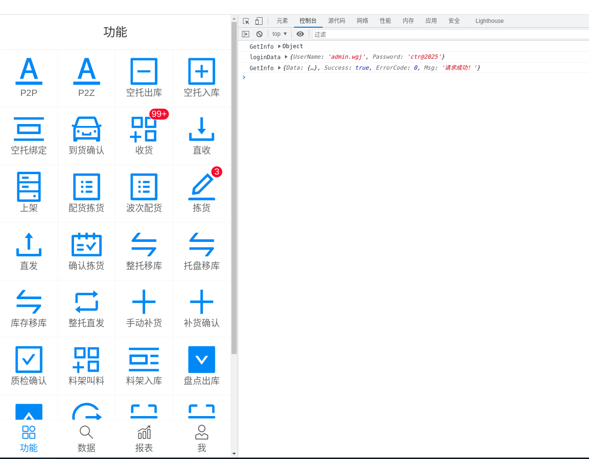{width:300px}

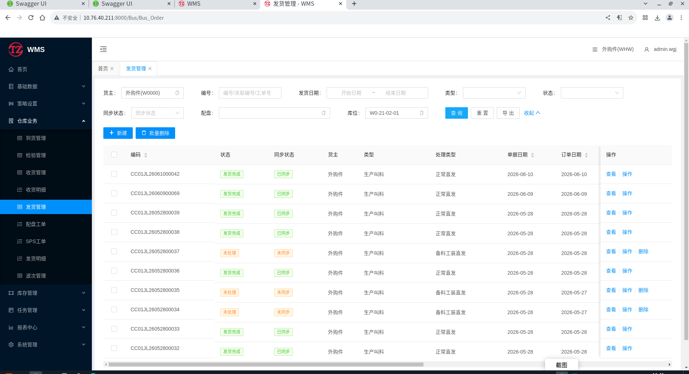{width:300px}

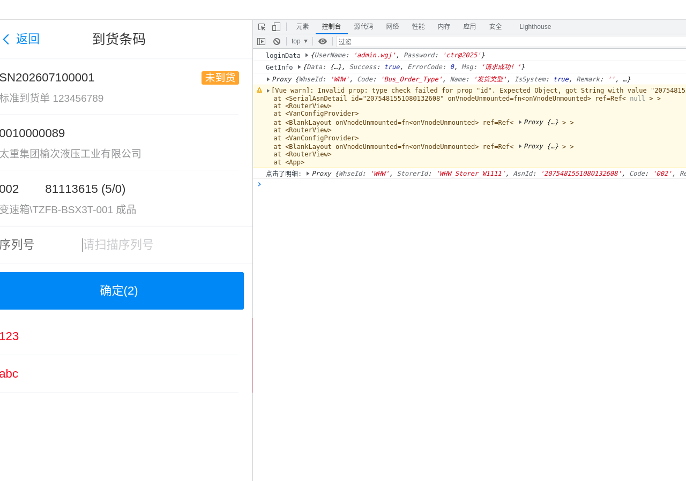{width:300px}

---

## 九、版本更新流程

以 API 为例，DI 替换对应名称即可。

### 步骤 1：停止服务

```bash
sudo systemctl stop giant-api
```

### 步骤 2：覆盖新文件

**方式一：命令行操作**

```bash
# /path/to/new/ 为新版本文件的实际路径（U盘更新文件路径）    /opt/wms/Giant.Api/ 为部署文件的路径
sudo cp -r /path/to/new/Giant.Api/* /opt/wms/Giant.Api/
# 赋予可执行权限（SCD 打包方式每次覆盖文件后都需要重新赋权）
sudo chmod +x /opt/wms/Giant.Api/Giant.Api
```

**方式二：可视化文件管理器操作**

1. 打开中科方德 NFS V50 文件管理器，导航到 `/opt/wms/Giant.Api/`

2. 将新版本文件全选复制，粘贴到该目录，选择"全部替换"

3. 替换完成后，仍需在终端执行赋权命令（文件管理器无法设置可执行权限）：

   ```bash
   sudo chmod +x /opt/wms/Giant.Api/Giant.Api
   ```

### 步骤 3：启动服务并验证

```bash
sudo systemctl start giant-api
sudo systemctl status giant-api
```

---

## 十、日常运维命令

### 服务管理

```bash
# 重启服务
sudo systemctl restart giant-api
sudo systemctl restart giant-di

# 查看实时日志
journalctl -u giant-api -f
journalctl -u giant-di -f

# 查看端口监听
ss -tlnp | grep -E '8075|8053'
```

### Nginx 管理

```bash
sudo systemctl reload nginx    # 修改配置后重载
sudo systemctl restart nginx   # 重启
sudo nginx -t                  # 校验配置语法
systemctl status nginx         # 查看状态
```

### 防火墙管理

```bash
sudo firewall-cmd --list-all                         # 查看规则
sudo firewall-cmd --permanent --add-port=端口/tcp    # 放行端口
sudo firewall-cmd --permanent --remove-port=端口/tcp # 删除规则
sudo firewall-cmd --reload                           # 重载规则
```

---

## 十一、常见问题排查

### ErrorCode 601 授权机器名不正确

```bash
hostname
sudo hostnamectl set-hostname CTR-SERVER193
sudo systemctl restart giant-api
```

### SQL Server 连接失败

先确认 `ZEQP_Root_CA` 根证书是否已经导入系统信任库，再检查网络连通性：

```bash
nc -zv 10.88.19.4 1433
```

### CORS 跨域错误

检查 `appsettings.Production.json` 中 `AllowedOrigins` 是否包含前端地址，修改后重启 API：

```bash
sudo systemctl restart giant-api
```

### DI 服务启动失败（Unix X509Store 错误）

确认证书配置使用的是 pfx 文件路径：

```json
"Certificates": {
  "Default": {
    "Path": "/opt/wms/certs/kestrel.pfx",
    "Password": "zeqp@2025"
  }
}
```

### 前端页面显示异常

清除浏览器缓存：`Ctrl + Shift + R`，或开无痕窗口重新访问。

### API 启动报错：The path must be absolute

原因：`appsettings.Production.json` 中存在 Windows 格式的路径（如 `E:\\wms\\upload`），未改为 Linux 绝对路径。

找到相关路径配置项，改为 Linux 格式：

```json
"UploadPath": "/opt/wms/upload"
```

修改完成后重新运行服务即可。

### SELinux 导致服务无法启动

中科方德 NFS V50 默认启用 SELinux，可能阻止服务读取文件或监听端口。临时验证：

```bash
# 查看 SELinux 状态
sestatus

# 如果怀疑是 SELinux 问题，临时设为宽松模式验证
sudo setenforce 0

# 确认问题后，正式添加策略规则（推荐）而非永久关闭 SELinux
sudo chcon -R -t bin_t /opt/wms/Giant.Api/Giant.Api
sudo chcon -R -t bin_t /opt/wms/Giant.DI/Giant.DI
```
