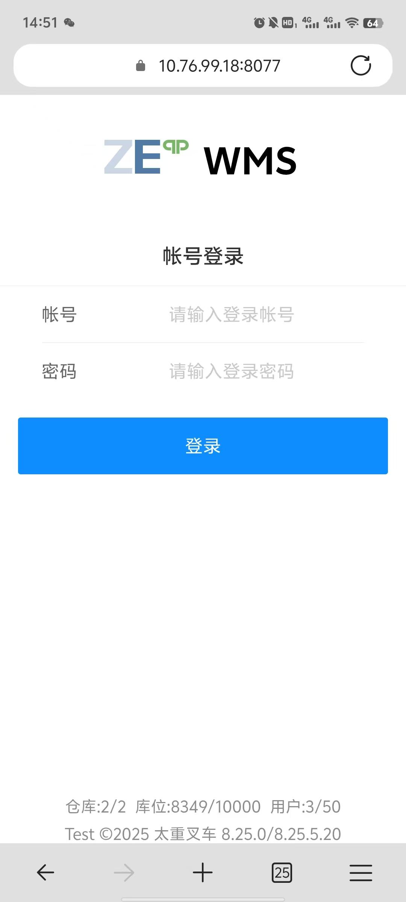
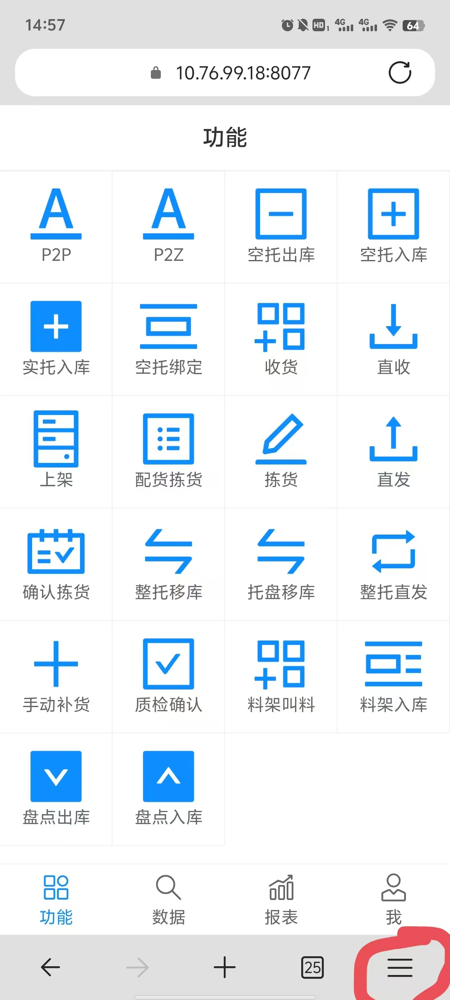
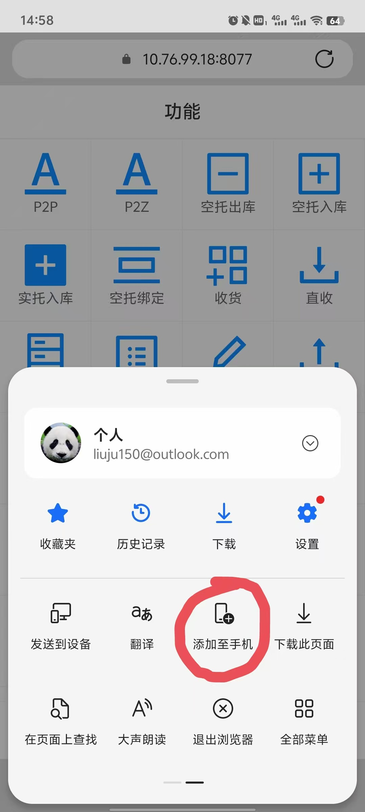
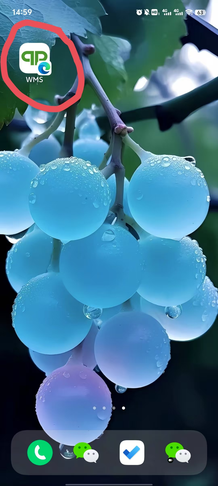
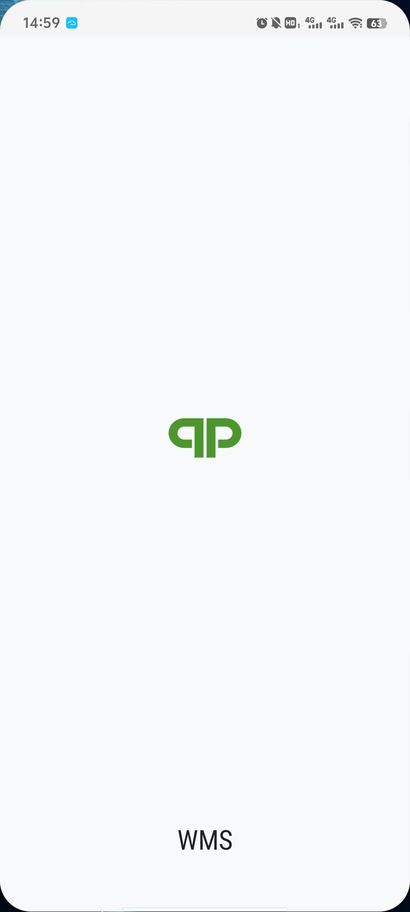
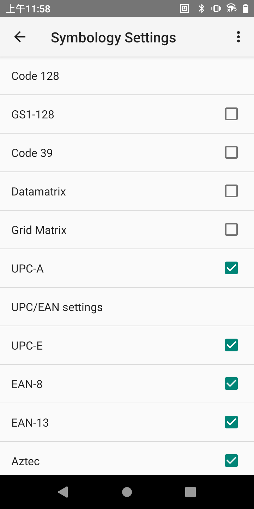

# PDA初始化

## 安装浏览器

|名称|下载|说明|
|---|---|---|
|Microsoft Edge|[下载Edge](https://www.microsoft.com/en-us/edge/emmx/anaheimclepop?form=MA13FJ)|Edge浏览器|
|Google Chrome|[应用商店下载](market://details?id=com.android.chrome)|谷歌浏览器|

## 连接无线网络

|名称|密码|说明|
|---|---|---|
|无线名称|无线密码|车间PDA专用无线|

**如果PDA使用固定IP地址，那么在连接无线的时候，要设置固定IP**

## 根证书安装

安装根证书：[安装说明](./installCert#移动端安装-android)

## 设置WMS移动端

1. 在新安装的Edge浏览器中输入WMS移动端地址 <a :href="'https://'+projectData.webHost+':'+projectData.wmsRFPort" target="_blank">https://{{projectData.webHost}}:{{projectData.wmsRFPort}}</a>

2. 输入分配的帐号与密码登录进入主页，点击浏览器“**菜单**”弹出功能操作

3. 在弹出的功能操作中，选择“添加至手机”

4. 在添加到手机功能弹出的界面中，点击“安装”按钮

5. 这时在桌面会出现“WMS”的快捷方式

6. 点击桌面WMS图标，启动WMS移动端系统

## 扫码设置

### 码制设置

1. 霍尼韦尔：设置->HoneyWell Settings->Scanning->Internal Scanner->Default profile->Symbology Settings

### 输出设置

## 注意事项

1. 如果“添加至手机”操作的时候，提示没有权限，请把浏览器对应权限打开

2. 如果PDA开机后，时间不是当前正常时间，请先把PDA时间设置正确

3. PDA申请一般需要记录PDA使用登记表

### {{projectData.projectName}}PDA使用登记表
|编号|MEID|IP地址|帐号|时间|领取人|电话|
|---|---|---|---|---|---|---|
|01|A000000000000000|10.0.0.1|2001|25.1.1|张三|13800000000|
|02|A000000000000000|10.0.0.2|2001|25.1.1|李四|13800000000|
|03|A000000000000000|10.0.0.3|2001|25.1.1|王五|13800000000|

拨号界面输入*#06#出现设备MEID
