# Windows Server 初始化配置

## 修改计算机名称

因为我们可能会有很多服务器，统一服务器名称有利于我们管理

一般我们会把服务器按IP命名，如下示例

10.88.19.1  -> CTR-SERVER191 

10.88.19.2  -> CTR-SERVER192

10.88.19.3  -> CTR-SERVER193

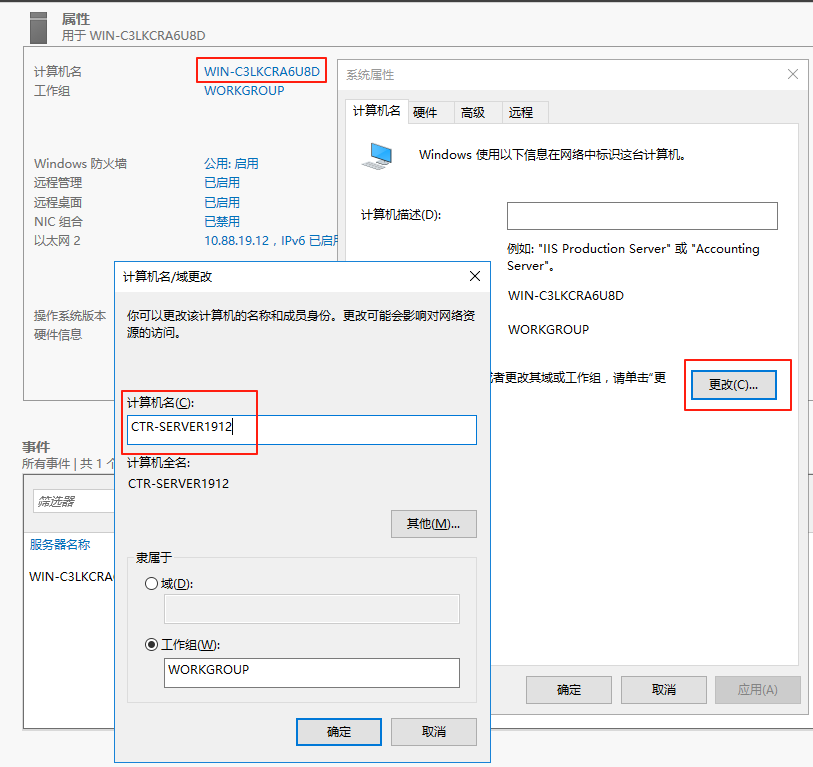

## 安装IIS

1. 打开服管理器 --> 添加角色和功能

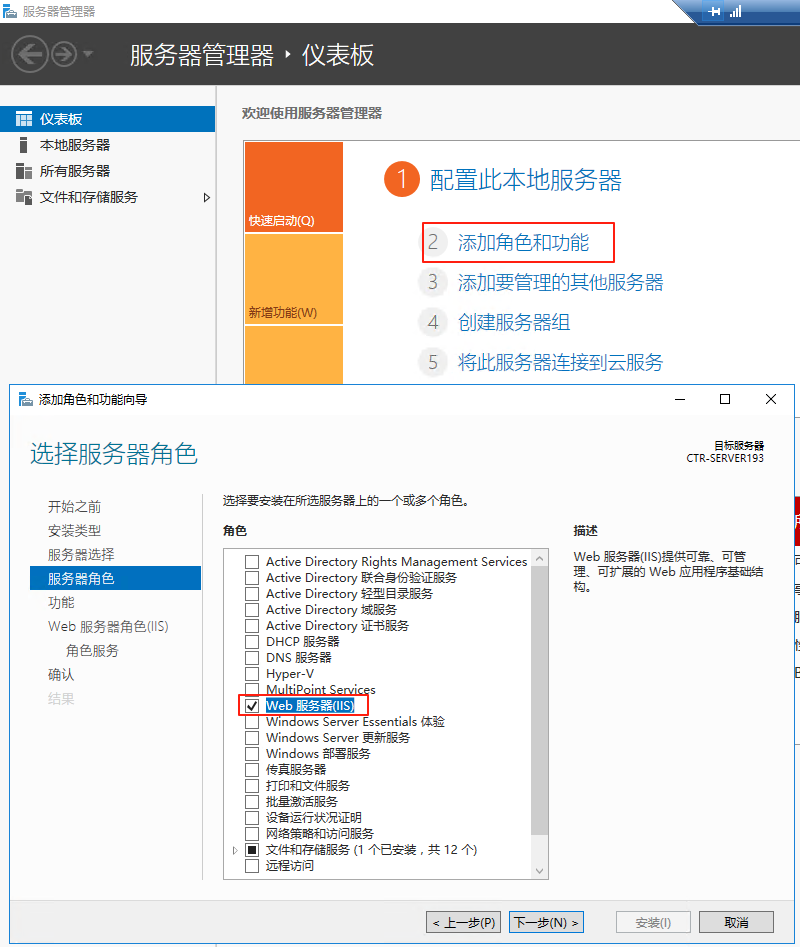

2. 选择IIS角色服务要支持的功能

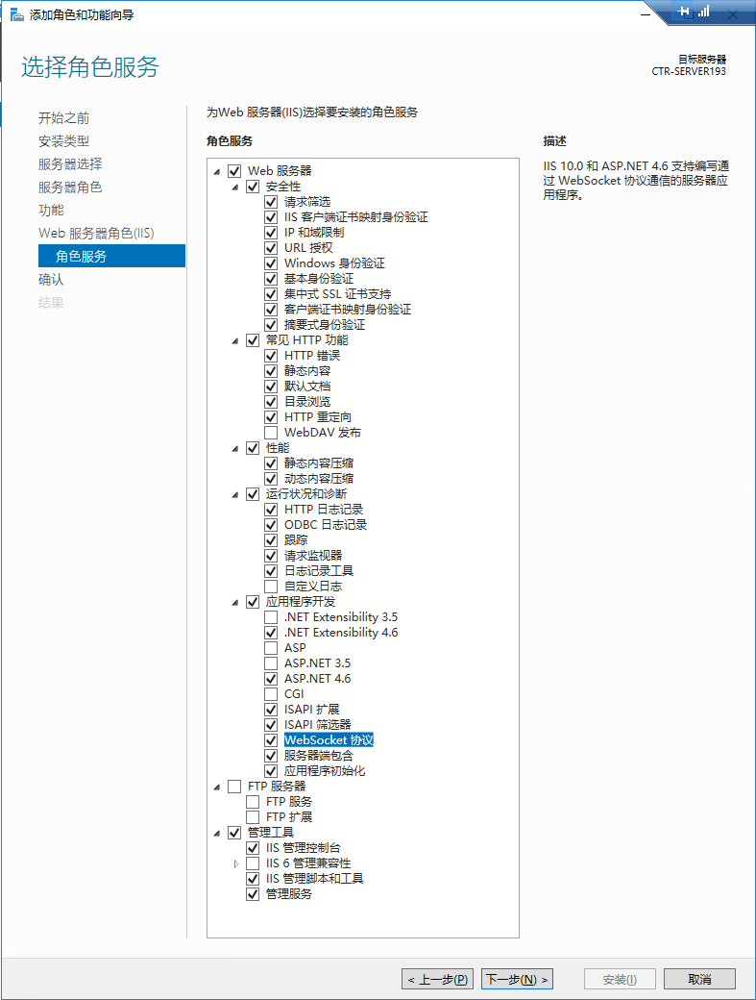

## 证书安装（非必需）

### 根证书安装

根证书安装：[安装说明](./installCert)

### 服务器证书安装

1. 双击服务器证书 --> 安装位置“本地计算机”
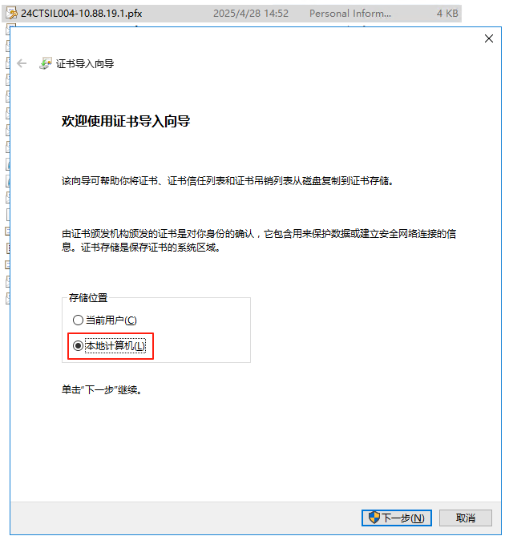

2. 输入证书密码（如果有）
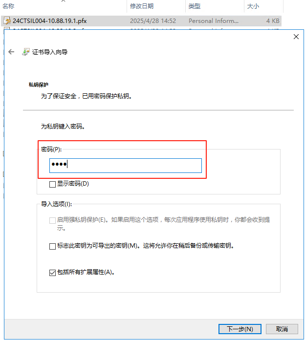

3. 选择“根据证书类型，自动选择证书存储”
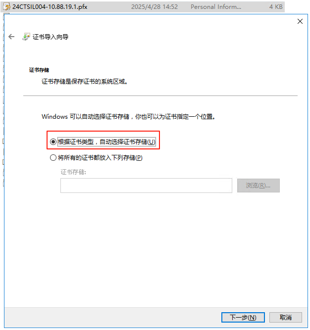

## 启用PSRemoting

1. 修改网络类型为“专用”
2. 启用PSRemoting
3. 修改信任的客户端Host

```powershell
Get-NetConnectionProfile
Set-NetConnectionProfile -Name "{指定网络名称}" -NetworkCategory Private
# Get-NetConnectionProfile | Set-NetConnectionProfile -NetworkCategory Private
Enable-PSRemoting
Set-Item WSMan:\localhost\Client\TrustedHosts -Value *
# 增加https监听
$MachineName=[System.Environment]::MachineName
$Cer=Get-ChildItem -Path Cert:\LocalMachine\My\ | Where-Object {$_.Subject -like "CN=$MachineName*"}
$Thumbprint=$Cer[0].Thumbprint
New-Item WSMan:\localhost\Listener\ -Transport HTTPS -Address * -CertificateThumbPrint $Thumbprint
```

### 修改网络类型为“专用”

步骤1. 按“Win + R”输入“secpol.msc”，然后点击“确定”打开本地安全策略。

步骤2. 单击“安全设置”，然后单击“网络列表管理器策略”，找到您的网络名称并双击它。

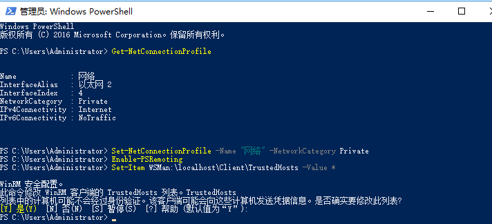

## 远程桌面证书（非必需）

```powershell
$MachineName=[System.Environment]::MachineName
$Cer=Get-ChildItem -Path Cert:\LocalMachine\My\ | Where-Object Subject -Like "CN=$MachineName*"
$Thumbprint=$Cer[0].Thumbprint
$Path=(Get-WmiObject -Class "Win32_TSGeneralSetting" -Namespace root\cimv2\terminalservices)
Set-WmiInstance -Path $Path -Arguments @{SSLCertificateSHA1Hash=$Thumbprint}
```

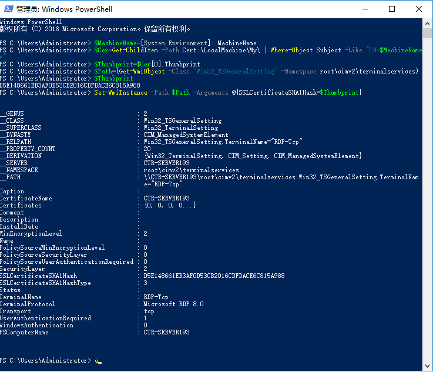

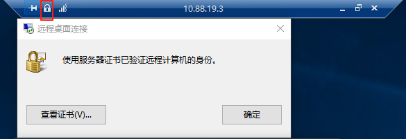

## 组件安装

1. Edge浏览器([下载](https://www.microsoft.com/zh-cn/edge/business/download))
2. .NET运行时([下载](https://dotnet.microsoft.com/zh-cn/download))
3. IIS URL重写模块([下载](https://www.iis.net/downloads/microsoft/url-rewrite))
4. Visual C++可再发行程序包([下载](https://learn.microsoft.com/zh-cn/cpp/windows/latest-supported-vc-redist))

## 注意事项

### 如果使用Windows远程桌面出现身份验证错误

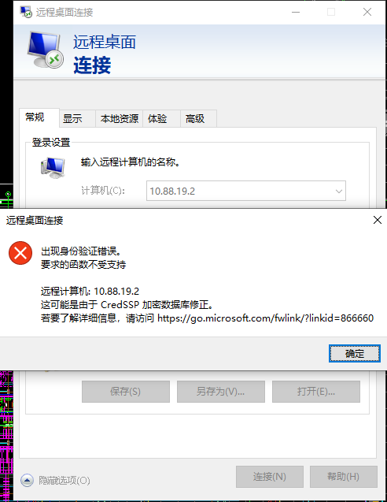

解决方案为

方法一：通过组策略编辑器修改（适用于Windows专业版/企业版）

打开组策略编辑器

按下 Win + R，输入 gpedit.msc，回车。

定位到凭据分配策略

依次展开路径：计算机配置 > 管理模板 > 系统 > 凭据分配。

修改加密数据库修正策略

双击右侧的 加密数据库修正，选择 已启用。

将 保护级别 设置为 易受攻击，点击确定保存。

重启远程连接

设置完成后，重新尝试远程桌面连接即可。

原理：此操作允许客户端回退到不安全的CredSSP协议版本，从而兼容未安装安全更新的远程服务器，但会降低安全性16。


方法二：通过注册表修改（适用于家庭版或无法使用组策略的版本）245
打开注册表编辑器

按下 Win + R，输入 regedit，回车。

创建或修改注册表项

导航至路径：
HKEY_LOCAL_MACHINE\SOFTWARE\Microsoft\Windows\CurrentVersion\Policies\System。

若路径下无 CredSSP\Parameters 项，需手动创建：

右键 System，新建项并命名为 CredSSP。

右键 CredSSP，新建项并命名为 Parameters。

添加DWORD值

在 Parameters 下，新建一个 DWORD (32位) 值，命名为 AllowEncryptionOracle。

双击该值，将数值数据设为 2（十六进制）。

重启电脑并重试连接

若连接仍失败，重启电脑后再次尝试。

原理：通过注册表直接设置 AllowEncryptionOracle=2，等效于组策略中的“易受攻击”模式2
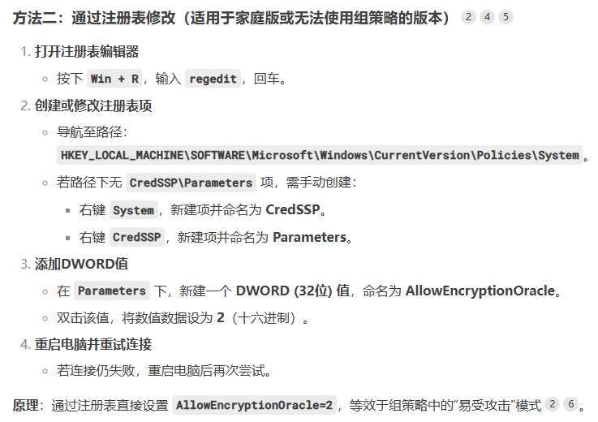