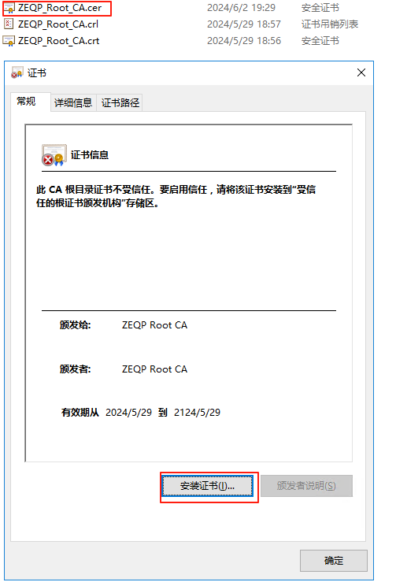
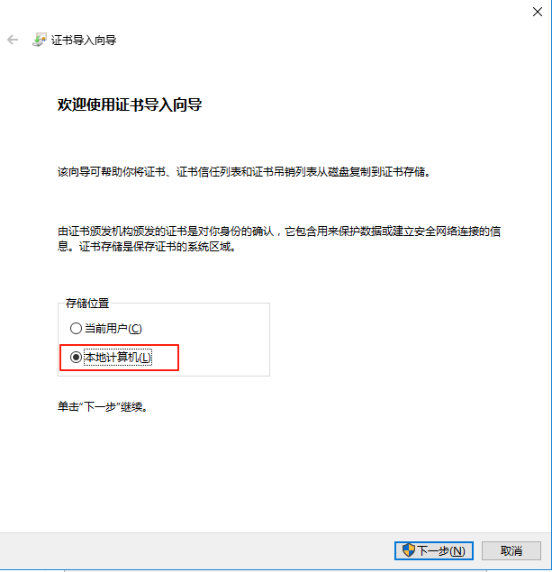
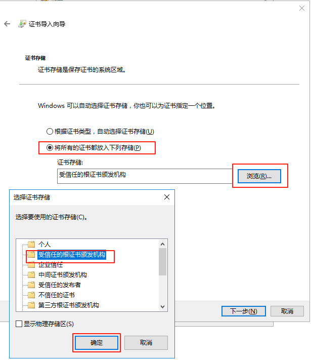
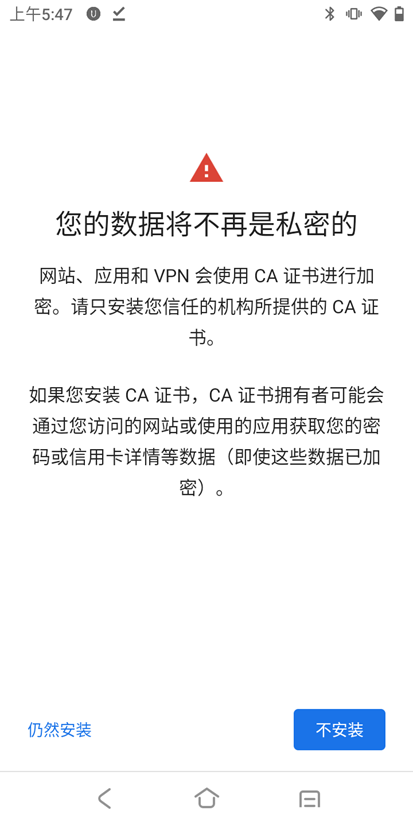
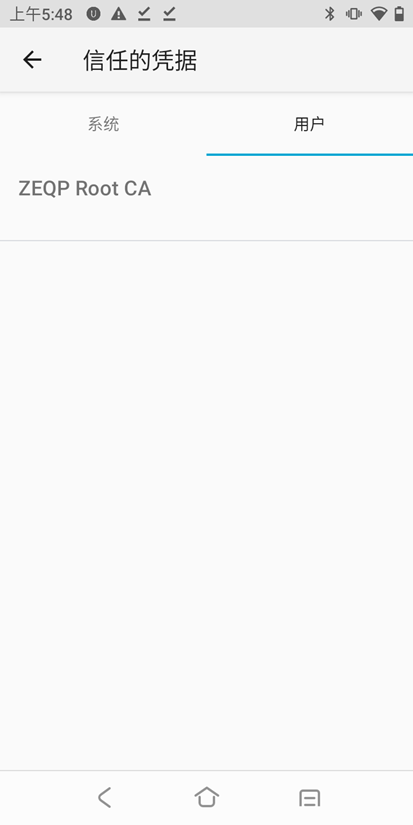

# 根证书安装

## 下载

|名称|地址|说明|
|---|---|---|
|ZEQP_Root_CA.cer|[下载根证书](/ZEQP_Root_CA.cer)|DER格式的X.509证书|
|ZEQP_Root_CA.crt|<a href="/ZEQP_Root_CA.crt" download>下载根证书</a>|PEM格式的X.509证书|

## 电脑端安装-Windows

1. 双击[ZEQP_Root_CA.cer](/ZEQP_Root_CA.cer)根证书 --> 点击“安装证书”

2. 存储位置选择“本地计算机”

3. 指定证书存储位置“受信息的根证书颁发机构”

## 移动端安装-Android

1. 打开PDA的浏览器，输入WMS文档网址：https://{{projectData.webHost}}:{{projectData.wmsDocPort}},然后[下载根证书](/ZEQP_Root_CA.cer)

2. 下载完成后进入设置->安全->加密与凭据->安装证书->CA 证书，点击**仍然安装**，选择下载的证书文件ZEQP_Root_CA.cer

3. 查看**受信任的凭据**，在**用户**栏看到刚才安装的ZEQP Root CA证书，表示安装成功
