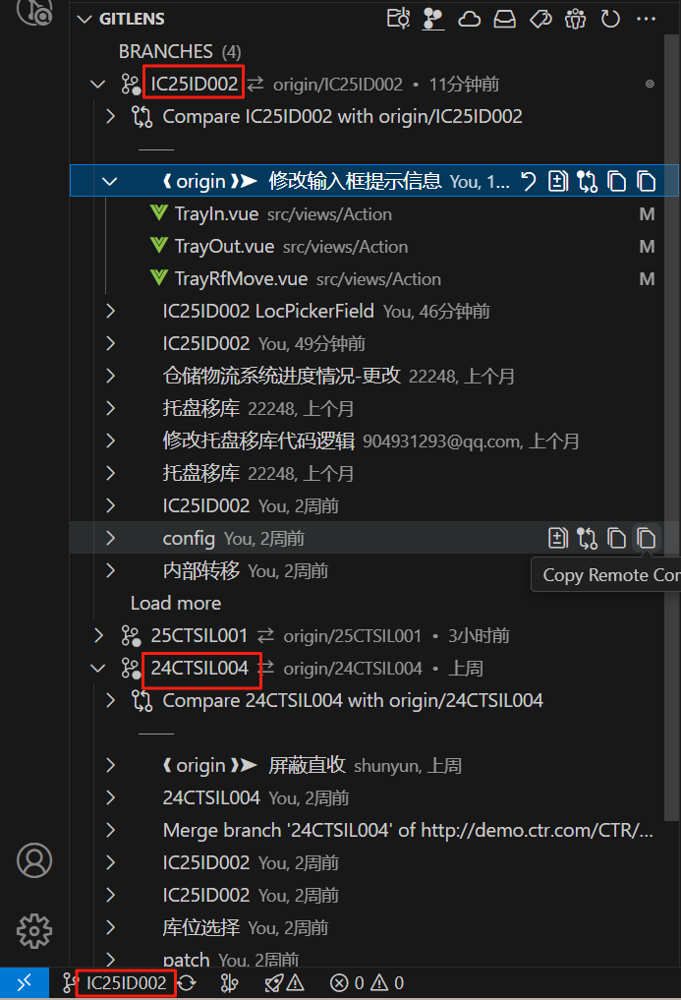
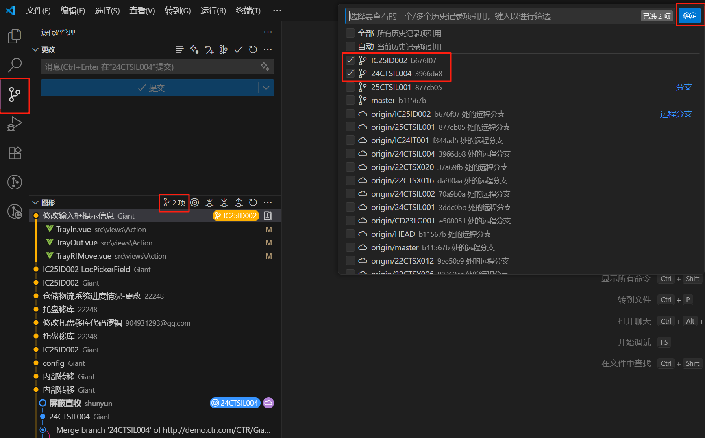
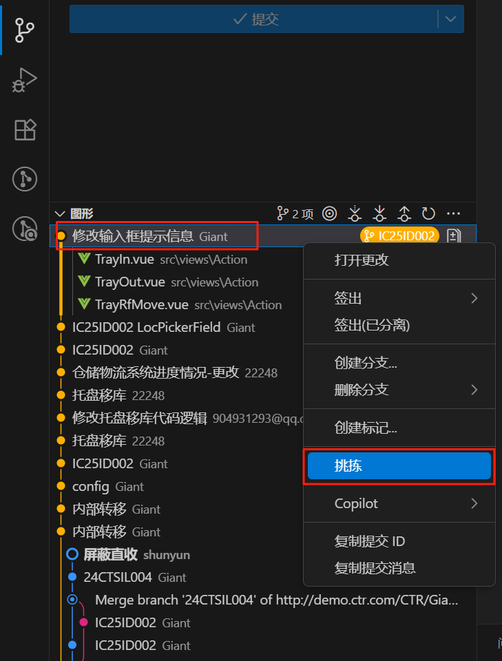
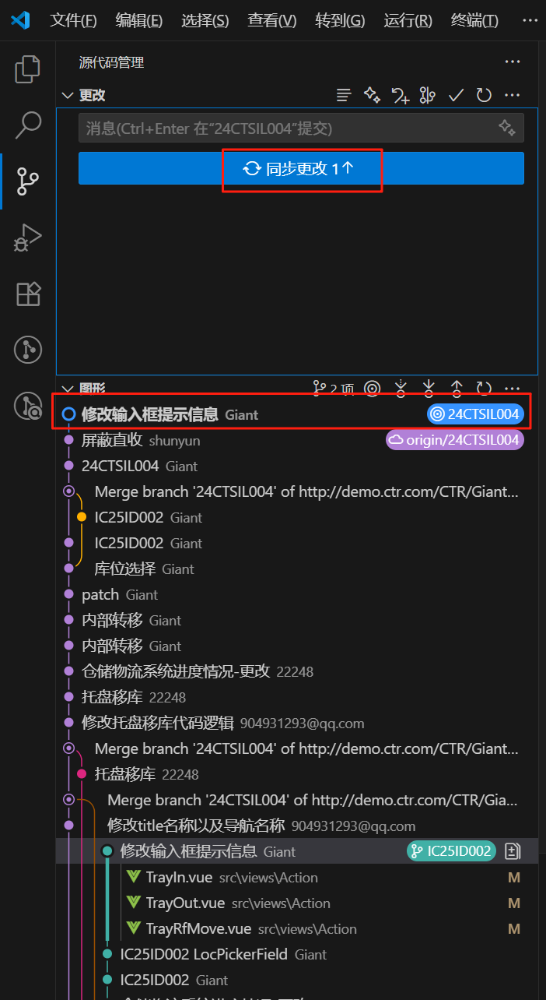
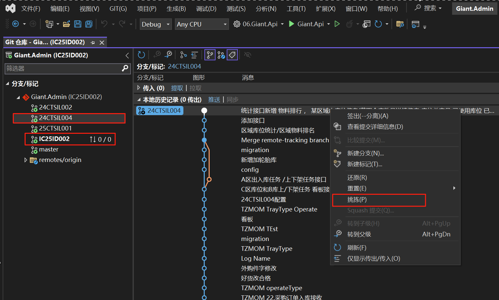

# 开发中常见问题

## Visual Studio Code 提交的代码如何同步至其它分支

比如说我当前在IC25ID002分支下提交了一个“修改输入框提示信息”的代码变更

我要怎么把这个变更同步到24CTSIL004分支下面去？

步骤：

1. 先把当前分支切换到24CTSIL004
2. 在源代码管理->图形，选择把24CTSIL004，IC25ID002两个分支都显示
3. 在IC25ID002提交的变更上点“右键”，选择“挑拣”
4. 在24CTSIL004已经可以看到变更信息，然后点“同步更改”把变更同步至远程

## Visual Studio 提交的代码如何同步至其它分支

比如说我当前在24CTSIL004分支下提交了一个代码变更

我要怎么把这个变更同步到IC25ID002分支下面去？

步骤：

1. 先把当前分支切换到IC25ID002
2. 在源代码管理点击24CTSIL004，找到要同步的变更
3. 在24CTSIL004变更上点“右键”，选择“挑拣”
4. 在IC25ID002已经可以看到变更信息，然后点“同步”把变更同步至远程

