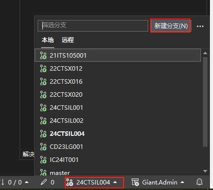
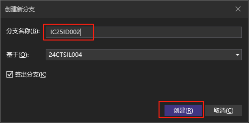
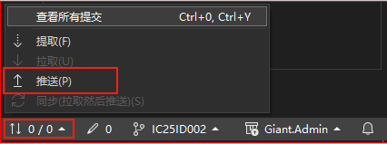
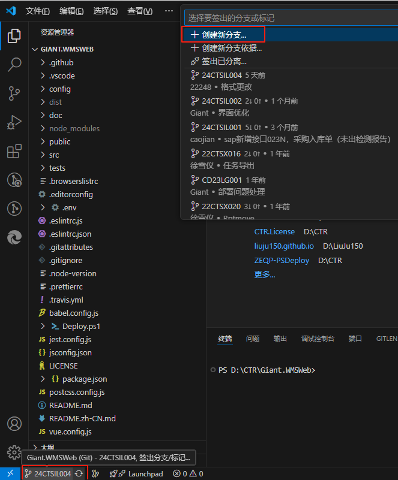
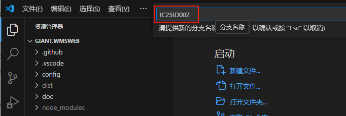
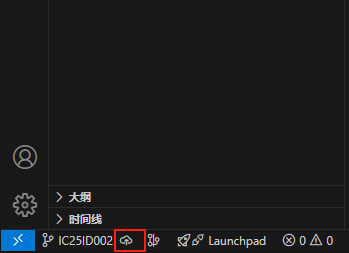
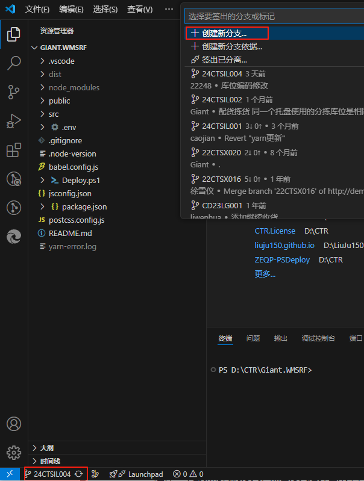
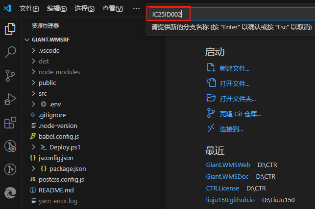
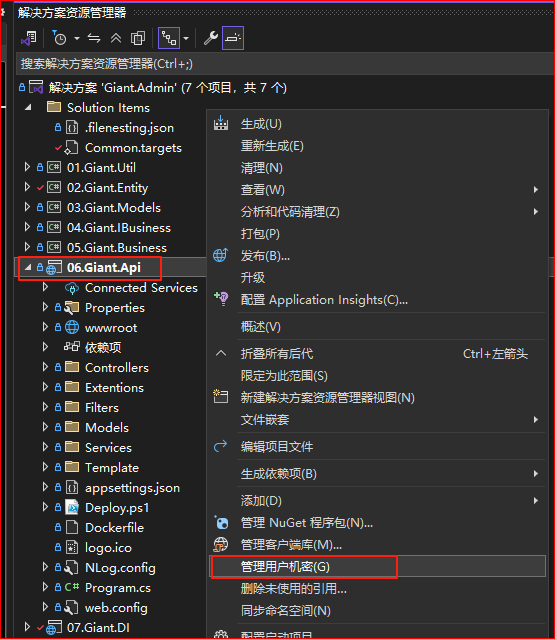
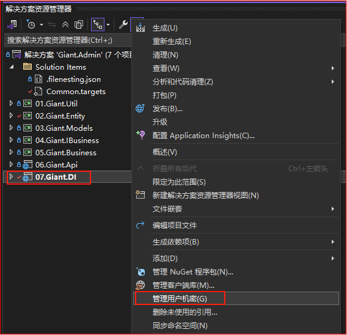

<script setup>
import { ref } from 'vue'
import { data } from '/.vitepress/project.data.ts'
const projectData = ref(data)
</script>

# 新项目初始化

**项目信息**

* 项目编号：IC25ID002
* 项目名称：XX仓储物流项目

## 创建代码分支

### WMS API 分支创建

使用Visual Studio打开Giant.Admin解决方案

选择一个最新的代码分支，点击“新建分支”

在分支名称上输入新项目的编号，然后点“创建”

分支会自动创建，并把当前分支切换成新项目分支

点击“同步”功能，选择“推送”,把新版本分支推送至源代码服务器







### WMS Web 分支创建

用Visual Studio Code打开Giant.WMSWeb项目

选择一个最新的代码分支，点击分支后弹出菜单，选择“创建新分支”

在输入框中输入项目编号为新分支的名称后，按回车键确定

分支会自动创建，并把当前分支切换成新项目分支

点击新分支后面的“同步”按钮，把新版本分支推送至源代码服务器







### WMS RF 分支创建

用Visual Studio Code打开Giant.WMSRF项目

选择一个最新的代码分支，点击分支后弹出菜单，选择“创建新分支”

在输入框中输入项目编号为新分支的名称后，按回车键确定

分支会自动创建，并把当前分支切换成新项目分支

点击新分支后面的“同步”按钮，把新版本分支推送至源代码服务器






## 项目数据配置

1. 删除02.Giant.Entity项目下面的迁移Migrations文件夹

2. 修改解决方案中项目信息

修改Common.targets文件

主要修改点为：ProjectCode、DatabaseType、UserSecretsId、VersionPrefix

|名称|值|说明|
|---|---|---|
|ProjectCode|WMSIC25ID002|项目编码，格式为WMS+项目号|
|DatabaseType|SqlServer|当前项目使用的数据库类型|
|UserSecretsId|Guid.NewGuid()|为新项目生成一个唯一ID，用来做机密与授权的关联|
|VersionPrefix|8.25.0|新项目系统版本号，格式.Net版本+年份|
|FileVersion|8.25.0.0|新项目文件版本号，格式.Net版本+年月日|

```xml
  <PropertyGroup>
    <TargetFramework>net8.0</TargetFramework>
    <Product>ZEQP.WMS</Product>
    <Description>中南智能仓储管理系统</Description>
    <ProjectCode>WMSIC25ID002</ProjectCode>
    <DatabaseType>SqlServer</DatabaseType>
    <UserSecretsId>37731b62-dac7-4323-b2ce-1ea0d47eef5d</UserSecretsId>
    <Company>长沙长泰机器人有限公司</Company>
    <Authors>信息物流事业部</Authors>
    <Copyright>Copyright ©$([System.DateTime]::Now.ToString('yyyy')) 长沙长泰机器人有限公司</Copyright>
    <VersionPrefix>8.25.0</VersionPrefix>
    <VersionSuffix>$(EnvironmentName)</VersionSuffix>
    <AssemblyTitle>$(Description)</AssemblyTitle>
    <AssemblyVersion>$(VersionPrefix)</AssemblyVersion>
    <FileVersion>8.$([System.DateTime]::Now.ToString('yy.M.d'))</FileVersion>
  </PropertyGroup>
```

3. 修改07.Giant.DI项目信息

修改项目文件中的UserSecretsId，生成一个新的Guid

因为WDI是单独授权，所以要有单独的UserSecretsId配置

```xml
  <PropertyGroup>
    <Product>ZEQP.WDI</Product>
    <Description>中南智能仓储数据集成平台</Description>
    <UserSecretsId>2fe1350a-de1c-4096-90b5-e5ac797bf026</UserSecretsId>
    <TargetFramework>net8.0</TargetFramework>
    <RootNamespace>Giant.DI</RootNamespace>
    <AssemblyName>Giant.DI</AssemblyName>
    <GenerateDocumentationFile>true</GenerateDocumentationFile>
    <IsTransformWebConfigDisabled>true</IsTransformWebConfigDisabled>
    <NoWarn>$(NoWarn);1591</NoWarn>
    <ImplicitUsings>enable</ImplicitUsings>
    <ApplicationIcon>logo.ico</ApplicationIcon>
  </PropertyGroup>
```

## 业务数据配置

1. 修改01.Giant.Util项目下的EntityDefinition.cs文件

主要修改其中的DefaultWhses,为默认仓库配置

其它字段配置可以按需求更改(不建议修改)

```C#
namespace Giant.Util;

/// <summary>
/// 实体定义
/// </summary>
public static class EntityDefinition
{
    /// <summary>
    /// 默认小字段长度
    /// </summary>
    public const int DefSmallColLen = 50;
    /// <summary>
    /// 默认中字段长度
    /// </summary>
    public const int DefMiddleColLen = 100;
    /// <summary>
    /// 默认大字段长度
    /// </summary>
    public const int DefLargeColLen = 2000;

    #region 计量字段默认配置
    /// <summary>
    /// 默认计量字段精度
    /// </summary>
    public const int DefDecimalPrecision = 18;
    /// <summary>
    /// 默认计量字段小数位数
    /// </summary>
    public const int DefDecimalScale = 2;
    #endregion

    /// <summary>
    /// 默认仓库编码
    /// </summary>
    [Obsolete("请使用DefaultWhses")]
    public const string DefWhseCode = "WHH";
    /// <summary>
    /// 默认管理员Id
    /// </summary>
    public const string DefAdminUserId = "1";

    /// <summary>
    /// 初始化仓库默认数据
    /// </summary>
    public static readonly List<(string WhseCode, string WhseName, string StorerCode, string AdminUserId)> DefaultWhses = 
    new List<(string WhseCode, string WhseName, string StorerCode, string AdminUserId)>
    {
        ("WHH","板金件","H0000","admin.bjj")
    };
}
```

2. 配置WMS API的数据库与开发授权

在06.Giant.Api项目上点右键，选择“管理用户机密”

在打开的secrets.json文件中。输入数据库连接与授权信息



```json
{
  "ConnectionStrings": {
    "GDbContext": "Data Source=10.76.99.19;Initial Catalog=IC25ID002;User Id={User};Password={Password};APP=ZEQPWMS;Pooling=true;"
  },
  "Copyright": {
    "License": "{WMS License}",
    "Sign": "{WMS Sign}"
  }
}
```

2. 配置WMS DI的数据库与开发授权

在07.Giant.DI项目上点右键，选择“管理用户机密”

在打开的secrets.json文件中。输入数据库连接与授权信息



```json
{
  "ConnectionStrings": {
    "GDbContext": "Data Source=10.76.99.19;Initial Catalog=IC25ID002;User Id={User};Password={Password};APP=ZEQPWMS;Pooling=true;"
  },
  "Copyright": {
    "License": "{WDI License}",
    "Sign": "{WDI Sign}"
  }
}
```