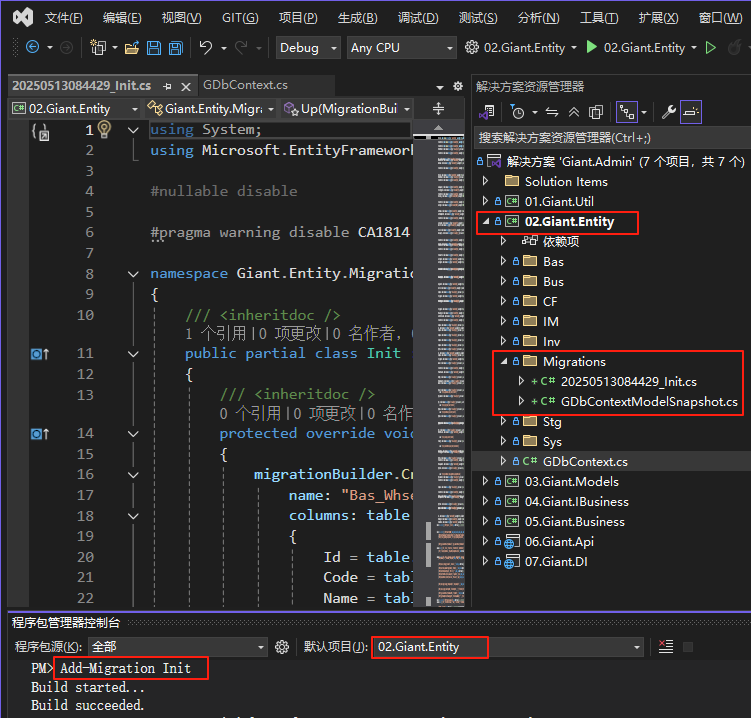
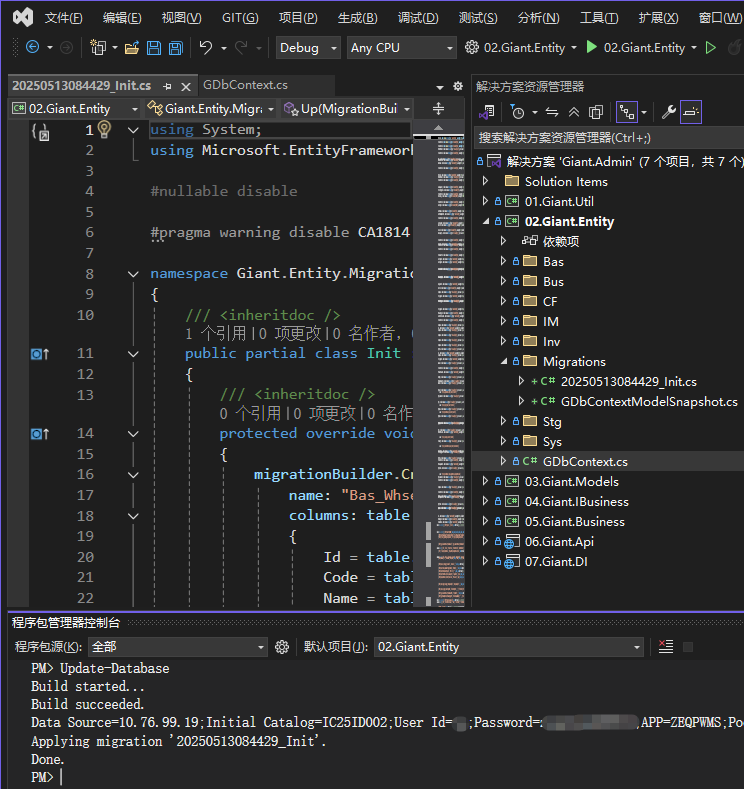
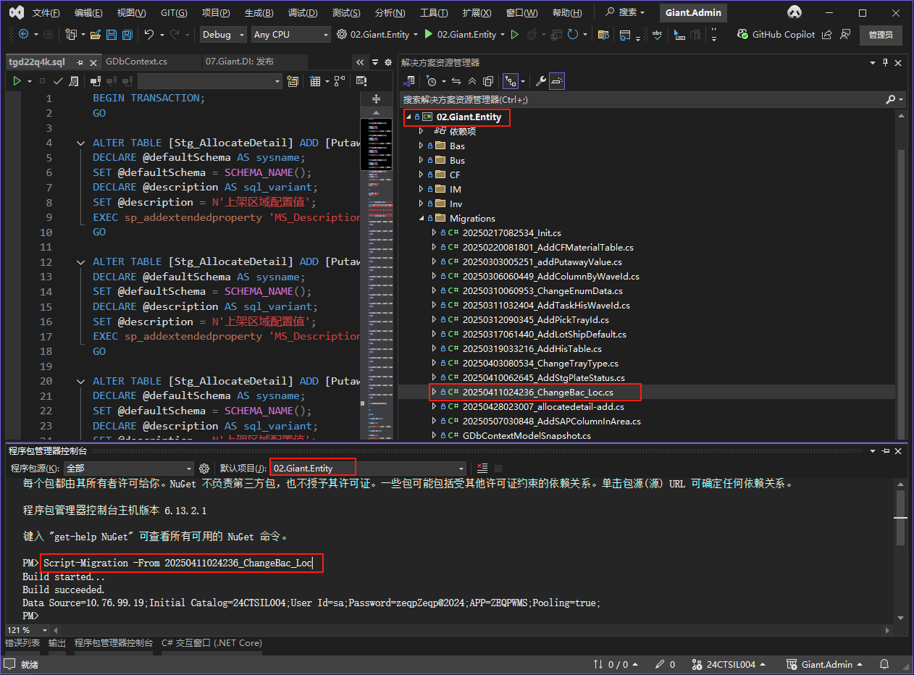

<script setup>
import { ref } from 'vue'
import { data } from '/.vitepress/project.data.ts'
const projectData = ref(data)
</script>

# 数据库更新

## 新增迁移

1. 把02.Gaint.Entity项目设定为当前启动项
2. 打开"工具“->"NuGet程序包管理器"->"程序包管理控制台"
3. 程序包管理控制台中“默认项目”选择02.Gaint.Entity
4. 在程序包管理控制台中输入以下命令

```powershell
Add-Migration {迁移名称}
```

生成成功后，会在Migrations目录下生成对应的迁移文件



## 应用迁移

1. 把02.Gaint.Entity项目设定为当前启动项
2. 打开"工具“->"NuGet程序包管理器"->"程序包管理控制台"
3. 程序包管理控制台中“默认项目”选择02.Gaint.Entity
4. 在程序包管理控制台中输入以下命令

### 开发环境（可以直连数据库）

```powershell
Update-Database
```



### 生产环境（不可以直连数据库）

使用下面命令生成SQL代码

然后把SQL代码至生产环境数据库执行

```powershell
Script-Migration -From {数据库最后更新迁移名称} -To {当前最新迁移名称}
```



