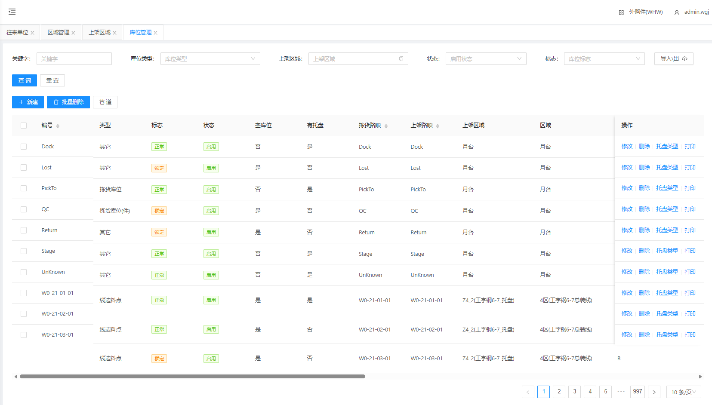
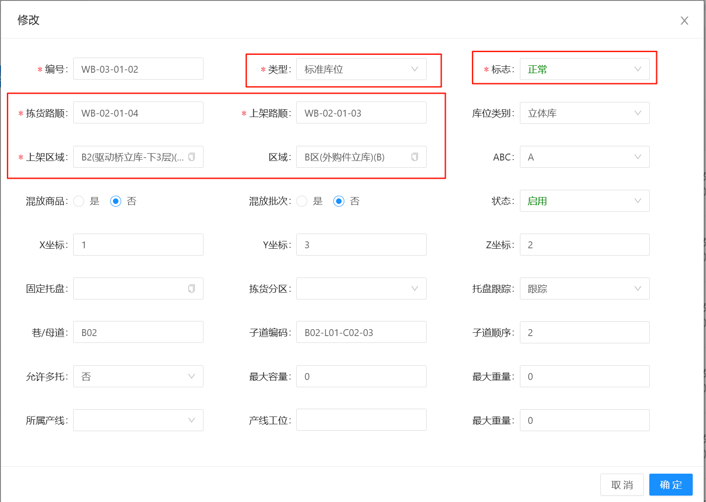
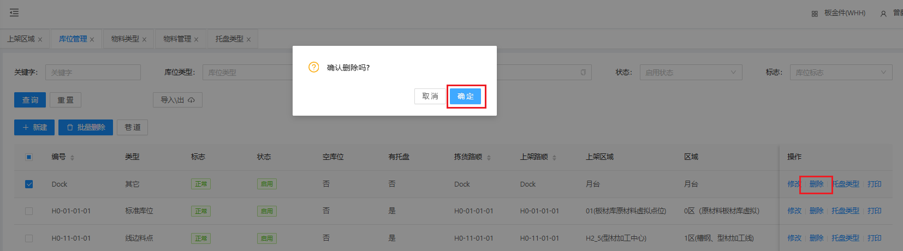
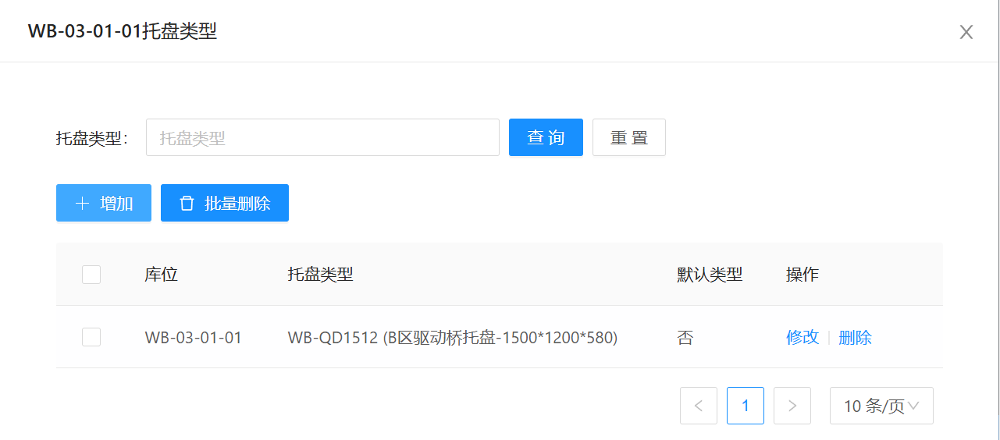
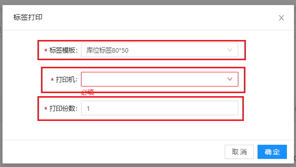

# 库位管理

显示当前所有已设置的库位位置，包含库位的基本信息新增、修改、删除、托盘类型、打印功能

## 新增/修改

&nbsp;&nbsp;&nbsp;&nbsp;1.拣货路顺：按照此顺序进行出库

&nbsp;&nbsp;&nbsp;&nbsp;2.上架路顺：按照此顺序进行上架

&nbsp;&nbsp;&nbsp;&nbsp;3.上架区域：逻辑区域，可对物料上架进行不同物料上架到不同区域

&nbsp;&nbsp;&nbsp;&nbsp;4.区域：所在规划区域

## 删除

点击操作表头下的删除按钮，进行删除操作

## 托盘类型

当前库位可以存放的托盘类型，在托盘/物料上架的时候需要进行此配置，否则无法上架

## 标签打印

&nbsp;&nbsp;&nbsp;&nbsp;1.标签模板：根据打印机当前打印纸尺寸选择标签

&nbsp;&nbsp;&nbsp;&nbsp;2.打印机：打印机

&nbsp;&nbsp;&nbsp;&nbsp;3.打印份数：打印份数

