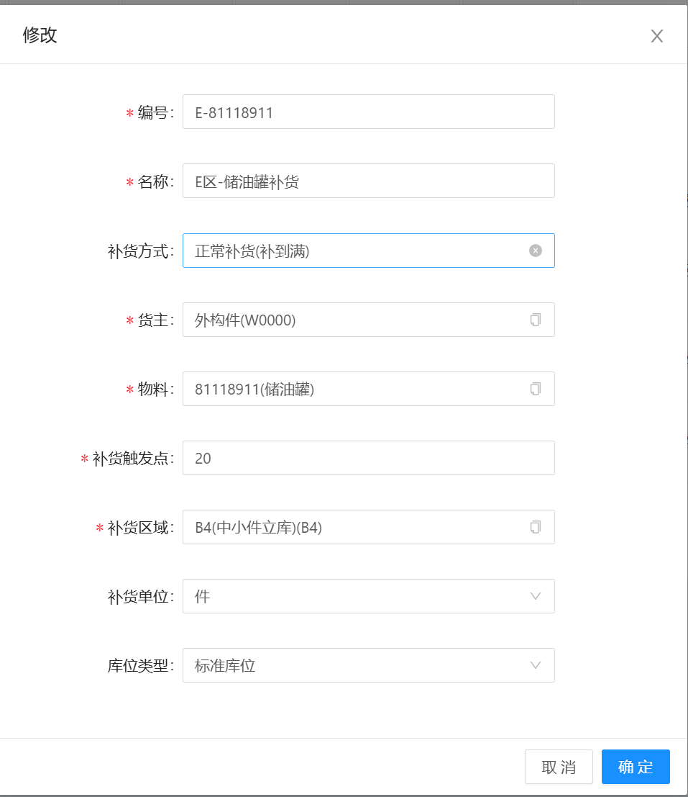
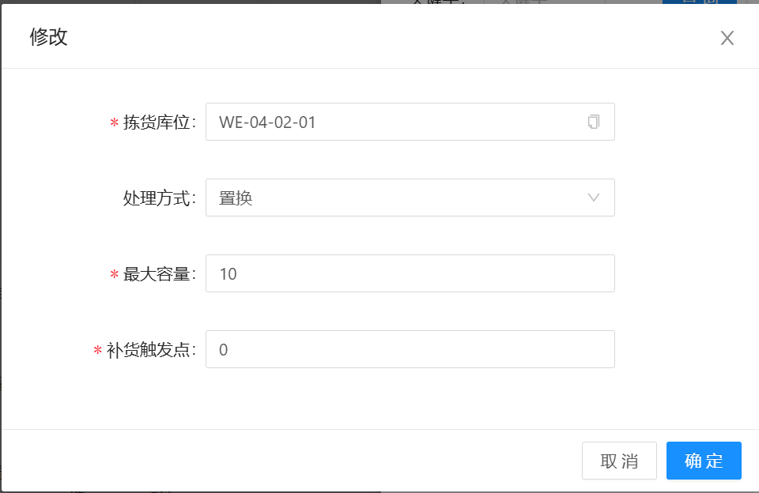
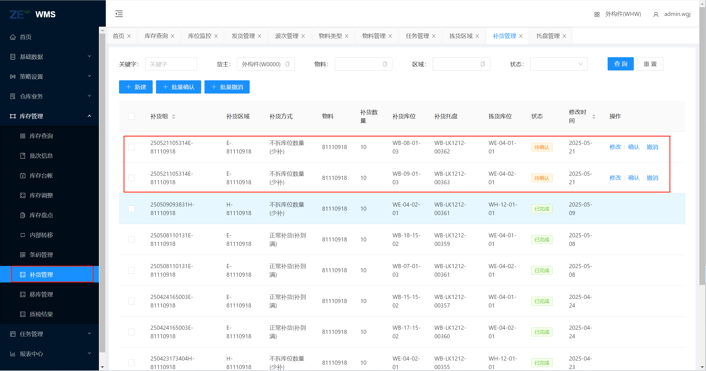

# 拣货区域

对某个区域进行物料补货，进入Web端页面，基础数据》拣货区域中，包含新增、修改、删除、拣货库位、补货功能{#pickZone-1}

## 新增修改

&nbsp;&nbsp;&nbsp;&nbsp;1.编号：自由定义

&nbsp;&nbsp;&nbsp;&nbsp;2.名称：自由定义

&nbsp;&nbsp;&nbsp;&nbsp;3.补货方式：正常补货(补到满)=按照配置的数量补货、不拆库位数量(少补)=只出一托货物、不拆库位数量(多补)=按照数量配置出托，直到最后一托达到数量

&nbsp;&nbsp;&nbsp;&nbsp;4.货主：货主

&nbsp;&nbsp;&nbsp;&nbsp;5.物料：需要补货的物料

&nbsp;&nbsp;&nbsp;&nbsp;6.补货触发点：需要补货的区域数量小于此数量，执行补货

&nbsp;&nbsp;&nbsp;&nbsp;7.补货区域：只从哪个区域补货

&nbsp;&nbsp;&nbsp;&nbsp;8.库位类型：只从哪种库位库位类型补货

## 拣货库位

&nbsp;&nbsp;&nbsp;&nbsp;1.拣货库位：被补货的库位

&nbsp;&nbsp;&nbsp;&nbsp;2.处理方式：置换=直接将托盘放置此位置  倒箱=需要补货点有托盘，将物料转移到被补货的托盘

&nbsp;&nbsp;&nbsp;&nbsp;3.最大容量：托盘的最大存储量

&nbsp;&nbsp;&nbsp;&nbsp;4.补货触发点：当数量小于等于此数量，进行补货

### 补货

进入Web端页面，点击“补货按钮”既可对当前配置的信息进行补货，在 库存管理》补货管理中，则会看到新增的补货信息，点击确认按钮完成生成补货任务进行补货

