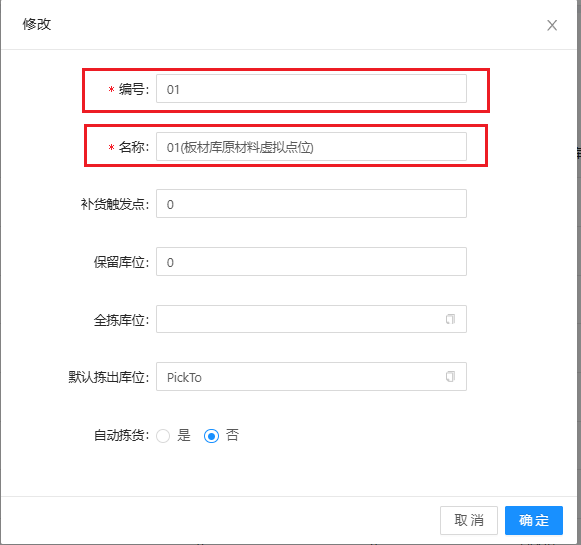
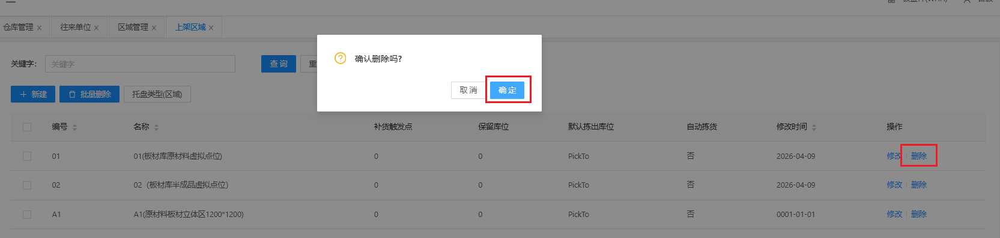
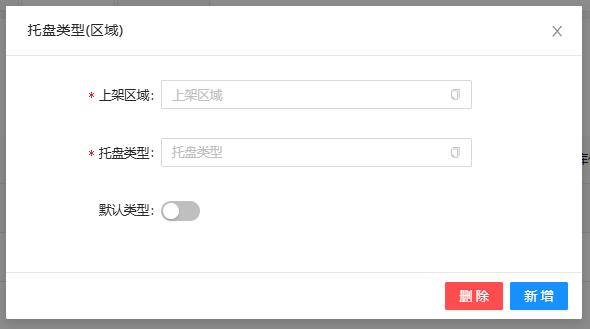

# 上架区域

对上架区域进行数据定义，包含上架区域基础信息新增、修改、删除、托盘类型(区域)，可以批量给所选择的上架区域设置托盘类型

## 新增/修改

&nbsp;&nbsp;&nbsp;&nbsp;1.编号：上架区域所对应的编号

&nbsp;&nbsp;&nbsp;&nbsp;2.名称：上架区域所对应的名称

## 删除 

点击操作表头下的删除按钮，进行删除操作

## 托盘类型(区域)

上架区域批量设置托盘类型

