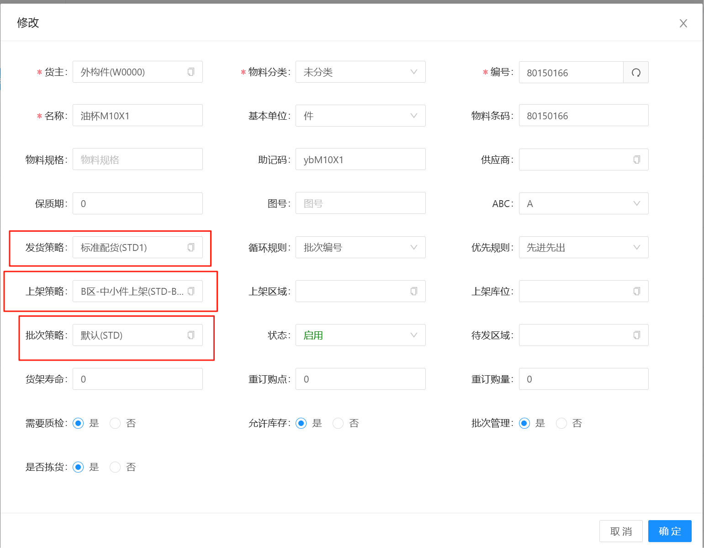
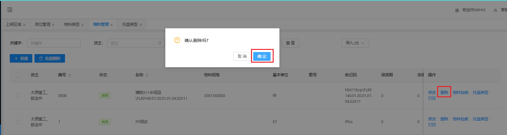
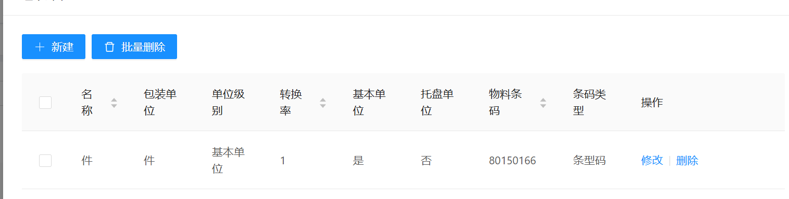
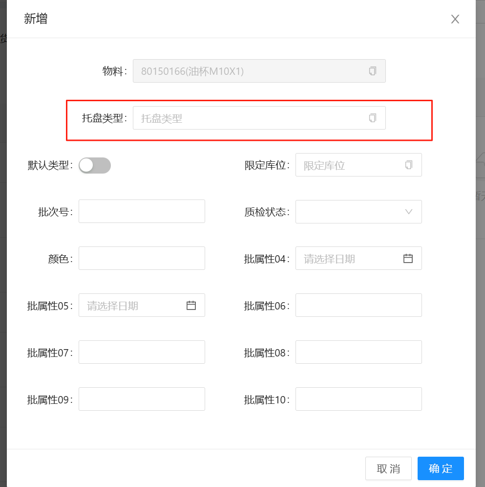

# 物料管理

对物料进行数据定义，包含物料的基本信息新增、修改、物料包装、托盘类型功能，每一种托盘类型都需要绑定一个托盘物料

## 新增/修改

&nbsp;&nbsp;&nbsp;&nbsp;1.发货策略：物料出库规则

&nbsp;&nbsp;&nbsp;&nbsp;2.上架策略：物料入库规则 {#sku-1}

&nbsp;&nbsp;&nbsp;&nbsp;3.批次策略：物料收货规则 {#sku-2}

## 删除

点击操作表头下的删除按钮，进行删除操作

## 物料包装

物料的基本包装单位维护，包含箱、托、件等等，

转换率：指当前单位转换的最小单位的数量，例如1箱矿泉水=24瓶矿泉水，当单位为箱时，转转率则为24

## 托盘类型

物料所存储的托盘类型，一般不进行维护

