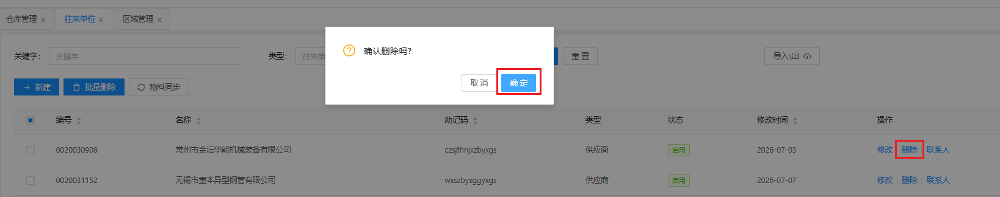
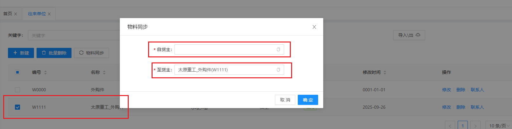

# 往来单位

对往来单位进行数据定义，包含往来单位基础信息新增、修改、删除、联系人、物料同步

## 新增/修改

&nbsp;&nbsp;&nbsp;&nbsp;1.编号：往来单位所对应的编号

&nbsp;&nbsp;&nbsp;&nbsp;2.名称：往来单位所对应的名称

&nbsp;&nbsp;&nbsp;&nbsp;3.类型：往来单位所对应的往来单位类型

## 删除

点击操作表头下的删除按钮，进行删除操作

## 联系人

往来单位数据设置对应的联系人

## 物料同步

选择往来单位数据，点击 **物料同步** 按钮，选择自货主数据，点击 **确认** ，系统会将 **货主为自货主的数据** 更改成 **货主为至货主的数据**

