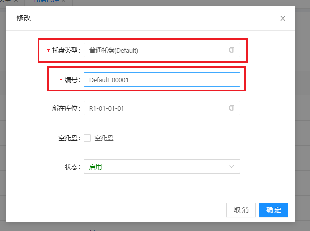
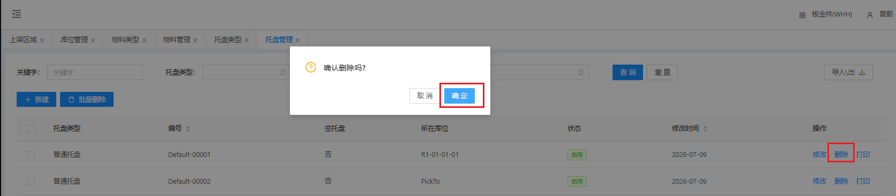
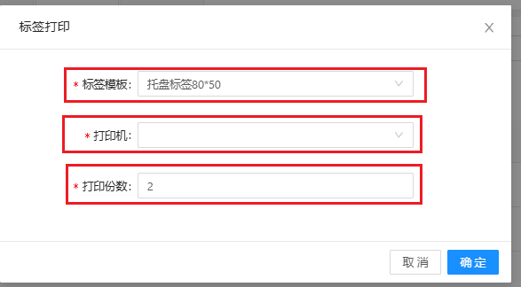

# 托盘管理

对托盘进行数据定义，包含托盘类型的基本信息新增、修改、打印

## 新增/修改

&nbsp;&nbsp;&nbsp;&nbsp;1.托盘类型：托盘类型

&nbsp;&nbsp;&nbsp;&nbsp;2.编号：编号

## 删除

点击操作表头下的删除按钮，进行删除操作

## 打印

&nbsp;&nbsp;&nbsp;&nbsp;1.标签模板：根据打印机当前打印纸尺寸选择标签

&nbsp;&nbsp;&nbsp;&nbsp;2.打印机：打印机

&nbsp;&nbsp;&nbsp;&nbsp;3.打印份数：打印份数

