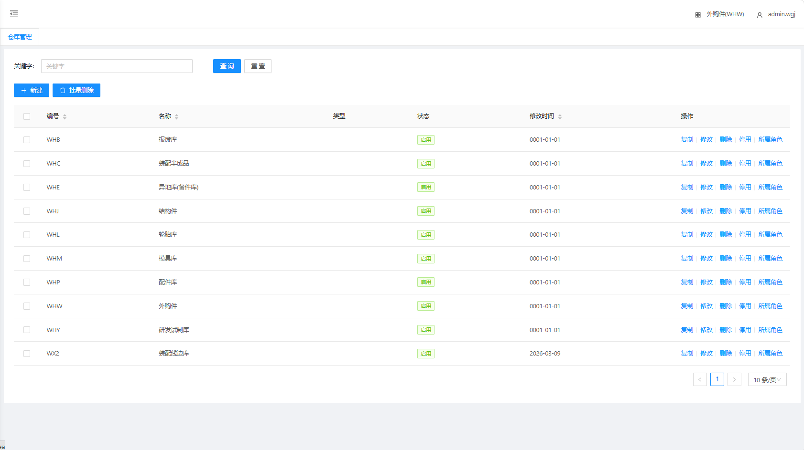
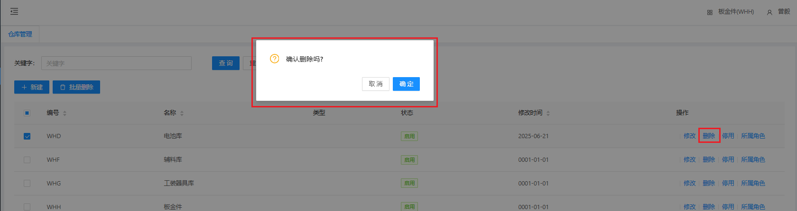

# 仓库管理

查看当前所有仓库的名称、编号、状态等，包含仓库基础信息新增、修改、删除、所属角色，每一个仓库数据都需要添加对应的仓库权限

## 新增、修改

&nbsp;&nbsp;&nbsp;&nbsp;1.编号：仓库所对应的编号

&nbsp;&nbsp;&nbsp;&nbsp;2.名称：仓库所对应的名称

&nbsp;&nbsp;&nbsp;&nbsp;3.类型：仓库所对应的仓库类型

## 删除

点击操作表头下的删除按钮，进行删除操作

## 所属角色

仓库数据设置对应的仓库权限

