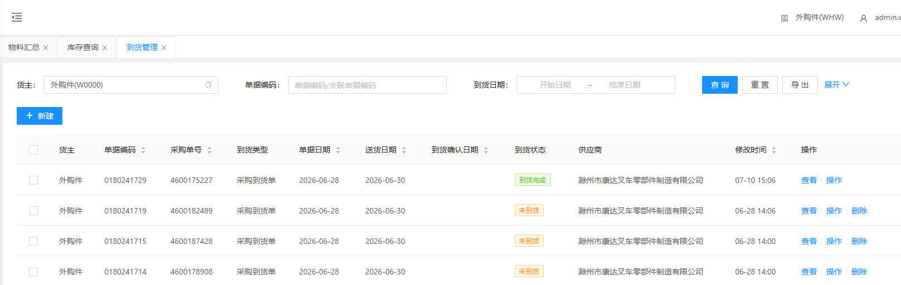
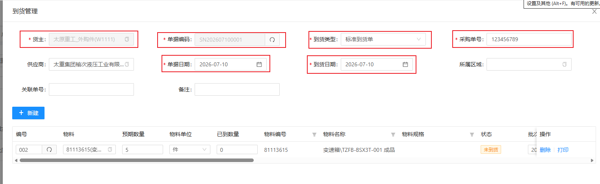
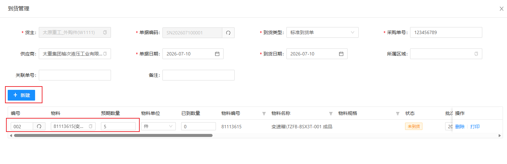
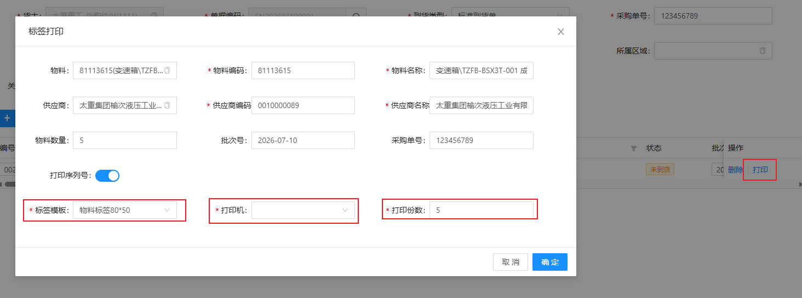
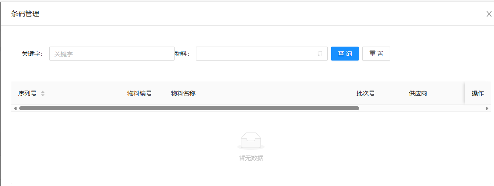
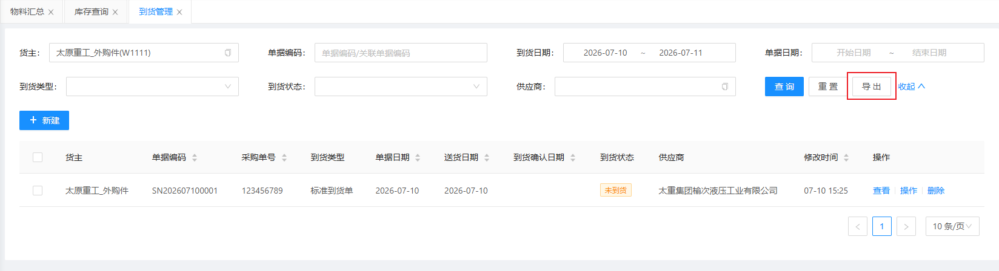

# 到货管理

到货管理数据通常由MOM进行下发；当MOM没有下发数据时，可通过WMS人工建立订单；包含新建订单、添加物料

## 查询/重置

可根据多个条件进行检索到货单数据/重置所有查询条件

## 人工建立到货单

&nbsp;&nbsp;&nbsp;&nbsp;1.货主：货主（默认显示当前货主）

&nbsp;&nbsp;&nbsp;&nbsp;2.单据编码：单据编码（点击文本框右侧刷新 **自动生成** ）

&nbsp;&nbsp;&nbsp;&nbsp;3.到货类型：到货类型（根据实际情况选择类型）

&nbsp;&nbsp;&nbsp;&nbsp;4.采购单号：采购单号

&nbsp;&nbsp;&nbsp;&nbsp;5.单据日期：单据日期（默认显示当前日期）

### 添加到货物料

点击新建，生成一栏无数据到货明细

&nbsp;&nbsp;&nbsp;&nbsp;1.编号：点击编号文本框右侧刷新 **自动生成**

&nbsp;&nbsp;&nbsp;&nbsp;2.物料：点击物料文本框选择到货物料

&nbsp;&nbsp;&nbsp;&nbsp;3.预期数量：预期数量

## 到货明细打印

点击到货明细物料进行打印操作

&nbsp;&nbsp;&nbsp;&nbsp;1.标签模板：根据打印机的打印纸选择模板

&nbsp;&nbsp;&nbsp;&nbsp;2.打印机：打印机（默认显示绑定打印机）

&nbsp;&nbsp;&nbsp;&nbsp;3.打印份数：自定义

## 条码管理

点击操作下的条码管理显示

数据由上游系统（MOM）推送的物料主数据是否启用序列号管理而生成

## 导出

点击导出会根据查询条件导出查询的到货单数据

