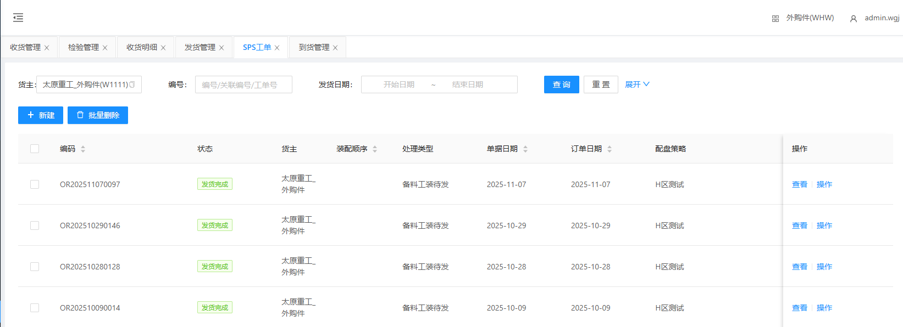
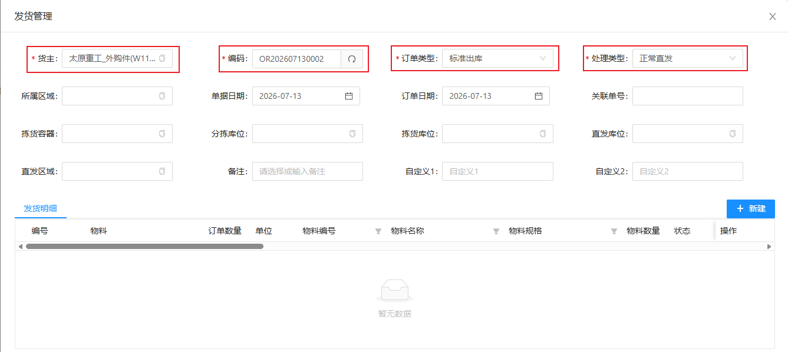
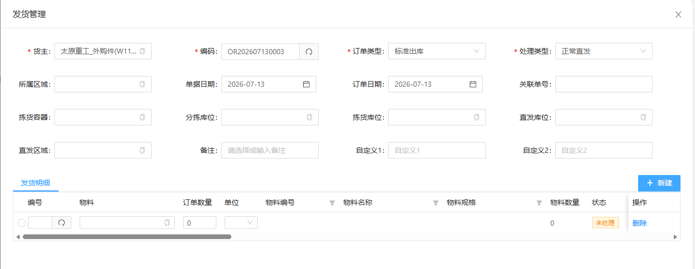
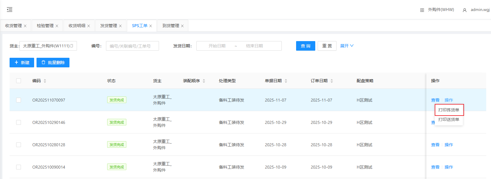
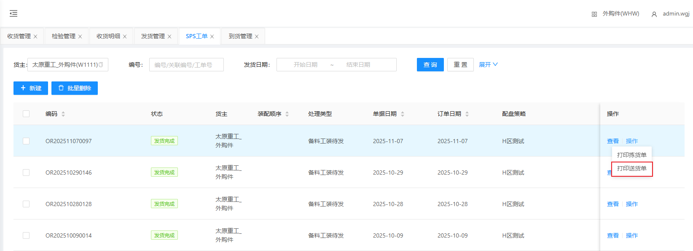

# SPS工单

SPS工单数据通常由MOM进行下发；当MOM没有下发数据时，可通过WMS人工建立订单。

## 查询/重置

可根据货主和单据编号进行检索SPS工单数据/重置所有查询条件

## 人工建立到货单

&nbsp;&nbsp;&nbsp;&nbsp;1.货主：货主（默认显示当前货主）

&nbsp;&nbsp;&nbsp;&nbsp;2.单据编码：单据编码（点击文本框右侧刷新 **自动生成** ）

&nbsp;&nbsp;&nbsp;&nbsp;3.订单类型：订单类型（根据实际情况选择类型）

&nbsp;&nbsp;&nbsp;&nbsp;4.处理类型：处理类型（根据实际情况选择订单处理类型）

### 添加SPS物料

点击新建，生成一栏无数据SPS工单明细

&nbsp;&nbsp;&nbsp;&nbsp;1.编号：点击编号文本框右侧刷新 **自动生成**

&nbsp;&nbsp;&nbsp;&nbsp;2.物料：点击物料文本框选择到货物料

&nbsp;&nbsp;&nbsp;&nbsp;3.订单数量：订单数量

##	打印拣货单

点击打印拣货单

## 打印送货单

点击打印收货单

