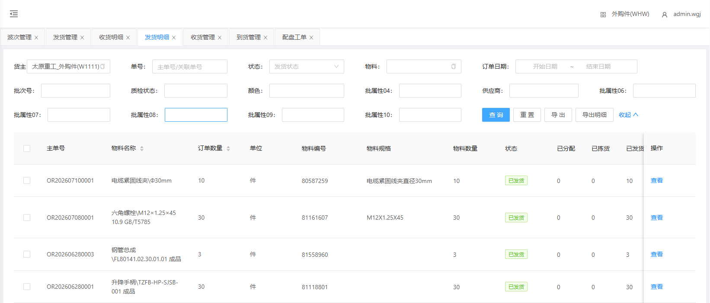
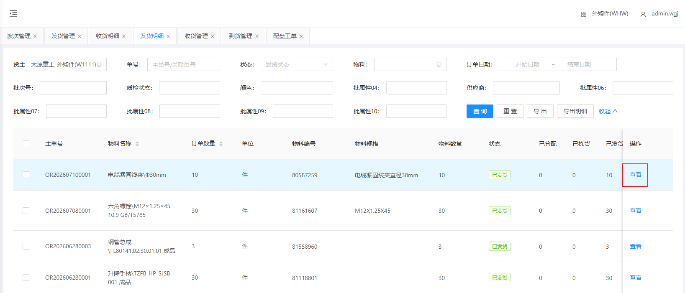
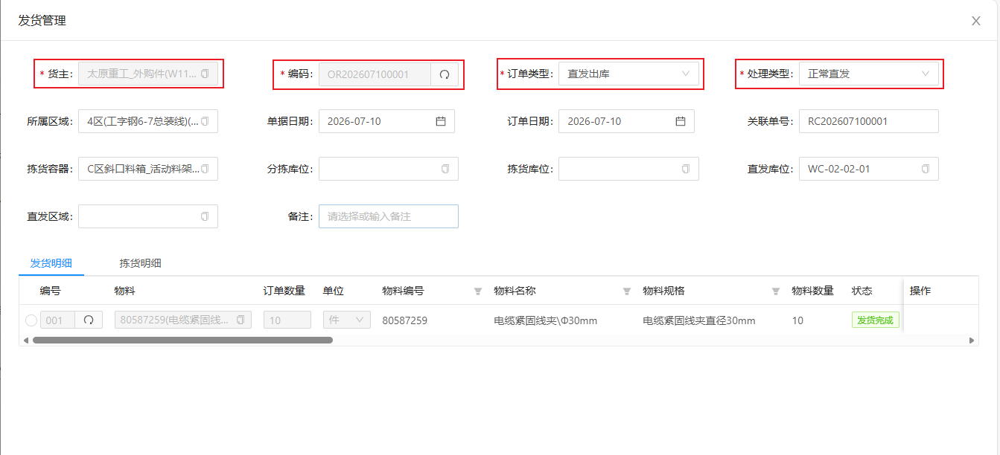

# 发货明细

显示发货单下的物料发货数据

## 查询/重置

可根据多个条件进行检索发货单数据/重置所有查询条件

## 查看发货明细

点击查看即可查询/修改发货订单明细

&nbsp;&nbsp;&nbsp;&nbsp;1.货主：货主（默认显示当前货主）

&nbsp;&nbsp;&nbsp;&nbsp;2.单据编码：单据编码（点击文本框右侧刷新 **自动生成** ）

&nbsp;&nbsp;&nbsp;&nbsp;3.发货类型：发货类型（根据实际情况选择类型）

&nbsp;&nbsp;&nbsp;&nbsp;4.处理类型：处理类型（根据实际情况选择类型）

