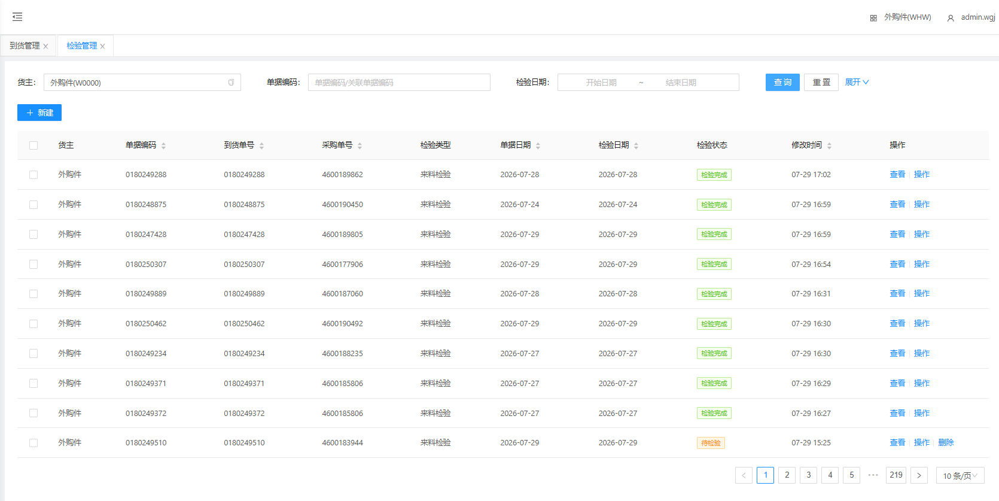
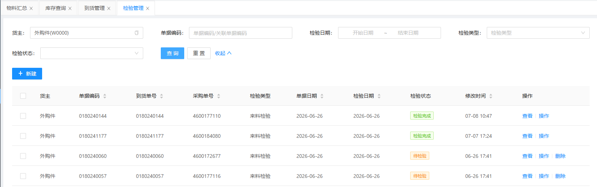
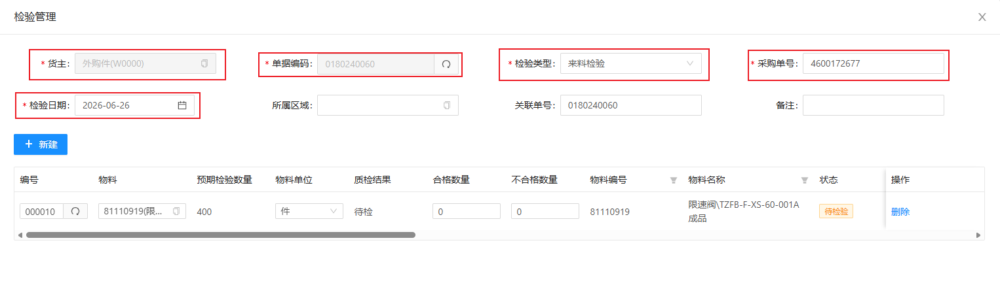
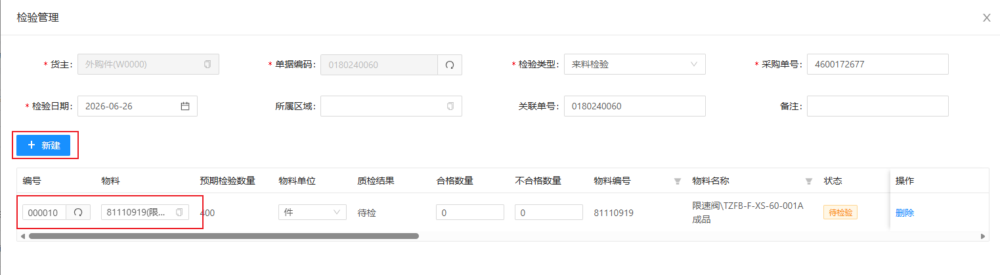
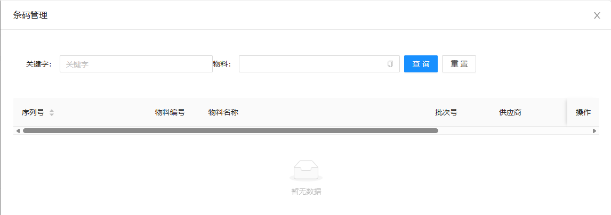

# 检验管理

检验管理数据通常由MOM进行下发；当MOM没有下发数据时，可通过WMS人工建立订单。

## 查询/重置

可根据多个条件进行检索到货单数据/重置所有查询条件

## 人工建立检验单

&nbsp;&nbsp;&nbsp;&nbsp;1.货主：货主（默认显示当前货主）

&nbsp;&nbsp;&nbsp;&nbsp;2.单据编码：单据编码（点击文本框右侧刷新 **自动生成** ）

&nbsp;&nbsp;&nbsp;&nbsp;3.检验类型：检验类型（根据实际情况选择类型）

&nbsp;&nbsp;&nbsp;&nbsp;4.采购单号：采购单号

&nbsp;&nbsp;&nbsp;&nbsp;5.检验日期：检验日期（默认显示当前日期）

### 添加检验物料

点击新建，生成一栏无数据检验明细

&nbsp;&nbsp;&nbsp;&nbsp;1.编号：点击编号文本框右侧刷新 **自动生成**

&nbsp;&nbsp;&nbsp;&nbsp;2.物料：点击物料文本框选择检验物料

## 条码管理

点击操作下的条码管理显示

数据由上游系统（MOM）推送的物料主数据是否启用序列号管理而生成

