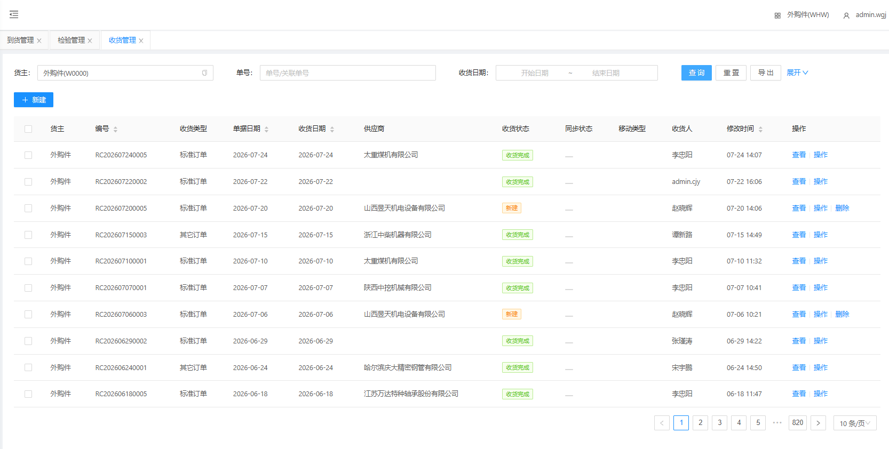
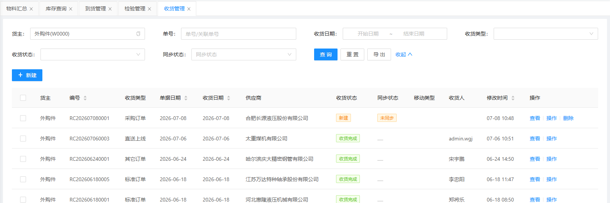
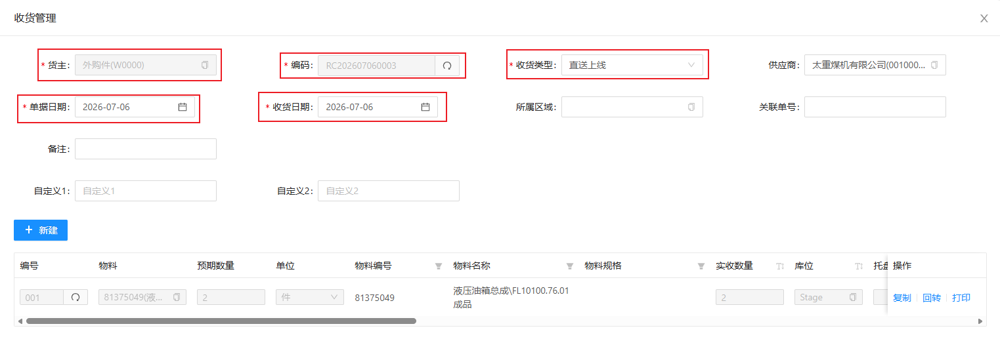
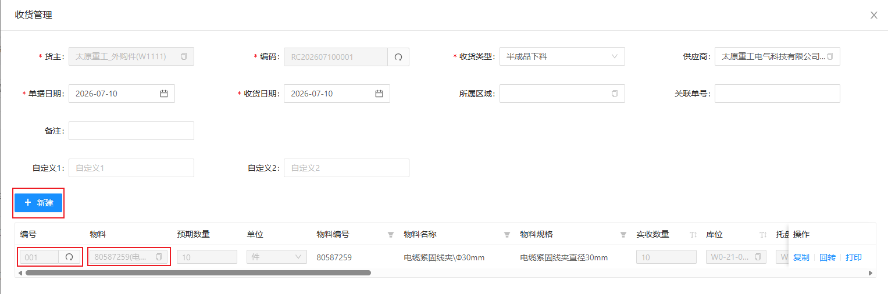
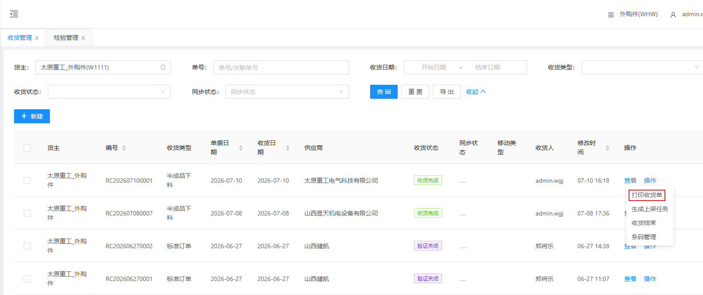
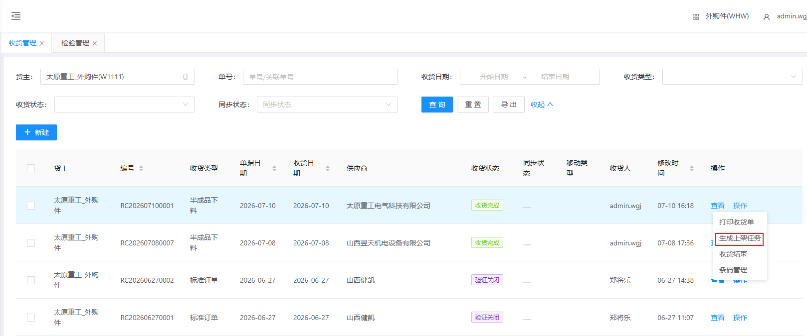
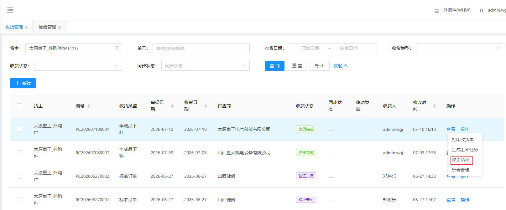
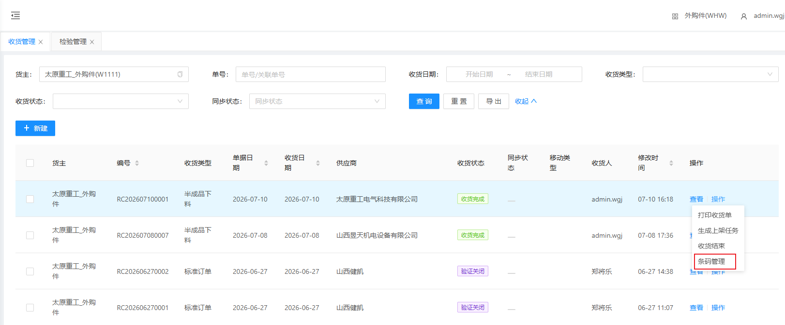

# 收货管理

可查询需要收货的物料的信息；收货管理数据通常由MOM下发至检验管理；当检验合格后，即可生成收货单，也可人工建立收货单

## 查询/重置

可根据多个条件进行检索收货单数据/重置所有查询条件

## 人工建立收货单

&nbsp;&nbsp;&nbsp;&nbsp;1.货主：货主（默认显示当前货主）

&nbsp;&nbsp;&nbsp;&nbsp;2.单据编码：单据编码（点击文本框右侧刷新 **自动生成** ）

&nbsp;&nbsp;&nbsp;&nbsp;3.收货类型：收货类型（根据实际情况选择类型）

&nbsp;&nbsp;&nbsp;&nbsp;4.单据日期：单据日期（默认显示当前日期）

&nbsp;&nbsp;&nbsp;&nbsp;5.收货日期：收货日期（默认显示当前日期）

### 添加收获物料

点击新建，生成一栏无数据收获明细

&nbsp;&nbsp;&nbsp;&nbsp;1.编号：点击编号文本框右侧刷新 **自动生成**

&nbsp;&nbsp;&nbsp;&nbsp;2.物料：点击物料文本框选择收货物料

## 打印收货单

点击打印收货单

## 生成上架任务

收货完成后即可生成上架任务

## 收获结束

结束当前收货单

## 条码管理

点击操作下的条码管理显示

数据由上游系统（MOM）推送的物料主数据是否启用序列号管理而生成

