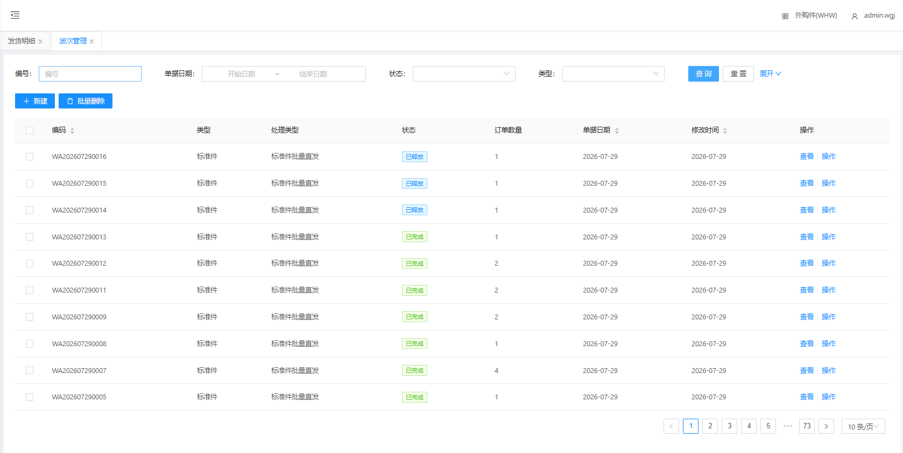
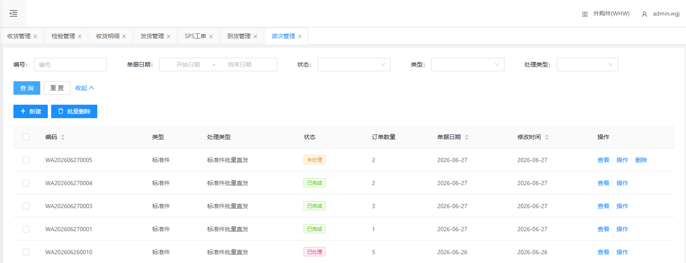
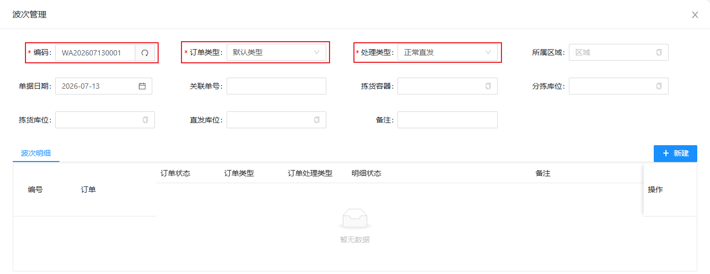
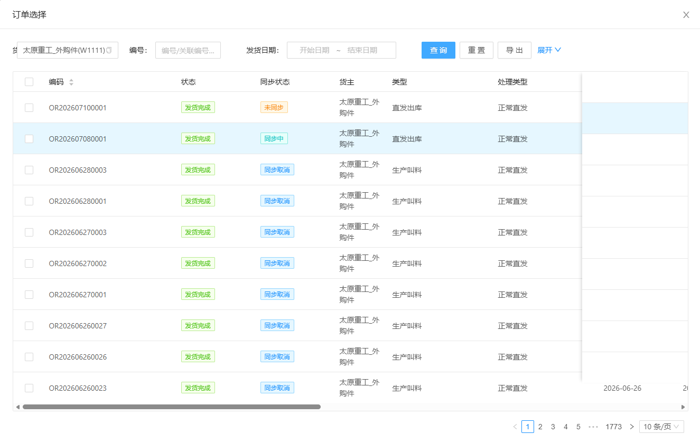
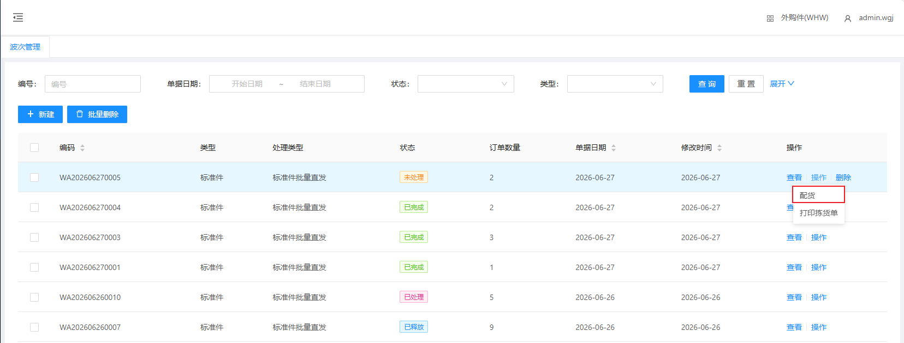
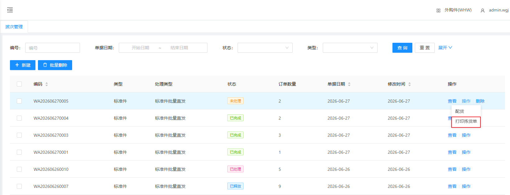

# 波次管理

波次管理通常由WMS人工建立订单。

## 查询/重置

可根据多个条件进行检索波次配盘单数据/重置所有查询条件

## 人工建立波次单

&nbsp;&nbsp;&nbsp;&nbsp;1.单据编码：单据编码（点击文本框右侧刷新 **自动生成** ）

&nbsp;&nbsp;&nbsp;&nbsp;2.订单类型：订单类型（根据实际情况选择订单类型）

&nbsp;&nbsp;&nbsp;&nbsp;3.处理类型：处理类型（根据实际情况选择订单处理类型）

### 添加波次明细

点击新建，勾选需要进行波次配盘的订单即可。

## 配货

把当前波次的所有订单进行统一配货。

## 打印拣货单

打印波次配盘拣货单

