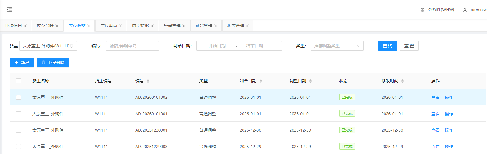
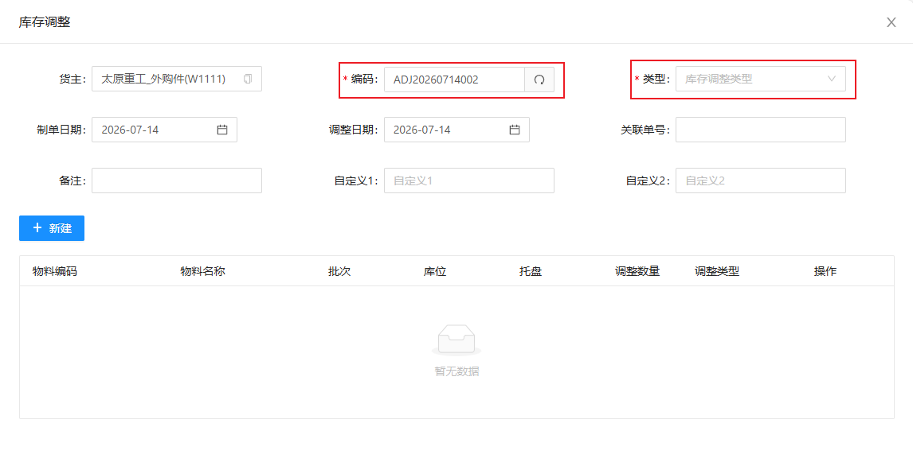
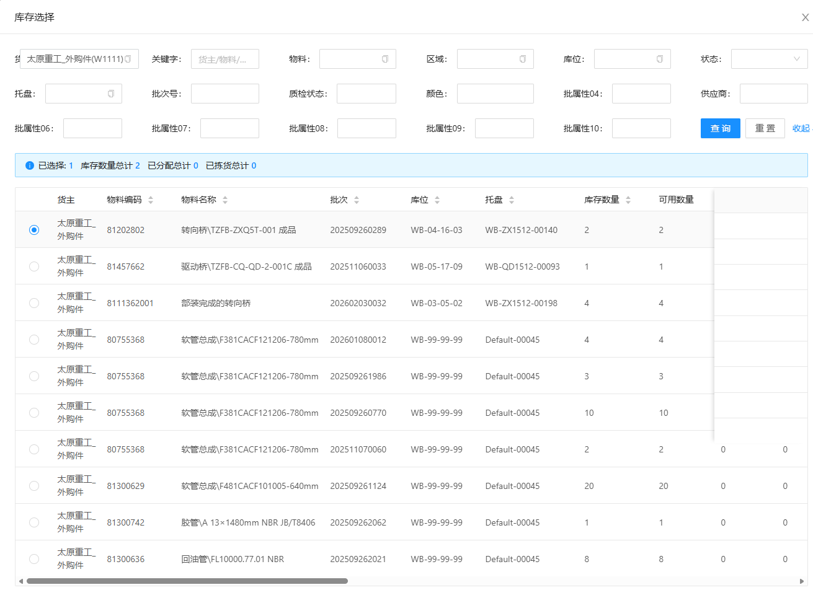

# 库存调整

查看/调整各物料，主要调整库存数量；包含新建、添加订单

## 查询/重置

可根据多个条件进行检索库存数据/重置所有查询条件

## 人工建立调整单

&nbsp;&nbsp;&nbsp;&nbsp;2.单据编码：单据编码（点击文本框右侧刷新 **自动生成** ）

&nbsp;&nbsp;&nbsp;&nbsp;3.调整类型：调整类型（根据实际情况选择类型）

### 添加调整物料

点击新建，生成一栏无数据调整明细

&nbsp;&nbsp;&nbsp;&nbsp;查询/重置：通过不同条件筛选需要调整的物料

&nbsp;&nbsp;&nbsp;&nbsp;输入实际数量，根据实际情况选择调整类型

