# 库存盘点

对各个区域，各个库位库存物料数据的统计

## 查询/重置

可根据多个条件进行检索库存数据/重置所有查询条件

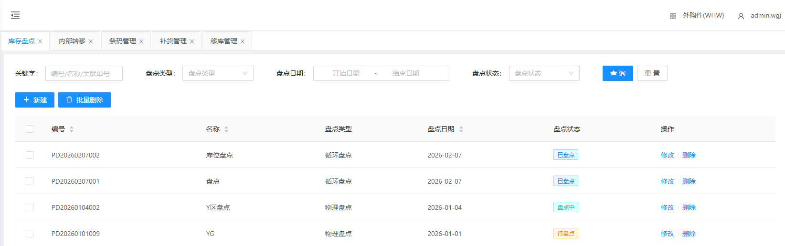

## 人工建立盘点单

&nbsp;&nbsp;&nbsp;&nbsp;单据编码：单据编码（点击文本框右侧刷新 **自动生成** ）

&nbsp;&nbsp;&nbsp;&nbsp;名称：物料名称

&nbsp;&nbsp;&nbsp;&nbsp;盘点类型：盘点类型（根据实际情况选择类型）

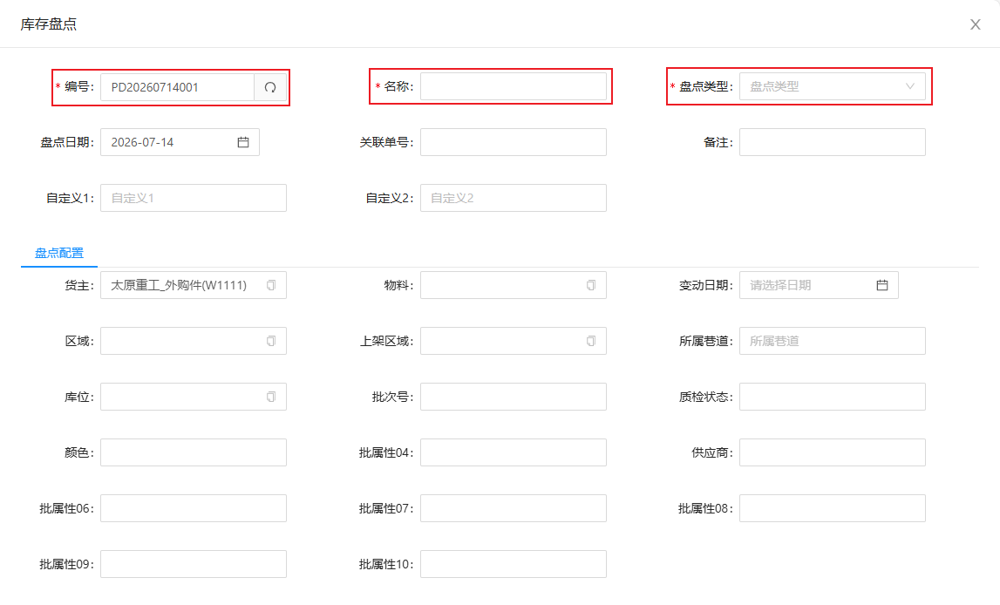

## 修改库存盘点信息

点击修改，可更改盘点单的信息

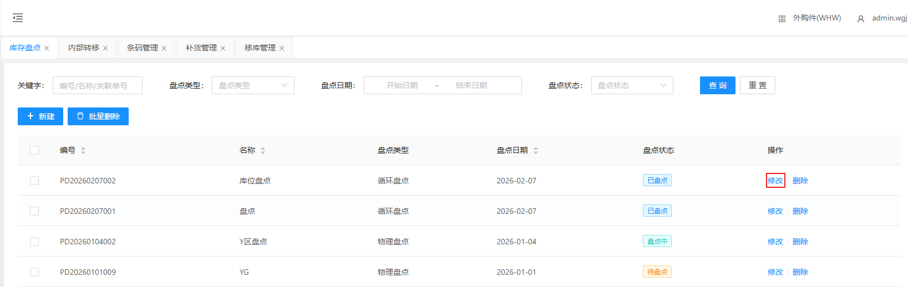

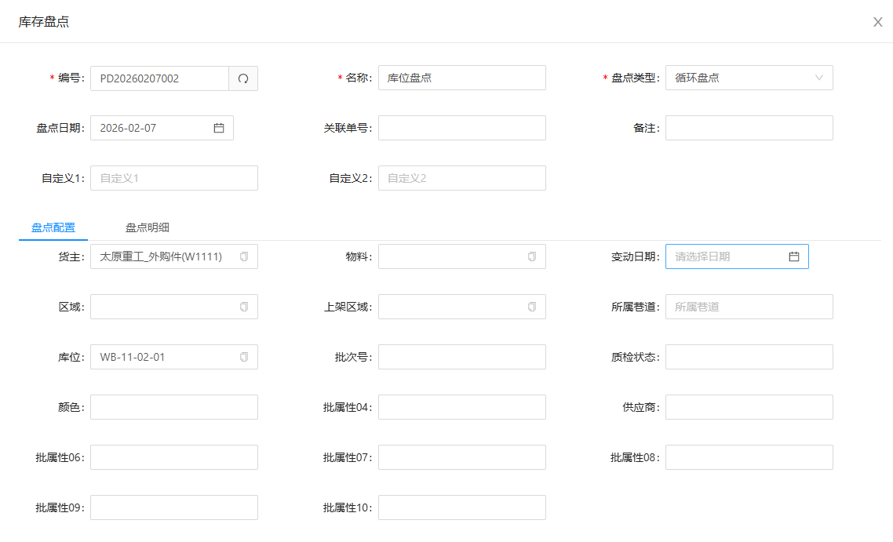

盘点配置的区域：增加区域选择可缩小盘点范围

出现此报错时，说明此库位的物料存在已分配、已拣货等情况，处理后即可盘点此区域

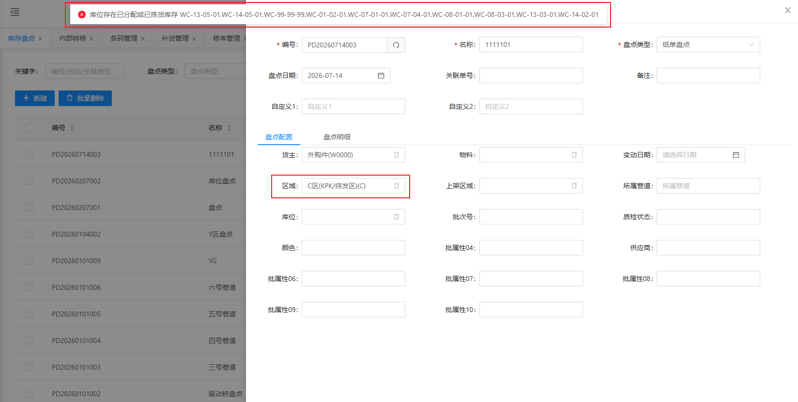

## 盘点单操作流程

&nbsp;&nbsp;&nbsp;&nbsp;1.动碰盘点：每天变化的库位盘点一次

&nbsp;&nbsp;&nbsp;&nbsp;2.循环盘点：每天实时入库的盘点

&nbsp;&nbsp;&nbsp;&nbsp;3.纸单盘点：限定区域限定范围盘点

&nbsp;&nbsp;&nbsp;&nbsp;4.物理盘点：出库数据的盘点

2.点击保存，保存盘点单

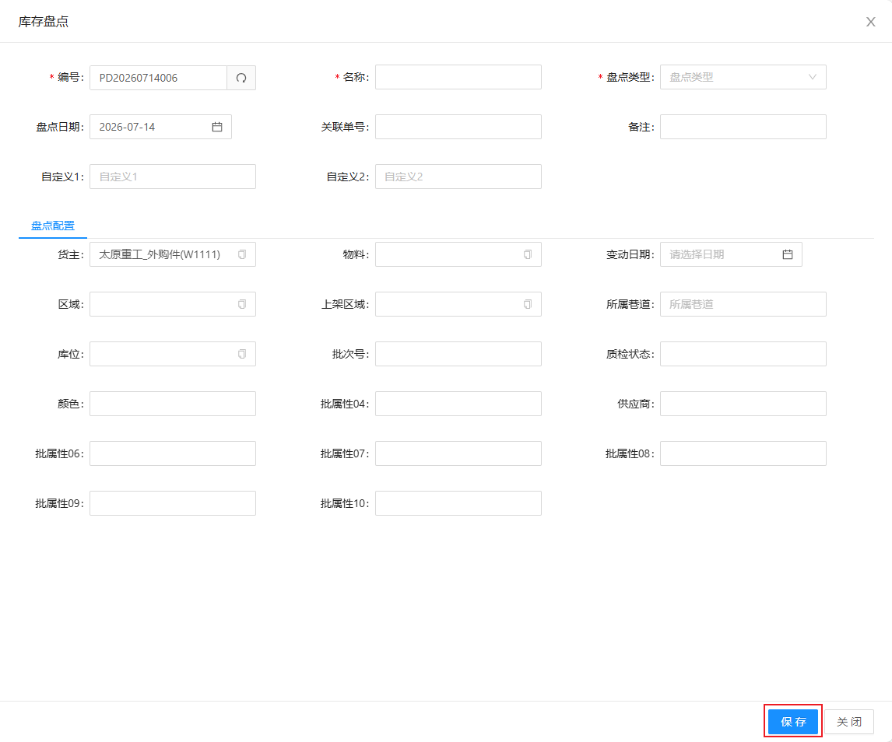

3.点击盘点单的开始

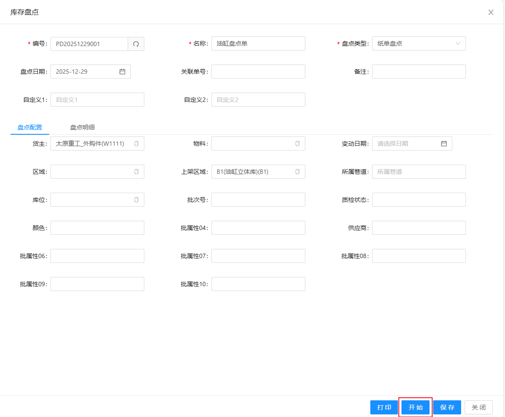

4.点击盘点明细的导出，导出需要盘点的物料信息，主要修改纸单盘点的盘点数量，盘点日期，盘点人。当新数据增加时，不需要增加编码和批次编码

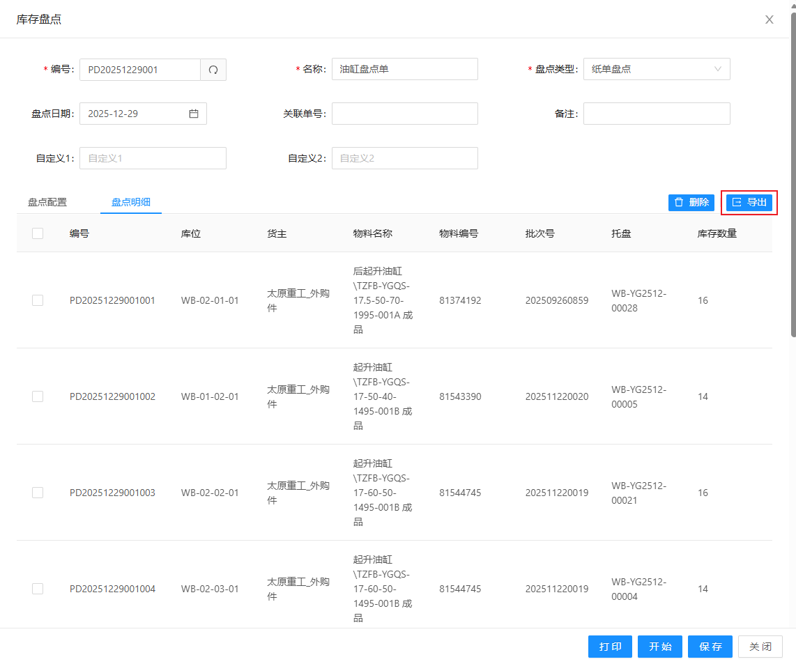

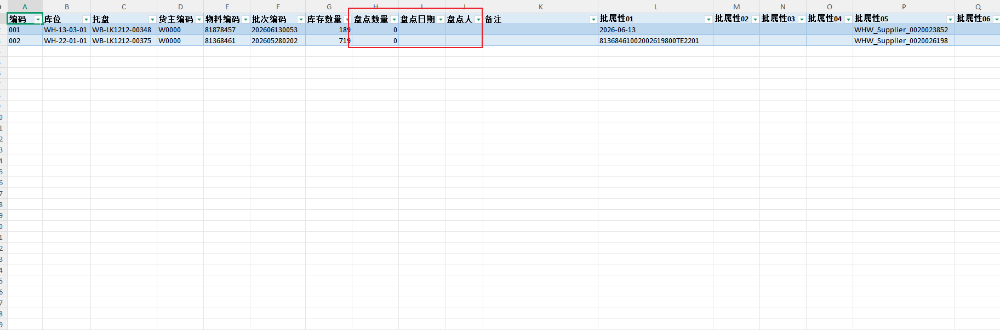

5.点击盘点明细的导入，将纸单盘点单的数据导入盘点明细，盘点状态是盘点中。

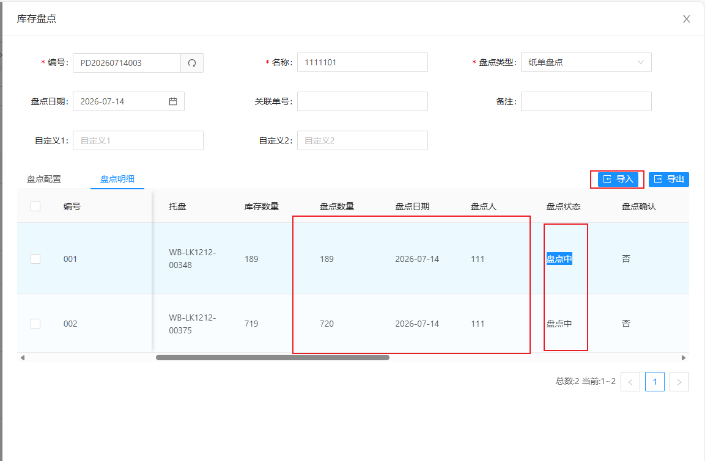

6.点击确认，盘点状态是已盘点。

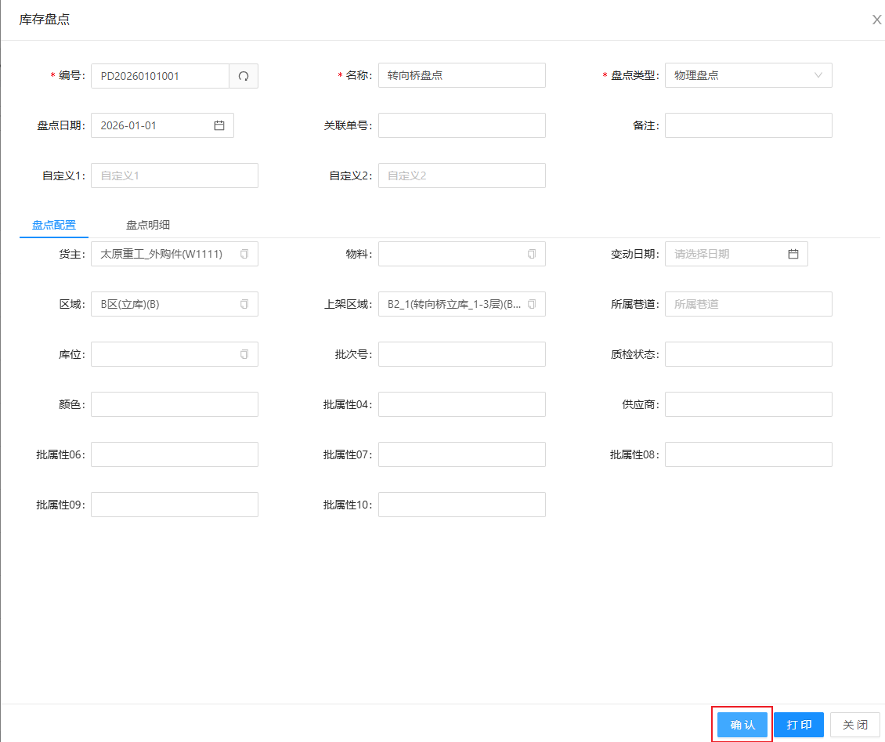

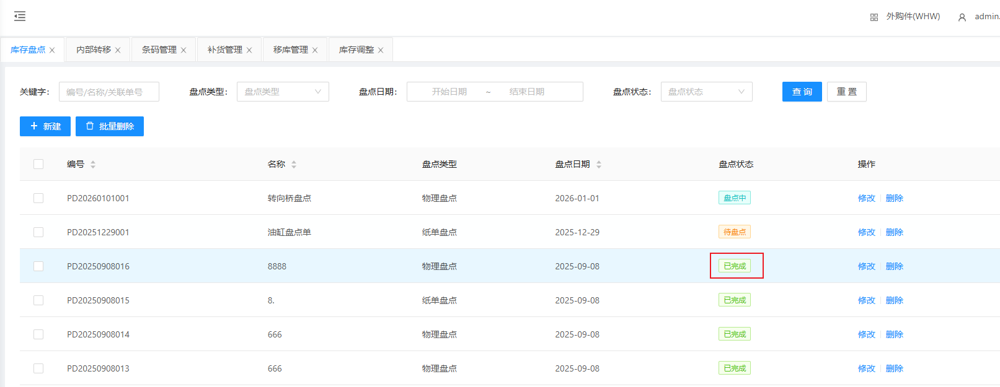

7.点击复核，盘点状态是已复核

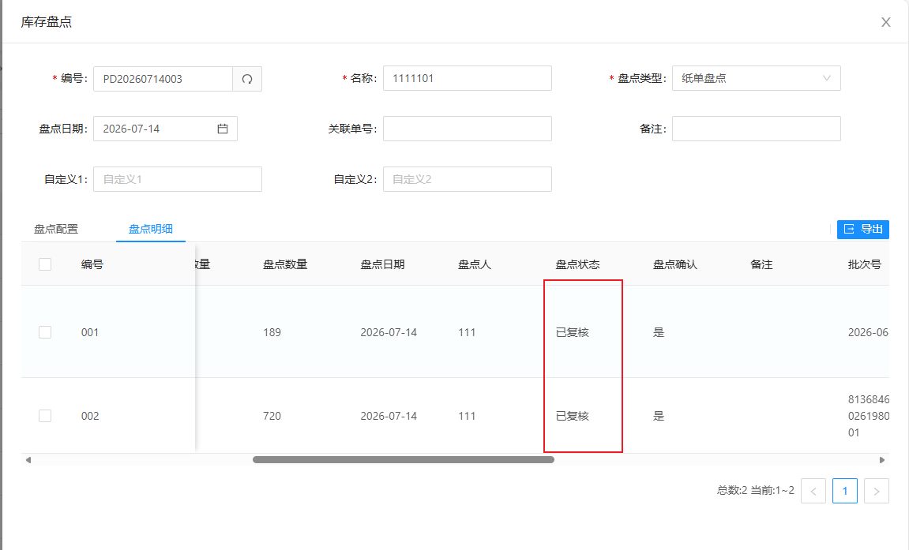

8.点击调整，会在库存调整中生成调整单

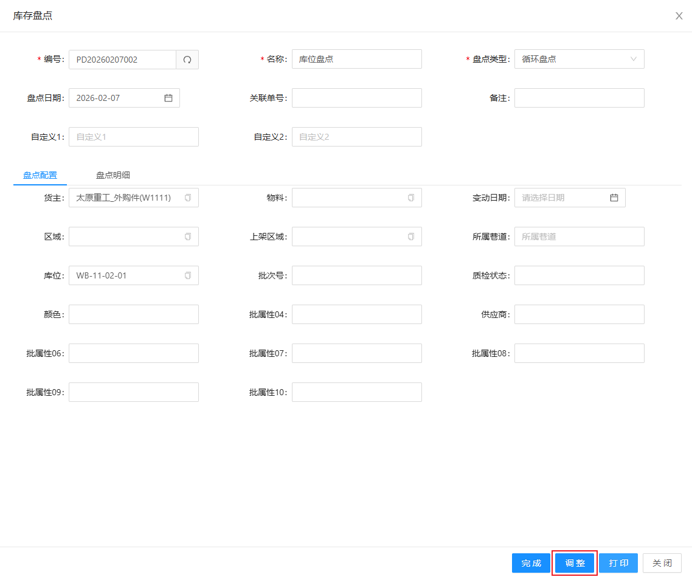

9.库存调整菜单点击确认调整，再回到盘点单，点击完成，完成此次纸单盘点操作。

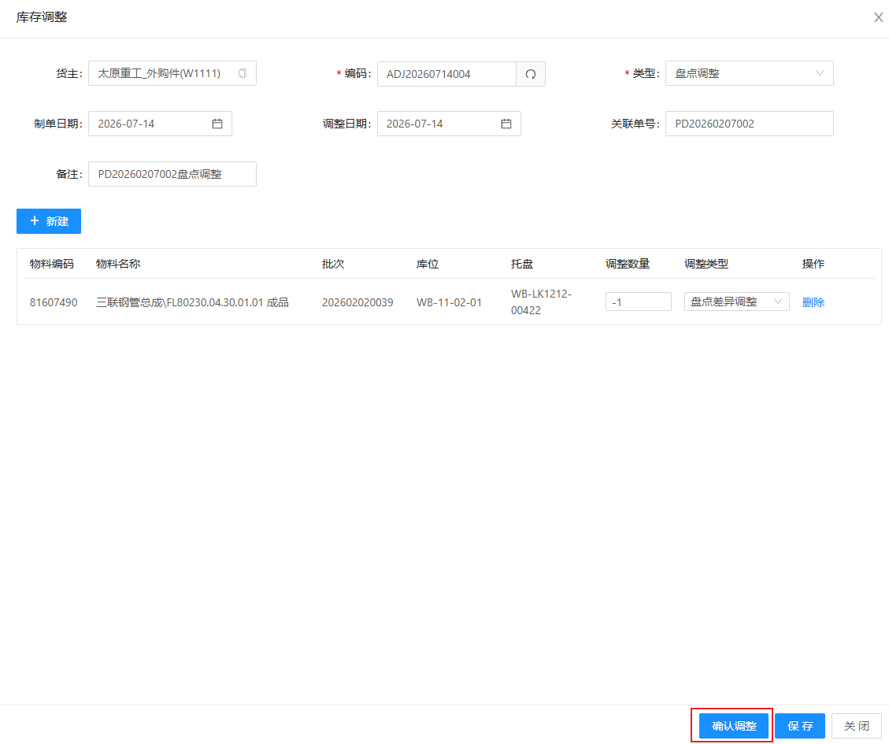

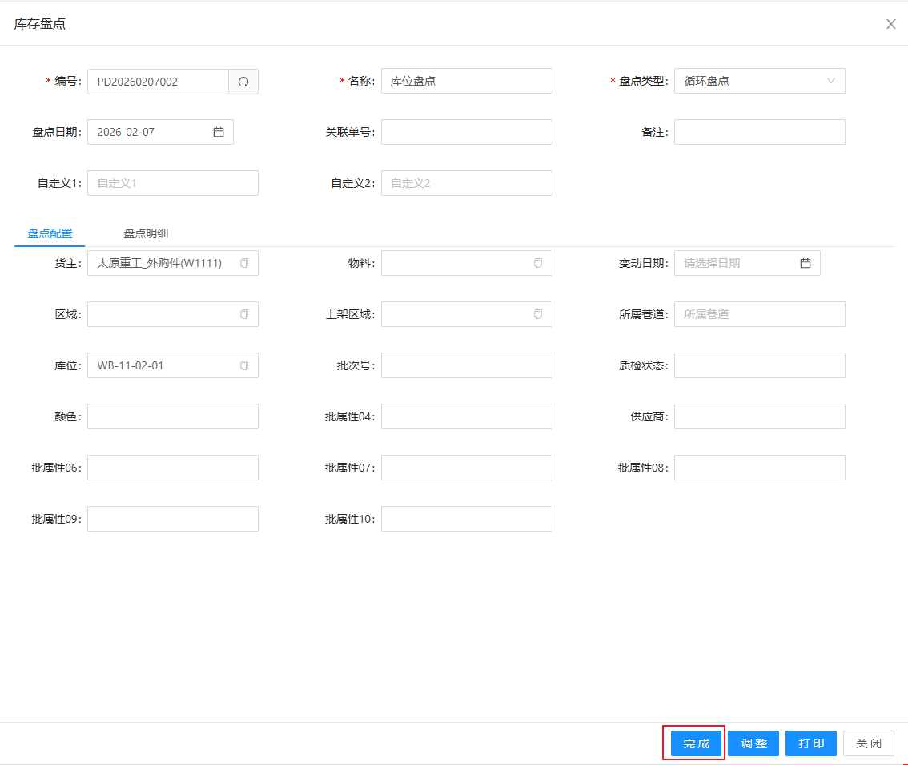