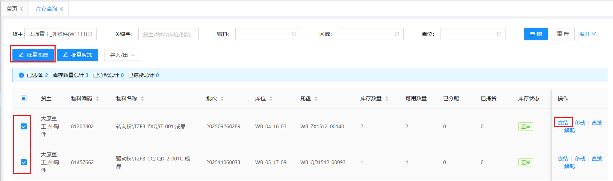
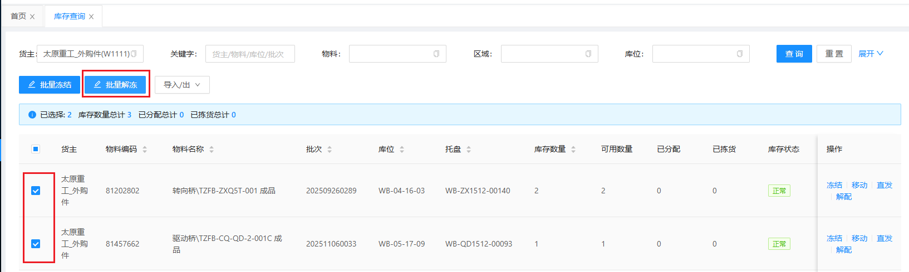
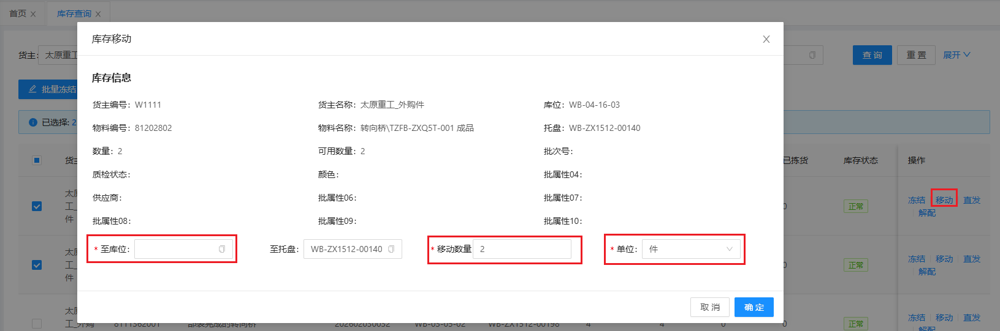
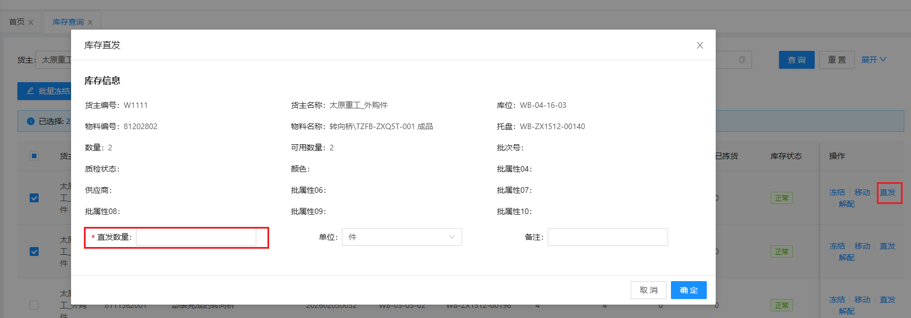
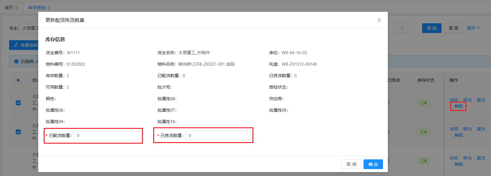

# 库存查询

查询物料信息都存在那些库位、托盘及物料状态(库存数量、可用数量、已分配)等数据，包含库存的批量冻结、冻结、批量解冻、移动、直发、解配

## 批量冻结/冻结

选择需要解冻的物料库存数据，点击批量冻结或点击操作下的冻结按钮，对物料进行冻结操作

## 批量解冻

选择需要解冻的物料库存数据，点击批量解冻按钮，对物料进行解冻操作

## 库存移动

&nbsp;&nbsp;&nbsp;&nbsp;1.至库位: 库存数据移动到的目标库位

&nbsp;&nbsp;&nbsp;&nbsp;2.至托盘: 库存数据移动到的目标托盘（ **默认当前托盘** ）

&nbsp;&nbsp;&nbsp;&nbsp;3.移动数量: 库存数据需要移动的数量

&nbsp;&nbsp;&nbsp;&nbsp;4.单位：库存数据移动的单位

## 库存直发

&nbsp;&nbsp;&nbsp;&nbsp;1.直发数量：库存数据需要直发的数量

&nbsp;&nbsp;&nbsp;&nbsp;2.单位：库存数据直发的单位

## 库存解配

当库存数据存在已分配、已拣货数据时，可进行库存解配操作

&nbsp;&nbsp;&nbsp;&nbsp;1.已配货数量：库存数据需要解配已配货的数量

&nbsp;&nbsp;&nbsp;&nbsp;2.已拣货数量：库存数据需要解配已配货的数量

