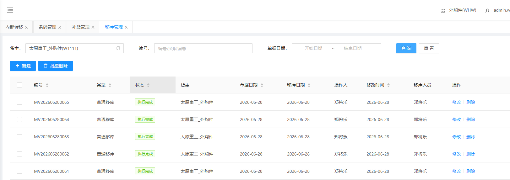
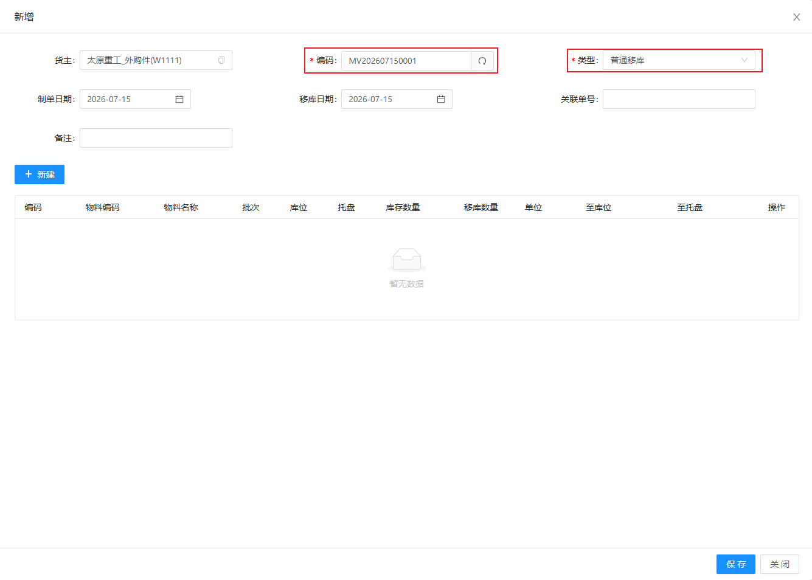
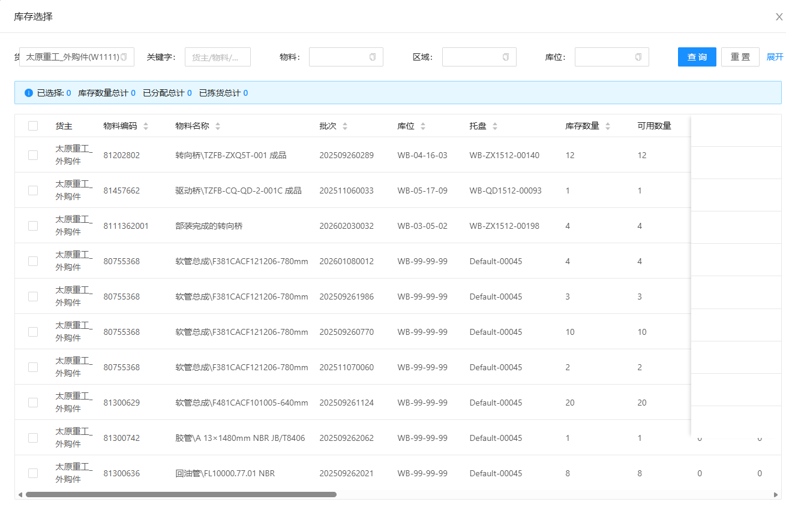
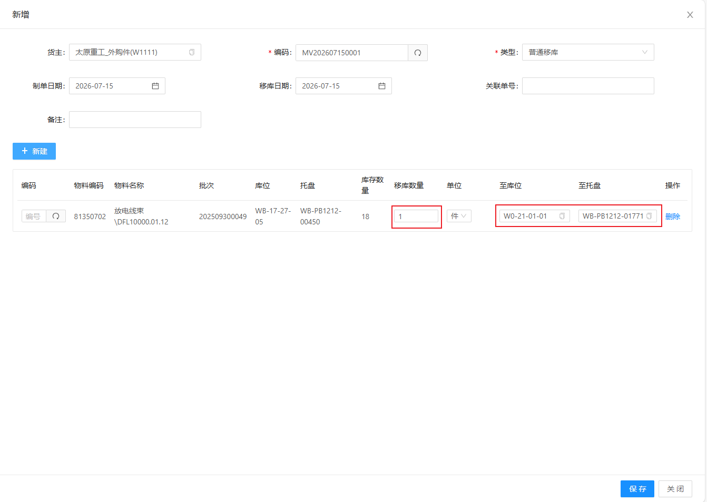
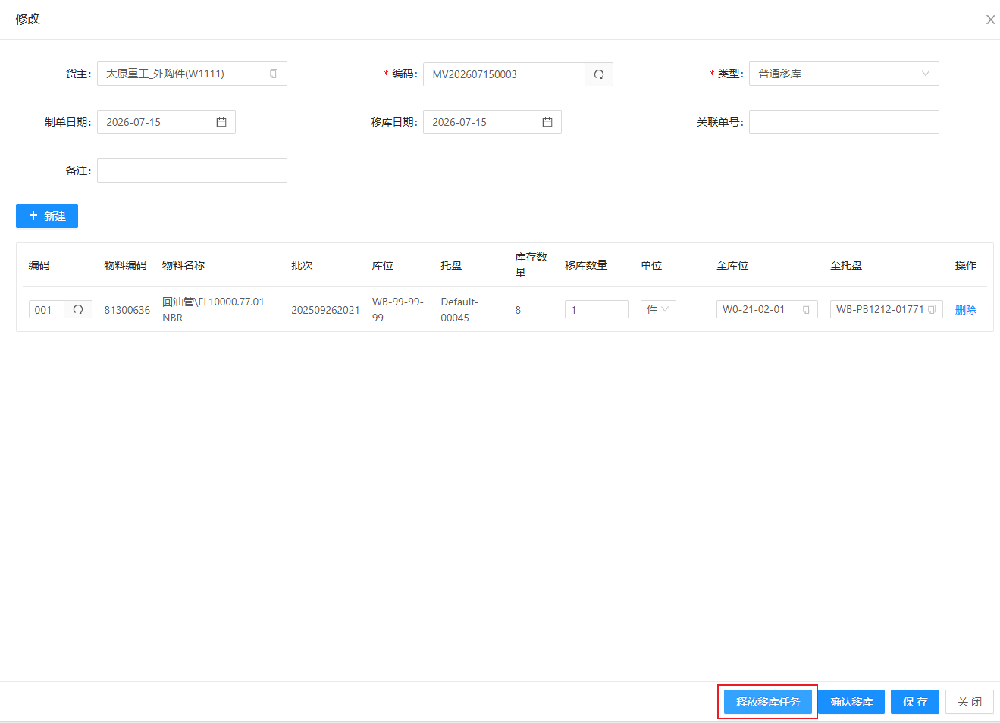
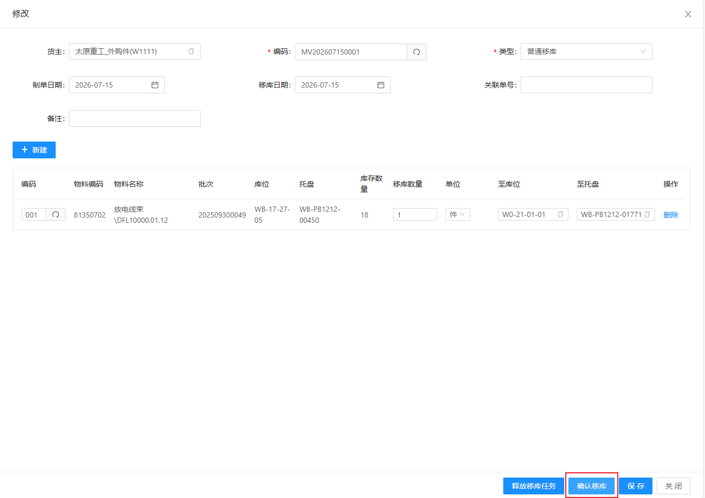

# 移库管理

显示不同移库状态的移库单，根据实际情况添加移库单；包含新建移库单、添加移库物料

## 查询/重置

可根据多个条件进行检索库存数据/重置所有查询条件

## 人工建立移库单

&nbsp;&nbsp;&nbsp;&nbsp;单据编码：单据编码（点击文本框右侧刷新 **自动生成** ）

&nbsp;&nbsp;&nbsp;&nbsp;类型：移库类型（根据实际情况选择类型）

### 添加移库物料

1.点击新建，生成一栏无数据移库明细

2.选择需要移库的物料，填写需要移至的库位、托盘信息，点击保存

3.在任务栏中找到对应任务，点击操作，点击释放移库任务，即可开始移库操作

4.待移库完成后，点击确认移库，任务显示已完成

