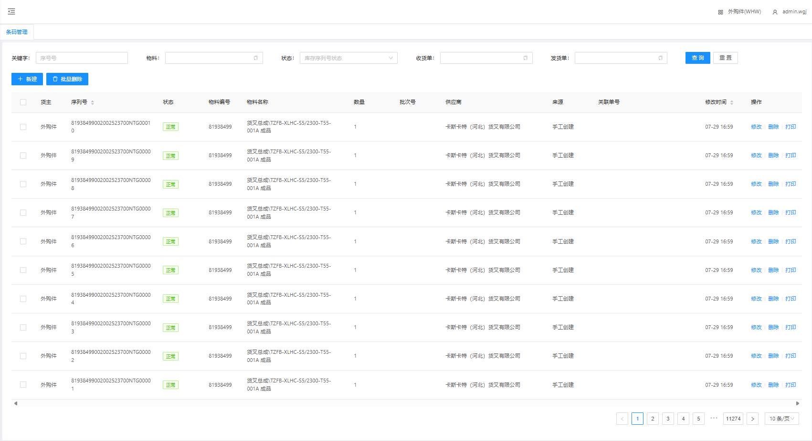
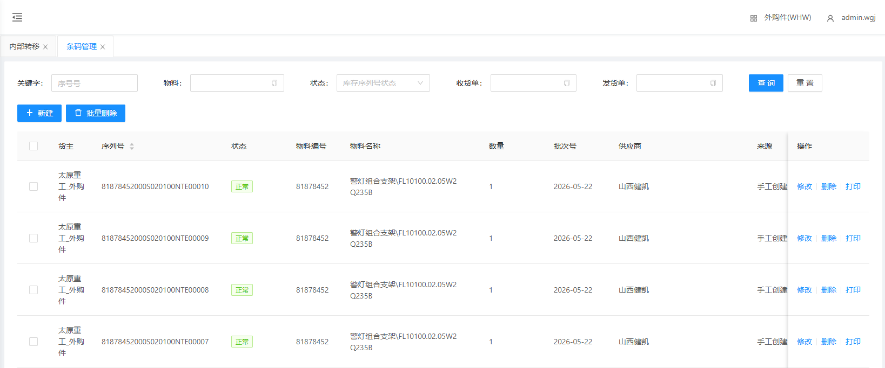
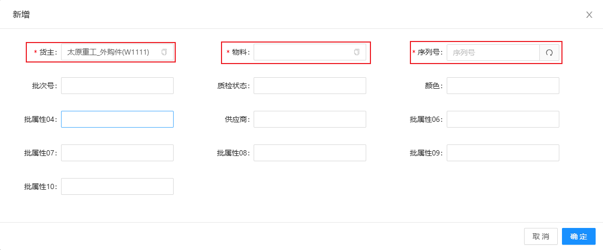
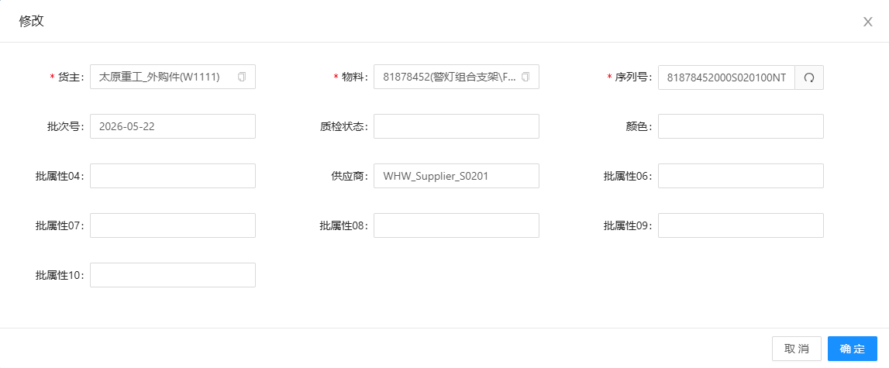
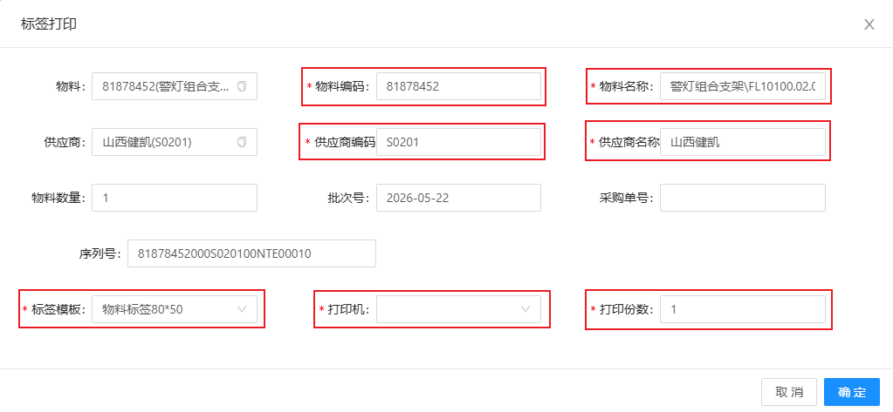

# 条码管理

显示各个物料的不同批次号下的条码数据；包含新建、修改条码单

## 查询/重置

可根据多个条件进行检索库存条码数据/重置所有查询条件

## 人工建立条码单

&nbsp;&nbsp;&nbsp;&nbsp;.货主：货主（默认显示当前货主）

&nbsp;&nbsp;&nbsp;&nbsp;物料：物料名称

&nbsp;&nbsp;&nbsp;&nbsp;单据编码：单据编码（点击文本框右侧刷新 **自动生成** ）

## 修改物料条码单

点击修改，可修改物料的条码货主信息、物料名称等

## 打印条码单

选择需要打印条码单的物料，点击打印，选择相应的物料编码和名称

