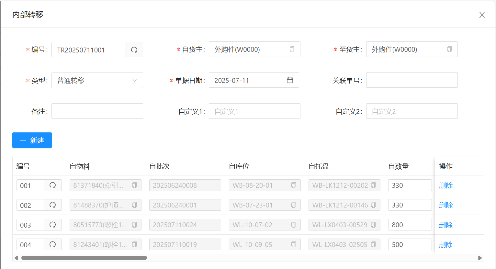

# 内部转移

功能路径： WMS -> 库存管理 -> 内部转移

## 功能介绍

* 内部转移主要作用是变更库存物料的货主/编号/批次属性等

1. 变更货主
2. 变更物料
3. 变更物料批次属性

## 使用场景

1. 变更货主：当物料的货权从一个货主转移至另一个货主的时候

比如：以公司为维度的货主，当前物料在A子公司转移至B公司管理

2. 变更物料：当物料编码需要变更成新的物料编码的时候

比如：在收货入库的时候，仓库人员输入了错误的物料编号，需要换成新的物料编码

3. 变更物料批次属性：当物料的某一个属性需要更新的时候使用

比如：批次号，收货日期，生产日期等物料属性变更

## 功能操作

1. 列表操作

【查询】：查询单据

【新建】：新建单据

【修改】：修改/查看单据

【删除】：删除单据

2. 单据操作

【新建】：新增要内部转移的库存记录

【删除】：删除要内部转移的库存记录

【保存】：保存单据

【执行转移】：执行内部转移操作，变更库存数据属性

【打印】：打印单据

【关闭】：关闭单据编辑界面

## 属性介绍

### 单据属性

|名称|说明|备注|
|-------|----|----|
|编号|单据编号|根据编码规则自动生成|
|自货主|要变更库存的原货主||
|至货主|要变更库存的实际目标货主|如果货主不变更的话,自货主与至货主选为同一值|
|类型|选择单据类型||
|单据日期 |选择单据日期||

### 单据明细属性

|名称|说明|备注|
|----|----|----|
|编号|单据明细行号||
|自**|原库存信息||
|至**|要变更的真实数据|输入要变更信息，如果有些属性不变化。要与原值一至|