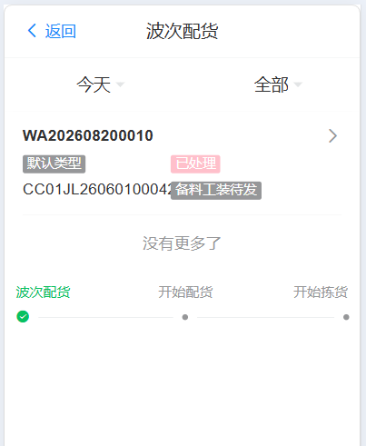
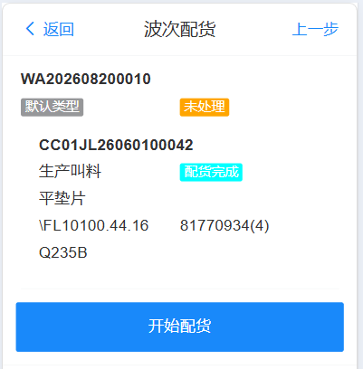
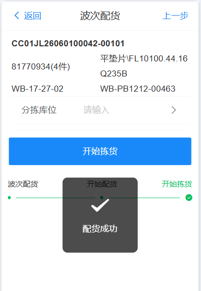
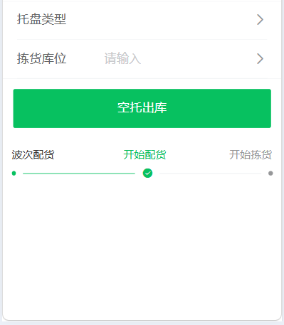

# 波次配货

将多个相同类型物料的发货单进行同一波次配货拣货流程

## 配货

&nbsp;&nbsp;&nbsp;&nbsp;点击开始配货，选择分拣库位进行拣货

&nbsp;&nbsp;&nbsp;&nbsp;分拣库位：根据发货单实际需求在拣货库位中拣货出需要物料数量

&nbsp;&nbsp;&nbsp;&nbsp;根据实际情况选择相应类型托盘，输入拣货库位后呼叫空托盘至库位

&nbsp;&nbsp;&nbsp;&nbsp;拣货库位：根据发货单进行拣货，物料全部拣货后，拣货数量一般大于需要数量

