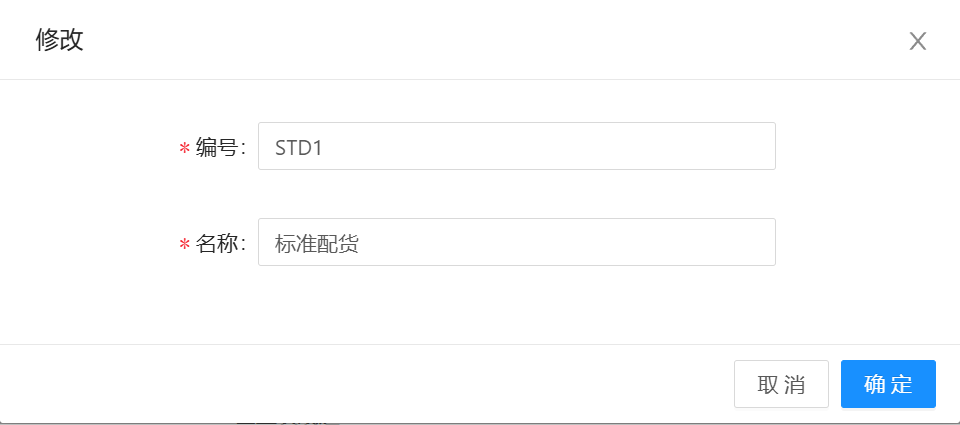
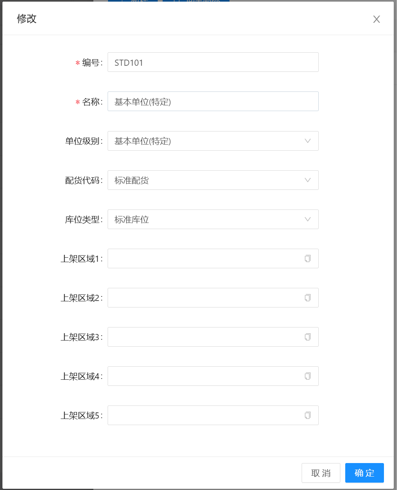

# 发货策略

## 主信息

物料或者托盘出库/发货时的策略定义，包含 新增、修改、删除、明细功能

编号：STD + 顺序号（或其他规则，编号不能重复）

名称：描述信息

## 明细

发货策略的明细定义，物料或托盘出库（发货）时的条件，可以存在多条明细，当第1条不满足时，进行第2条检索，以此类推

编号：发货策略编号 + 顺序号

名称：描述信息

单位级别：

&nbsp;&nbsp;&nbsp;&nbsp;1.基本单位：  

&nbsp;&nbsp;&nbsp;&nbsp;2.二级单位：

&nbsp;&nbsp;&nbsp;&nbsp;3.三级单位：

&nbsp;&nbsp;&nbsp;&nbsp;4.四级单位：

&nbsp;&nbsp;&nbsp;&nbsp;5.基本单位(特定)：

配货代码：
&nbsp;&nbsp;&nbsp;&nbsp;1.标准配货： 在发货时，根据发货数量进行发货。如发货数量20个，发货的托盘上有100个，在发完货后，托盘会退回到原位，托盘上的物料会减少为80个

&nbsp;&nbsp;&nbsp;&nbsp;2.单位配货：

&nbsp;&nbsp;&nbsp;&nbsp;3.整托配货(单托)：在发货时不管需要发货数量的多少，直接发一整托。如发货数量20个，发货的托盘上有100个，发完货后，托盘上的物料会全部清空。同样，发货数量200个，也只会发货一整托（数量随意）

&nbsp;&nbsp;&nbsp;&nbsp;4.整托配货(多托)：在发货时根据需要，一次发多托货。如发货数量25，有两托物料都装有数量为20的托盘，则会一次性发两托物料，托盘到指定地方后，托盘绑定的物料全部清空。

&nbsp;&nbsp;&nbsp;&nbsp;5.整托配货(订单)：

库位类型：发货所需物料/托盘 所在库位类型

上架区域1-5：发货所需物料/托盘 所属的区域

