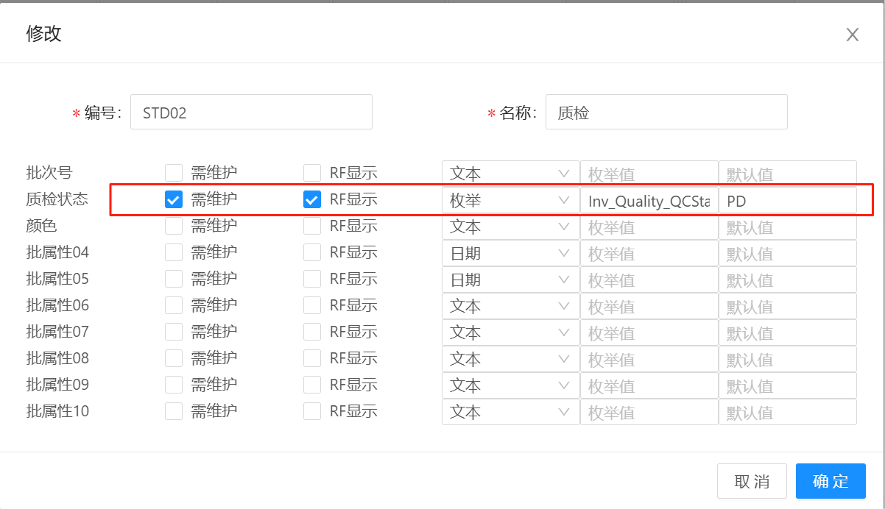
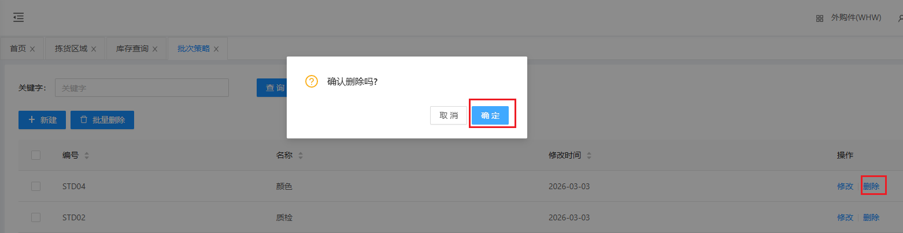

# 批次策略

物料入库/上架时批次相关的策略定义，包含 新增、修改、删除功能，配合收货时使用

## 新增/修改

&nbsp;&nbsp;&nbsp;&nbsp;1.编号：STD + 顺序号（或其他规则，编号不能重复）

&nbsp;&nbsp;&nbsp;&nbsp;2.名称：描述信息

&nbsp;&nbsp;&nbsp;&nbsp;3.批次信息：例如质检状态，需要进行收货维护信息时，将红色区域勾选上

## 删除

点击操作表头下的删除按钮，进行删除操作

