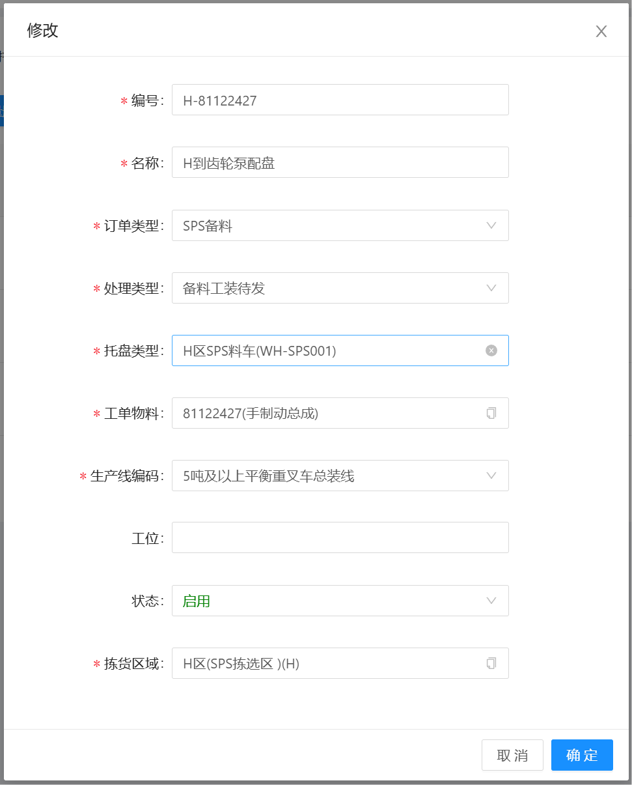
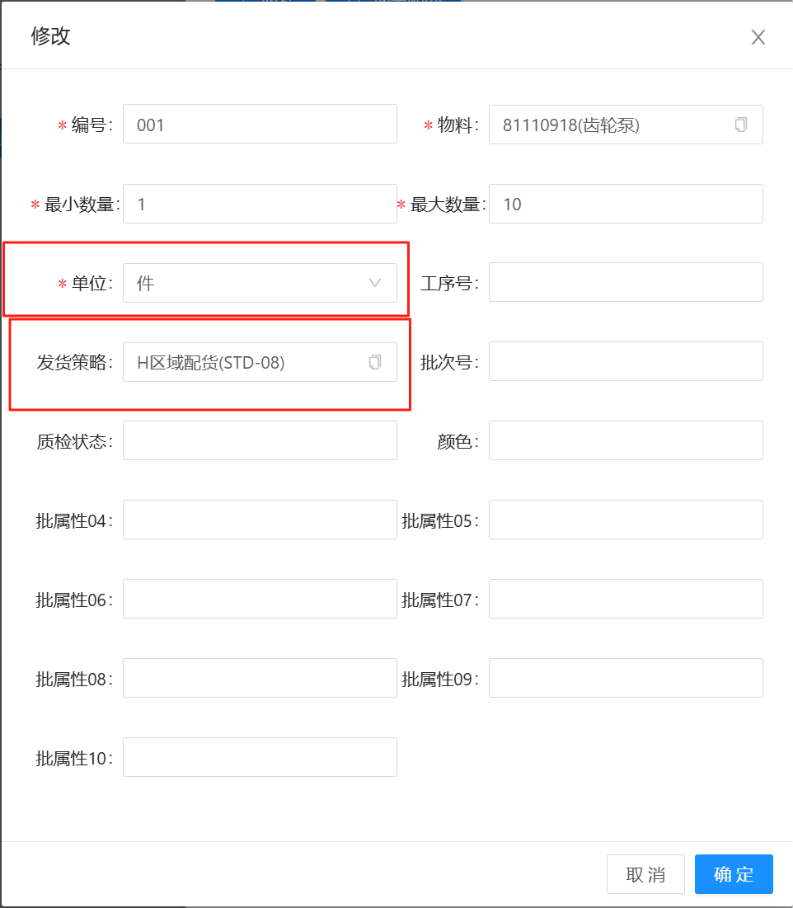
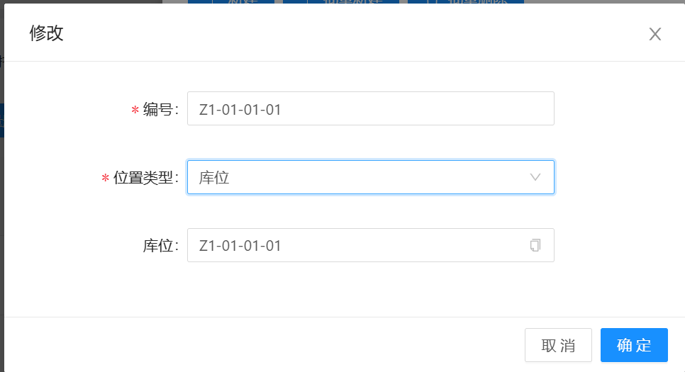
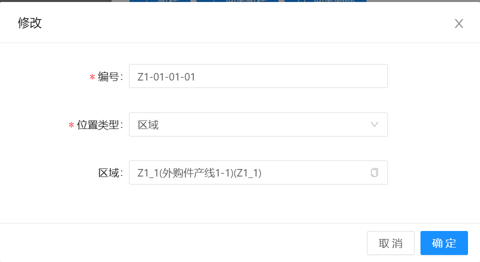

# 配盘策略

物料进行发货时，当没有使用MOM对接，直接由WMS系统触发发货时，则需要配盘，包含新增，修改，删除，物料，库位功能

## 主信息

编号：STD + 顺序号（或其他规则，编号不能重复）

名称：描述信息

订单类型：生成的发货单类型

托盘类型：拣选需要放置的最终的托盘类型

工单物料：拣选配盘后的总成物料

生产线编码：发货的最终产线

拣货区域：在哪个区域拣货

## 物料

配盘中的物料信息，由一至多个物料组成新的配盘信息

编号：配盘策略编号 + 顺序号（或其他规则）

物料：配盘的物料信息

最小数量：默认为1

最大数量：根据配盘的实际需要设置

发货策略：在发货策略中配置

## 库位

物料最终发货的位置，可按照库位或者区域选择

  
   

&nbsp;