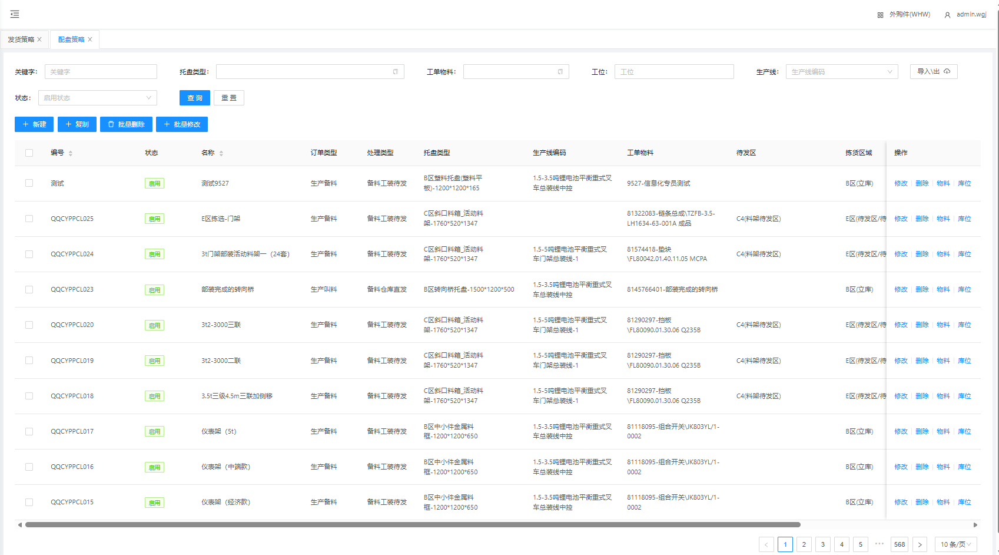
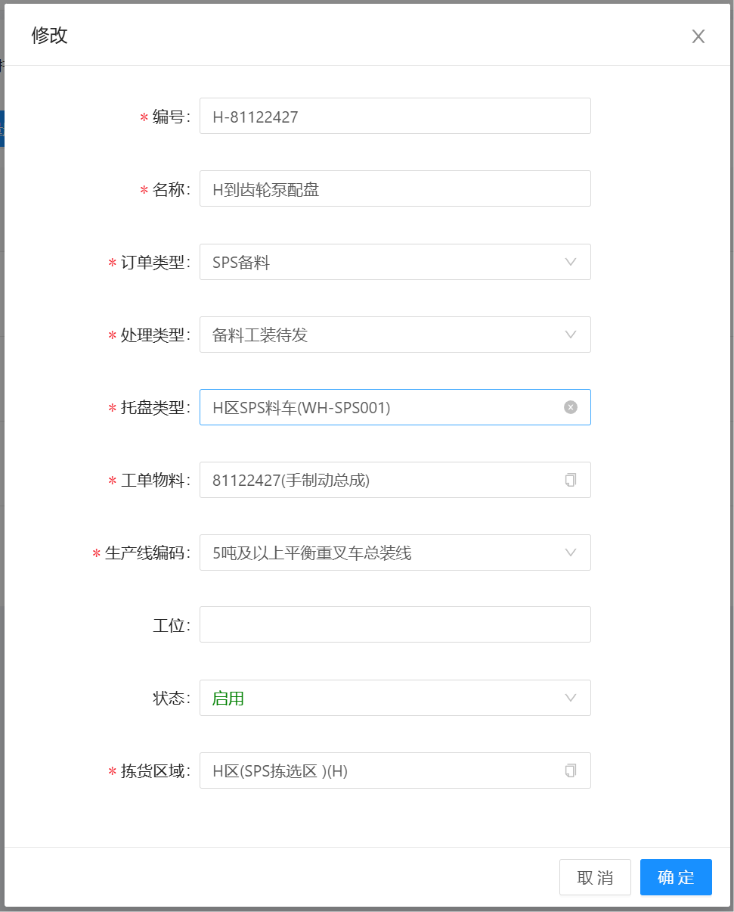
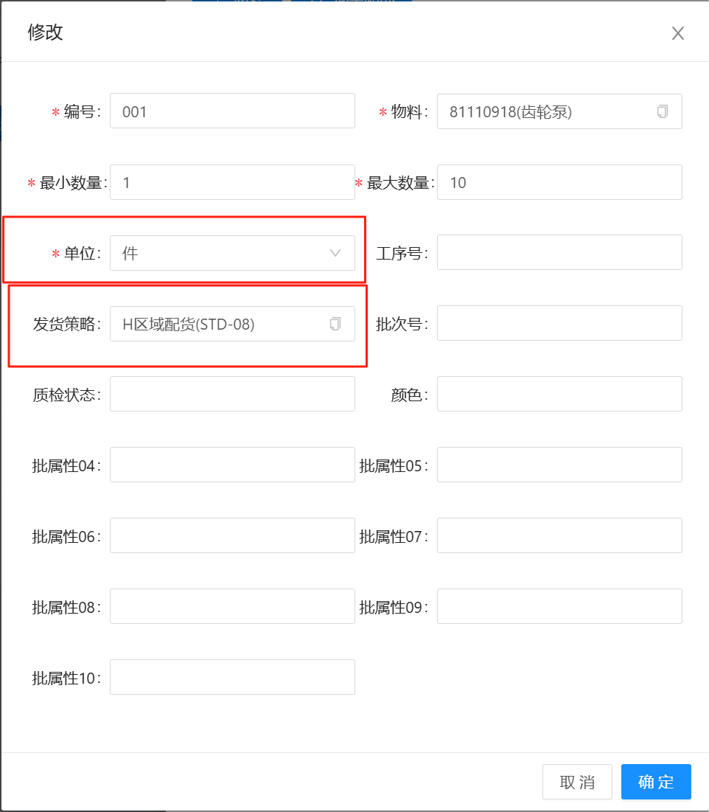
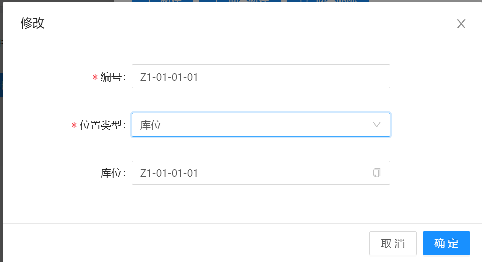
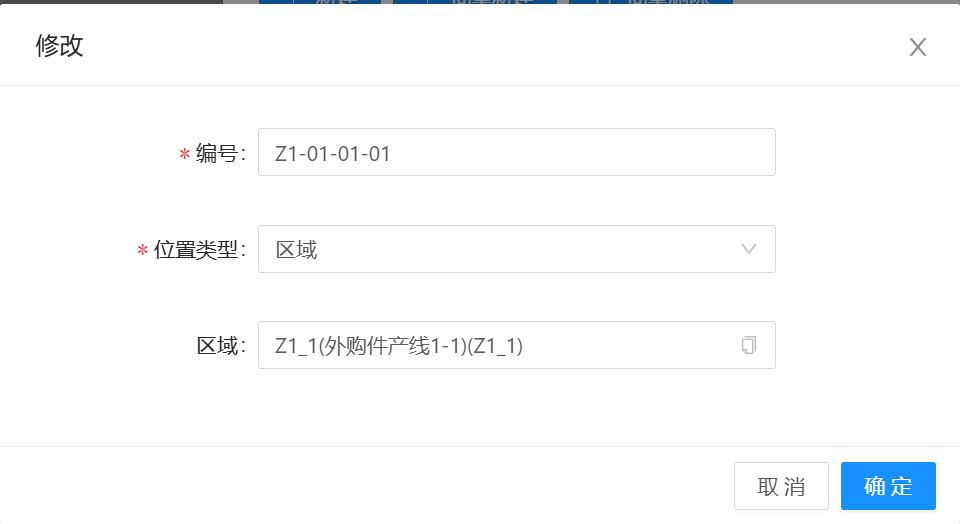

# 配盘策略

物料进行发货时，当没有使用MOM对接，直接由WMS系统触发发货时，则需要配盘，包含新增，修改，删除，物料，库位功能

## 新增/修改

&nbsp;&nbsp;&nbsp;&nbsp;1.编号：STD + 顺序号（或其他规则，编号不能重复）

&nbsp;&nbsp;&nbsp;&nbsp;2.名称：描述信息

&nbsp;&nbsp;&nbsp;&nbsp;3.订单类型：生成的发货单类型

&nbsp;&nbsp;&nbsp;&nbsp;4.托盘类型：拣选需要放置的最终的托盘类型

&nbsp;&nbsp;&nbsp;&nbsp;5.工单物料：拣选配盘后的总成物料

&nbsp;&nbsp;&nbsp;&nbsp;6.生产线编码：发货的最终产线

&nbsp;&nbsp;&nbsp;&nbsp;7.拣货区域：在哪个区域拣货

## 物料

配盘中的物料信息，由一至多个物料组成新的配盘信息

&nbsp;&nbsp;&nbsp;&nbsp;1.编号：配盘策略编号 + 顺序号（或其他规则）

&nbsp;&nbsp;&nbsp;&nbsp;2.物料：配盘的物料信息

&nbsp;&nbsp;&nbsp;&nbsp;3.最小数量：默认为1

&nbsp;&nbsp;&nbsp;&nbsp;4.最大数量：根据配盘的实际需要设置

&nbsp;&nbsp;&nbsp;&nbsp;5.发货策略：在发货策略中配置

## 库位

物料最终发货的位置，可按照库位或者区域选择

  
   

&nbsp;