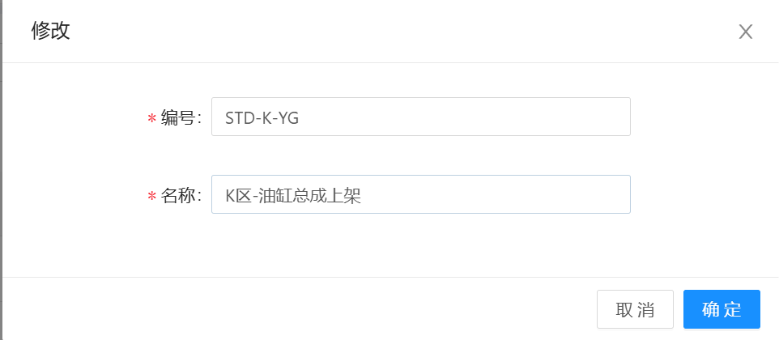
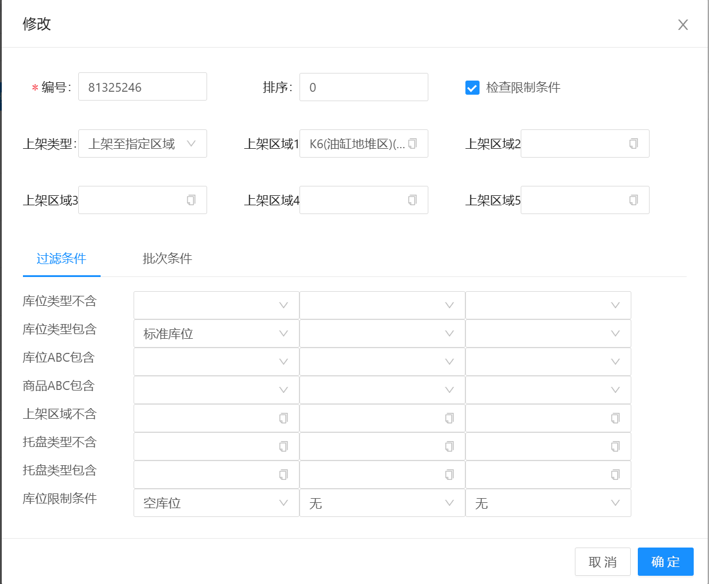

# 上架策略

物料或者托盘上架/入库时的策略定义，包含 新增、修改、删除、明细功能

## 主信息

编号：STD + 顺序号（或其他规则，编号不能重复）

名称：描述信息

## 明细信息

上架明细信息，对上架的规则进行维护，可存在多条，按照顺序对物料/托盘上架位置进行检索，得到满足条件的库位信息

编号：上架策略编号 + 顺序号

排序：排序号（入库时根据排序，检索排序）

上架类型：上架的模式，一般使用 指定区域或指定库位（此两项需要选择区域或货位）

过滤条件：针对于库位，托盘，物料的限制条件，需勾选右上角的“检查限制条件”选择框，

