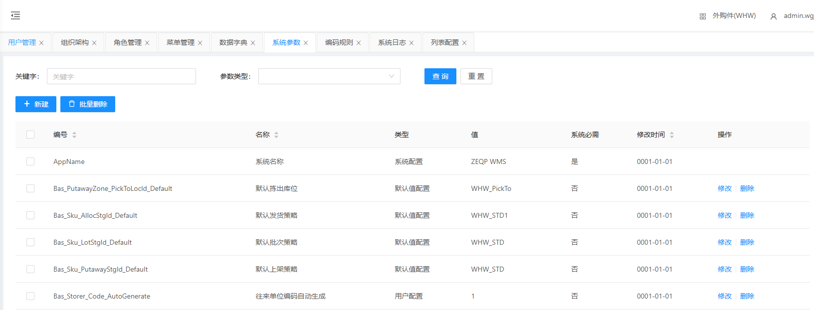
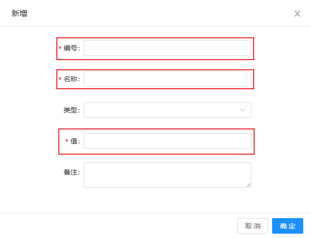
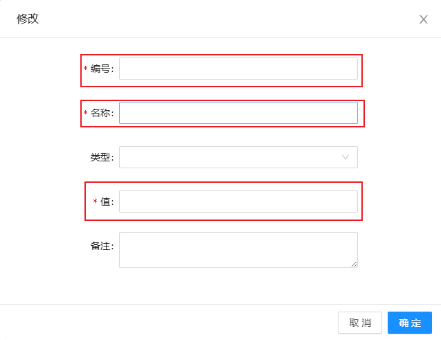

# 系统参数

显示不同名称不同编号的类型、值、系统是否必须和修改时间

## 查询/重置

可根据多个条件进行检索系统参数数据/重置所有查询条件

## 新建系统参数

点击新建

&nbsp;&nbsp;&nbsp;&nbsp;编号：编号（根据实际情况填写）

&nbsp;&nbsp;&nbsp;&nbsp;名称：名称（根据实际情况填写）

&nbsp;&nbsp;&nbsp;&nbsp;值：值（根据实际情况填写）

## 修改系统参数

点击修改

&nbsp;&nbsp;&nbsp;&nbsp;编号：编号（根据实际情况填写）

&nbsp;&nbsp;&nbsp;&nbsp;名称：名称（根据实际情况填写）

&nbsp;&nbsp;&nbsp;&nbsp;值：值（根据实际情况填写）

