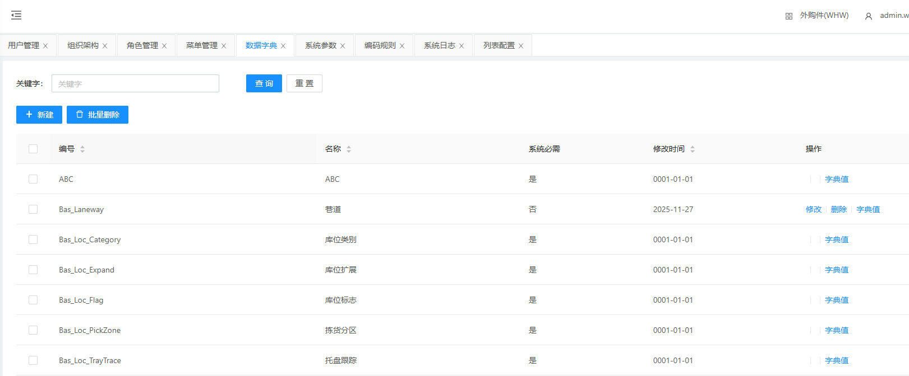
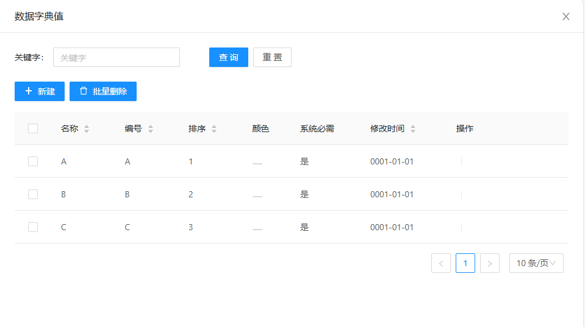
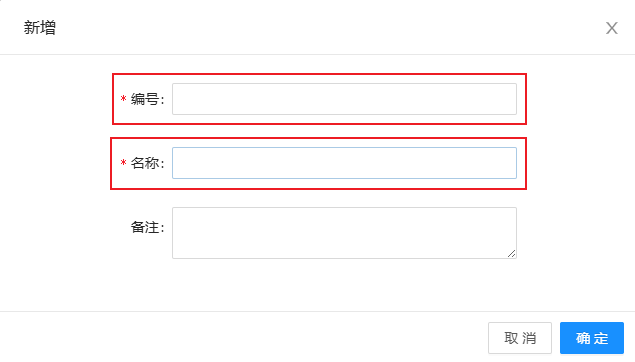
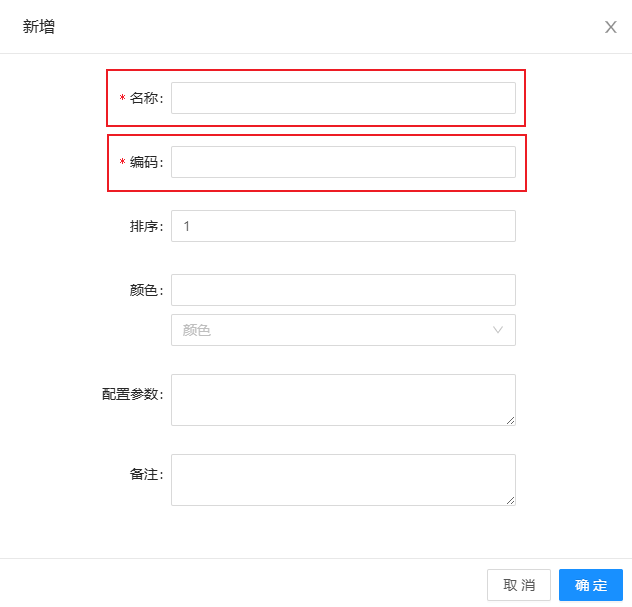

# 数据字典

显示不同名称不同编号的数据字典，包含数据字典的修改、删除、字典值

## 查询/重置

可根据多个条件进行检索数据字典数据/重置所有查询条件

## 新建数据字典

&nbsp;&nbsp;&nbsp;&nbsp;编号：编号（根据实际情况填写）

&nbsp;&nbsp;&nbsp;&nbsp;名称：名称（根据实际情况填写）

## 字典值

点击字典值，可查看字典值

&nbsp;&nbsp;&nbsp;&nbsp;编号：编号（根据实际情况填写）

&nbsp;&nbsp;&nbsp;&nbsp;名称：名称（根据实际情况填写）

### 新建字典值

点击新建，可新建字典值

