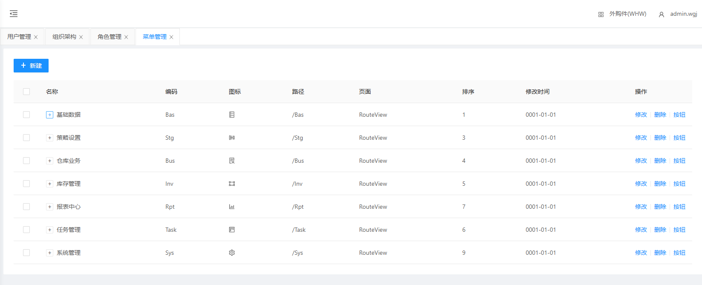
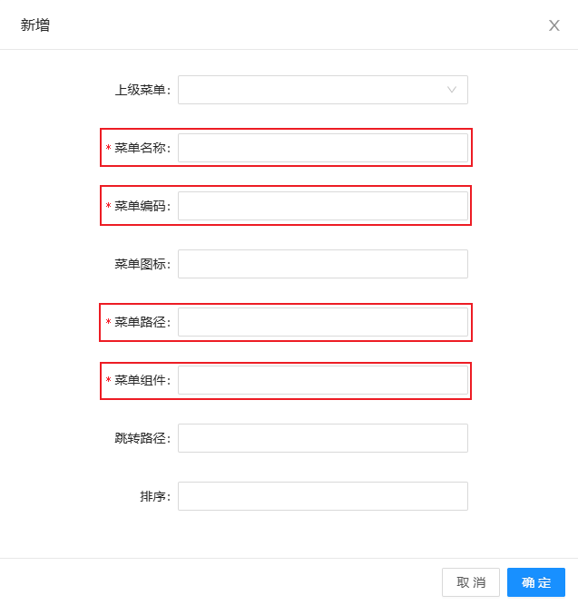
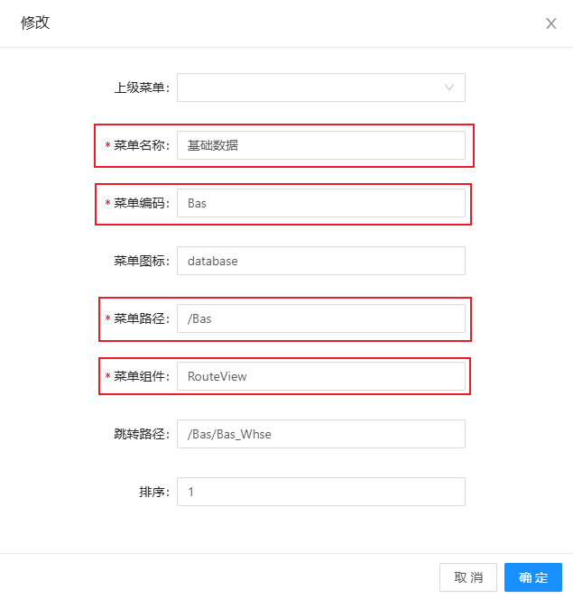
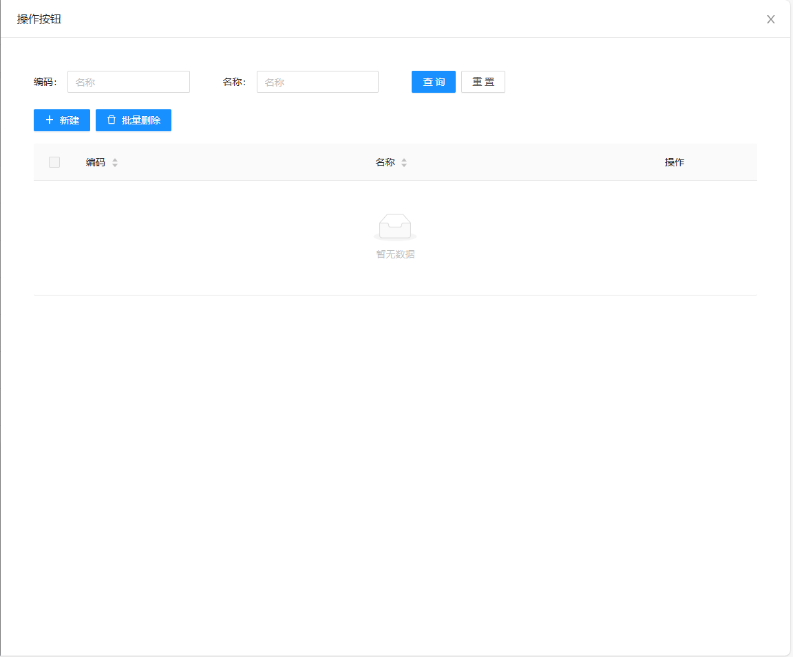
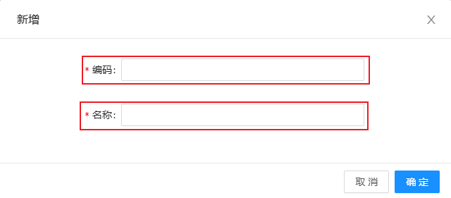

# 菜单管理

显示左边菜单的编码、图标、路径、页面、排序和修改时间

## 新建菜单

点击新建

&nbsp;&nbsp;&nbsp;&nbsp;菜单名称：菜单名称（根据实际情况填写）

&nbsp;&nbsp;&nbsp;&nbsp;菜单编码：菜单编码

&nbsp;&nbsp;&nbsp;&nbsp;菜单路径：菜单路径（根据实际情况填写）

&nbsp;&nbsp;&nbsp;&nbsp;菜单组件：菜单组件（根据实际情况填写）

## 修改菜单

点击修改，可修改菜单

## 添加菜单按钮

点击按钮，点击新建，可添加菜单按钮

&nbsp;&nbsp;&nbsp;&nbsp;编码：编码（根据实际情况填写）

&nbsp;&nbsp;&nbsp;&nbsp;名称：名称（根据实际情况填写）

