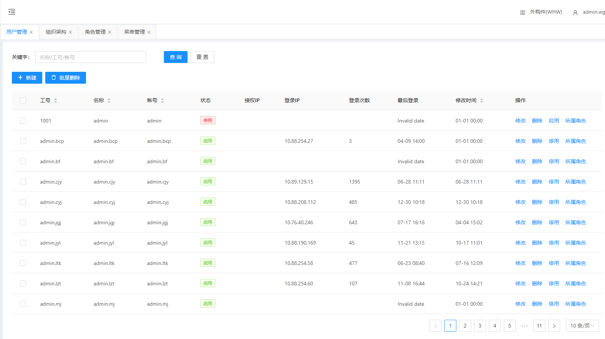
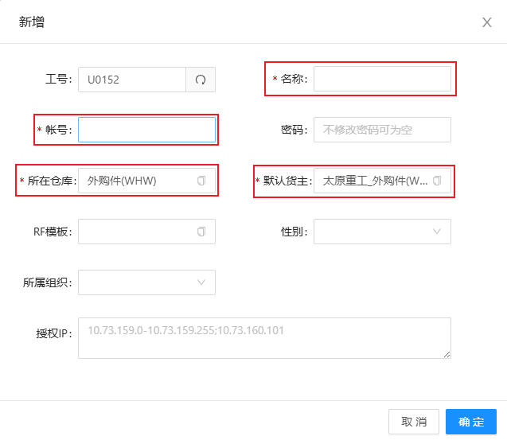
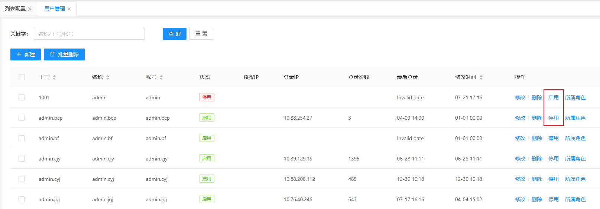
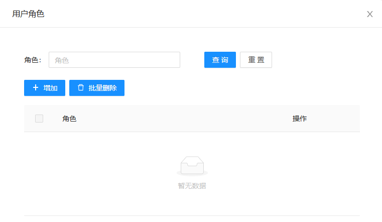
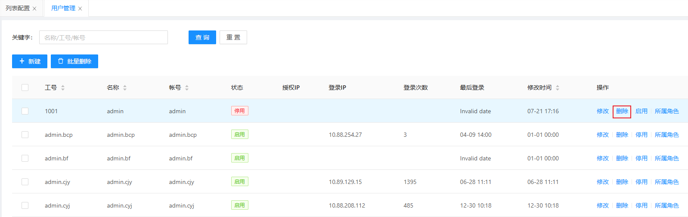

# 用户管理

显示登录WMS用户的信息，包含用户管理信息新增、修改、删除、启用/停用、所属角色

## 查询/重置

可根据多个条件进行检索用户管理数据/重置所有查询条件

## 新增/修改用户管理

&nbsp;&nbsp;&nbsp;&nbsp;名称：名称（根据实际情况填写）

&nbsp;&nbsp;&nbsp;&nbsp;账号：账号

&nbsp;&nbsp;&nbsp;&nbsp;所在仓库：所在仓库（根据实际情况选择）

&nbsp;&nbsp;&nbsp;&nbsp;默认货主：默认货主（根据实际情况选择）

## 启用/停用

WMS登录用户启用/停用操作

## 所属角色

给登录用户绑定所属角色

## 删除

删除登录用户

