# 采购收货入库

## 采购到货

1. MOM推送采购到货单至WMS

WMS根据MOM信息记录到货订单，供后续仓库人员操作

```json
{"Requests":[
{"contractNo":"CCWX250822001","deliverytime":"20251215","drdat":"20251215","erzet":"114023","factoryCode":"CC01","hfree3":"60036495","isDel":"0","orderNo":"0180002558","orderType":"DC02","procurementGroupCode":"634","procurementGroupName":"叉车生产外协组","purchaseOrder":"4600003071","rows":[
{"allotNumber":"2000.000","basicUnitName":"件","branchCompanyNo":"CC01","currency":"CNY","hfree3":"0","materialNo":"81374987","netPrice":"10.00","planDeliveryTime":"20251215","posnr":"000010","rows2":[],"warehouseNo":"1206"},
{"allotNumber":"2000.000","basicUnitName":"件","branchCompanyNo":"CC01","currency":"CNY","hfree3":"0","materialNo":"81300623","netPrice":"10.00","planDeliveryTime":"20251215","posnr":"000020","rows2":[],"warehouseNo":"1206"},
{"allotNumber":"2000.000","basicUnitName":"件","branchCompanyNo":"CC01","currency":"CNY","hfree3":"0","materialNo":"81375036","netPrice":"10.00","planDeliveryTime":"20251215","posnr":"000030","rows2":[],"warehouseNo":"1206"},
{"allotNumber":"2000.000","basicUnitName":"件","branchCompanyNo":"CC01","currency":"CNY","hfree3":"0","materialNo":"81497347","netPrice":"10.00","planDeliveryTime":"20251215","posnr":"000040","rows2":[],"warehouseNo":"1206"},
{"allotNumber":"2000.000","basicUnitName":"件","branchCompanyNo":"CC01","currency":"CNY","hfree3":"0","materialNo":"81213551","netPrice":"10.00","planDeliveryTime":"20251215","posnr":"000050","rows2":[],"warehouseNo":"1206"},
{"allotNumber":"2000.000","basicUnitName":"件","branchCompanyNo":"CC01","currency":"CNY","hfree3":"0","materialNo":"81131447","netPrice":"10.00","planDeliveryTime":"20251215","posnr":"000060","rows2":[],"warehouseNo":"1206"},
{"allotNumber":"2000.000","basicUnitName":"件","branchCompanyNo":"CC01","currency":"CNY","hfree3":"0","materialNo":"81123951","netPrice":"10.00","planDeliveryTime":"20251215","posnr":"000070","rows2":[],"warehouseNo":"1206"},
{"allotNumber":"2000.000","basicUnitName":"件","branchCompanyNo":"CC01","currency":"CNY","hfree3":"0","materialNo":"81151601","netPrice":"10.00","planDeliveryTime":"20251215","posnr":"000080","rows2":[],"warehouseNo":"1206"},
{"allotNumber":"2000.000","basicUnitName":"件","branchCompanyNo":"CC01","currency":"CNY","hfree3":"0","materialNo":"80587259","netPrice":"10.00","planDeliveryTime":"20251215","posnr":"000090","rows2":[],"warehouseNo":"1206"},
{"allotNumber":"2000.000","basicUnitName":"件","branchCompanyNo":"CC01","currency":"CNY","hfree3":"0","materialNo":"81151628","netPrice":"10.00","planDeliveryTime":"20251215","posnr":"000100","rows2":[],"warehouseNo":"1206"},
{"allotNumber":"2000.000","basicUnitName":"件","branchCompanyNo":"CC01","currency":"CNY","hfree3":"0","materialNo":"81214407","netPrice":"10.00","planDeliveryTime":"20251215","posnr":"000110","rows2":[],"warehouseNo":"1206"},
{"allotNumber":"2000.000","basicUnitName":"件","branchCompanyNo":"CC01","currency":"CNY","hfree3":"0","materialNo":"81131388","netPrice":"10.00","planDeliveryTime":"20251215","posnr":"000120","rows2":[],"warehouseNo":"1206"},
{"allotNumber":"2000.000","basicUnitName":"件","branchCompanyNo":"CC01","currency":"CNY","hfree3":"0","materialNo":"81152981","netPrice":"10.00","planDeliveryTime":"20251215","posnr":"000130","rows2":[],"warehouseNo":"1206"},
{"allotNumber":"2000.000","basicUnitName":"件","branchCompanyNo":"CC01","currency":"CNY","hfree3":"0","materialNo":"80307520","netPrice":"10.00","planDeliveryTime":"20251215","posnr":"000140","rows2":[],"warehouseNo":"1206"},
{"allotNumber":"2000.000","basicUnitName":"件","branchCompanyNo":"CC01","currency":"CNY","hfree3":"0","materialNo":"80376264","netPrice":"10.00","planDeliveryTime":"20251215","posnr":"000150","rows2":[],"warehouseNo":"1206"},
{"allotNumber":"2000.000","basicUnitName":"件","branchCompanyNo":"CC01","currency":"CNY","hfree3":"0","materialNo":"80374700","netPrice":"10.00","planDeliveryTime":"20251215","posnr":"000160","rows2":[],"warehouseNo":"1206"}
],"supplyName":"红星通讯有限公司.","supplyNo":"0010000011","systemCode":"CC028","typeDesc":"外协交货单(内向交货单)"}
]}
```
2. 在PDA “功能”->“到货确认" 里面就可以看到“到货订单”

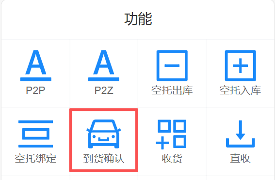

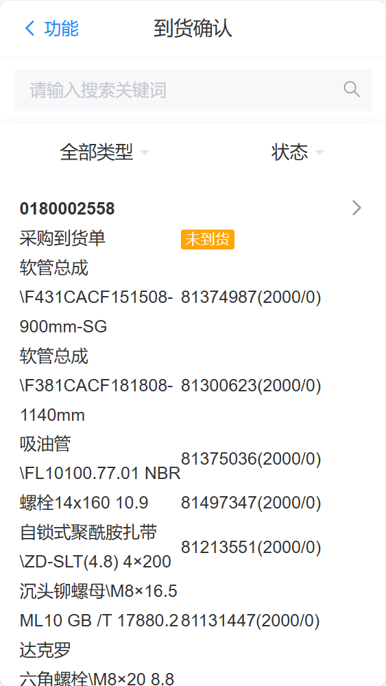

点击此到货订单进入订单明细界面

* 仓库人员确认好物料实际数量，在对应物料位置输入实际到货数量
* 如果物料实际到货数量与预期数量全部一至，可以点击右上角“全部到货”批量输入到货数量
* 如果只是部分物料确认好数量，有些物料还没有清点的时候，可以点击保存按钮，保存当前操作进度（可以操作多次）
* 如果物料全部确认好实际数量后，就可以点击“到货确认”按钮，系统会把订单状态变成“确认完成”状态，到货订单完成操作

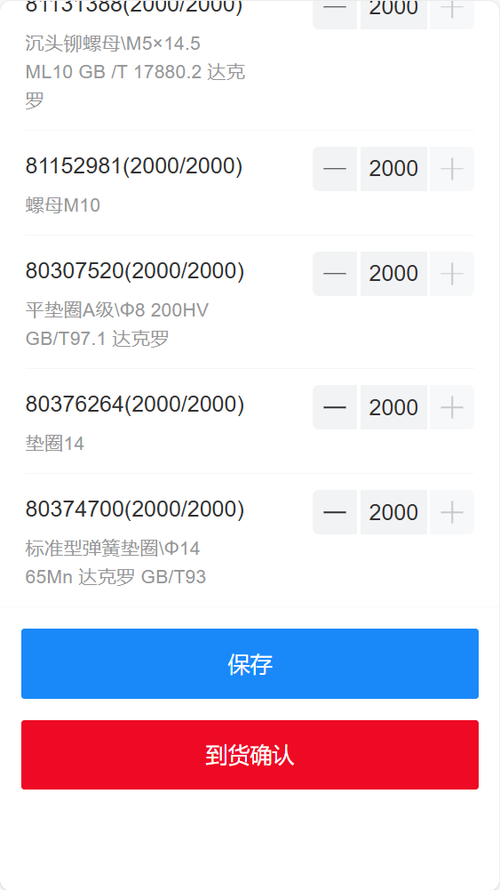
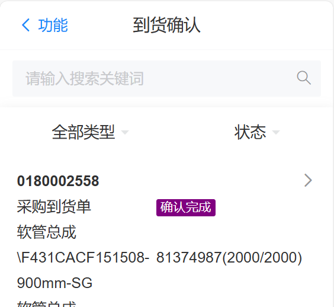

3. 当到货单由仓库人员确认完成后，系统会自动向MOM反馈采购收货信息

```json
{"orderNo":"0180002558","orderType":"DC02","typeDesc":"外协交货单(内向交货单)","purchaseOrder":"4600003071","drdat":"20251215","erzet":"114023","contractNo":"CCWX250822001","procurementGroupCode":"634","procurementGroupName":"叉车生产外协组","receiptTaskNo":"0180002558","rows":[
{"posnr":"000010","materialNo":"81374987","allotNumber":2000.00,"missingPartsQty":0.00,"unit":"件","serialNoList":[],"hfree1":null,"hfree2":null,"hfree3":null},
{"posnr":"000020","materialNo":"81300623","allotNumber":2000.00,"missingPartsQty":0.00,"unit":"件","serialNoList":[],"hfree1":null,"hfree2":null,"hfree3":null},
{"posnr":"000030","materialNo":"81375036","allotNumber":2000.00,"missingPartsQty":0.00,"unit":"件","serialNoList":[],"hfree1":null,"hfree2":null,"hfree3":null},
{"posnr":"000040","materialNo":"81497347","allotNumber":2000.00,"missingPartsQty":0.00,"unit":"件","serialNoList":[],"hfree1":null,"hfree2":null,"hfree3":null},
{"posnr":"000050","materialNo":"81213551","allotNumber":2000.00,"missingPartsQty":0.00,"unit":"件","serialNoList":[],"hfree1":null,"hfree2":null,"hfree3":null},
{"posnr":"000060","materialNo":"81131447","allotNumber":2000.00,"missingPartsQty":0.00,"unit":"件","serialNoList":[],"hfree1":null,"hfree2":null,"hfree3":null},
{"posnr":"000070","materialNo":"81123951","allotNumber":2000.00,"missingPartsQty":0.00,"unit":"件","serialNoList":[],"hfree1":null,"hfree2":null,"hfree3":null},
{"posnr":"000080","materialNo":"81151601","allotNumber":2000.00,"missingPartsQty":0.00,"unit":"件","serialNoList":[],"hfree1":null,"hfree2":null,"hfree3":null},
{"posnr":"000090","materialNo":"80587259","allotNumber":2000.00,"missingPartsQty":0.00,"unit":"件","serialNoList":[],"hfree1":null,"hfree2":null,"hfree3":null},
{"posnr":"000100","materialNo":"81151628","allotNumber":2000.00,"missingPartsQty":0.00,"unit":"件","serialNoList":[],"hfree1":null,"hfree2":null,"hfree3":null},
{"posnr":"000110","materialNo":"81214407","allotNumber":2000.00,"missingPartsQty":0.00,"unit":"件","serialNoList":[],"hfree1":null,"hfree2":null,"hfree3":null},
{"posnr":"000120","materialNo":"81131388","allotNumber":2000.00,"missingPartsQty":0.00,"unit":"件","serialNoList":[],"hfree1":null,"hfree2":null,"hfree3":null},
{"posnr":"000130","materialNo":"81152981","allotNumber":2000.00,"missingPartsQty":0.00,"unit":"件","serialNoList":[],"hfree1":null,"hfree2":null,"hfree3":null},
{"posnr":"000140","materialNo":"80307520","allotNumber":2000.00,"missingPartsQty":0.00,"unit":"件","serialNoList":[],"hfree1":null,"hfree2":null,"hfree3":null},
{"posnr":"000150","materialNo":"80376264","allotNumber":2000.00,"missingPartsQty":0.00,"unit":"件","serialNoList":[],"hfree1":null,"hfree2":null,"hfree3":null},
{"posnr":"000160","materialNo":"80374700","allotNumber":2000.00,"missingPartsQty":0.00,"unit":"件","serialNoList":[],"hfree1":null,"hfree2":null,"hfree3":null}
],"hfree1":null,"hfree2":null,"hfree3":"刘巨","operateType":null,"extendJson":null,"factoryCode":"CC01","systemCode":"CC028"}
```


可以在WMS->任务管理->发送报文 看到当前反馈MOM的报文执行情况

## 质检结果

1. MOM收到WMS反馈的到货确认后，MOM会生成到货质检单

当质检人员检验完成后，MOM会向WMS推送质检结果(单条)

WMS接收质检结果后，会记录质检信息，并同时生成收货入库订单

```json
{"factoryCode":"CC01","materialNo":"81214407","orderNo":"0180002558","posnr":"000110","rows":[{"inspectionRecordNo":"CC01UATLLJL2025121500006","qualifiedQuantity":2000.000,"qualityResult":"0","serialNoList":[]}],"systemCode":"CC028","type":"0","warehouseNo": "1206"}
{"factoryCode":"CC01","materialNo":"81213551","orderNo":"0180002558","posnr":"000050","rows":[{"inspectionRecordNo":"CC01UATLLJL2025121500012","qualifiedQuantity":2000.000,"qualityResult":"0","serialNoList":[]}],"systemCode":"CC028","type":"0","warehouseNo": "1206"}
{"factoryCode":"CC01","orderNo":"0180002558","systemCode":"CC028","materialNo":"81131388","posnr":"000120","rows":[{"inspectionRecordNo":"CC01UATLLJL2025121500005","qualifiedQuantity":2000.000,"qualityResult":"0","serialNoList":[]}],"type":"0","warehouseNo": "1206"}
{"factoryCode":"CC01","orderNo":"0180002558","systemCode":"CC028","materialNo":"81151628","posnr":"000100","rows":[{"inspectionRecordNo":"CC01UATLLJL2025121500007","qualifiedQuantity":2000.000,"qualityResult":"0","serialNoList":[]}],"type":"0","warehouseNo": "1206"}
{"factoryCode":"CC01","orderNo":"0180002558","systemCode":"CC028","materialNo":"81497347","posnr":"000040","rows":[{"inspectionRecordNo":"CC01UATLLJL2025121500013","qualifiedQuantity":2000.000,"qualityResult":"0","serialNoList":[]}],"type":"0","warehouseNo": "1206"}
{"factoryCode":"CC01","orderNo":"0180002558","systemCode":"CC028","materialNo":"81151601","posnr":"000080","rows":[{"inspectionRecordNo":"CC01UATLLJL2025121500009","qualifiedQuantity":2000.000,"qualityResult":"0","serialNoList":[]}],"type":"0","warehouseNo": "1206"}
{"factoryCode":"CC01","orderNo":"0180002558","systemCode":"CC028","materialNo":"80376264","posnr":"000150","rows":[{"inspectionRecordNo":"CC01UATLLJL2025121500002","qualifiedQuantity":2000.000,"qualityResult":"0","serialNoList":[]}],"type":"0","warehouseNo": "1206"}
{"factoryCode":"CC01","orderNo":"0180002558","systemCode":"CC028","materialNo":"80374700","posnr":"000160","rows":[{"inspectionRecordNo":"CC01UATLLJL2025121500001","qualifiedQuantity":2000.000,"qualityResult":"0","serialNoList":[]}],"type":"0","warehouseNo": "1206"}
{"factoryCode":"CC01","orderNo":"0180002558","systemCode":"CC028","materialNo":"80587259","posnr":"000090","rows":[{"inspectionRecordNo":"CC01UATLLJL2025121500008","qualifiedQuantity":2000.000,"qualityResult":"0","serialNoList":[]}],"type":"0","warehouseNo": "1206"}
{"factoryCode":"CC01","orderNo":"0180002558","systemCode":"CC028","materialNo":"81152981","posnr":"000130","rows":[{"inspectionRecordNo":"CC01UATLLJL2025121500004","qualifiedQuantity":2000.000,"qualityResult":"0","serialNoList":[]}],"type":"0","warehouseNo": "1206"}
{"factoryCode":"CC01","orderNo":"0180002558","systemCode":"CC028","materialNo":"80307520","posnr":"000140","rows":[{"inspectionRecordNo":"CC01UATLLJL2025121500003","qualifiedQuantity":2000.000,"qualityResult":"0","serialNoList":[]}],"type":"0","warehouseNo": "1206"}
{"factoryCode":"CC01","orderNo":"0180002558","systemCode":"CC028","materialNo":"81131447","posnr":"000060","rows":[{"inspectionRecordNo":"CC01UATLLJL2025121500011","qualifiedQuantity":2000.000,"qualityResult":"0","serialNoList":[]}],"type":"0","warehouseNo": "1206"}
{"factoryCode":"CC01","orderNo":"0180002558","systemCode":"CC028","materialNo":"81123951","posnr":"000070","rows":[{"inspectionRecordNo":"CC01UATLLJL2025121500010","qualifiedQuantity":2000.000,"qualityResult":"0","serialNoList":[]}],"type":"0","warehouseNo": "1206"}
{"factoryCode":"CC01","orderNo":"0180002558","systemCode":"CC028","materialNo":"81375036","posnr":"000030","rows":[{"inspectionRecordNo":"CC01UATLLJL2025121500014","qualifiedQuantity":2000.000,"qualityResult":"0","serialNoList":[]}],"type":"0","warehouseNo": "1206"}
{"factoryCode":"CC01","orderNo":"0180002558","systemCode":"CC028","materialNo":"81300623","posnr":"000020","rows":[{"inspectionRecordNo":"CC01UATLLJL2025121500015","qualifiedQuantity":2000.000,"qualityResult":"0","serialNoList":[]}],"type":"0","warehouseNo": "1206"}
{"factoryCode":"CC01","orderNo":"0180002558","systemCode":"CC028","materialNo":"81374987","posnr":"000010","rows":[{"inspectionRecordNo":"CC01UATLLJL2025121500016","qualifiedQuantity":2000.000,"qualityResult":"0","serialNoList":[]}],"type":"0","warehouseNo": "1206"}
```

在WMS系统里可以看到MOM推送过来的收货入库订单

仓库人员可以在PDA->功能->收货 里看到收货入库订单

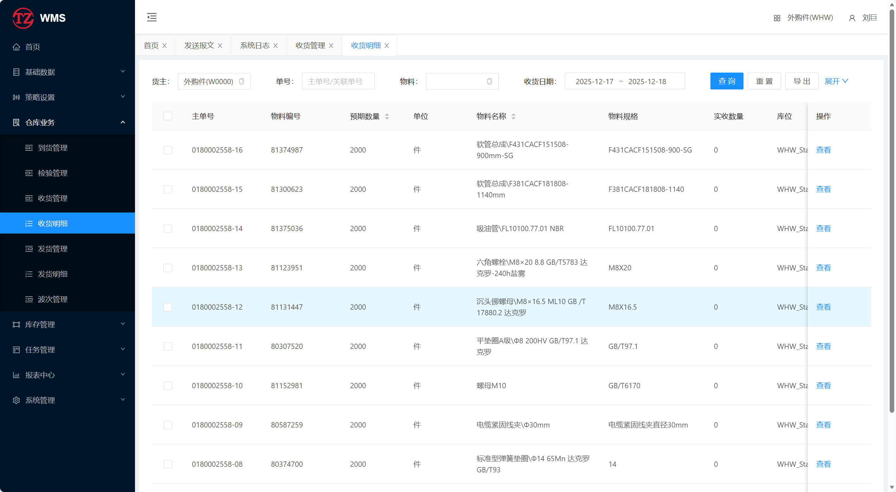


## 入库上架

1. 仓库人员在PDA -> 收货 可以看到当前到货单入库信息

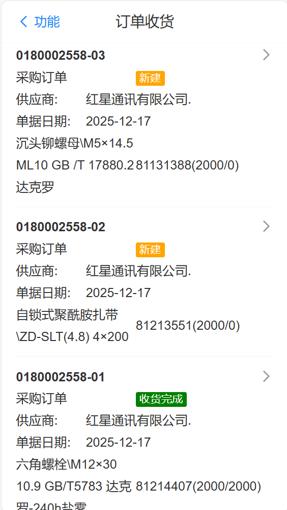

2. 仓库人员根据物料的实际情况，进行入库绑盘上架操作

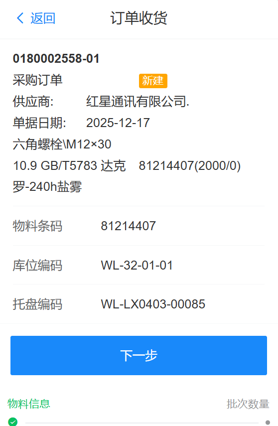


3. 当收货入库订单收货完成后，在PDA 数据-> 收货管理

看到对应订单，并向左滑动订单，操作“关闭”按钮

订单变成“验证关闭”状态。此时系统会自动向MOM推送“采购订单入库”信息

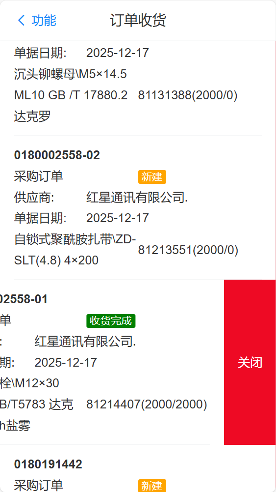

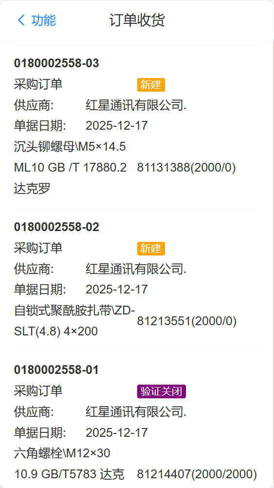

反馈MOM的信息如下

```json
{"requests":
{"voucherNo":"0180002558","allotNo":"0180002558-01","allotType":"101","allotDate":"20251217","inputDate":"20251217","userName":"刘巨","voucherText":null,"hfree1":null,"hfree2":null,"hfree3":null,"hfree4":null,"hfree5":null,"rows":[
{"rowNo":"000110","allotNumber":2000.00,"unit":"件","materialNo":"81214407","branchCompanyNo":"CC01","warehouseNo":"1206","specialMark":null,"orderNo":null,"termsNo":null,"wbsNo":null,"workOrder":null,"hfree1":"81214407001000001100SM1701","rows2":[]}
],"operateType":null,"extendJson":null,"factoryCode":"CC01","systemCode":"CC028"}}
```

## 其它

1. WMS系统功能增加 仓库业务 -> 到货管理

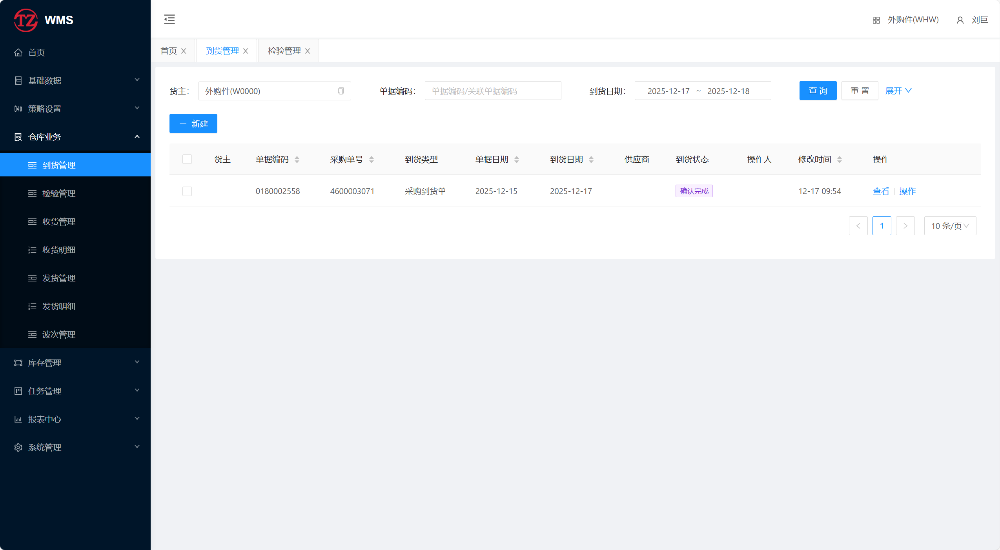

2. WMS系统功能增加 仓库业务 -> 检验管理

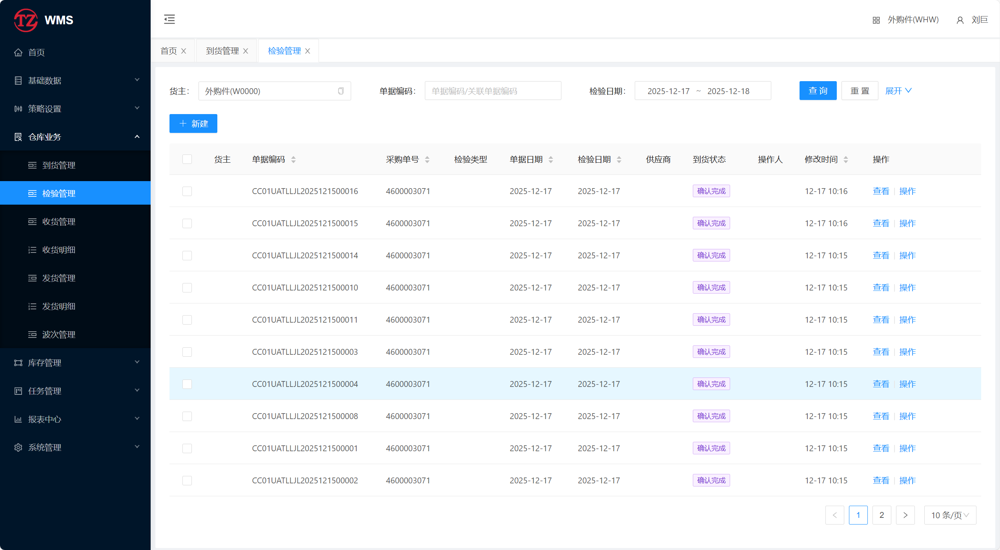