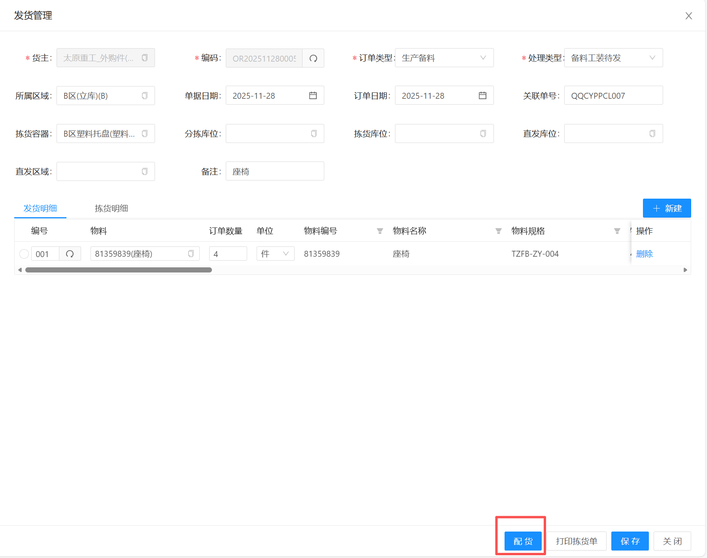
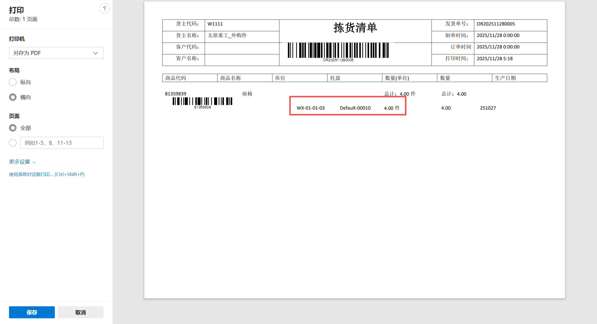
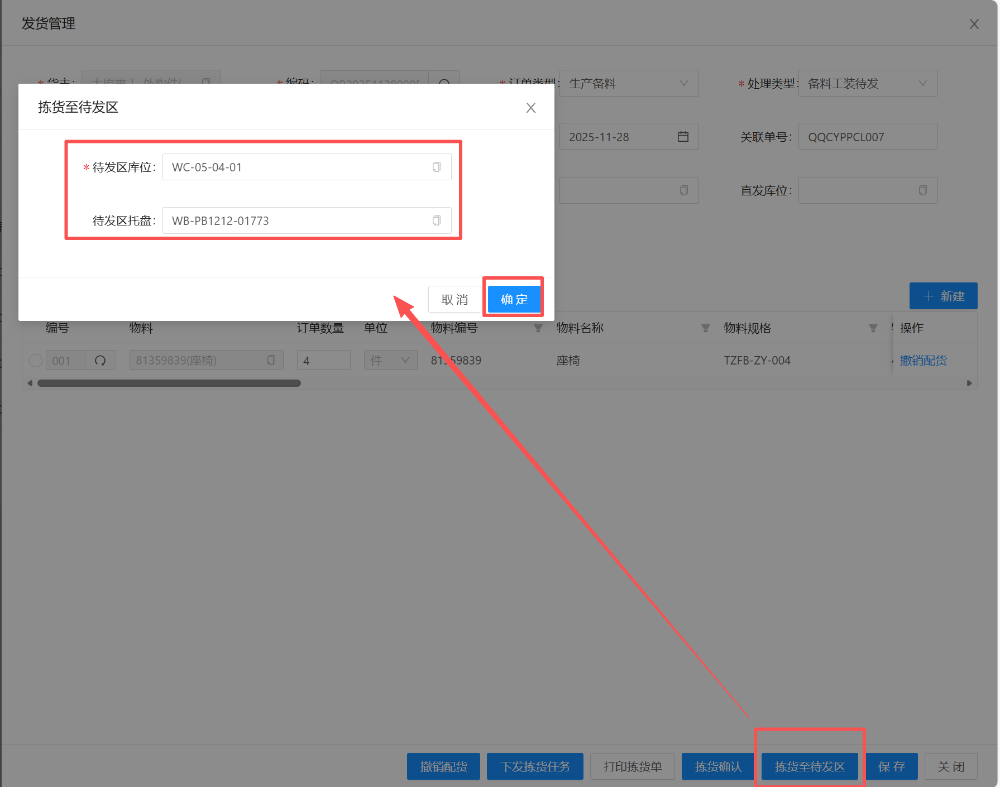
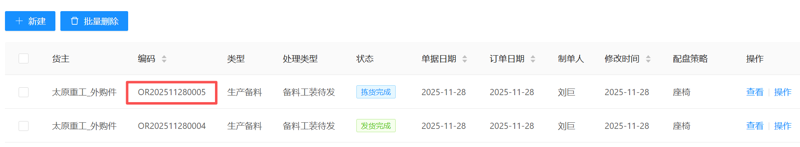
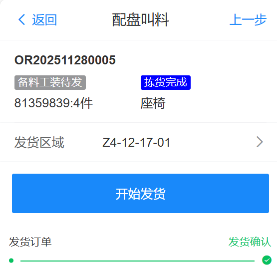

# 手工拣货至待发区

## 功能说明

功能适用于通过在PC端进行手工配货

然后拣货人员手工拣货至临时托盘后

人工转运至待发区，并更新订单状态的操作

## 操作步骤

1. 配货

找到对应的配盘订单，点击“配货”按钮

系统会根据订单的物料需求匹配库存

配货完成后，订单状态为“配货完成”

当配货完成后，可以点击”打印拣货单“，查看当前配货的库存

这个时候，拣货人员可以按这个拣货单把所有物料拣货至临时托盘

当拣货完成后，可以手工操作指定把临时托盘运至待发区

2. 拣货至待发区

当临时托盘运至待发区后，在订单上点击“拣货至待发区”

输入当时在待发区的“库位编号”与“临时托盘号”后，点确定

这个时候订单的状态就变成“拣货完成”了。

可以等待MOM叫料请求，也可以通过“配盘叫料”功能把物料发货

3. 配盘叫料

通过配盘叫料，可以模拟MOM叫料请求，把物料配送至线边

当发货任务完成后，订单状态变成“发货完成”，订单结束

