# 打印操作设置

## 驱动安装

1. 安装驱动软件 [ZT111 工业打印机支持](https://www.zebra.cn/cn/zh/support-downloads/printers/industrial/zt111.html)
2. 标签打印软件 [BarTender](https://portal.seagullscientific.com/downloads/bartender)

## 

A.驱动下载: 
B.下载后安装步骤如下：
> 双击运行界面

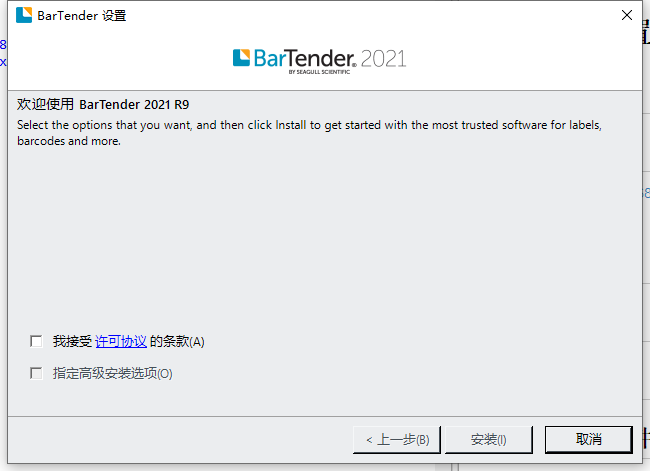
> 勾选接受许可协议条款，然后点击安装，如下图  

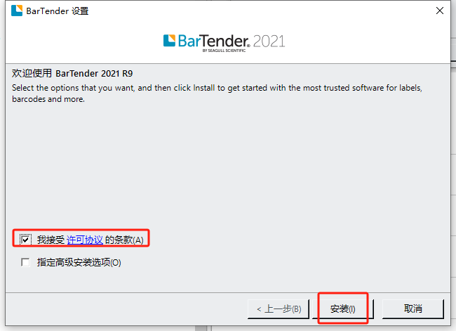

> 安装等待，如下图  

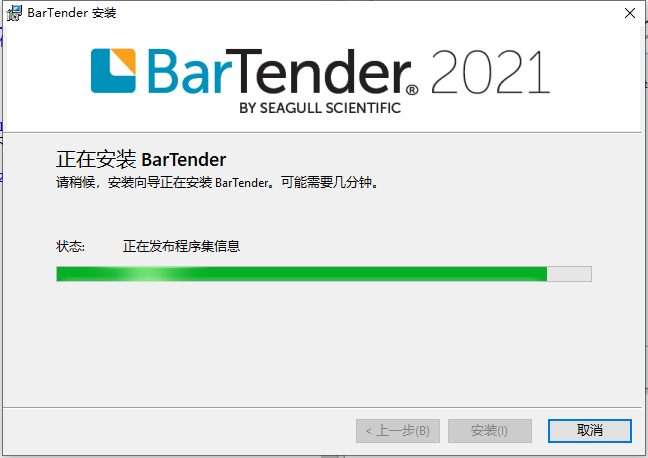

> 点击完成，即可完成驱动安装，如下图

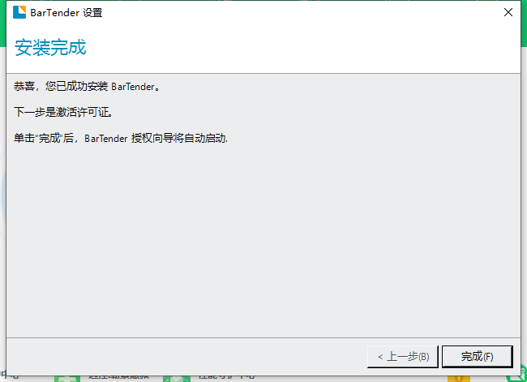

## 打印测试 ##

打开驱动软件，如下图：
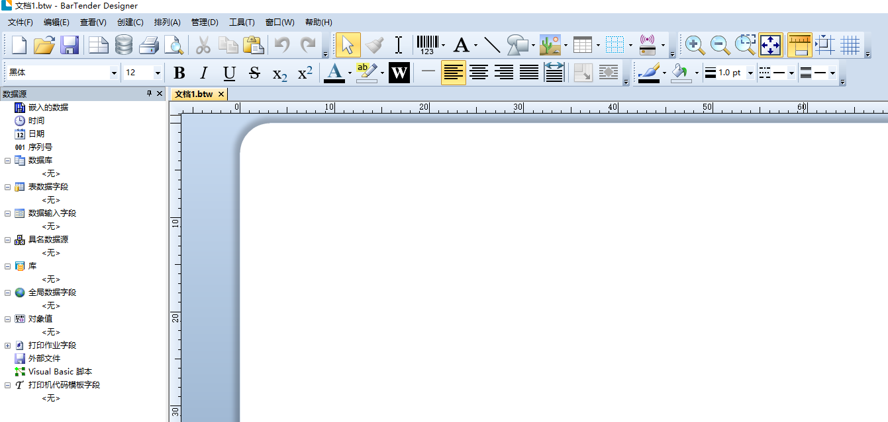
> 选择文件-新建-空白模板-如下图：  
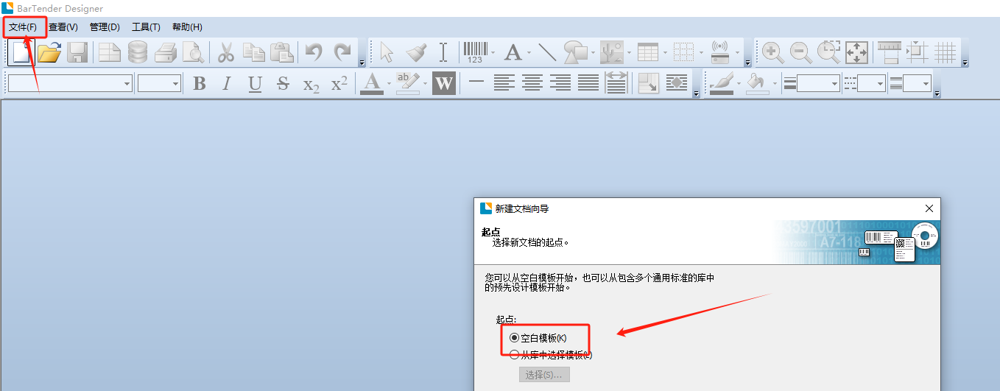

> 选择你给打印机驱动命名的驱动名称,如下图:

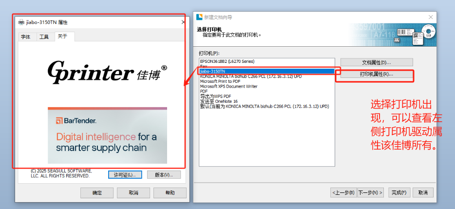

> 指定自定义设置，下一步，如下图：  

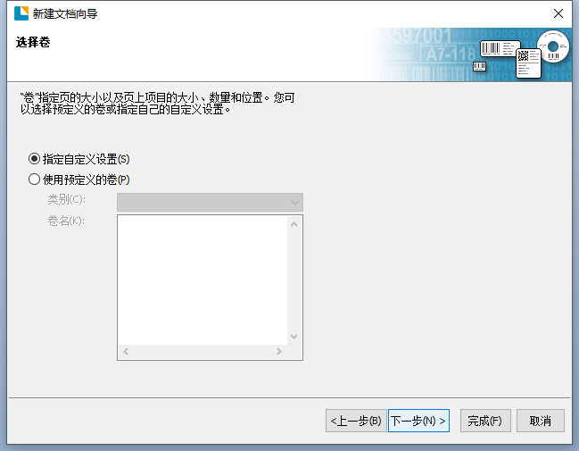
> 每页项目数，下一步，如下图:

> 其中**侧边**和**打印的项目形状**视现场情况决定，点击下一步，选择模板打下，如下图：  
模板大小，视现场情况决定，这里选择60mmx40mm,方向为纵向，点击完成。

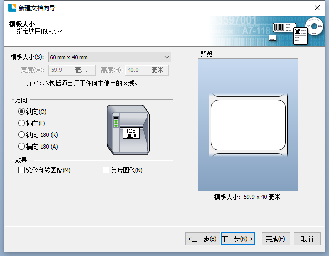

> 在工具图标栏中选择国际标准为128的图形码，放入到编辑区，如下图：

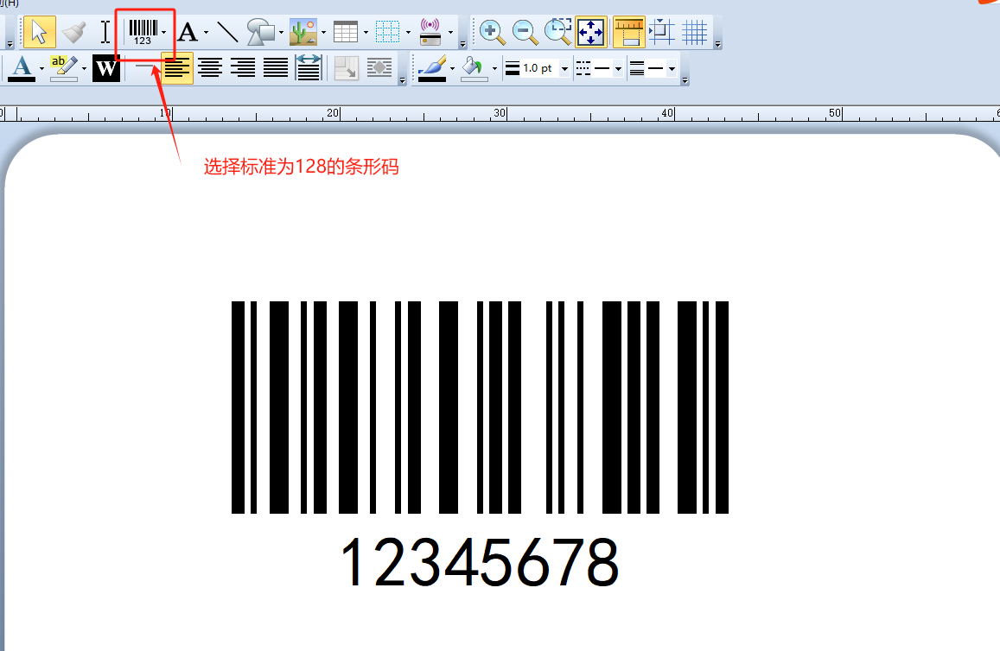

> 选择文件-打印-找到你的驱动名称，选择打印，等待打印机完成打印，即完成打印测试，如下图：

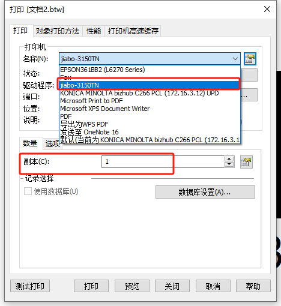

## WSM系统与打印联动 ##

> 进入WMS系统，点击系统设置-数据字典-在搜索栏中关键字输入：LabelPrint_Template，点击查询，出现如下结果，如下图：  

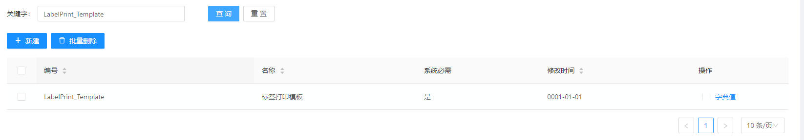

> 选择字典项-点击添加字典-分别添加a.托盘 b.物料 c.库位 共3项，如下图：  
> 注：**编号的内容必须与开发人员进行对接后，名称要与打印模板名称对应。模板文件将根据文件名称与中间件服务进行关联**  

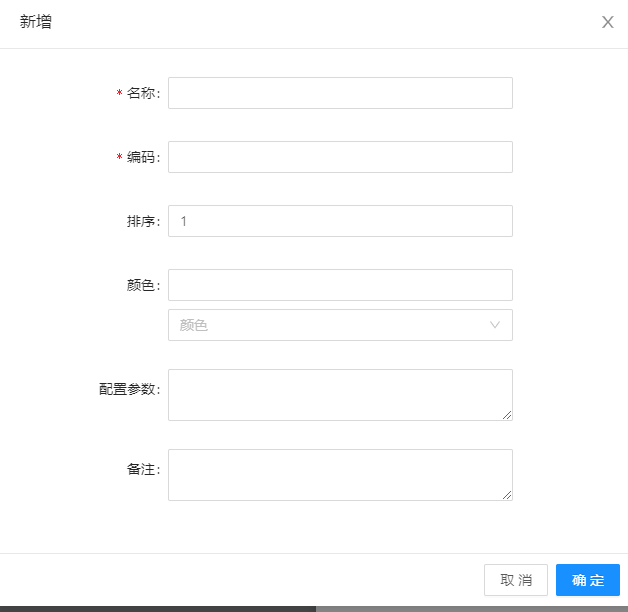
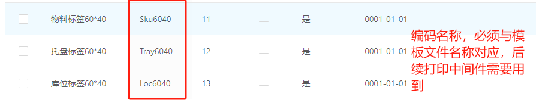  

  

>下载打印中间件

ZEQP.BarTenderService.rar

下载完成后进行解压，找到Template文件夹，如下图：

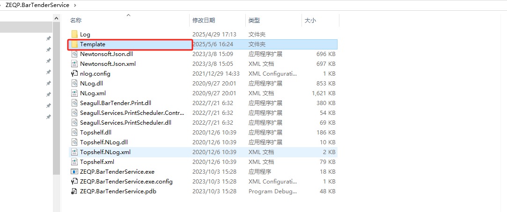  

**注：模板文件根据项目现场情况向公司开发人员索要对应的模板文件，并将模板文件放置到该Template文件夹下，其中，文件名称必须和WMS字典中的Code名称一一对应，如下图：。**
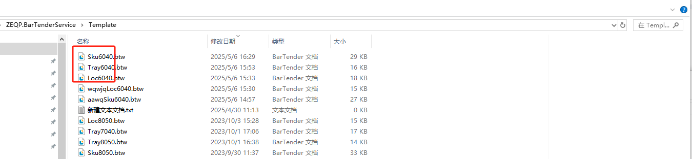  

>打开中间件程序,在解压目录中找到**ZEQP.BarTenderService.exe**，并打开，如下图：   

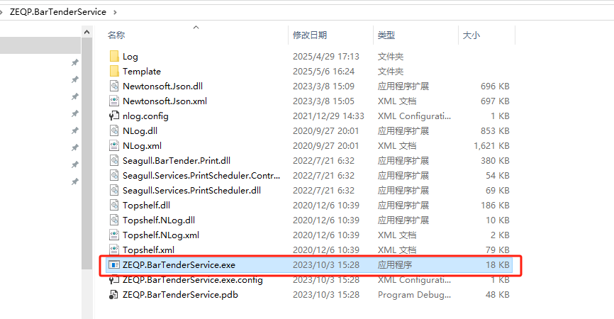 
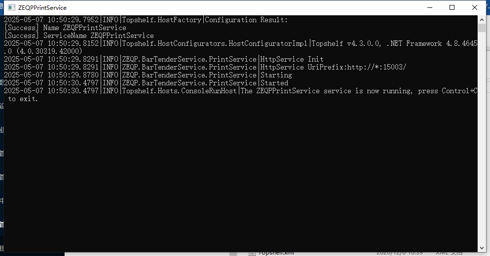   

>WMS系统打印按照权限授权
进入WMS系统-系统设置-角色管理-根据业务需要找到对应的角色名称，点击选项按钮，如下图：
  
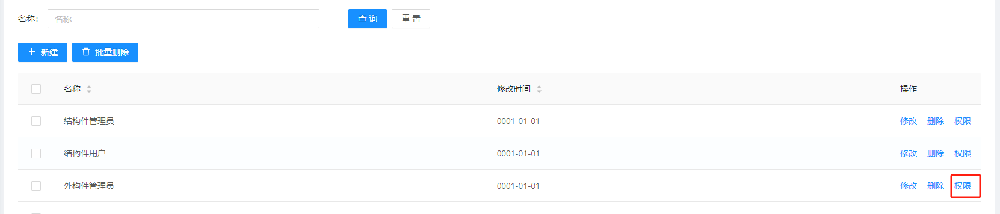    

分别找到-基础数据-**A.托盘管理 B.物料管理 C.库位管理，点击下拉，找到按钮权限-打印并打勾，**如下图：  

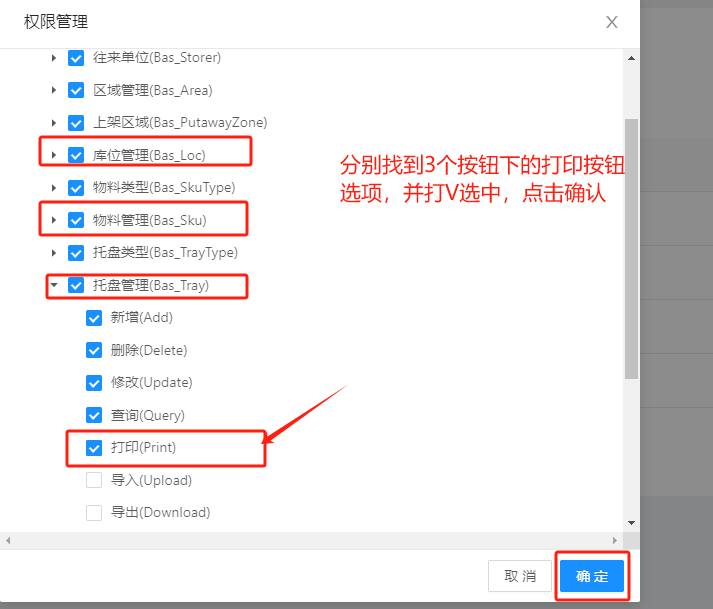    

>打印测试  

授权完成以后，我们找一个功能进行打印，这里选择基础数据-库位管理，如下图:  

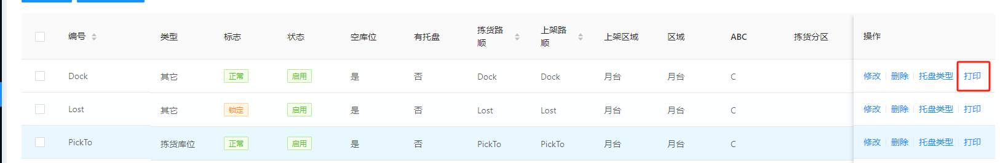

**注：如果系统管理员不对对应角色进行页面按钮的打印授权，是无法看到该功能的打印按钮的。**

点击打印按钮，弹出如下对话框,如下图:

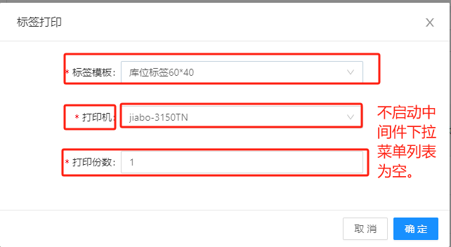

**注:  
1.如果打印机下拉列表没有任何数据，请上文提到的中间件程序ZEQP.BarTenderService.exe**  
2.**不同基础功能对应的标签模板不通，请选择对应的标签模板，否则无法正常打印**