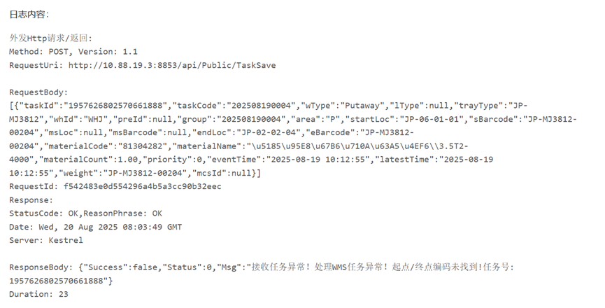

## 1重复收货或数量填多

数量信息不符合或者多次对同意托盘的同一物料进行收货操作，都会影响库存的数量与实际不符，如果出现不符的情况根据第五节《物料直发》操作将物料数量修正回实际数量。反之，如果系统中物料数量较实际情况少，则再次进行直收，补齐数量即可。

## 2直发物料后托盘放在原库位

使用直发功能后，被直发掉的库位库位状态会变成无托盘空库位的状态，如果直发后托盘依然在库位上，需要使用空托绑定功能将托盘与库位绑定。

## 3“未检测到该物料”

出现此情况，有以下几种情况：

①未新建物料；

②物料包装重复或者没有；

③物料编码输入错误。

①解决方式：新建物料（详见第一页）。②解决方法：物料包装重复联系运营商，物料包装没有新建即可。③解决方法：正确输入物料编码。

## 4 空托出库显示无托盘

出现这种报错有以下几种情况：

①输入的所需托盘类型错误，即系统内没有此类托盘；

②系统内的库位没有绑定此类型的空托盘或所有此类型的托盘都是有货状态；

解决方法：

①检查所需托盘类型是否合规；

②如果有未使用的此类型空托盘，可以使用空托绑定绑定托盘；

## 5 物料收货上架显示无空库位

上架时显示“没有空库位可入”而无法分配上架库位时，可能是以下几种情况：

①（常见）物料对应阶段的上架区域无空库位可用，解决方法：盘点该区域的库位或者将该区域的托盘发走来腾出空位即可解决；

②物料对应阶段的上架策略未添加该阶段的上架策略，解决方法：打开PC端->策略设置->上架策略，选择物料对应的上架策略，点击明细，点击新增，在批次条件中选择对应的检索属性和上架区域，点击确定后即可进行上架操作。

③使用托盘对应上架区域未添加，解决方法：打开PC端->基础数据->物料管理，搜索对应使用托盘的物料信息，点击修改，添加上架区域即可。

## 6 任务未执行⭐

在任务下发后，任务未执行的情况有三种，具体如下：

①未配置LIP系统对应库位：如果LIP中没有对应库位的编码，在PC端WMS->系统管理->系统日志中可以查到对应信息，根据任务号在日志中进行查询，显示内容如图所示：

解决方法：登录PC端LIP系统，打开基础数据->库位信息，对相关起点/终点进行查询，如果没有数据，则需要新建库位，编号、名称、区域和类型必填，平库库位、线边库位需要填写方位（Left为-01结尾输送线输出物料，Right为-02结尾输送线输出物料，如果不确定则统一使用Left），库位更新完成后即可使用。

②出库任务起点终点库位未填线边库位、平库库位方位：在这种情况下任务已成功发送到LIP，通常情况下，LIP会把平库库位的托盘入库任务或立体库库位出库到平库的任务拆分成两个任务，一个任务是AGV搬运任务，一个是堆垛机任务，分别发送给RCS系统（AGV调度系统）和MCS系统（堆垛机调度系统），但是立体库之外的库位如果未填写方位，LIP则不会对任务进行拆分，在LIP->任务信息->任务信息中，显示该任务是一个整合的任务，LIP无法下发给下层的MCS、LIP系统去做，所以该任务无法执行。

解决方法：登录PC端LIP系统，打开基础数据->库位信息，对任务相关的库外库位进行查询，并填写方位（Left为-01结尾输送线输出物料，Right为-02结尾输送线输出物料，如果不确定则统一使用Left）。

③拣货任务系统bug：该情况只出现于配货拣货时生成的任务，只有空托出库出来，而需要拣货的托盘未出来。

解决方法：登录PC端LIP系统，打开任务信息->任务信息，查询相关任务，找到对应任务的MCS任务，点击修改，右边弹出的页面中将自动中的“否”改成“是”，点击确定，任务即可开始执行。

## 7 托盘入库放入货架后任务状态未变成已完成。

托盘在入库并且被堆垛机放入货架后未报完成，造成的原因可能是之前下发过该托盘的入库任务，但未完成时将该任务取消了，MCS中对应的堆垛机任务未同步取消，在下一次下发任务后，托盘执行的堆垛机任务是上次取消的任务的终点，因为MCS对应的任务号不同，完成后上报就不会给当前下发的任务包完成。

解决方法：登录PC端MCS系统，打开任务管理->毛坯库任务/成品库任务，根据任务托盘在容器编码搜索栏进行查询，确认刚才完成的入库任务是哪个，并对当前未处理的任务进行删除，在WMS系统中对刚才的任务手动点完成，根据MCS实际完成情况，在WMS中将托盘与其上面的物料信息绑定到正确的库位中，保证实际情况与WMS中的物料信息一致即可。

## 8 发货任务取消，库存状态异常

在使用整托直发功能，对应的发货任务取消后，对应的库存其状态会变成已拣货的状态，该状态下其库存位置会无法使用，该物料无法调用。

解决方法：打开WMS->库存管理->库存查询，查询对应库存，使用直发，数量为对应的已拣货数量，点击确定，库存又重新变为可用的了。

## 9 创建物料失败

创建物料时，在必填项填完后，报错物料无法创建。

解决方案：联系厂家实施人员，该问题引起原因是该物料的物料编号已经被使用过并且物料信息已删除，该物料的信息仍在数据库中但是不会显示在前端中，厂家实施人员需要打开数据库将对应物料编码数据的“Deleted”从1修改为0即可。

## 10 发货任务被手动强制完成导致后续任务无法执行

如果发货的物料托盘还在立库内没有取出来，取消涉及到的包括空托出库等任务，检查发货物料的库存是否正常，然后重新开始配盘；

如果发货的物料已经出至KBK，将相关库存直发，并检查涉及到的库位状态是否恢复，最后把要发货的物料送至需要的区域，如果出来的托盘还有尾料，则重新收货上架。

## 11 使用空托绑定功能显示该库位不支持此类型托盘的绑定

原因是该库位没有设置允许使用此类型的托盘

解决方法：进入WMS的web端，进入基础数据里面的库位管理，通过关键字查询到要绑定的库位，点击操作栏的托盘类型按钮，在里面添加需要的托盘类型即可。

## 12 对物料进行盘点出库/入库时，在盘点位置的托盘被使用点对点移动后，导致的托盘信息丢失

如果在盘点过程中，因为现场的需要，挪动了待盘点的托盘，就会导致托盘信息丢失，如果不进行空托绑定，就再将托盘盘点入库，会导致终点的托盘信息丢失，因此在盘点过程中挪动了托盘，盘点入库前就必须对托盘进行一次库位绑定。

## 13 使用WMS系统时，查询不到需要的各种基础信息（库存、库位、托盘）

出现这种情况的原因，可能是使用的账号的所属仓库不是需要查询的仓库；

解决方法：联系仓库管理员，修改该账号的所属仓库；

## 14 登录WMS系统时忘记账号密码

解决方法，联系仓库管理员重置密码；

具体操作：登录WMS系统有仓库管理员权限的账号，进入系统管理里面的用户管理，通过关键字查询到对应的账号，在操作栏里面点击修改，然后在密码这一栏里面输入新密码并点击确认。