# A区物料收货 #
## 前置配置-批次策略 ##
> 批次策略配置  

进入WMS系统，找到策略设置-批次策略-新建一个名称为批次与质检的批次策略，如下图:
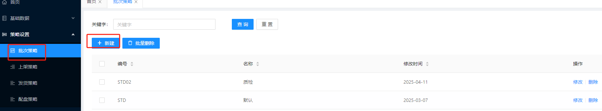  

新增： 输入编号、名称  
标签选择：批次号，勾选维护、RF显示、默认文本  
标签选择：质检状态 勾选需维护、RF显示、下拉选择枚举，枚举值为Inv_Quality_QCStatus，默认值为PD  

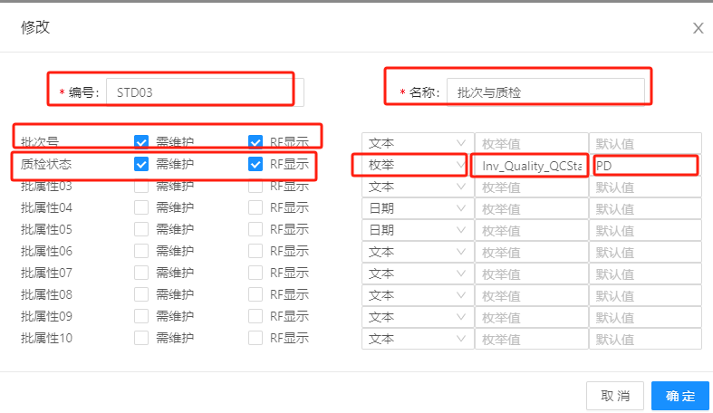  
注：枚举值来自于WMS系统-系统设置-字典值，如下图：  
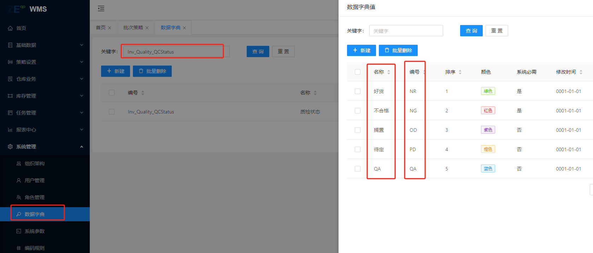  
## 前置配置-上架策略 
 
> 上级策略配置  

进入WMS系统，找到策略设置-上级策略-新建上架策略,输入编号、名称，如下图:  

  

新建成功以后，点击明细-新建明细，输入编号、选择上级类型（默认上架到指定区域）、上级区域-选择物料需要上级的目标库位区域，过滤条件默认为标准库位，如果**目标上级区域立库且是双生库位，就选择空库位，子道同物料**，点击确认。如下图：

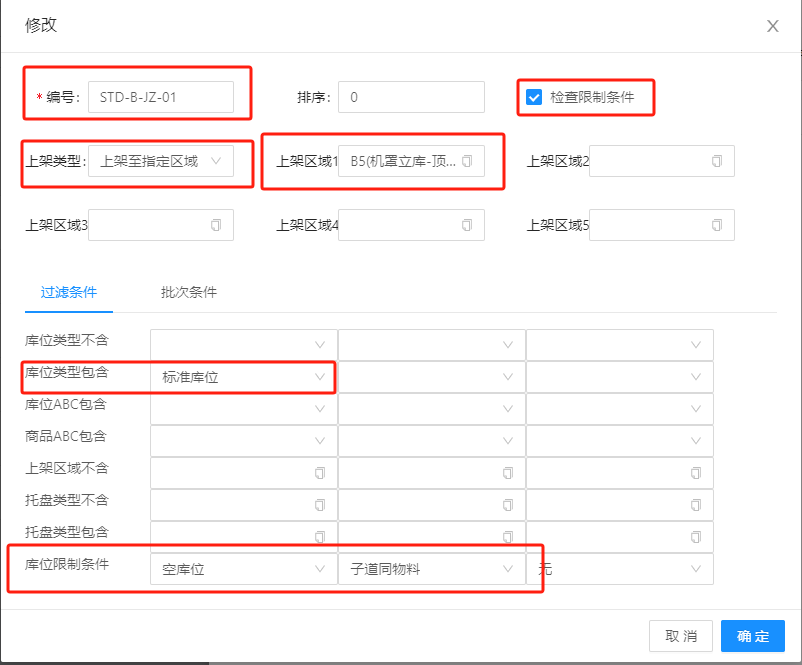    

## 设置物料批次策略和上级策略 ##

进入WMS系统-基础数据-物料管理-找到你需要上级的物料信息，点击修改，这里举例为机罩物料，如下图：  
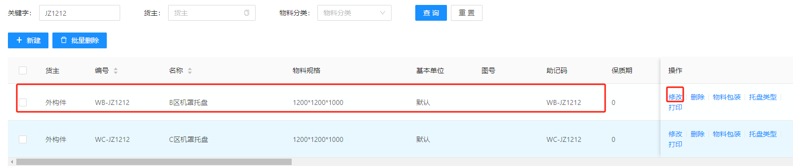 

进入到修改界面后，为物料配置上架策略和批次策略，点击确定,完成物料策略设置，如下图:

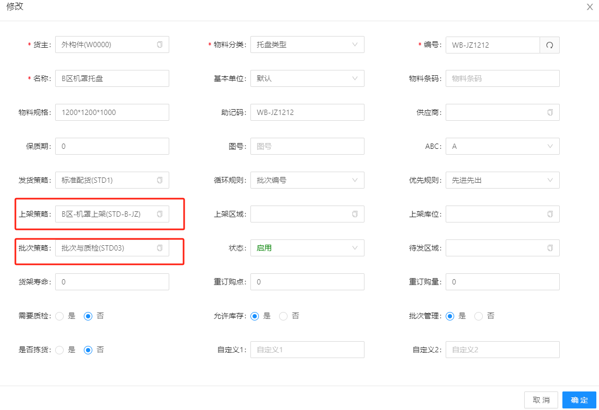 

## 空托入库 ##
根据现场业务地区规划，如下图:  

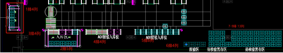 

入库接驳及PKB区，用来放置外部货物，必须准备空托承载货物，首先在RF端需要员工将空托绑定到承载货物位置，如下图：  
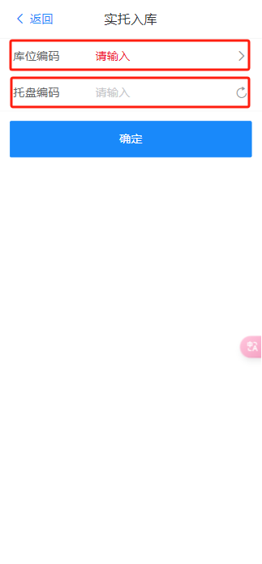  

注：  
a.库位编码为A区域所在的区域里面的库位的位置唯一编码，可以**通过RF端扫码获取**  
b.托盘编码，来自于托盘上面的标签码，同理也是可以**通过RF端扫码获取**  

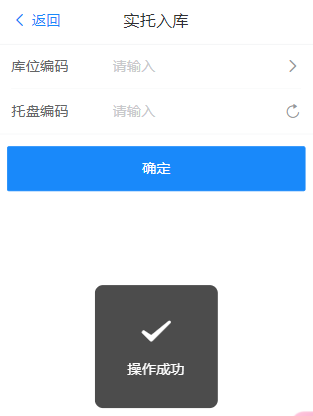  
 

## 质检收货 ##
>参与角色：A区收货区管理员， 所属系统：WMS  

仓库业务-收货管理-所属区域（A区-外购件立库-入库区）-新建收货如下图: 
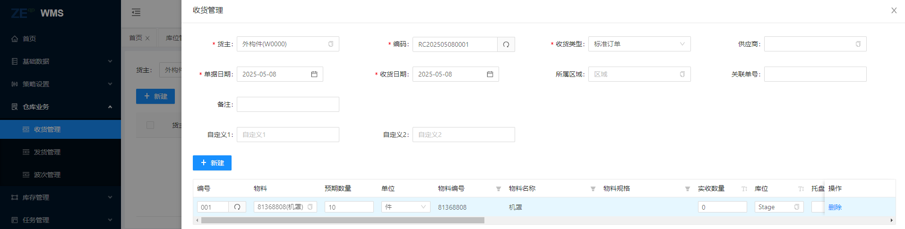  
收货内容包含：货主/编码/收货类型/单据日期/单据日期/收货日期

点击图上的新建按钮，出现需要填写货物的详情信息，如下图: 

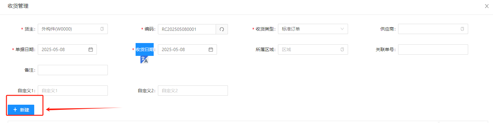  

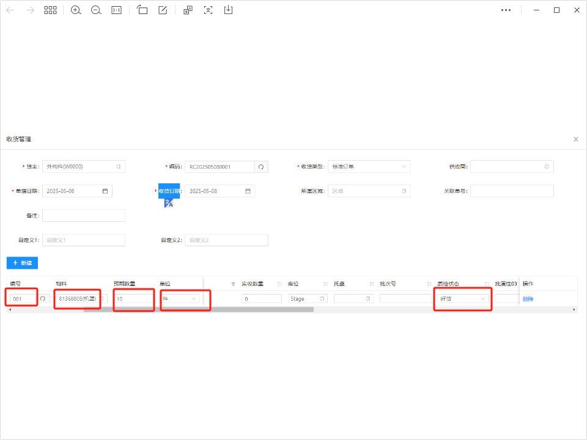   

需要填写的内容包含：编号、物料（这里选择机罩），预期数量、单位、**质检状态（用户收货自检用）**，填写完毕点击确认，产生系统产生收货端,如下图：  
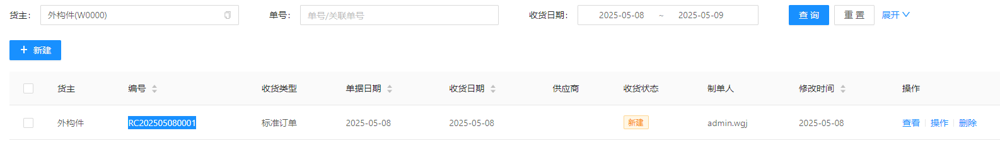  

>参与角色：区域线下收货员,所属系统：WMSRF端  

线下收货员使用RF端，根据WMS生成的收货单件，在RF端进行操作，选择功能模块-点击收货-输入收货单号-下一步 -扫码物料-库位编码-托盘编码
如下图：  
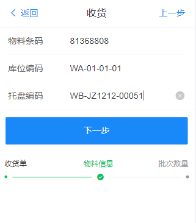
注：  
a.物料条码来自于物料的条形码,可以**通过RF端扫码获取**   
b.库位编码来自于A区收货库位的库位条形码,可以**通过RF端扫码获取**   
c.托盘编码来自于收货库位上托盘的条形码,可以**通过RF端扫码获取**   

点击下一步，如下图:  

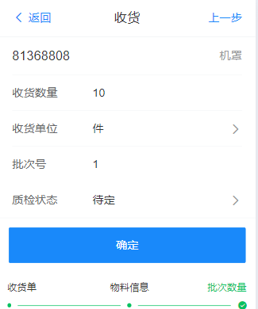

注:  
a.**收货数量，收货数量根据现场情况定，输入具体现场物料数量(XK)，根据收货单号的预期收货数量(YK)，当来料不满足于预期收货数量时，XK<yk,收货员可以多次进行收货处理直到收到满。**  
b.选择货物的单位  
c.选择货物所属批次，可自定义手工输入  
d.质检状态，**在WMS收货管理中，需要和货物的质检状态一致，这里我们选择好货，对应质检功能。**,如下图：  

最后点击确认完成收货。   

>WMS系统收货跟踪  

当线下人员完成收货时，WMS系统可以跟踪当前收货单据的状态，如下图，  
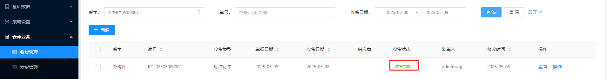  

## 上架 ##

收货完成后，进行上架，在RF端进行操作，选择功能模块-点击上架-输入库位编码-输入托盘编码-下一步 -扫码物料-库位编码-托盘编码
如下图：
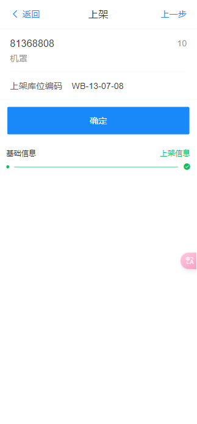

点击确认，提升操作成功，如下图:
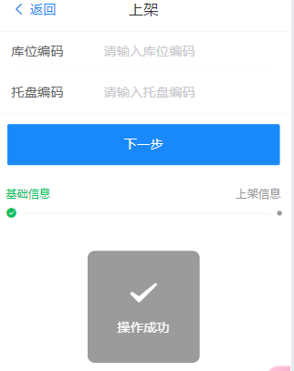

此时，后台产生上架任务，具体位置在数据-任务管理中，手指右滑动，点击完成，如下图

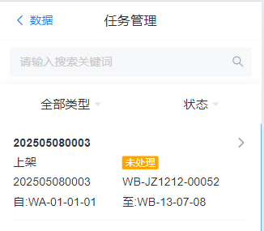
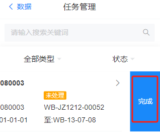
## 整托移库 ##

>A区收货区域整托移库移动到同区其他区域示例,模拟有货库位WA-01-01-01 移动到库位 WA-03-03-01,如下图所属:  

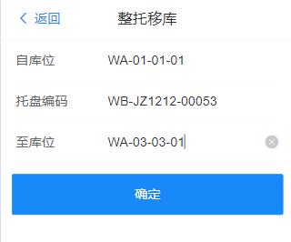  
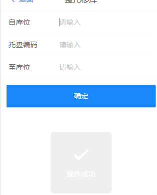

此时，在数据-任务管理列表，将生成一项移库任务，同时，目标库位被锁定，优化点击完成即可完成整托移库，如下图：

  

