# 此目录写操作说明文档

# 备货物料至待发区 #

>物料备货前置条件 
#../../preCondition/sku/index.md#sku1
1.物料调盘类型设置完成，详情点击跳转到(../../preCondition/sku/index.md#sku1)，如下图：
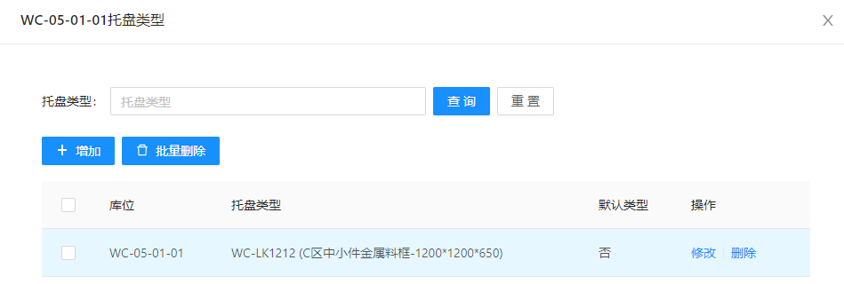  

2.配盘策略配置完成

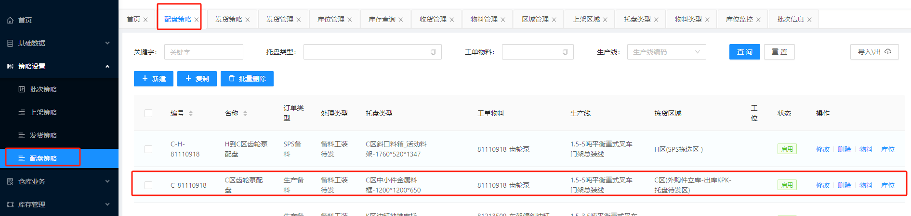  

注：1.配盘策略中的数据来自于MOM下发的数据信息，默认状态为未启用，系统管理员需维护本条数据的详情、物料、库位等信息。  
2.设置配盘策略明细，其中物料中的发货策略代表物料发自于哪里，如下图： 

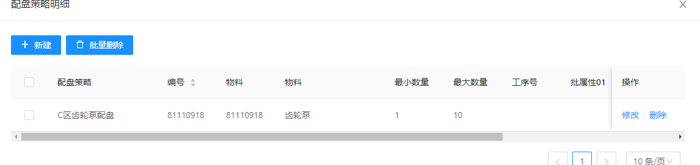   

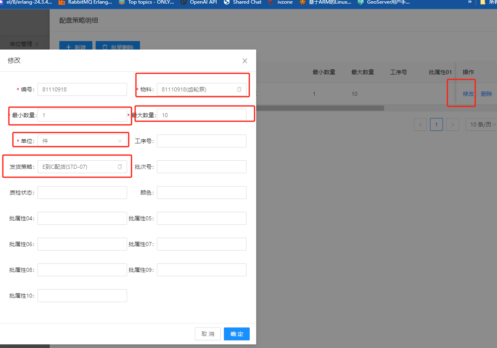   

3.配置好配盘库位（待发区库位或区域）

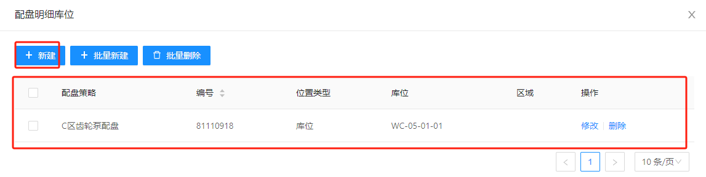   

4.最后将状态修改为启用状态，如下图

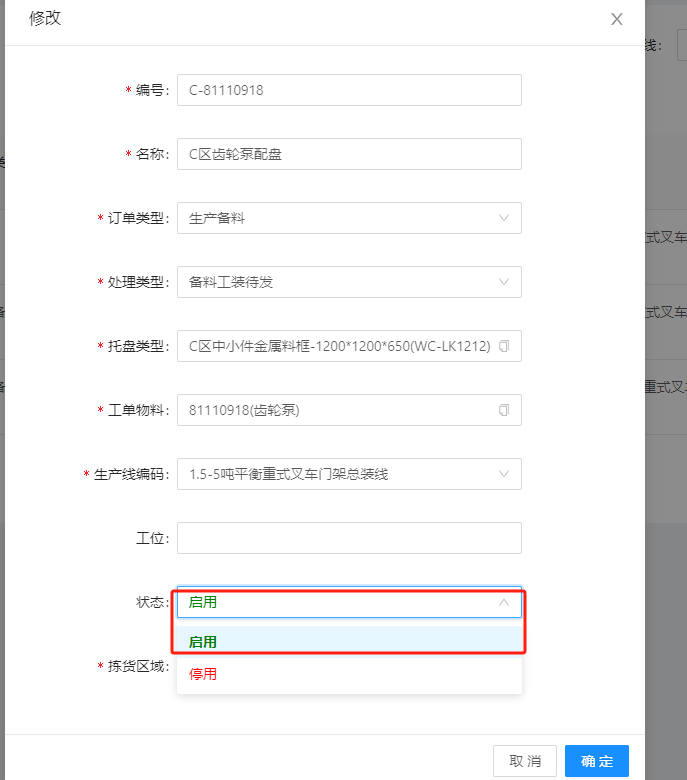

>备货到待发区  

根据上图前置条件，现场的业务RF端业务管理员通过RF功能-配货拣货开始备货，备货项通过MOM向WMS发起货单进行备货叫料。如下图：
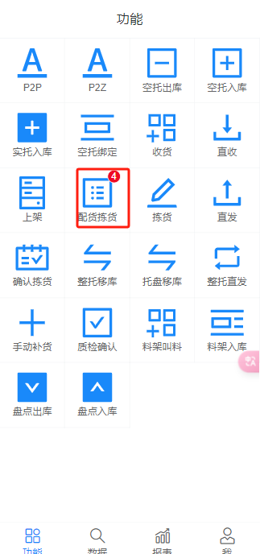

管理员可以通过点击需要备货的项，开始备货，填写拣货库位，点击开始配货，如下图：

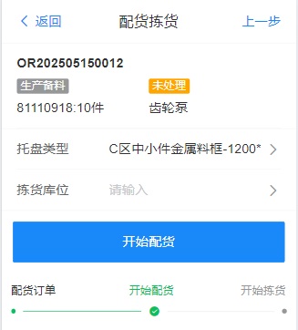

选择分拣库位，点击开始配货，提升配货成功,如下图 

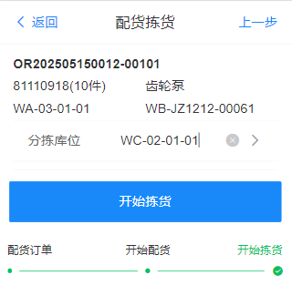

此时，系统在RF-数据-任务管理产生2种任务 

1.空托出库，通知AGV从库区出一个空托盘到拣货库位,如下图:

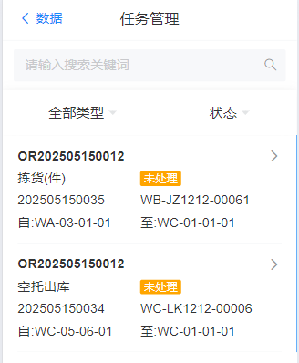

现场业务管理员可以完成该任务。

现场拣货人员可以在拣货进行拣货任务，系统将在**RF端-功能-拣货-**，点击下一步进行拣货，如下图，
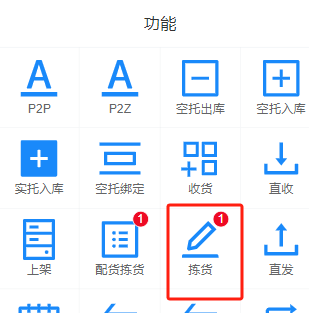    

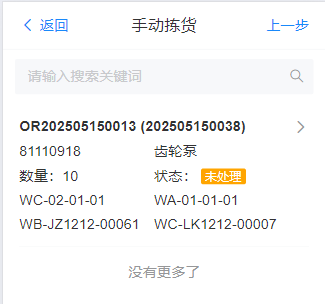

点击完成，完成拣货任务，并自动生产空托移库和空托上架功能，如下图：   

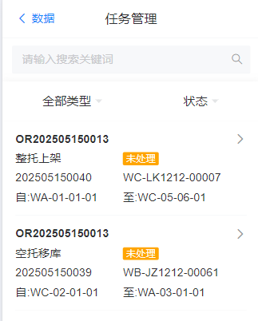

并通知AGV将拣货完成的货物发送到待发区，输送完毕后，可以点击完成任务。
## 物料直发线边 ##

完成整托上架后，系统将在RF端-数据-配盘叫料中，产生产线叫料任务，产线管理员在RF端-数据-配盘叫料中选择所在产线需要的叫料任务，如下图

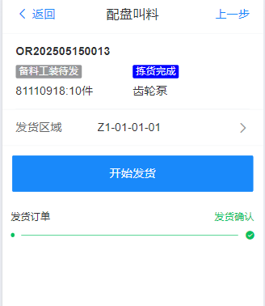  

用户选择发货区域以后点击开始发货，系统系统将在**RF端-数据-任务管理-**中生成发货任务，点击完成发货即可完成次流程，如下图。

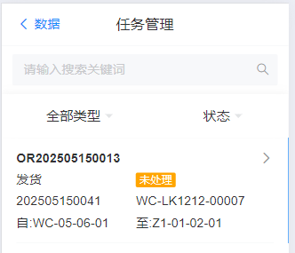